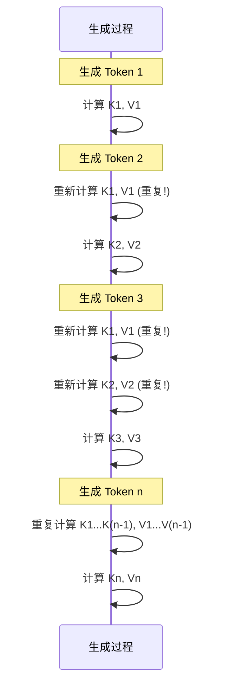
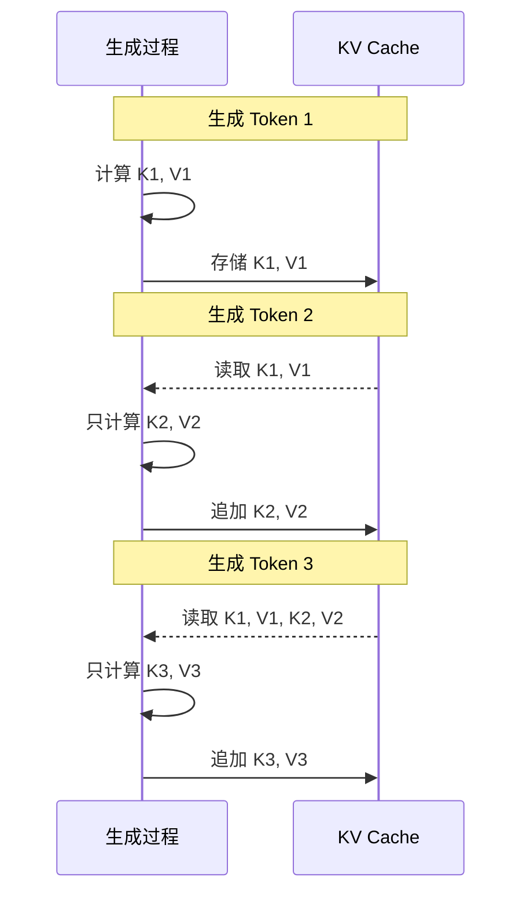
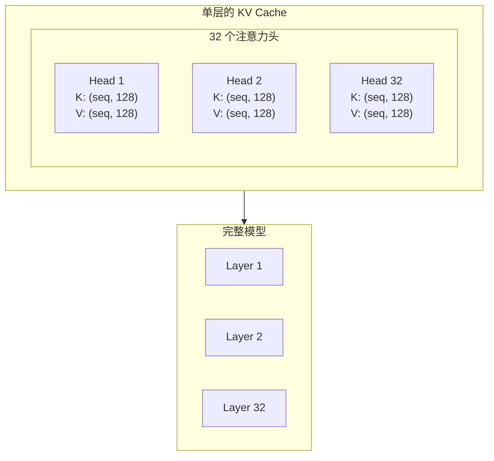
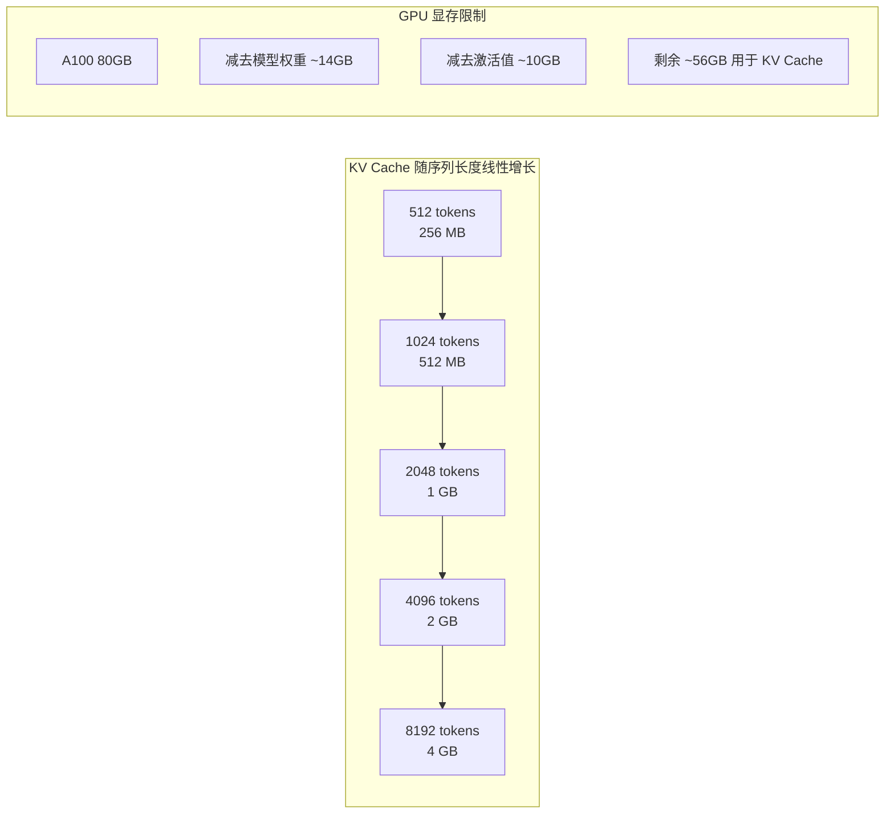
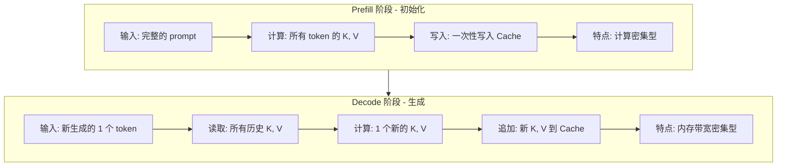
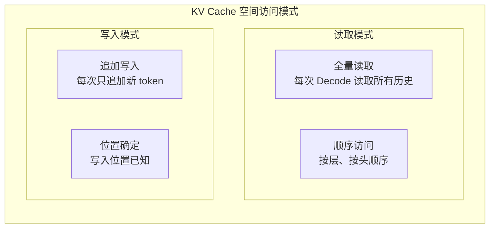
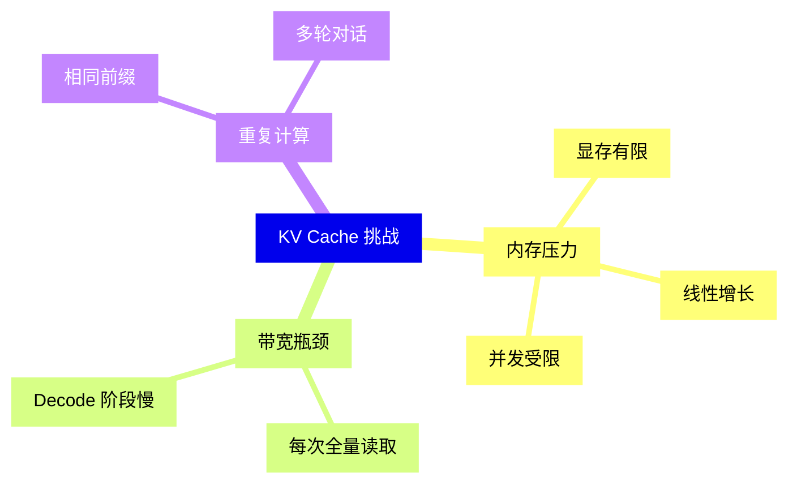
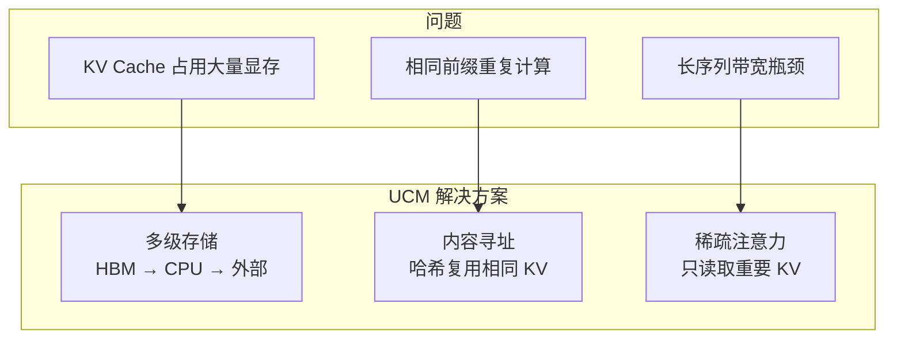
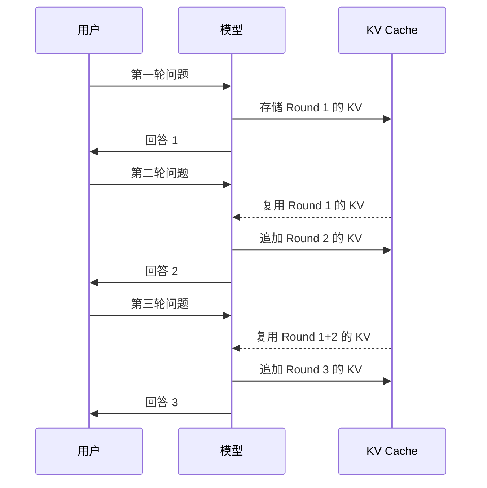

> **阅读时间**: 约 15 分钟
> **前置要求**: [Transformer 与注意力机制基础](./01-transformer-attention.md)

---

## 概述

KV Cache 是 LLM 推理优化的核心技术。本文深入讲解 KV Cache 的原理、内存计算和优化动机。

---

## 1. 为什么需要 KV Cache

### 1.1 自回归生成的重复计算问题

在没有 KV Cache 的情况下，生成每个新 token 都需要重新计算所有历史 token 的 Key 和 Value：


**问题**: 生成第 n 个 token 需要 $O(n)$ 次 K、V 计算，生成 n 个 token 总计 $O(n^2)$ 次计算。
### 1.2 KV Cache 的解决方案
KV Cache 缓存已计算的 Key 和 Value，避免重复计算：

**优化效果**: 生成第 n 个 token 只需 $O(1)$ 次 K、V 计算，总计 $O(n)$ 次。
---
## 2. KV Cache 的数据结构

### 2.1 张量形状

对于一个 Transformer 模型，KV Cache 的形状为：

```
KV Cache 形状:
┌─────────────────────────────────────────────────────────────┐
│ K: [batch_size, num_layers, num_heads, seq_len, head_dim]  │
│ V: [batch_size, num_layers, num_heads, seq_len, head_dim]  │
└─────────────────────────────────────────────────────────────┘

示例 (Llama-7B):
- batch_size = 1
- num_layers = 32
- num_heads = 32
- seq_len = 2048 (动态增长)
- head_dim = 128

K 和 V 各: 1 x 32 x 32 x 2048 x 128 = 268,435,456 个元素
```

### 2.2 内存布局



---
## 3. KV Cache 内存占用计算
### 3.1 计算公式
单个请求的 KV Cache 内存占用：
$$
\text{KV Cache Size} = 2 \times L \times H \times S \times D \times \text{dtype\_size}
$$
其中：
- $2$ = Key 和 Value 两部分
- $L$ = 层数 (num_layers)
- $H$ = 注意力头数 (num_heads)
- $S$ = 序列长度 (seq_len)
- $D$ = 每个头的维度 (head_dim)
- dtype_size = 数据类型大小（FP16 = 2 bytes，FP32 = 4 bytes）
### 3.2 典型模型的 KV Cache 大小
| 模型 | 参数量 | 层数 | 头数 | head_dim | 每 token KV (FP16) | 2K 序列 |
|------|--------|------|------|----------|-------------------|---------|
| Llama-7B | 7B | 32 | 32 | 128 | 512 KB | 1 GB |
| Llama-13B | 13B | 40 | 40 | 128 | 800 KB | 1.6 GB |
| Llama-70B | 70B | 80 | 64 | 128 | 2.56 MB | 5.12 GB |
| GPT-4 (估计) | 1.8T | 120 | 128 | 128 | 15.36 MB | 30.72 GB |

### 3.3 线性增长的挑战


**关键问题**:
- 单请求长序列会占用大量显存
- 并发请求会快速耗尽显存
- 显存成为 LLM 服务的主要瓶颈

---

## 4. KV Cache 的访问模式

### 4.1 时间特性

KV Cache 的访问分为两个阶段：



### 4.2 空间特性


### 4.3 瓶颈分析
| 阶段 | 主要瓶颈 | 原因 |
|------|----------|------|
| Prefill | 计算 | 需要计算所有 token 的注意力 |
| Decode | 内存带宽 | 每个 token 都要读取全部历史 KV |

**Decode 阶段的带宽问题**:
- 生成 1 个 token 需要读取所有历史 KV
- 序列越长，读取量越大
- GPU 计算能力被浪费在等待数据传输
---
## 5. KV Cache 优化动机

### 5.1 问题汇总



### 5.2 优化方向

| 优化方向 | 技术方案 | UCM 对应模块 |
|----------|----------|-------------|
| 减少存储 | KV 压缩、量化 | `ucm/sparse/kvcomp/` |
| 减少读取 | 稀疏注意力 | `ucm/sparse/esa/`, `gsa/` |
| 复用 KV | 前缀缓存 | `ucm/store/` |
| 扩展容量 | 外部存储 | `ucm/store/posix/`, `nfs/` |
| 跨请求共享 | 内容寻址 | `ucm/integration/vllm/ucm_connector.py` |

### 5.3 UCM 的核心思路



---
## 6. KV Cache 复用场景
### 6.1 前缀缓存（Prefix Caching）
当多个请求共享相同前缀时，可以复用已计算的 KV：
```
请求 1: "请帮我翻译以下内容：Hello World"
请求 2: "请帮我翻译以下内容：Good Morning"
请求 3: "请帮我翻译以下内容：How are you"

共同前缀: "请帮我翻译以下内容："
         ↓
    只计算一次 KV，三个请求共享
```
### 6.2 多轮对话


### 6.3 RAG 检索增强

```
System Prompt (10K tokens): 固定不变，可以缓存
Retrieved Context (5K tokens): 部分可能重复
User Query (100 tokens): 每次不同
优化: 缓存 System Prompt 的 KV，只计算变化部分
```

---

## 7. 关键概念总结

| 概念 | 说明 | 重要性 |
|------|------|--------|
| KV Cache | 缓存历史 token 的 Key 和 Value | 避免重复计算 |
| 线性增长 | 内存随序列长度线性增长 | 显存瓶颈 |
| Prefill vs Decode | 两个阶段的不同特性 | 针对性优化 |
| 前缀复用 | 相同前缀共享 KV | 减少计算 |
| 内容寻址 | 基于内容哈希查找 KV | UCM 核心机制 |

---

## 延伸阅读

- [Efficient Memory Management for Large Language Model Serving with PagedAttention](https://arxiv.org/abs/2309.06180)
- [vLLM: Easy, Fast, and Cheap LLM Serving with PagedAttention](https://blog.vllm.ai/2023/06/20/vllm.html)