> **阅读时间**: 约 20 分钟
> **前置要求**: [KV Cache 核心概念](./02-kv-cache-fundamentals.md)

---

## 概述

vLLM 是目前最流行的 LLM 推理框架之一。UCM 通过与 vLLM 集成来实现 KV Cache 管理优化。本文介绍 vLLM 的核心架构和关键概念。

---

## 1. vLLM 简介

### 1.1 设计目标

vLLM 的核心目标是解决 LLM 推理中的内存效率问题：

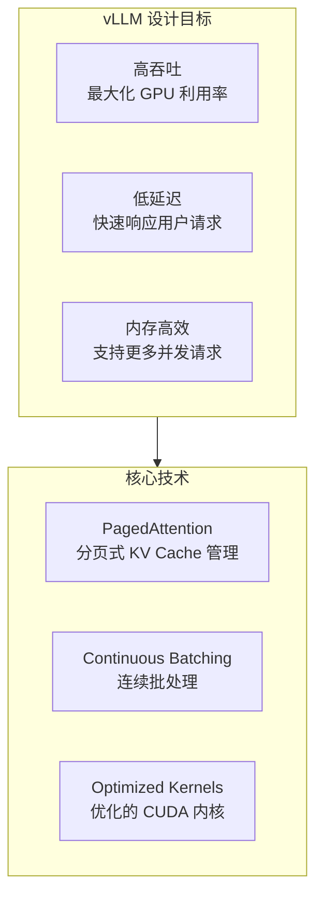
### 1.2 与其他框架对比
| 特性 | vLLM | HuggingFace | TensorRT-LLM |
|------|------|-------------|--------------|
| PagedAttention | Yes | No | Partial |
| 连续批处理 | Yes | No | Yes |
| 内存效率 | 高 | 低 | 中 |
| 易用性 | 高 | 最高 | 中 |
| UCM 集成 | 支持 | - | - |
---
## 2. vLLM 整体架构

### 2.1 架构层次

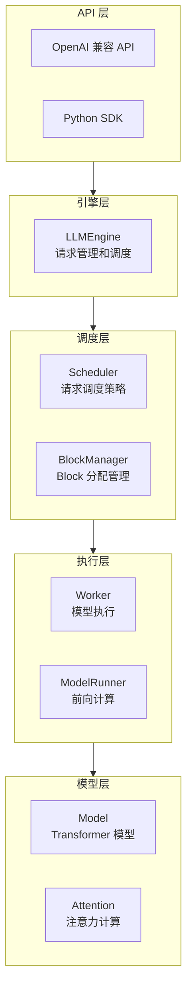

### 2.2 核心组件

| 组件 | 职责 | 关键文件 |
|------|------|----------|
| LLMEngine | 请求生命周期管理 | `vllm/engine/llm_engine.py` |
| Scheduler | 请求调度和批处理 | `vllm/core/scheduler.py` |
| BlockManager | KV Cache Block 分配 | `vllm/core/block_manager.py` |
| Worker | GPU 上的模型执行 | `vllm/worker/worker.py` |
| ModelRunner | 前向计算封装 | `vllm/worker/model_runner.py` |

---
## 3. PagedAttention 原理
### 3.1 传统 KV Cache 的问题
传统方法为每个请求预分配固定大小的连续内存：
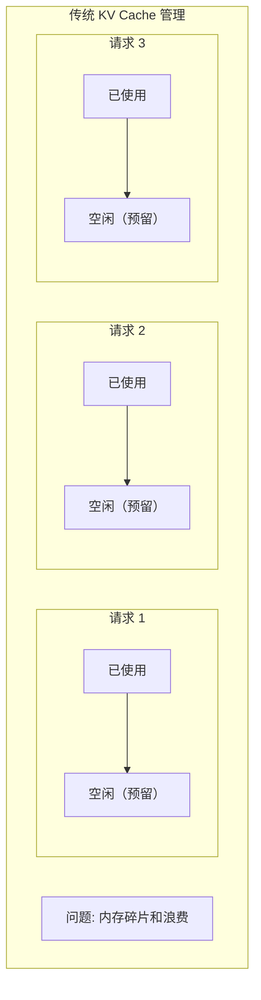

**问题**:
- 必须预分配最大长度
- 无法准确预知每个请求的实际长度
- 导致大量内存浪费
### 3.2 PagedAttention 的解决方案
PagedAttention 借鉴操作系统的虚拟内存思想，将 KV Cache 分成固定大小的 Block：
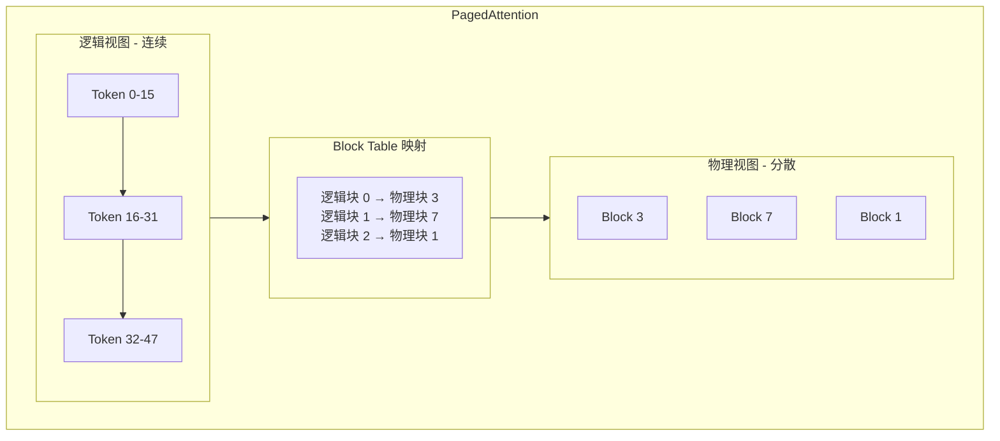
### 3.3 Block 的结构
```python
class Block:
    block_size = 16  # 每个 Block 存储 16 个 token 的 KV
    # 物理内存布局
    # K: [block_size, num_heads, head_dim]
    # V: [block_size, num_heads, head_dim]
```

**优势**:
- 按需分配，无需预留
- 减少内存碎片
- 支持更多并发请求
---
## 4. Scheduler 调度器

### 4.1 调度器职责

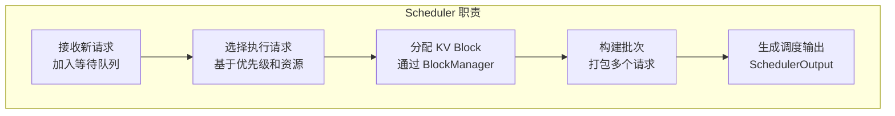

### 4.2 请求状态

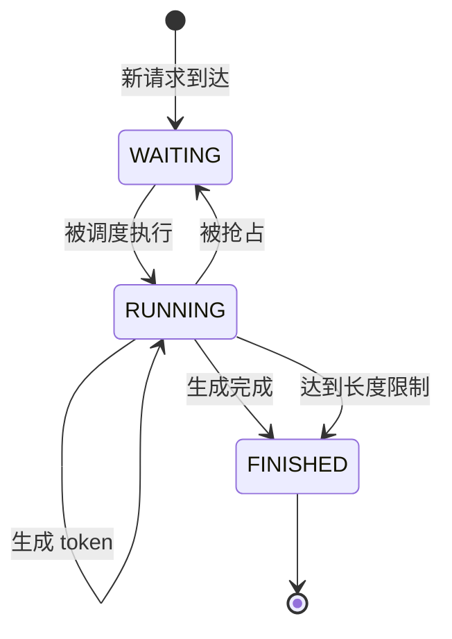

### 4.3 调度策略

| 策略 | 说明 | 适用场景 |
|------|------|----------|
| FCFS | 先来先服务 | 默认策略 |
| 抢占式 | 长请求可被短请求抢占 | 低延迟优先 |
| 公平调度 | 均衡各请求的进度 | 多用户场景 |

---
## 5. Worker 和 ModelRunner
### 5.1 Worker 职责
Worker 负责在 GPU 上执行模型推理：
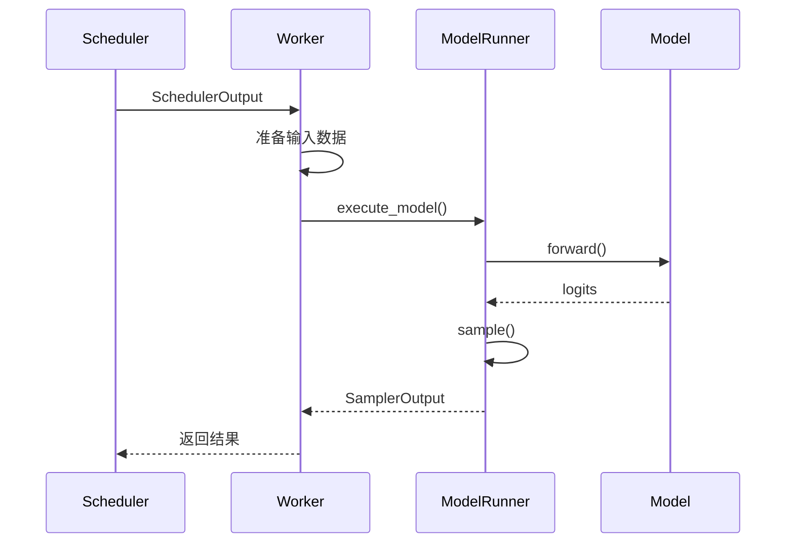

### 5.2 ModelRunner 执行流程

```python
# ModelRunner 简化流程
class ModelRunner:
    def execute_model(self, scheduler_output):
        # 1. 准备输入张量
        input_ids = self._prepare_inputs(scheduler_output)
        # 2. 准备 KV Cache
        kv_caches = self._get_kv_caches()

        # 3. 执行前向计算
        logits = self.model.forward(
            input_ids=input_ids,
            kv_caches=kv_caches,
            attn_metadata=attn_metadata
        )
        # 4. 采样生成 token
        output = self.sampler(logits)

        return output
```
---
## 6. KVConnector 接口

### 6.1 接口设计

vLLM 提供 KVConnector 接口，允许外部系统（如 UCM）接入 KV Cache 管理：

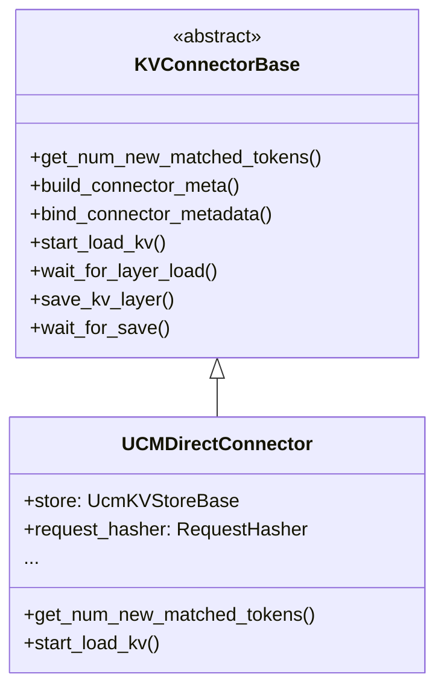

### 6.2 接口方法说明

| 方法 | 调用位置 | 说明 |
|------|----------|------|
| `get_num_new_matched_tokens` | Scheduler | 查询 KV Cache 命中数量 |
| `build_connector_meta` | Scheduler | 构建传输元数据 |
| `bind_connector_metadata` | Worker | 绑定元数据到执行上下文 |
| `start_load_kv` | Worker | 开始加载 KV Cache |
| `wait_for_layer_load` | Worker | 等待层级加载完成 |
| `save_kv_layer` | Worker | 保存 KV Cache |
| `wait_for_save` | Worker | 等待保存完成 |

### 6.3 UCM 如何接入

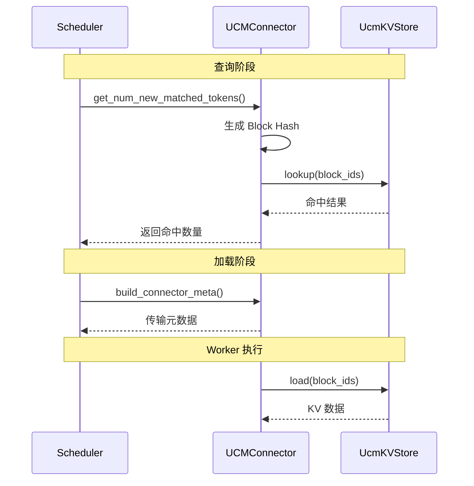

---
## 7. Block 管理
### 7.1 BlockManager
BlockManager 管理物理 Block 的分配和释放：
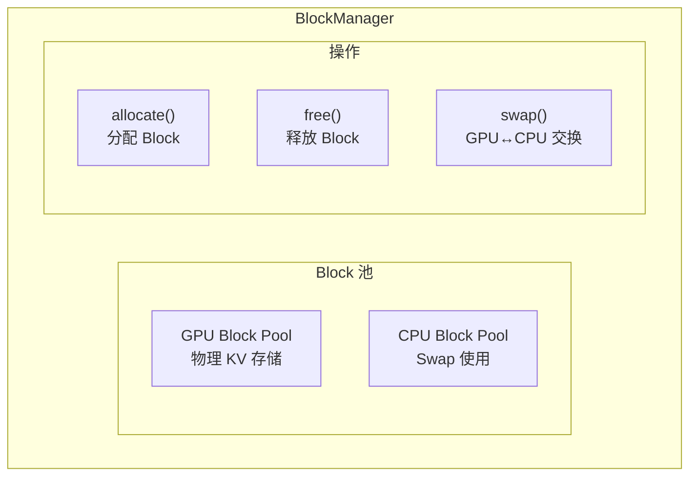
### 7.2 Block Table
每个请求维护一个 Block Table，记录逻辑块到物理块的映射：
```python
request_1 = {
    "block_table": [5, 12, 3, None, None],  # 逻辑块 → 物理块
    "num_tokens": 45,  # 当前 token 数
    "max_blocks": 5    # 最大 Block 数
}

# 逻辑块 1 → 物理块 12 (Token 16-31)
# 逻辑块 2 → 物理块 3 (Token 32-44)
```

### 7.3 Copy-on-Write

当多个请求共享前缀时，vLLM 使用 Copy-on-Write 优化：

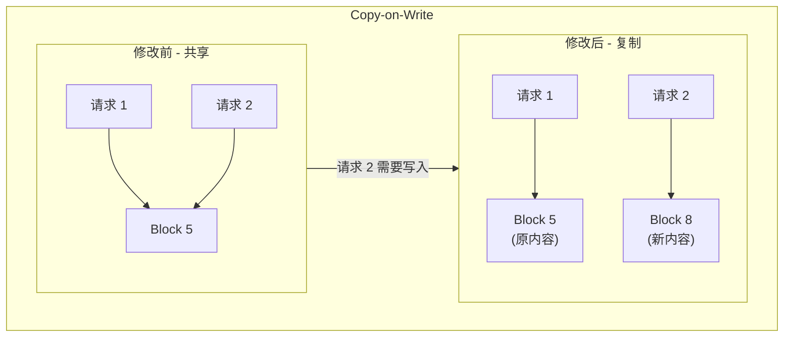
---
## 8. vLLM 扩展点

### 8.1 UCM 使用的扩展点

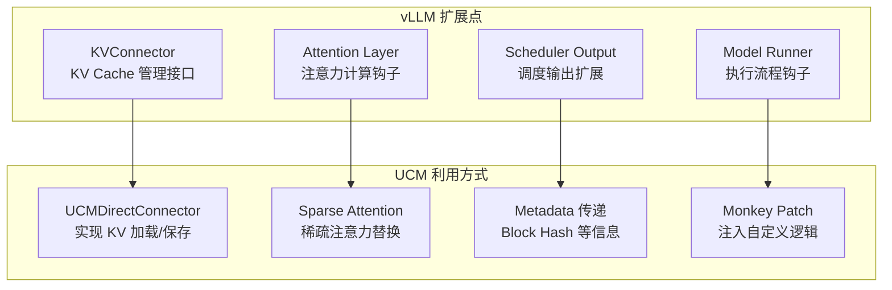

### 8.2 Monkey Patching

UCM 通过 Monkey Patching 在不修改 vLLM 源码的情况下注入功能：

```python
import vllm.attention

_original_attention_forward = vllm.attention.Attention.forward

def _patched_attention_forward(self, ...):
    # UCM 前置处理
    ucm_sparse.attention_begin(...)

    # 调用原始函数
    result = _original_attention_forward(self, ...)

    # UCM 后置处理
    ucm_sparse.attention_finished(...)

    return result

vllm.attention.Attention.forward = _patched_attention_forward
```

---
## 9. 关键概念总结
| 概念 | 说明 | 与 UCM 的关系 |
|------|------|--------------|
| PagedAttention | 分页式 KV Cache 管理 | UCM 基于 Block 级别操作 |
| Scheduler | 请求调度和资源分配 | UCM 在此查询 KV 命中 |
| Worker | GPU 上的模型执行 | UCM 在此加载/保存 KV |
| KVConnector | KV Cache 管理接口 | UCM 实现此接口 |
| Block Table | 逻辑块到物理块映射 | UCM 扩展为内容寻址 |
| Monkey Patching | 运行时代码注入 | UCM 的非侵入式集成方式 |

---

## 延伸阅读

- [vLLM 官方文档](https://docs.vllm.ai/)
- [PagedAttention 论文](https://arxiv.org/abs/2309.06180)
- [vLLM GitHub 仓库](https://github.com/vllm-project/vllm)
