> **阅读时间**: 约 15 分钟
> **前置要求**: [vLLM 架构概览](./03-vllm-architecture.md)

---

## 概述

理解硬件内存层级和数据传输特性是优化 LLM 推理的关键。本文介绍 GPU/CPU 内存架构以及 UCM 如何利用这些特性进行优化。

---

## 1. 内存层级金字塔

### 1.1 层级结构

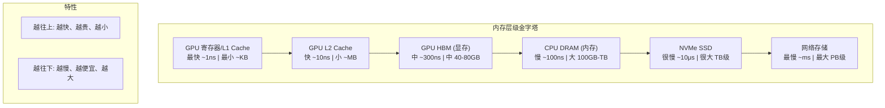
### 1.2 各层级参数对比
| 存储层级 | 延迟 | 带宽 | 典型容量 | 每 GB 成本 |
|----------|------|------|----------|------------|
| GPU 寄存器 | ~1 ns | ~TB/s | ~KB | - |
| GPU L1 Cache | ~5 ns | ~10 TB/s | ~128 KB | - |
| GPU L2 Cache | ~30 ns | ~5 TB/s | ~50 MB | - |
| GPU HBM | ~300 ns | ~2 TB/s | 40-80 GB | $$$ |
| CPU DRAM | ~100 ns | ~200 GB/s | 100 GB - 1 TB | $$ |
| NVMe SSD | ~10 μs | ~7 GB/s | 1-30 TB | $ |
| 网络存储 | ~1 ms | ~10 GB/s | PB 级 | ¢ |
---
## 2. GPU 显存（HBM）

### 2.1 HBM 特性

HBM (High Bandwidth Memory) 是现代 GPU 的主要内存：

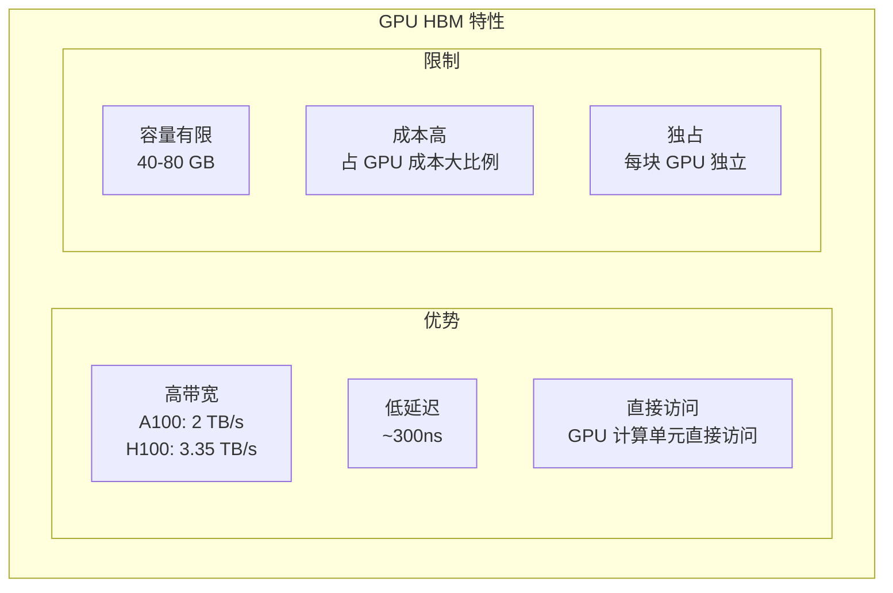

### 2.2 HBM 使用分配

以 A100 80GB 为例：

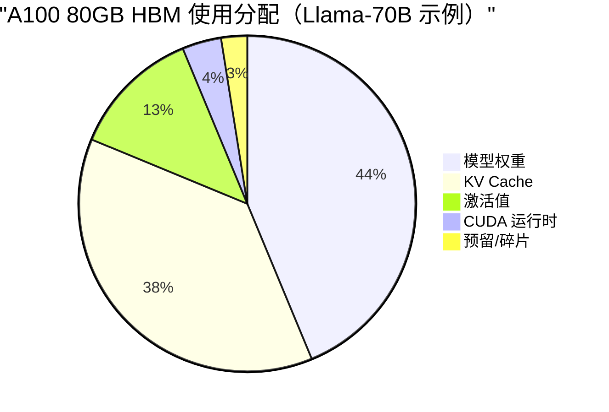

**关键洞察**: KV Cache 占用了大量显存，是优化的重点目标。

---
## 3. CPU 内存与 Pinned Memory
### 3.1 普通内存 vs Pinned Memory
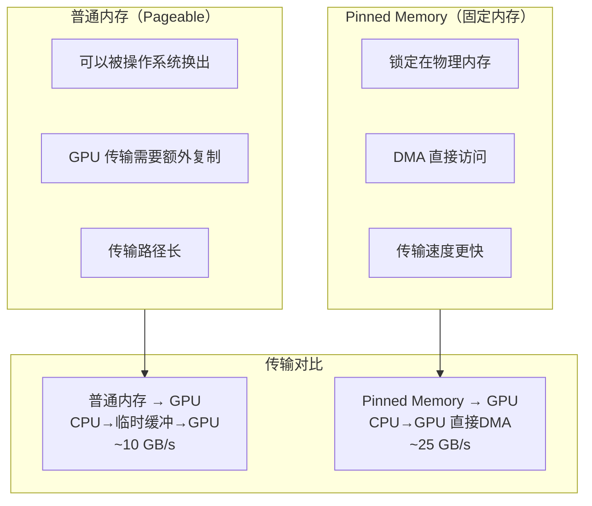

### 3.2 UCM 的 Pinned Memory 使用

UCM 使用 Pinned Memory 缓冲池加速数据传输：

```python
# UCM Pinned Memory 缓冲池示意
class PinnedMemoryPool:
    def __init__(self, buffer_count=1024, buffer_size=4096):
        # 预分配固定数量的 Pinned Memory 缓冲区
        self.buffers = [
            torch.empty(buffer_size, dtype=torch.uint8, pin_memory=True)
            for _ in range(buffer_count)
        ]

    def get_buffer(self):
        # 从池中获取可用缓冲区
        return self.free_buffers.pop()

    def return_buffer(self, buffer):
        # 归还缓冲区到池
        self.free_buffers.append(buffer)
```
---
## 4. 数据传输路径

### 4.1 PCIe 传输

CPU 和 GPU 之间通过 PCIe 总线传输数据：

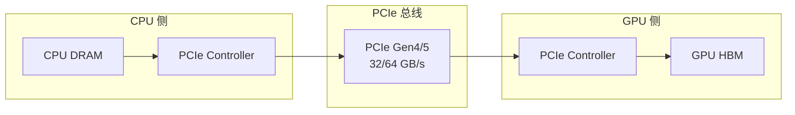

### 4.2 NVLink（多 GPU）

NVLink 提供 GPU 之间的高速直连：

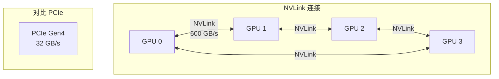

### 4.3 传输带宽对比

| 传输路径 | 带宽 | 延迟 |
|----------|------|------|
| GPU 内部 (HBM) | ~2000 GB/s | ~300 ns |
| GPU-GPU (NVLink) | ~600 GB/s | ~1 μs |
| GPU-CPU (PCIe 4.0) | ~32 GB/s | ~10 μs |
| CPU-SSD (NVMe) | ~7 GB/s | ~10 μs |
| CPU-Network | ~10 GB/s | ~1 ms |

---
## 5. 异步传输与重叠
### 5.1 同步 vs 异步传输
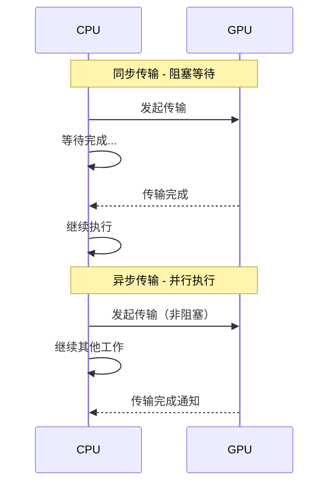

### 5.2 计算与传输重叠

UCM 利用异步传输实现计算与数据传输的重叠：

```mermaid
gantt
    title 计算与传输重叠示意
    dateFormat X
    axisFormat %s

    section 无重叠
    加载 KV :load1, 0, 3
    计算 Attention :compute1, 3, 5
    保存 KV :save1, 5, 8
    section 有重叠
    加载 KV (Layer N+1) :load2, 0, 3
    计算 Attention (Layer N) :compute2, 0, 2
    保存 KV (Layer N-1) :save2, 0, 2
```
### 5.3 CUDA Streams
CUDA Streams 用于管理异步操作：
```python
class AsyncTransfer:
    def __init__(self):
        self.compute_stream = torch.cuda.Stream()
        self.transfer_stream = torch.cuda.Stream()
    def overlapped_execution(self, kv_data, compute_fn):
        # 在 transfer stream 上异步加载
        with torch.cuda.stream(self.transfer_stream):
            kv_gpu = kv_data.to('cuda', non_blocking=True)

        # 在 compute stream 上执行计算
        with torch.cuda.stream(self.compute_stream):
            # 等待传输完成
            self.compute_stream.wait_stream(self.transfer_stream)
            result = compute_fn(kv_gpu)

        return result
```
---
## 6. UCM 多级存储架构

### 6.1 存储层级设计

UCM 利用多级存储层级优化 KV Cache 管理：

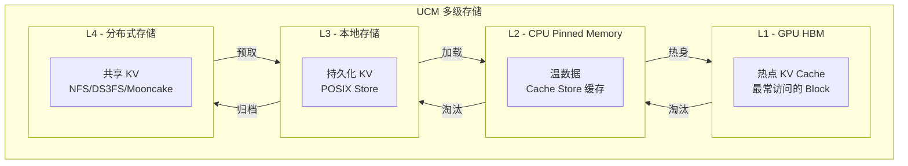

### 6.2 Pipeline Store 组合

UCM 支持灵活的存储层级组合：

```
配置示例:

1. Cache|Posix - 本地高速缓存
   HBM ↔ Pinned Memory Cache ↔ 本地 SSD

2. Cache|NFS - 分布式缓存
   HBM ↔ Pinned Memory Cache ↔ NFS 共享存储

3. Cache|DS3FS - 云存储缓存
   HBM ↔ Pinned Memory Cache ↔ S3 对象存储
```

---
## 7. 传输优化技术
### 7.1 批量传输
将多个小传输合并为大传输：
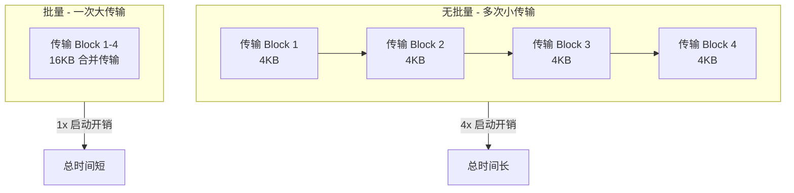
### 7.2 预取（Prefetch）
提前加载即将使用的数据：
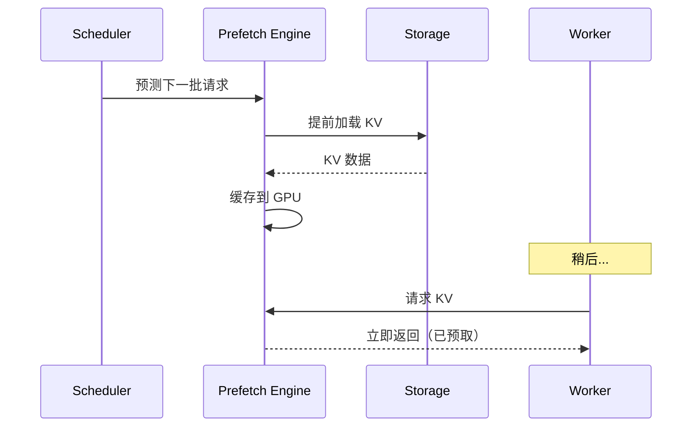
### 7.3 零拷贝（Zero-Copy）
减少不必要的数据复制：
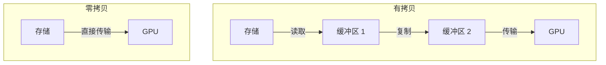

---

## 8. 关键概念总结

| 概念 | 说明 | UCM 应用 |
|------|------|----------|
| HBM | GPU 高带宽显存 | 热点 KV 存储 |
| Pinned Memory | CPU 固定内存 | Cache Store 缓冲池 |
| PCIe | CPU-GPU 传输总线 | 决定传输带宽上限 |
| 异步传输 | 非阻塞数据传输 | 计算传输重叠 |
| CUDA Streams | 异步操作管理 | 并行调度 |
| 预取 | 提前加载数据 | Prefetch Engine |
| 多级存储 | 分层存储架构 | Pipeline Store |

---

## 延伸阅读

- [CUDA Programming Guide - Memory](https://docs.nvidia.com/cuda/cuda-c-programming-guide/index.html#memory-hierarchy)
- [Understanding GPU Memory](https://developer.nvidia.com/blog/understanding-tensor-core-performance-with-nsight-compute/)