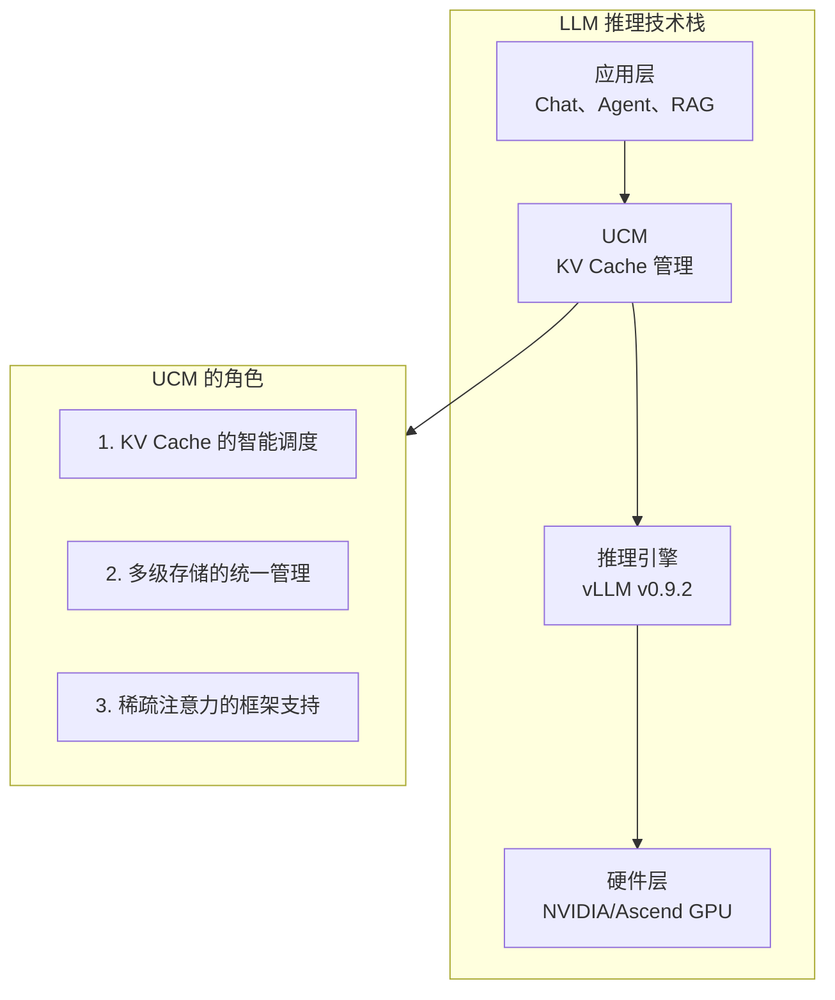
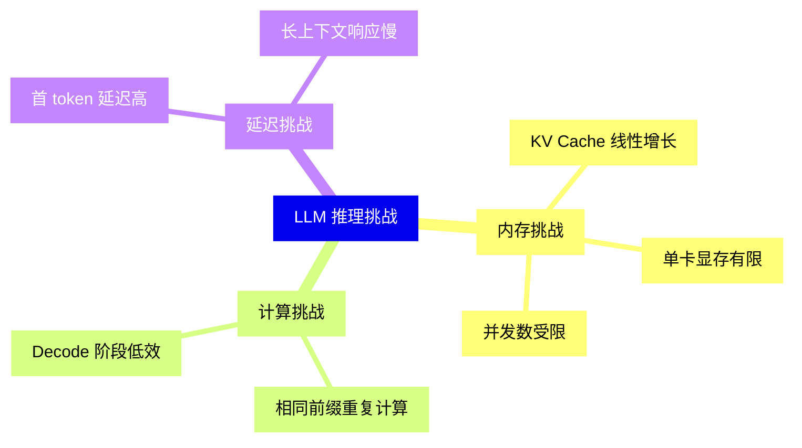
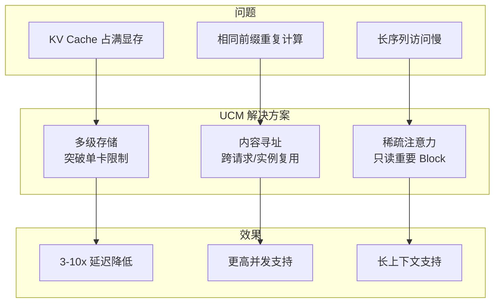
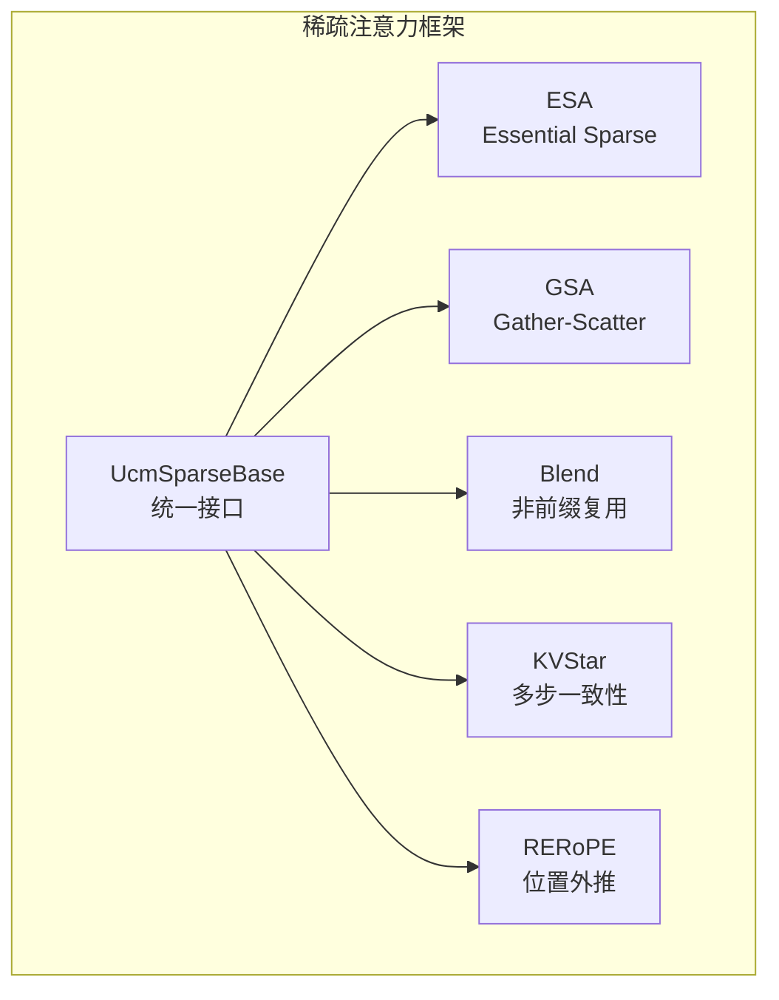
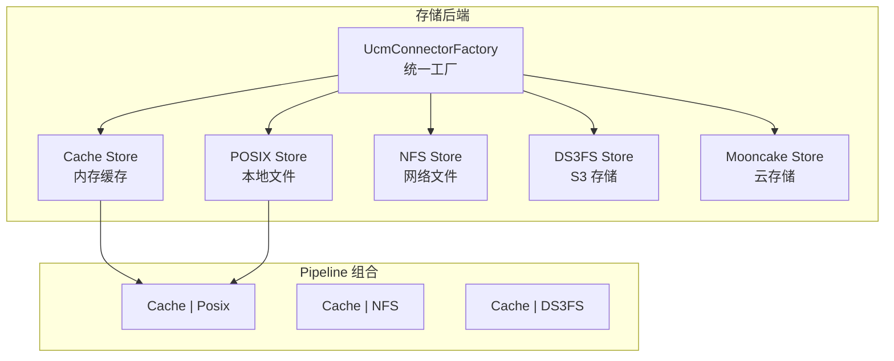
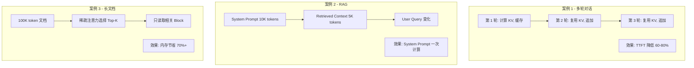
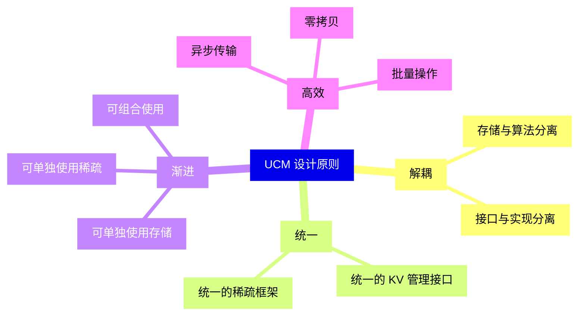

> **阅读时间**: 约 10 分钟
> **前置要求**: [前置知识模块](../00-prerequisites/)

---

## 概述

UCM（Unified Cache Management，统一缓存管理）是一个面向 LLM 推理优化的 KV Cache 管理框架。本文介绍 UCM 的项目定位、核心特性和设计目标。

---

## 1. UCM 是什么

### 1.1 一句话定义

> **UCM 是一个 KV Cache 管理框架**，通过持久化 KV Cache 并提供多种检索机制，替代冗余计算，实现 LLM 推理 3-10 倍的延迟降低。

### 1.2 项目定位



### 1.3 核心能力

| 能力 | 说明 | 效果 |
|------|------|------|
| **前缀缓存** | 缓存并复用相同前缀的 KV | 减少重复计算 |
| **多级存储** | HBM → CPU → 外部存储 | 扩展 KV 容量 |
| **稀疏注意力** | 只加载重要的 KV Block | 降低带宽需求 |
| **PD 分离** | Prefill 和 Decode 分离 | 优化资源利用 |
---
## 2. 为什么需要 UCM

### 2.1 LLM 推理的核心挑战



### 2.2 现有方案的局限

| 方案 | 优点 | 局限 |
|------|------|------|
| vLLM PagedAttention | 减少内存碎片 | 仍受单卡显存限制 |
| vLLM 自动前缀缓存 | 复用前缀 KV | 仅限单实例、内存中 |
| KV 压缩/量化 | 减少存储量 | 可能损失精度 |
| 模型并行 | 扩展容量 | 通信开销大 |

### 2.3 UCM 的解决思路



---
## 3. UCM 核心特性
### 3.1 内容寻址的 KV Cache
UCM 使用基于内容的哈希来标识 KV Block：
```
传统方式（位置寻址）:
  请求 ID + 位置 → KV Block
  问题: 相同内容无法跨请求复用

UCM 方式（内容寻址）:
  Hash(Token IDs) → KV Block
  优势: 相同内容自动复用，跨请求/实例共享
```
### 3.2 统一的稀疏注意力框架
UCM 提供统一的接口支持多种稀疏注意力算法：


### 3.3 可插拔的存储后端



### 3.4 非侵入式 vLLM 集成

UCM 通过 Monkey Patching 实现与 vLLM 的集成，无需修改 vLLM 源码：

```python
# 用户使用方式
from vllm import LLM
from vllm.config import KVTransferConfig
# 配置 UCM 连接器
ktc = KVTransferConfig(
    kv_connector="UCMConnector",
    kv_connector_module_path="ucm.integration.vllm.ucm_connector",
    kv_role="kv_both",
    kv_connector_extra_config={
        "UCM_CONFIG_FILE": "./ucm_config.yaml"
    }
)
# 正常使用 vLLM
llm = LLM(model="llama-7b", kv_transfer_config=ktc)
```
---
## 4. 适用场景

### 4.1 最佳适用场景

| 场景 | 优化效果 | 原因 |
|------|----------|------|
| **多轮对话** | 显著 | 历史上下文 KV 可复用 |
| **RAG 检索增强** | 显著 | System Prompt 可缓存 |
| **长文档问答** | 显著 | 长上下文受益于稀疏注意力 |
| **批量相似请求** | 显著 | 共同前缀可共享 |

### 4.2 典型应用案例



---
## 5. 版本兼容性
### 5.1 系统要求
| 组件 | 版本要求 |
|------|----------|
| Python | 3.10+ |
| PyTorch | 2.0+ |
| vLLM | v0.9.2 |
| CUDA | 11.8+ / 12.0+ |

### 5.2 硬件平台支持

| 平台 | 状态 | 说明 |
|------|------|------|
| NVIDIA GPU (CUDA) | 完全支持 | 主要开发平台 |
| Huawei Ascend NPU | 完全支持 | 华为昇腾适配 |
| Metax MUSA | 支持 | 摩尔线程适配 |
| Hygon MACA | 支持 | 海光 DCU 适配 |
---
## 6. 项目愿景

### 6.1 设计原则



### 6.2 愿景目标

> **"任何模型、任何场景、任何规模"**

- 支持各种 Transformer 模型
- 适应从单卡到集群的部署规模
- 覆盖各类 LLM 应用场景
