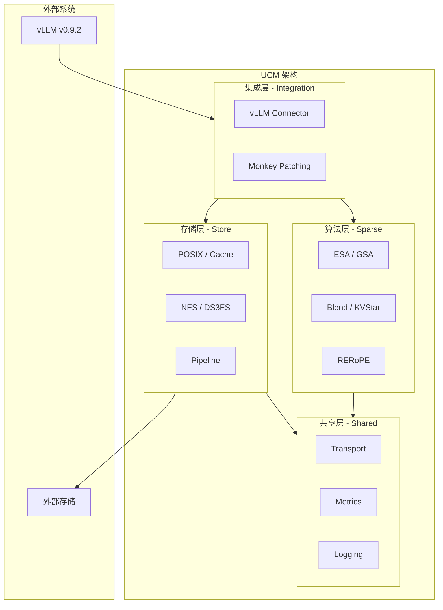
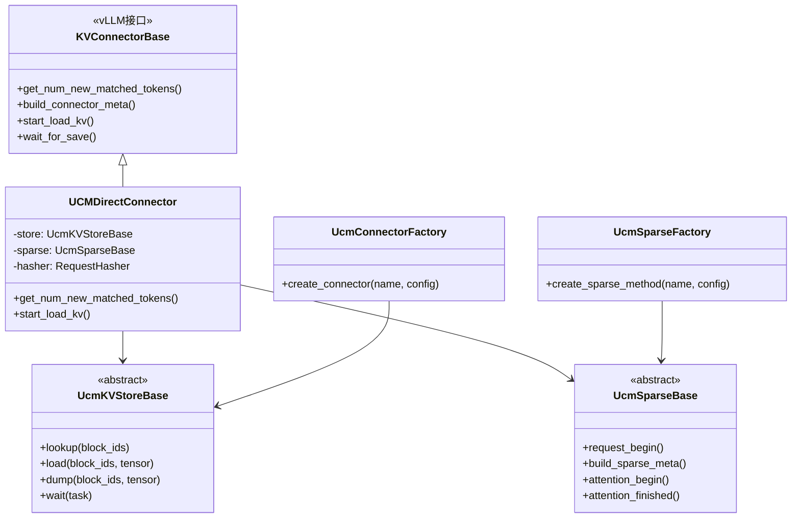
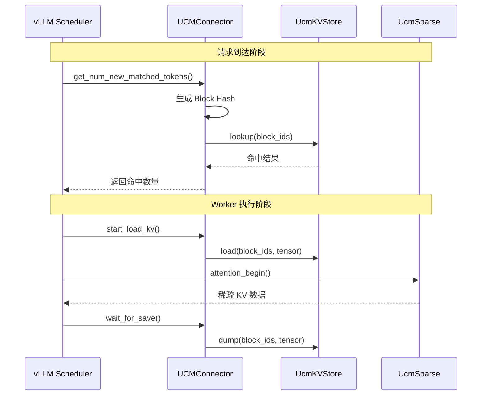
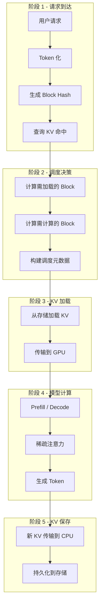
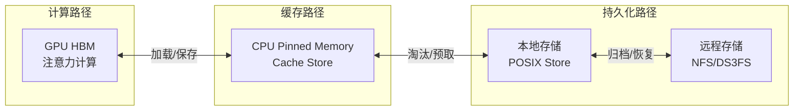

> **阅读时间**: 约 15 分钟
> **前置要求**: [UCM 项目简介](./01-introduction.md)

---

## 概述

本文介绍 UCM 的整体架构设计，包括四大核心模块、数据流、扩展点等内容。

---

## 1. 四大支柱架构

UCM 采用模块化设计，由四大核心模块组成：


### 1.1 模块职责
| 模块 | 目录 | 职责 |
|------|------|------|
| **集成层** | `ucm/integration/vllm/` | 与 vLLM 的接口对接、Monkey Patching |
| **算法层** | `ucm/sparse/` | 稀疏注意力算法实现 |
| **存储层** | `ucm/store/` | KV Cache 存储后端管理 |
| **共享层** | `ucm/shared/` | 传输、监控、日志等基础设施 |

---

## 2. 目录结构

```
ucm/
├── integration/                # 集成层
│   └── vllm/
│       ├── ucm_connector.py    # 主连接器实现
│       ├── blend_connector.py  # Blend 专用连接器
│       └── patch/              # Monkey Patching
│           ├── apply_patch.py
│           └── patch_funcs/
│               └── v092/       # vLLM v0.9.2 补丁
│
├── sparse/                     # 算法层
│   ├── base.py                 # 稀疏算法基类
│   ├── factory.py              # 算法工厂
│   ├── esa/                    # ESA 算法
│   ├── gsa/                    # GSA 算法
│   ├── gsa_on_device/          # GPU 端 GSA
│   ├── blend/                  # Blend 算法
│   ├── kvstar/                 # KVStar 算法
│   └── rerope/                 # RERoPE 算法
│
├── store/                      # 存储层
│   ├── ucmstore.py             # 存储基类
│   ├── factory.py              # 存储工厂
│   ├── posix/                  # 本地文件存储
│   ├── cache/                  # 内存缓存
│   ├── pipeline/               # Pipeline 组合
│   ├── nfsstore/               # NFS 存储
│   ├── ds3fs/                  # S3 存储
│   └── mooncakestore/          # 云存储
│
├── shared/                     # 共享层
│   ├── trans/                  # 设备传输
│   ├── metrics/                # 监控指标
│   └── infra/                  # 基础工具
│
└── logger.py                   # 日志配置
```
---
## 3. 核心组件关系

### 3.1 类图概览



### 3.2 组件交互



---
## 4. 数据流
### 4.1 完整请求处理流程


### 4.2 KV Cache 数据路径



---

## 5. 扩展点设计

### 5.1 存储后端扩展

添加新的存储后端只需：

1. 实现 `UcmKVStoreBase` 接口
2. 在工厂中注册
```python
class MyCustomStore(UcmKVStoreBase):
    def lookup(self, block_ids: List[bytes]) -> List[bool]:
        # 实现查找逻辑
        pass
    def load(self, block_ids, tensor) -> Task:
        # 实现加载逻辑
        pass
    def dump(self, block_ids, tensor) -> Task:
        # 实现保存逻辑
        pass
# 注册到工厂
UcmConnectorFactory.register_connector(
    "MyCustomStore",
    "my_module.custom_store",
    "MyCustomStore"
)
```
### 5.2 稀疏算法扩展
添加新的稀疏算法只需：
1. 实现 `UcmSparseBase` 接口
2. 在工厂中注册

```python
# 自定义稀疏算法示例
class MySparsAlgorithm(UcmSparseBase):
    def build_sparse_meta(self, scheduler_output, ...):
        # 构建稀疏元数据
        pass
    def attention_begin(self, layer_idx, ...):
        # 注意力前处理
        pass
    def attention_finished(self, layer_idx, ...):
        # 注意力后处理
        pass
# 注册到工厂
UcmSparseFactory.register_sparse_method(
    "MySparse",
    "my_module.sparse",
    "MySparsAlgorithm"
)
```
---
## 6. 配置系统

### 6.1 配置文件结构

```yaml

ucm_connectors:
  - ucm_connector_name: "UcmPipelineStore"
    ucm_connector_config:
      store_pipeline: "Cache|Posix"
      storage_backends: "/data/ucm_cache"
      buffer_number: 2048

ucm_sparse_config:
  ESA:
    sparse_ratio: 0.3
    local_window_sz: 2
    retrieval_stride: 5

metrics_config_path: "./metrics_config.yaml"

load_only_first_rank: false
use_layerwise: true
```

### 6.2 配置优先级

```
高优先级 ──────────────────────────────► 低优先级

环境变量 > kv_connector_extra_config > YAML 文件 > 默认值
```

---
## 7. 监控与可观测性
### 7.1 核心指标
| 指标 | 类型 | 说明 |
|------|------|------|
| `ucm_lookup_hit_rate` | Gauge | KV 查询命中率 |
| `ucm_load_duration_ms` | Histogram | 加载耗时分布 |
| `ucm_load_speed_gbps` | Gauge | 加载速度 |
| `ucm_save_duration_ms` | Histogram | 保存耗时分布 |
| `ucm_save_speed_gbps` | Gauge | 保存速度 |
### 7.2 日志配置
```bash
export UNIFIED_CACHE_LOG_LEVEL=DEBUG  # DEBUG/INFO/WARNING/ERROR
```
---
## 8. 关键设计决策

| 决策 | 选择 | 原因 |
|------|------|------|
| vLLM 集成方式 | Monkey Patching | 无需修改源码，易于升级 |
| Block 标识 | MD5 哈希 | 平衡速度和碰撞率 |
| 存储抽象 | 异步任务模型 | 支持计算传输重叠 |
| 稀疏接口 | 生命周期钩子 | 灵活支持各类算法 |
