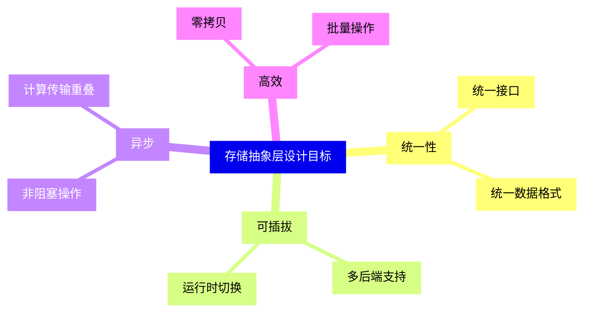
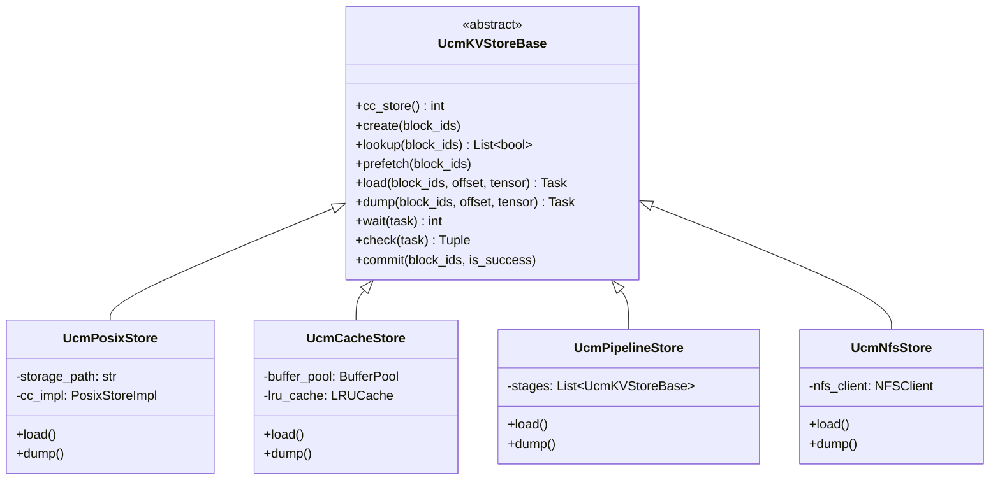
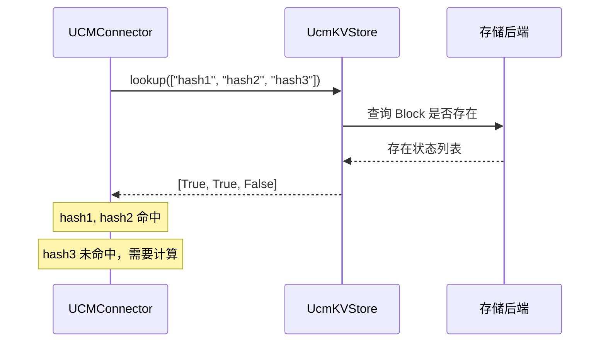
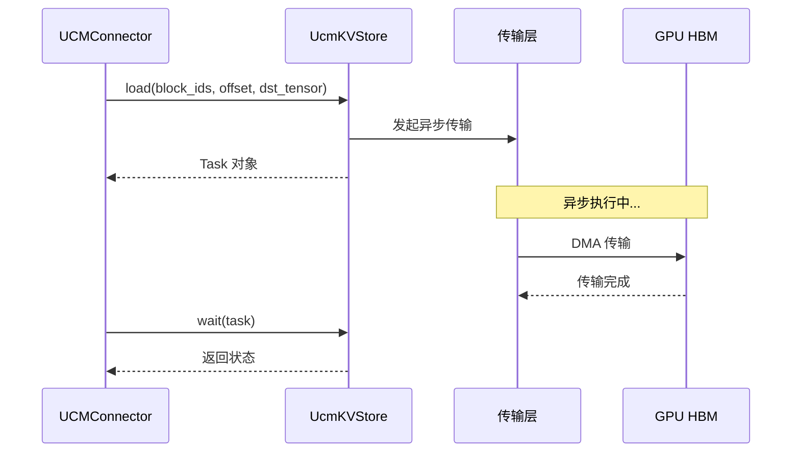
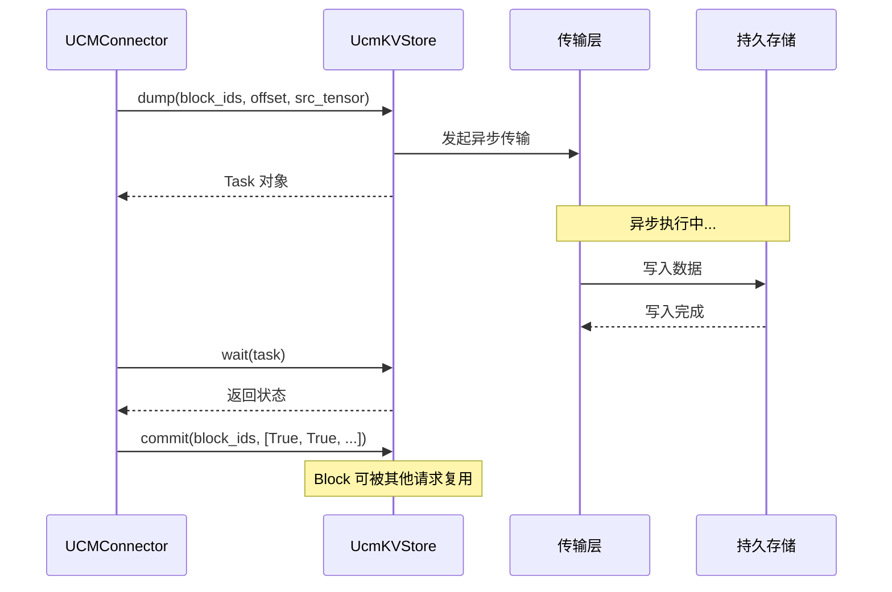
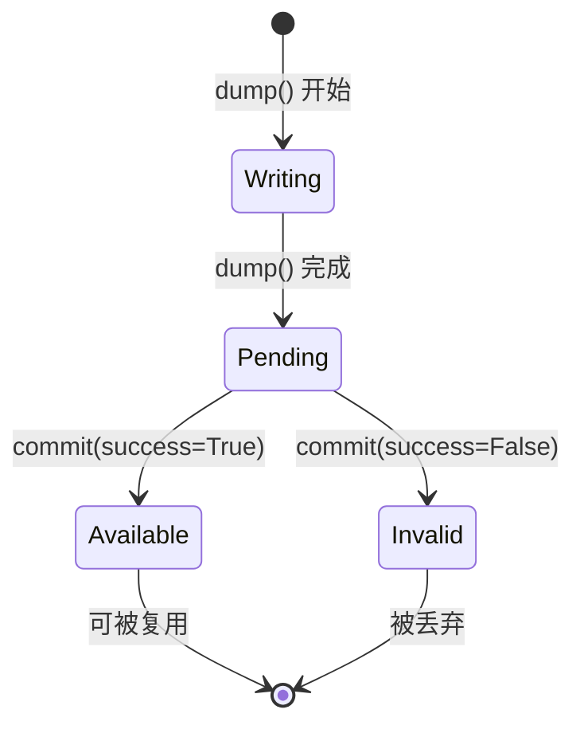
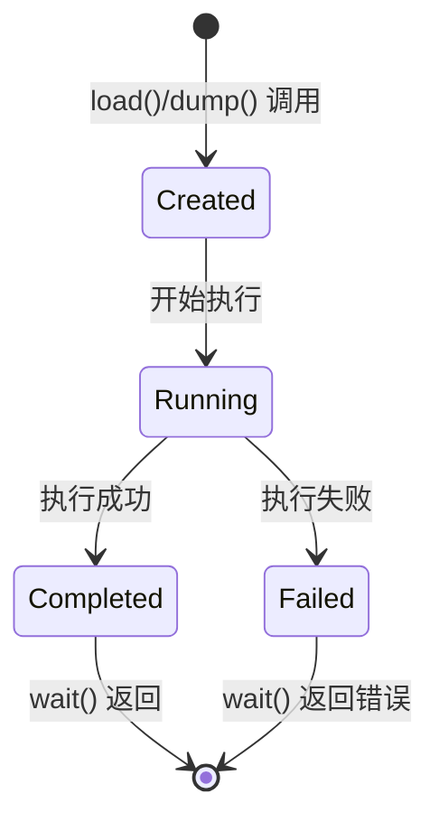
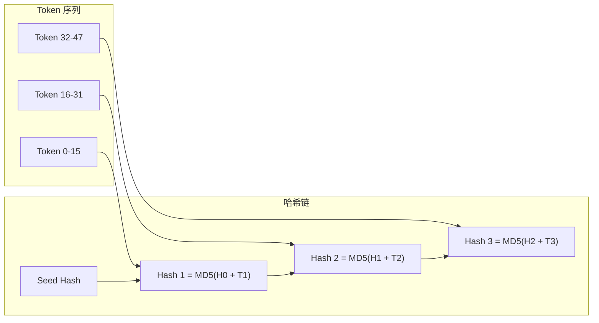

> **阅读时间**: 约 20 分钟
> **前置要求**: [快速开始](../01-overview/03-quick-start.md)

---

## 概述

本文深入讲解 UCM 存储抽象层的设计，包括核心接口、异步任务模型和扩展机制。

---

## 1. 设计哲学

### 1.1 设计目标


### 1.2 核心原则
| 原则 | 说明 | 实现 |
|------|------|------|
| 最小接口 | 定义必要的操作 | 5 个核心方法 |
| 异步优先 | 默认非阻塞 | Task 模型 |
| 平台无关 | 屏蔽硬件差异 | 抽象传输层 |
| 可组合 | 支持层级组合 | Pipeline Store |

---

## 2. UcmKVStoreBase 接口

### 2.1 接口定义

**代码位置**: `ucm/store/ucmstore.py:31-205`

```python
class UcmKVStoreBase(ABC):
    """UCM 存储后端的抽象基类"""

    @abstractmethod
    def cc_store(self) -> int:
        """返回底层 C++ 存储实现的指针"""
        pass
    @abstractmethod
    def create(self, block_ids: List[bytes]) -> None:
        """在存储中预创建 KV 空间"""
        pass

    @abstractmethod
    def lookup(self, block_ids: List[bytes]) -> List[bool]:
        """查询 Block 是否存在于存储中"""
        pass
    @abstractmethod
    def prefetch(self, block_ids: List[bytes]) -> None:
        """预取 Block 到高速缓存层"""
        pass

    @abstractmethod
    def load(
        self,
        block_ids: List[bytes],
        offset: int,
        dst_tensor: torch.Tensor
    ) -> Task:
        """从存储加载 KV 到设备张量"""
        pass

    @abstractmethod
    def dump(
        self,
        block_ids: List[bytes],
        offset: int,
        src_tensor: torch.Tensor
    ) -> Task:
        """从设备张量保存 KV 到存储"""
        pass

    @abstractmethod
    def wait(self, task: Task) -> int:
        """等待异步任务完成"""
        pass
    @abstractmethod
    def check(self, task: Task) -> Tuple[int, bool]:
        """检查任务状态（非阻塞）"""
        pass

    @abstractmethod
    def commit(
        self,
        block_ids: List[bytes],
        is_success: List[bool]
    ) -> None:
        """提交 Block，使其可被其他请求复用"""
        pass
```

### 2.2 接口层次图


---
## 3. 核心操作详解

### 3.1 lookup - 查询操作



**使用场景**:
- Scheduler 调用，判断哪些 Block 可以复用
- 影响调度决策：命中的 Block 不需要计算

### 3.2 load - 加载操作



**关键参数**:
- `block_ids`: 要加载的 Block 哈希列表
- `offset`: 目标张量中的起始位置
- `dst_tensor`: GPU 上的目标张量

### 3.3 dump - 保存操作



### 3.4 commit - 提交操作



**设计原因**:
- 分离写入和可见性
- 保证只有完整写入的 Block 才能被复用
- 支持失败回滚

---
## 4. 异步任务模型
### 4.1 Task 类
**代码位置**: `ucm/store/ucmstore.py`
```python
@dataclass
class Task:
    """异步任务句柄"""
    task_id: int           # 任务 ID
    task_type: TaskType    # 任务类型 (LOAD/DUMP)
    block_count: int       # Block 数量
    start_time: float      # 开始时间
```
### 4.2 任务生命周期

### 4.3 任务使用模式
```python
task = store.load(block_ids, offset, tensor)
status = store.wait(task)  # 阻塞直到完成
# 模式 2: 非阻塞检查
task = store.load(block_ids, offset, tensor)
while True:
    status, done = store.check(task)
    if done:
        break
    # 可以做其他事情
    do_other_work()

tasks = []
for batch in batches:
    task = store.load(batch.block_ids, batch.offset, batch.tensor)
    tasks.append(task)
for task in tasks:
    store.wait(task)
```
---
## 5. V1 接口增强

### 5.1 V0 vs V1 对比

| 特性 | V0 接口 | V1 接口 |
|------|---------|---------|
| 地址操作 | 基于 offset | 基于 shard_index |
| 分片支持 | 不支持 | 原生支持 |
| Block 预留 | 预分配 | 按需预留 |
| 提交机制 | 手动 commit | 自动提交 |

### 5.2 V1 接口定义

**代码位置**: `ucm/store/ucmstore_v1.py`

```python
class UcmKVStoreBaseV1(ABC):
    """V1 版本存储接口，增强分片支持"""

    @abstractmethod
    def lookup(
        self,
        block_ids: List[bytes],
        shard_indices: List[int]
    ) -> List[bool]:
        """查询指定分片的 Block"""
        pass

    @abstractmethod
    def load_data(
        self,
        block_ids: List[bytes],
        shard_indices: List[int],
        dst_addrs: List[int],
        sizes: List[int]
    ) -> Task:
        """加载数据到指定地址"""
        pass

    @abstractmethod
    def dump_data(
        self,
        block_ids: List[bytes],
        shard_indices: List[int],
        src_addrs: List[int],
        sizes: List[int]
    ) -> Task:
        """从指定地址保存数据"""
        pass
```

---
## 6. Block 标识设计
### 6.1 Block ID 生成
UCM 使用 MD5 哈希链来标识 Block：

### 6.2 哈希链的优势
| 优势 | 说明 |
|------|------|
| **前缀敏感** | 相同前缀产生相同哈希 |
| **增量计算** | 新 Block 只需一次哈希 |
| **模型隔离** | 不同模型的 KV 不会碰撞 |
| **跨请求复用** | 相同内容自动共享 |

### 6.3 代码实现

**代码位置**: `ucm/integration/vllm/ucm_connector.py`

```python
class RequestHasher:
    """请求哈希生成器"""

    def __init__(self, model_id: str, world_size: int, dtype: str, rank_id: int):
        # 元信息作为哈希前缀
        self.meta = f"{model_id}:{world_size}:{dtype}:{rank_id}"
        self.seed = hashlib.md5(b"UCM_HASH_SEED").digest()
    def generate_block_hashes(
        self,
        token_ids: List[int],
        block_size: int
    ) -> List[bytes]:
        """生成 Block 哈希链"""
        hashes = []
        parent_hash = self.seed

        for i in range(0, len(token_ids), block_size):
            block_tokens = token_ids[i:i + block_size]
            # 链式哈希
            data = parent_hash + pickle.dumps(block_tokens)
            block_hash = hashlib.md5(data).digest()
            hashes.append(block_hash)
            parent_hash = block_hash

        return hashes
```
---
## 7. 扩展存储后端

### 7.1 实现步骤

1. 继承 `UcmKVStoreBase` 或 `UcmKVStoreBaseV1`
2. 实现所有抽象方法
3. 在工厂中注册

### 7.2 示例实现

```python
from ucm.store.ucmstore import UcmKVStoreBase, Task

class MyCustomStore(UcmKVStoreBase):
    """自定义存储后端示例"""

    def __init__(self, config: dict):
        self.backend_url = config.get("backend_url")
        self._connect()

    def _connect(self):
        # 初始化连接
        pass

    def lookup(self, block_ids: List[bytes]) -> List[bool]:
        results = []
        for block_id in block_ids:
            exists = self._check_exists(block_id)
            results.append(exists)
        return results

    def load(self, block_ids, offset, dst_tensor) -> Task:
        # 发起异步加载
        task_id = self._async_load(block_ids, dst_tensor.data_ptr() + offset)
        return Task(task_id=task_id, task_type=TaskType.LOAD, ...)

    def dump(self, block_ids, offset, src_tensor) -> Task:
        # 发起异步保存
        task_id = self._async_dump(block_ids, src_tensor.data_ptr() + offset)
        return Task(task_id=task_id, task_type=TaskType.DUMP, ...)

    def wait(self, task: Task) -> int:
        return self._wait_task(task.task_id)

    def check(self, task: Task) -> Tuple[int, bool]:
        return self._check_task(task.task_id)

    def commit(self, block_ids, is_success):
        for block_id, success in zip(block_ids, is_success):
            if success:
                self._mark_available(block_id)
```

### 7.3 注册到工厂

```python
from ucm.store.factory import UcmConnectorFactory

UcmConnectorFactory.register_connector(
    name="MyCustomStore",
    module_path="my_package.custom_store",
    class_name="MyCustomStore"
)
```

---
## 8. 关键代码入口
| 功能 | 文件 | 行号 |
|------|------|------|
| 存储基类定义 | `ucm/store/ucmstore.py` | 31-205 |
| V1 接口定义 | `ucm/store/ucmstore_v1.py` | 1-100 |
| 存储工厂 | `ucm/store/factory.py` | 34-71 |
| Block 哈希生成 | `ucm/integration/vllm/ucm_connector.py` | 50-120 |
