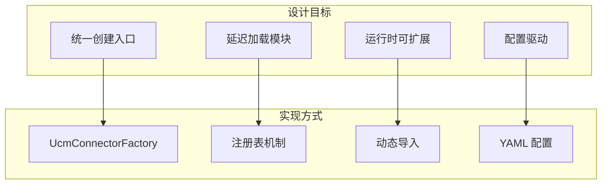
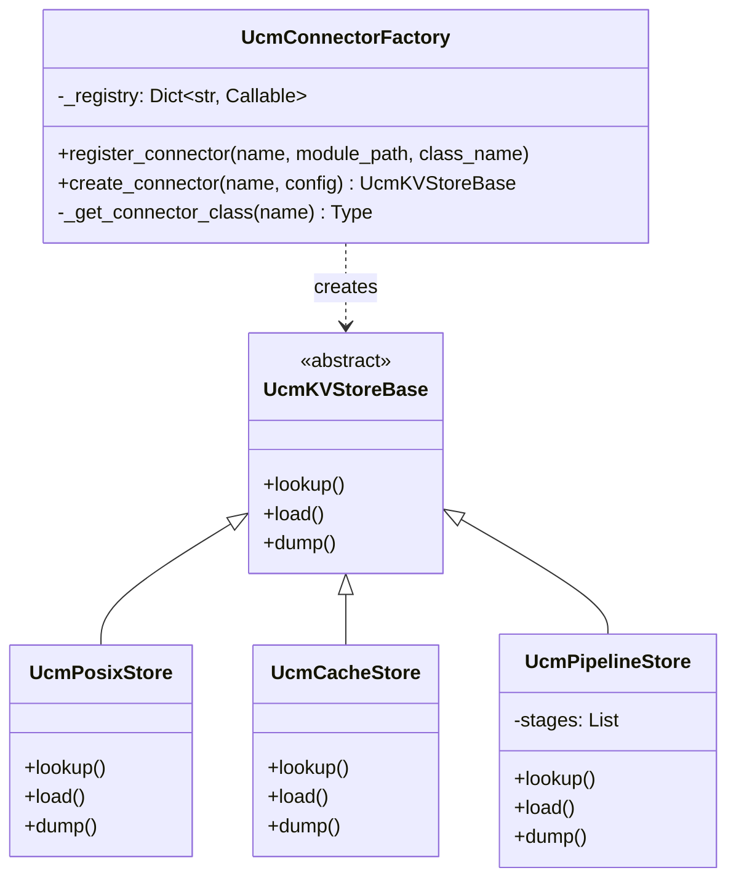
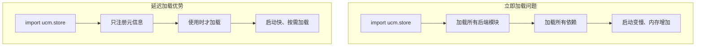
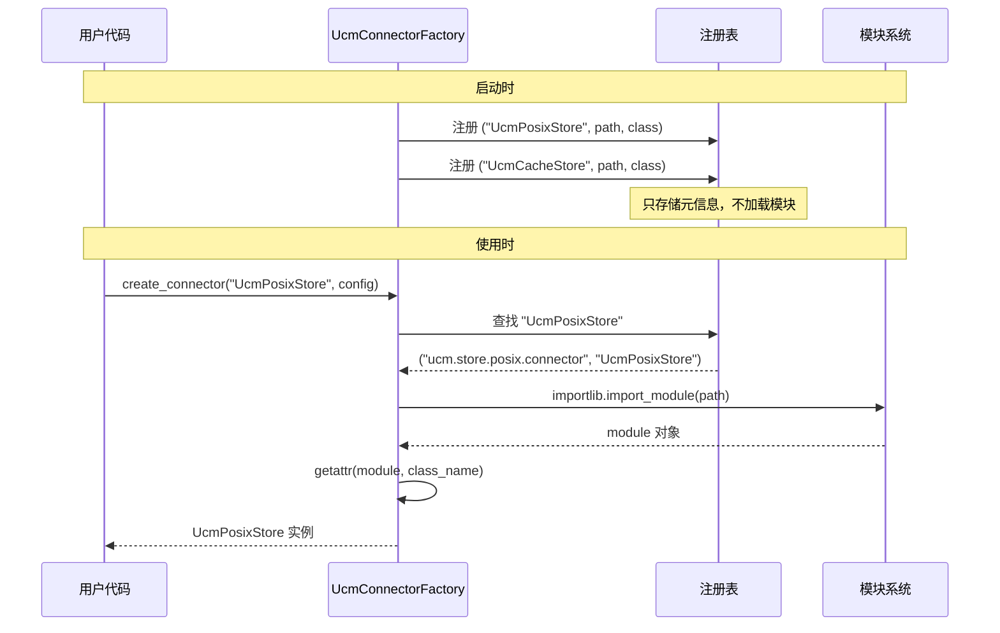
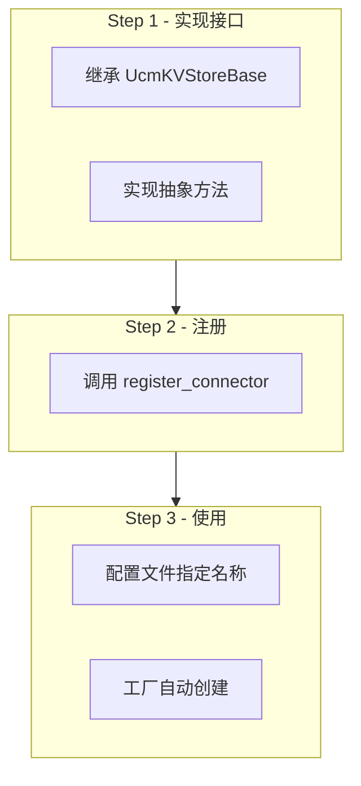

> **阅读时间**: 约 12 分钟
> **前置要求**: [存储抽象层设计](./01-storage-abstraction.md)

---

## 概述

本文讲解 UCM 存储层的工厂模式实现，包括连接器注册、延迟加载和实例化流程。

---

## 1. 工厂模式设计

### 1.1 设计目标



### 1.2 核心类图


---
## 2. 工厂实现

### 2.1 工厂类

**代码位置**: `ucm/store/factory.py:34-71`

```python
class UcmConnectorFactory:
    """UCM 存储连接器工厂"""

    # 注册表: 名称 -> (模块路径, 类名)
    _registry: Dict[str, Tuple[str, str]] = {}

    @classmethod
    def register_connector(
        cls,
        name: str,
        module_path: str,
        class_name: str
    ) -> None:
        """注册存储连接器

        Args:
            name: 连接器名称，如 "UcmPosixStore"
            module_path: 模块路径，如 "ucm.store.posix.connector"
            class_name: 类名，如 "UcmPosixStore"
        """
        cls._registry[name] = (module_path, class_name)

    @classmethod
    def create_connector(
        cls,
        connector_name: str,
        config: Dict[str, Any]
    ) -> UcmKVStoreBase:
        """创建存储连接器实例

        Args:
            connector_name: 注册的连接器名称
            config: 连接器配置字典

        Returns:
            UcmKVStoreBase 实例
        """
        if connector_name not in cls._registry:
            raise ValueError(f"Unknown connector: {connector_name}")

        connector_cls = cls._get_connector_class(connector_name)
        return connector_cls(config)

    @classmethod
    def _get_connector_class(cls, name: str) -> Type[UcmKVStoreBase]:
        """获取连接器类（延迟导入）"""
        module_path, class_name = cls._registry[name]

        # 动态导入模块
        module = importlib.import_module(module_path)

        # 获取类
        return getattr(module, class_name)
```

### 2.2 连接器注册

```python

UcmConnectorFactory.register_connector(
    "UcmPosixStore",
    "ucm.store.posix.connector",
    "UcmPosixStore"
)

UcmConnectorFactory.register_connector(
    "UcmCacheStore",
    "ucm.store.cache.connector",
    "UcmCacheStore"
)

UcmConnectorFactory.register_connector(
    "UcmPipelineStore",
    "ucm.store.pipeline.connector",
    "UcmPipelineStore"
)

UcmConnectorFactory.register_connector(
    "UcmNfsStore",
    "ucm.store.nfsstore.connector",
    "UcmNfsStore"
)

UcmConnectorFactory.register_connector(
    "UcmDs3fsStore",
    "ucm.store.ds3fs.connector",
    "UcmDs3fsStore"
)
```

---
## 3. 延迟加载机制
### 3.1 为什么延迟加载


### 3.2 延迟加载流程



---

## 4. 配置驱动创建

### 4.1 配置文件格式

```yaml
# ucm_config.yaml
ucm_connectors:
  - ucm_connector_name: "UcmPipelineStore"
    ucm_connector_config:
      store_pipeline: "Cache|Posix"
      storage_backends: "/data/ucm_cache"
      buffer_number: 2048
      block_size: 16
      io_direct: true
```

### 4.2 配置加载流程

```python
def create_store_from_config(config_path: str) -> UcmKVStoreBase:
    """从配置文件创建存储实例"""
    import yaml
    with open(config_path) as f:
        config = yaml.safe_load(f)

    # 获取第一个连接器配置
    connector_config = config['ucm_connectors'][0]
    connector_name = connector_config['ucm_connector_name']
    connector_params = connector_config['ucm_connector_config']
    # 通过工厂创建
    return UcmConnectorFactory.create_connector(
        connector_name,
        connector_params
    )
```

---

## 5. 扩展自定义后端

### 5.1 实现步骤


### 5.2 示例: 自定义 Redis 后端
```python

from ucm.store.ucmstore import UcmKVStoreBase, Task
import redis

class UcmRedisStore(UcmKVStoreBase):
    """Redis 存储后端"""
    def __init__(self, config: dict):
        self.host = config.get('host', 'localhost')
        self.port = config.get('port', 6379)
        self.client = redis.Redis(host=self.host, port=self.port)

    def lookup(self, block_ids: list) -> list:
        results = []
        for block_id in block_ids:
            exists = self.client.exists(block_id)
            results.append(bool(exists))
        return results
    def load(self, block_ids, offset, dst_tensor) -> Task:
        # 实现加载逻辑
        ...
    def dump(self, block_ids, offset, src_tensor) -> Task:
        # 实现保存逻辑
        ...
    def wait(self, task: Task) -> int:
        # 实现等待逻辑
        ...
    def check(self, task: Task):
        # 实现检查逻辑
        ...
    def commit(self, block_ids, is_success):
        # 实现提交逻辑
        ...
```

### 5.3 注册自定义后端

```python
# 在应用启动时注册
from ucm.store.factory import UcmConnectorFactory

UcmConnectorFactory.register_connector(
    "UcmRedisStore",
    "my_package.redis_store",
    "UcmRedisStore"
)

# ucm_config.yaml
# ucm_connectors:
#     ucm_connector_config:
#       host: "redis.example.com"
```

---

## 6. V1 工厂

### 6.1 V1 工厂差异

**代码位置**: `ucm/store/factory_v1.py`

```python
class UcmConnectorFactoryV1:
    """V1 版本的存储连接器工厂

    与 V0 的主要区别:
    - 支持分片索引 (shard_index)
    - 支持地址级操作 (load_data/dump_data)
    - 自动提交机制
    """

    _registry: Dict[str, Tuple[str, str]] = {}

    @classmethod
    def create_connector(
        cls,
        connector_name: str,
        config: Dict[str, Any]
    ) -> UcmKVStoreBaseV1:
        """创建 V1 版本的存储连接器"""
        ...
```

---

## 7. 最佳实践

### 7.1 选择合适的后端

| 场景 | 推荐后端 | 原因 |
|------|----------|------|
| 单机开发/测试 | UcmPosixStore | 简单、无依赖 |
| 单机生产 | UcmPipelineStore (Cache\|Posix) | 高速缓存 + 持久化 |
| 多机共享 | UcmPipelineStore (Cache\|NFS) | 支持跨节点复用 |
| 云环境 | UcmPipelineStore (Cache\|DS3FS) | S3 兼容 |
### 7.2 配置建议
```yaml
ucm_connectors:
  - ucm_connector_name: "UcmPosixStore"
    ucm_connector_config:
      storage_backends: "/tmp/ucm_dev"
      io_direct: false

ucm_connectors:
  - ucm_connector_name: "UcmPipelineStore"
    ucm_connector_config:
      store_pipeline: "Cache|Posix"
      storage_backends: "/data/ucm_cache"
      buffer_number: 4096
      io_direct: true
```