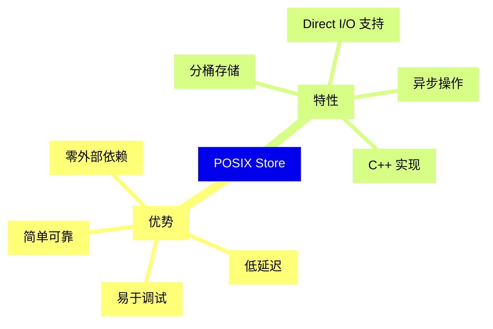
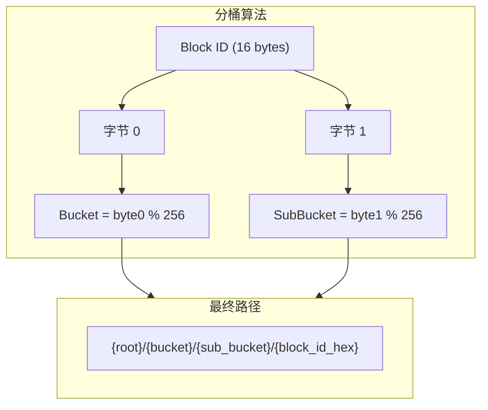
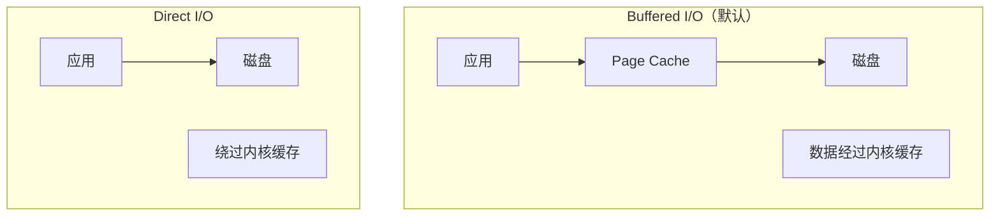

> **阅读时间**: 约 12 分钟
> **前置要求**: [工厂模式](./02-factory-pattern.md)

---

## 概述

POSIX Store 是 UCM 最基础的存储后端，使用本地文件系统存储 KV Cache。本文详解其设计和实现。

---

## 1. 设计概述

### 1.1 特点


### 1.2 适用场景
| 场景 | 适合程度 | 说明 |
|------|----------|------|
| 单机开发/测试 | 最佳 | 简单、无需配置 |
| 单机生产 | 良好 | 配合 Cache Store 使用 |
| 多机集群 | 不适合 | 无法跨节点共享 |
---
## 2. 文件布局

### 2.1 目录结构

```
/data/ucm_cache/           # 根目录
├── 0/                     # Bucket 0
│   ├── 0/                 # Sub-bucket 0
│   │   ├── a1b2c3d4...    # Block 文件
│   │   └── e5f6g7h8...
│   ├── 1/
│   └── ...
├── 1/                     # Bucket 1
│   └── ...
└── ...
```

### 2.2 分桶策略



**分桶原因**:
- 避免单目录文件过多
- 提高文件系统性能
- 支持并行 I/O

### 2.3 Block 文件格式

```
┌─────────────────────────────────────────────┐
│                 Block 文件                   │
├─────────────────────────────────────────────┤
│ Header (可选)                                │
│   - Magic Number: 4 bytes                   │
│   - Version: 4 bytes                        │
│   - Block Size: 4 bytes                     │
│   - Num Layers: 4 bytes                     │
├─────────────────────────────────────────────┤
│ Layer 0 KV Cache                            │
│   - K: [block_size, num_heads, head_dim]    │
│   - V: [block_size, num_heads, head_dim]    │
├─────────────────────────────────────────────┤
│ Layer 1 KV Cache                            │
│   ...                                       │
├─────────────────────────────────────────────┤
│ Layer N KV Cache                            │
│   ...                                       │
└─────────────────────────────────────────────┘
```

---
## 3. 核心实现
### 3.1 Python 接口
**代码位置**: `ucm/store/posix/connector.py`
```python
class UcmPosixStore(UcmKVStoreBase):
    """POSIX 文件系统存储后端"""
    def __init__(self, config: dict):
        self.storage_path = config.get('storage_backends', '/tmp/ucm_cache')
        self.io_direct = config.get('io_direct', False)
        self.block_size = config.get('block_size', 16)

        # 初始化 C++ 实现
        self._cc_store = self._init_cc_store()
        # 确保目录存在
        self._ensure_directories()

    def lookup(self, block_ids: List[bytes]) -> List[bool]:
        """查询 Block 是否存在"""
        results = []
        for block_id in block_ids:
            path = self._get_block_path(block_id)
            results.append(os.path.exists(path))
        return results

    def load(self, block_ids, offset, dst_tensor) -> Task:
        """从文件加载 KV 到 GPU"""
        return self._cc_store.load(
            block_ids,
            offset,
            dst_tensor.data_ptr(),
            dst_tensor.nbytes
        )
    def dump(self, block_ids, offset, src_tensor) -> Task:
        """从 GPU 保存 KV 到文件"""
        return self._cc_store.dump(
            block_ids,
            offset,
            src_tensor.data_ptr(),
            src_tensor.nbytes
        )

    def _get_block_path(self, block_id: bytes) -> str:
        """计算 Block 文件路径"""
        bucket = block_id[0]
        sub_bucket = block_id[1]
        hex_id = block_id.hex()
        return os.path.join(
            self.storage_path,
            str(bucket),
            str(sub_bucket),
            hex_id
        )
```
### 3.2 C++ 实现
**代码位置**: `ucm/csrc/store/posix_store.cpp`
```cpp
class PosixStore : public StoreV1 {
public:
    PosixStore(const std::string& base_path, bool use_direct_io)
        : base_path_(base_path), use_direct_io_(use_direct_io) {
        // 初始化
    }
    Task Load(const std::vector<BlockId>& block_ids,
              void* dst_addr,
              size_t size) override {
        auto task = CreateTask(TaskType::LOAD);

        // 异步执行
        thread_pool_.Submit([=]() {
            for (const auto& block_id : block_ids) {
                std::string path = GetBlockPath(block_id);
                ReadFile(path, dst_addr, size);
            }
            task->Complete();
        });
        return task;
    }

private:
    void ReadFile(const std::string& path, void* dst, size_t size) {
        int flags = O_RDONLY;
        if (use_direct_io_) {
            flags |= O_DIRECT;
        }
        int fd = open(path.c_str(), flags);
        if (fd < 0) {
            throw std::runtime_error("Failed to open file");
        }

        ssize_t bytes_read = read(fd, dst, size);
        close(fd);
        if (bytes_read != size) {
            throw std::runtime_error("Incomplete read");
        }
    }
};
```

---

## 4. Direct I/O 支持

### 4.1 什么是 Direct I/O



### 4.2 何时使用

| 场景 | 推荐 | 原因 |
|------|------|------|
| 有 UCM Cache Store | Direct I/O | 避免双重缓存 |
| 无额外缓存层 | Buffered I/O | 利用 Page Cache |
| NVMe SSD | Direct I/O | 发挥最大性能 |
| HDD | Buffered I/O | Page Cache 有益 |
### 4.3 配置方式
```yaml
ucm_connectors:
  - ucm_connector_name: "UcmPosixStore"
    ucm_connector_config:
      storage_backends: "/data/ucm_cache"
      io_direct: true  # 启用 Direct I/O
```
### 4.4 对齐要求
使用 Direct I/O 时需要满足对齐要求：
```cpp
// 对齐要求
constexpr size_t DIRECT_IO_ALIGNMENT = 512;  // 通常是 512 或 4096
void* aligned_buffer = aligned_alloc(DIRECT_IO_ALIGNMENT, size);
// 确保地址对齐
assert(reinterpret_cast<uintptr_t>(aligned_buffer) % DIRECT_IO_ALIGNMENT == 0);
// 确保大小对齐
assert(size % DIRECT_IO_ALIGNMENT == 0);
```
---
## 5. 性能优化

### 5.1 批量操作

```python
for block_id in block_ids:
    store.load([block_id], offset, tensor)
    store.wait(task)

task = store.load(block_ids, offset, tensor)
store.wait(task)
```

### 5.2 异步 I/O

```python
tasks = []
for batch in batches:
    task = store.load(batch.block_ids, batch.offset, batch.tensor)
    tasks.append(task)

for task in tasks:
    store.wait(task)
```

### 5.3 预取优化

```python
current_task = store.load(current_batch.block_ids, ...)

next_task = store.load(next_batch.block_ids, ...)

store.wait(current_task)


```

---
## 6. 配置参考
### 6.1 完整配置
```yaml
ucm_connectors:
  - ucm_connector_name: "UcmPosixStore"
    ucm_connector_config:
      # 存储路径（必需）
      storage_backends: "/data/ucm_cache"

      # Direct I/O（可选，默认 false）
      io_direct: true
      # Block 大小（可选，默认 16）
      block_size: 16

      # 线程池大小（可选）
      io_threads: 8
      # 预分配 bucket 目录（可选）
      preallocate_buckets: true
```
### 6.2 环境变量
```bash
export UCM_POSIX_STORAGE_PATH=/custom/path

export UCM_POSIX_DEBUG=1
```
---
## 7. 常见问题

### 7.1 权限错误

```bash
mkdir -p /data/ucm_cache
chmod 755 /data/ucm_cache
```

### 7.2 磁盘空间不足

```bash
df -h /data/ucm_cache

find /data/ucm_cache -type f -mtime +7 -delete
```

### 7.3 Direct I/O 失败

```python
# 某些网络文件系统不支持 Direct I/O

config = {
    "storage_backends": "/data/ucm_cache",
    "io_direct": False
}
```
