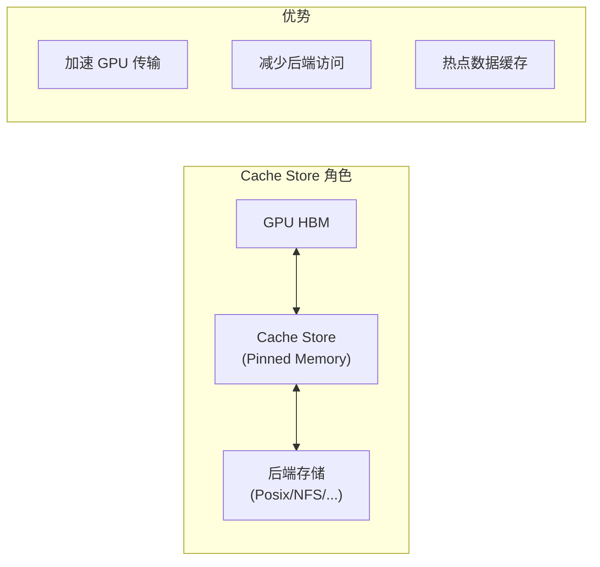
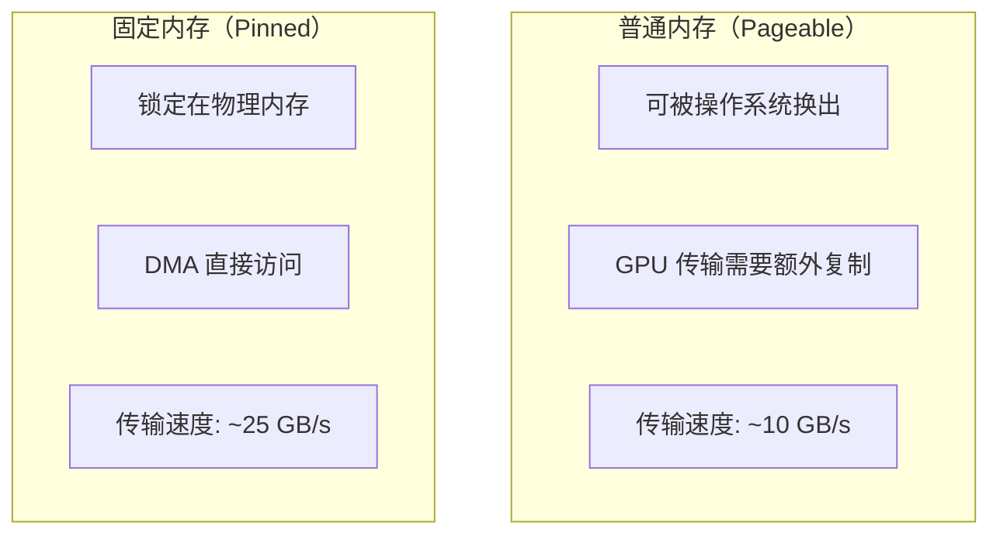
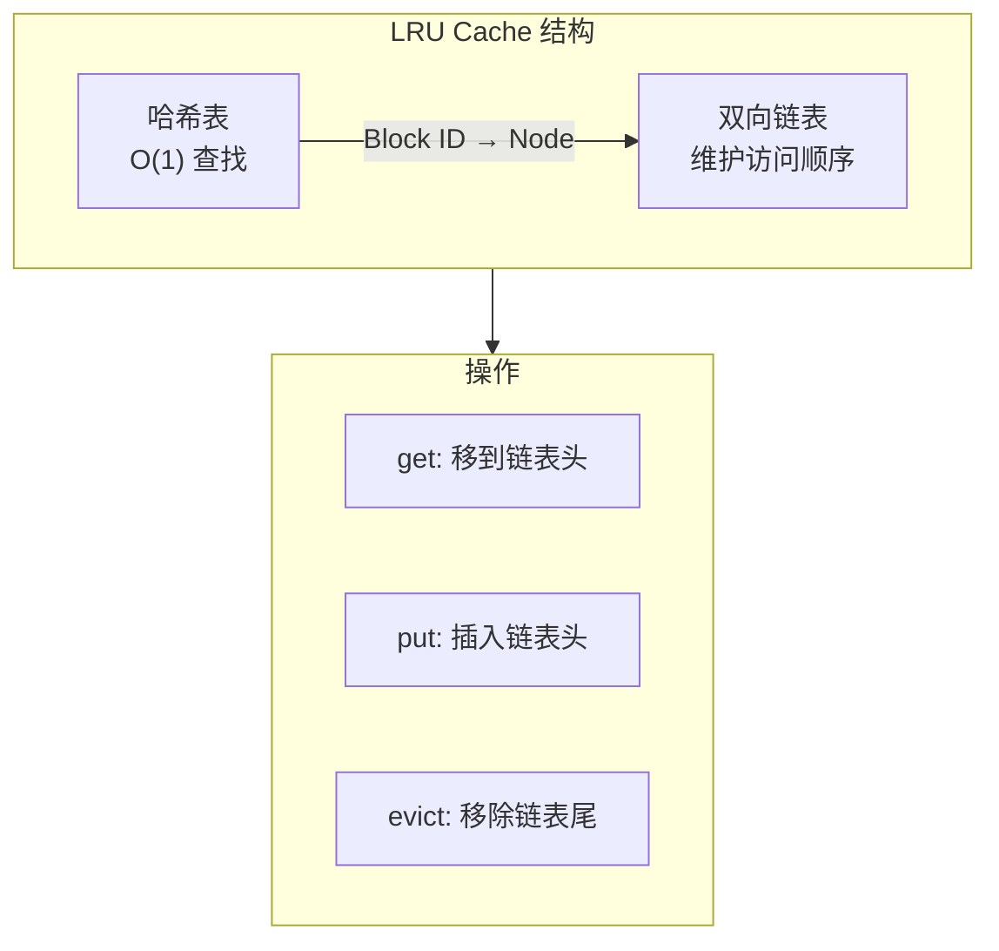
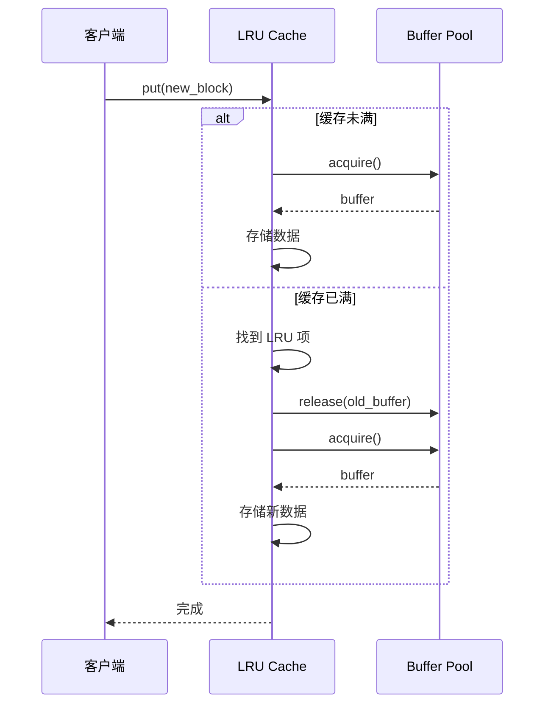
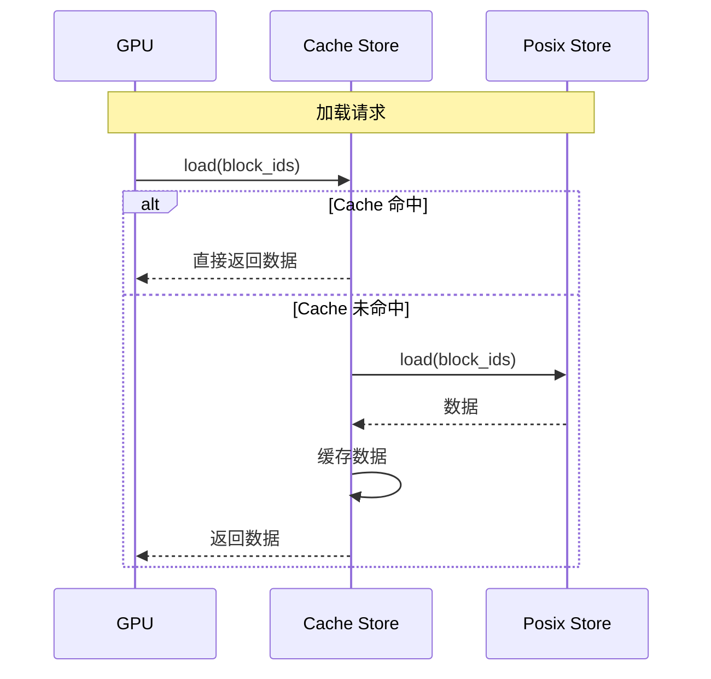
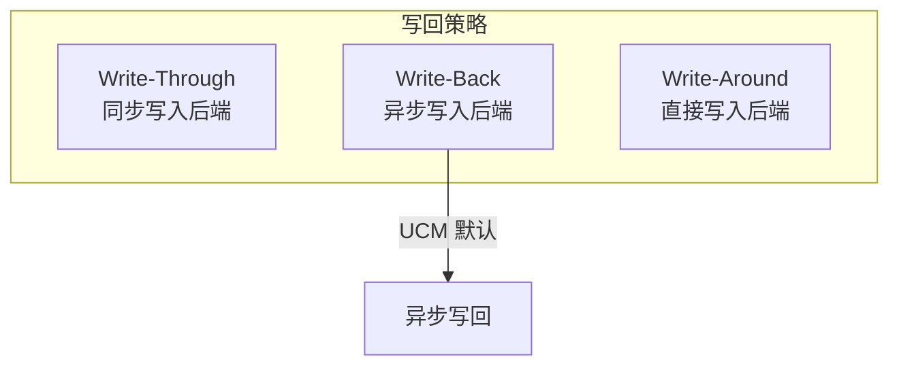

> **阅读时间**: 约 12 分钟
> **前置要求**: [POSIX 后端](./03-posix-backend.md)

---

## 概述

Cache Store 是 UCM 的高速缓存层，使用 CPU Pinned Memory 作为 GPU 和外部存储之间的缓冲。本文详解其设计和实现。

---

## 1. 设计概述

### 1.1 架构定位



### 1.2 特点

| 特点 | 说明 |
|------|------|
| Pinned Memory | 固定内存，DMA 直接访问 |
| LRU 淘汰 | 最近最少使用淘汰策略 |
| 预分配缓冲池 | 避免运行时分配开销 |
| 异步传输 | 支持计算传输重叠 |
---
## 2. Pinned Memory 缓冲池

### 2.1 为什么使用 Pinned Memory



### 2.2 缓冲池设计

```python
class PinnedMemoryPool:
    """Pinned Memory 缓冲池"""

    def __init__(self, buffer_count: int, buffer_size: int):
        self.buffer_count = buffer_count
        self.buffer_size = buffer_size

        # 预分配所有缓冲区
        self.buffers = [
            torch.empty(buffer_size, dtype=torch.uint8, pin_memory=True)
            for _ in range(buffer_count)
        ]

        # 空闲缓冲区队列
        self.free_buffers = queue.Queue()
        for buf in self.buffers:
            self.free_buffers.put(buf)

    def acquire(self) -> torch.Tensor:
        """获取一个缓冲区"""
        return self.free_buffers.get()

    def release(self, buffer: torch.Tensor):
        """释放缓冲区"""
        self.free_buffers.put(buffer)
```

### 2.3 配置参数

```yaml
ucm_connectors:
  - ucm_connector_name: "UcmCacheStore"
    ucm_connector_config:
      # 缓冲区数量
      buffer_number: 2048

      # 每个缓冲区大小（字节）
      buffer_size: 4096

      # 总内存占用 = 2048 * 4096 = 8 MB
```

---
## 3. LRU 缓存策略
### 3.1 缓存结构

### 3.2 实现
```python
class LRUCache:
    """LRU 缓存实现"""
    def __init__(self, capacity: int):
        self.capacity = capacity
        self.cache = OrderedDict()
        self._lock = threading.Lock()

    def get(self, key: bytes) -> Optional[torch.Tensor]:
        """获取缓存项"""
        with self._lock:
            if key not in self.cache:
                return None
            # 移到末尾（最近使用）
            self.cache.move_to_end(key)
            return self.cache[key]
    def put(self, key: bytes, value: torch.Tensor):
        """添加缓存项"""
        with self._lock:
            if key in self.cache:
                self.cache.move_to_end(key)
            else:
                if len(self.cache) >= self.capacity:
                    # 淘汰最久未使用的
                    self.cache.popitem(last=False)
                self.cache[key] = value

    def contains(self, key: bytes) -> bool:
        """检查是否存在"""
        with self._lock:
            return key in self.cache
```

### 3.3 淘汰流程


---
## 4. 核心实现

### 4.1 UcmCacheStore 类

**代码位置**: `ucm/store/cache/connector.py`

```python
class UcmCacheStore(UcmKVStoreBase):
    """内存缓存存储后端"""

    def __init__(self, config: dict):
        buffer_count = config.get('buffer_number', 1024)
        buffer_size = config.get('buffer_size', 4096)

        # 初始化缓冲池
        self.buffer_pool = PinnedMemoryPool(buffer_count, buffer_size)

        # 初始化 LRU 缓存
        self.cache = LRUCache(capacity=buffer_count)

    def lookup(self, block_ids: List[bytes]) -> List[bool]:
        """查询缓存命中"""
        return [self.cache.contains(bid) for bid in block_ids]

    def load(self, block_ids, offset, dst_tensor) -> Task:
        """从缓存加载到 GPU"""
        task = Task(TaskType.LOAD)

        for block_id in block_ids:
            cached = self.cache.get(block_id)
            if cached is not None:
                # 缓存命中，直接传输
                dst_tensor[offset:offset + len(cached)].copy_(cached)
            else:
                # 缓存未命中
                raise CacheMissError(block_id)

        task.complete()
        return task

    def dump(self, block_ids, offset, src_tensor) -> Task:
        """从 GPU 保存到缓存"""
        task = Task(TaskType.DUMP)

        for i, block_id in enumerate(block_ids):
            # 获取缓冲区
            buffer = self.buffer_pool.acquire()
            # 复制数据
            buffer.copy_(src_tensor[offset + i * self.block_size])
            # 加入缓存
            self.cache.put(block_id, buffer)

        task.complete()
        return task
```

---
## 5. 作为 Pipeline 的一部分
### 5.1 典型组合
```yaml
store_pipeline: "Cache|Posix"

# 读取: GPU ← Cache ← Posix (如果 Cache 未命中)
# 写入: GPU → Cache → Posix (异步写回)
```

### 5.2 多级加载流程



### 5.3 写回策略


---
## 6. 性能调优

### 6.1 缓冲区数量

```
推荐公式:
buffer_number = max_concurrent_blocks * 2

其中:
- max_concurrent_blocks = batch_size * max_seq_len / block_size
```

### 6.2 缓冲区大小

```
推荐公式:
buffer_size = block_size * num_layers * 2 * num_heads * head_dim * sizeof(dtype)

示例 (Llama-7B):
buffer_size = 16 * 32 * 2 * 32 * 128 * 2 = 8 MB
```

### 6.3 监控指标

```python
stats = cache_store.get_stats()
print(f"Cache hit rate: {stats['hit_rate'] * 100:.1f}%")
print(f"Cache size: {stats['current_size']} / {stats['capacity']}")
print(f"Evictions: {stats['eviction_count']}")
```

---
## 7. 配置参考
```yaml
ucm_connectors:
  - ucm_connector_name: "UcmCacheStore"
    ucm_connector_config:
      # 缓冲区数量
      buffer_number: 4096

      # 缓冲区大小（字节）
      buffer_size: 8388608  # 8 MB
      # LRU 淘汰阈值（可选）
      eviction_threshold: 0.9

      # 预热（可选）
      warmup_enabled: true
      # 统计收集间隔（可选）
      stats_interval: 60
```