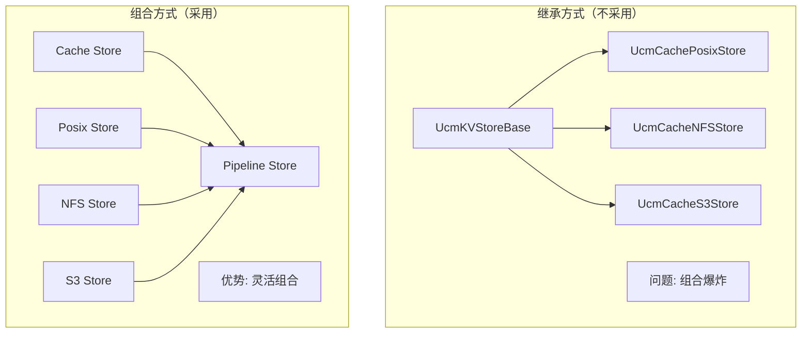
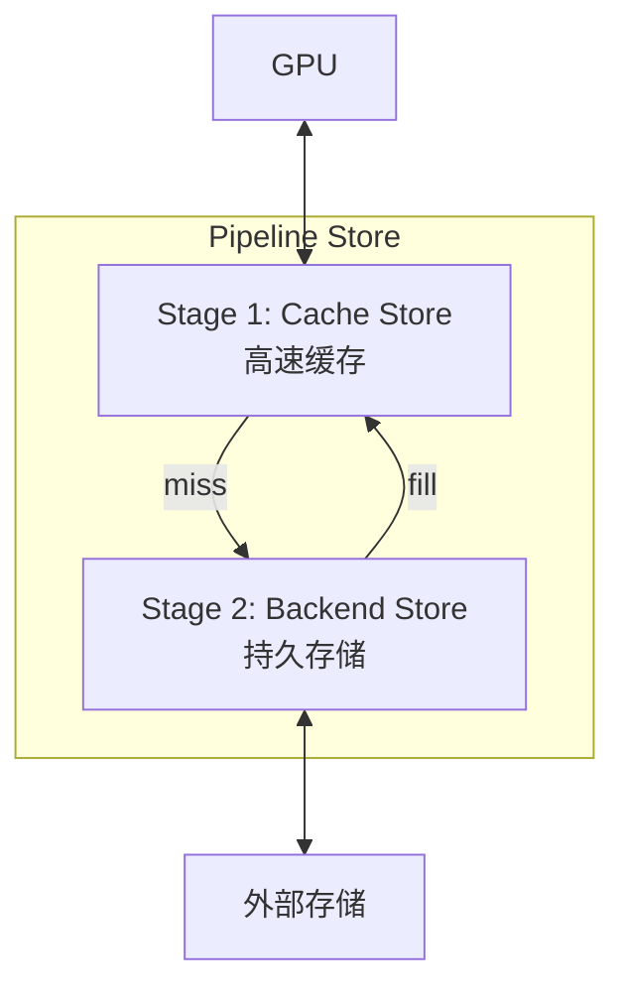
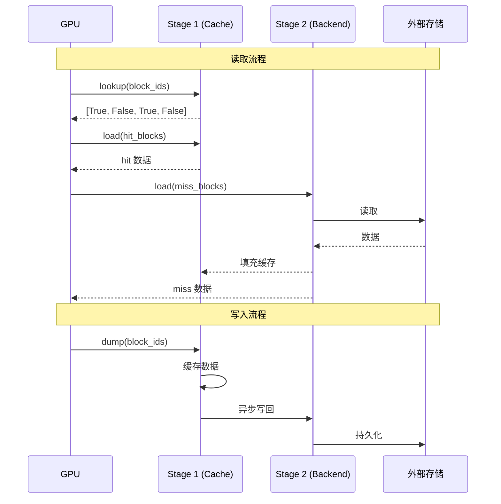
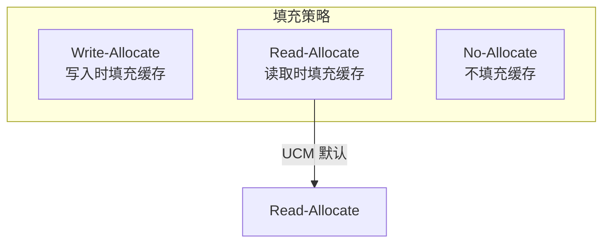

> **阅读时间**: 约 12 分钟
> **前置要求**: [Cache 后端](./04-cache-backend.md)

---

## 概述

Pipeline Store 是 UCM 存储层的核心设计，支持灵活组合多个存储后端形成多级缓存架构。本文详解其设计和使用。

---

## 1. 设计理念

### 1.1 组合优于继承


### 1.2 支持的组合
| 组合 | 配置 | 用途 |
|------|------|------|
| Cache + Posix | `Cache\|Posix` | 单机高速缓存 |
| Cache + NFS | `Cache\|NFS` | 分布式缓存 |
| Cache + DS3FS | `Cache\|DS3FS` | 云存储缓存 |
| Cache + Empty | `Cache\|Empty` | 纯内存（测试用） |

---

## 2. Pipeline 架构

### 2.1 层级结构


### 2.2 数据流


---

## 3. 核心实现

### 3.1 UcmPipelineStore 类

**代码位置**: `ucm/store/pipeline/connector.py:33-168`

```python
class UcmPipelineStore(UcmKVStoreBase):
    """Pipeline 存储组合"""

    def __init__(self, config: dict):
        pipeline_spec = config.get('store_pipeline', 'Cache|Posix')
        # 解析 Pipeline 规格
        stage_names = pipeline_spec.split('|')

        # 创建各阶段
        self.stages = []
        for stage_name in stage_names:
            stage = self._create_stage(stage_name, config)
            self.stages.append(stage)

    def _create_stage(self, name: str, config: dict) -> UcmKVStoreBase:
        """创建 Pipeline 阶段"""
        if name == 'Cache':
            from ucm.store.cache.connector import UcmCacheStore
            return UcmCacheStore(config)
        elif name == 'Posix':
            from ucm.store.posix.connector import UcmPosixStore
            return UcmPosixStore(config)
        elif name == 'NFS':
            from ucm.store.nfsstore.connector import UcmNfsStore
            return UcmNfsStore(config)
        elif name == 'Ds3fs':
            from ucm.store.ds3fs.connector import UcmDs3fsStore
            return UcmDs3fsStore(config)
        else:
            raise ValueError(f"Unknown stage: {name}")
    def lookup(self, block_ids: List[bytes]) -> List[bool]:
        """分层查找"""
        results = [False] * len(block_ids)
        for stage in self.stages:
            stage_results = stage.lookup(block_ids)
            for i, hit in enumerate(stage_results):
                if hit:
                    results[i] = True
        return results
    def load(self, block_ids, offset, dst_tensor) -> Task:
        """分层加载"""
        # 先尝试从第一层加载
        cache_stage = self.stages[0]
        cache_hits = cache_stage.lookup(block_ids)
        # 分离命中和未命中
        hit_ids = [bid for bid, hit in zip(block_ids, cache_hits) if hit]
        miss_ids = [bid for bid, hit in zip(block_ids, cache_hits) if not hit]
        tasks = []
        # 从缓存加载命中的
        if hit_ids:
            task = cache_stage.load(hit_ids, offset, dst_tensor)
            tasks.append(task)

        # 从后端加载未命中的
        if miss_ids and len(self.stages) > 1:
            backend_stage = self.stages[1]
            task = backend_stage.load(miss_ids, offset, dst_tensor)
            tasks.append(task)

            # 填充缓存
            self._fill_cache(miss_ids, dst_tensor)
        return CompositeTask(tasks)
    def dump(self, block_ids, offset, src_tensor) -> Task:
        """分层保存"""
        tasks = []
        # 保存到缓存
        cache_stage = self.stages[0]
        task = cache_stage.dump(block_ids, offset, src_tensor)
        tasks.append(task)

        # 异步写回后端
        if len(self.stages) > 1:
            backend_stage = self.stages[1]
            task = backend_stage.dump(block_ids, offset, src_tensor)
            tasks.append(task)

        return CompositeTask(tasks)
```
### 3.2 Builder 模式
```python
class UcmPipelineStoreBuilder:
    """Pipeline Store 构建器"""
    _builders = {}
    @classmethod
    def register(cls, name: str, builder_func):
        """注册构建器"""
        cls._builders[name] = builder_func

    @classmethod
    def build(cls, pipeline_spec: str, config: dict) -> UcmPipelineStore:
        """构建 Pipeline"""
        if pipeline_spec in cls._builders:
            return cls._builders[pipeline_spec](config)
        else:
            return UcmPipelineStore(config)

# 注册预定义组合
UcmPipelineStoreBuilder.register(
    "Cache|Posix",
    lambda config: _cache_posix_pipeline_builder(config)
)
UcmPipelineStoreBuilder.register(
    "Cache|NFS",
    lambda config: _cache_nfs_pipeline_builder(config)
)
```
---
## 4. 配置示例

### 4.1 Cache + Posix

```yaml
ucm_connectors:
  - ucm_connector_name: "UcmPipelineStore"
    ucm_connector_config:
      store_pipeline: "Cache|Posix"

      # Cache 配置
      buffer_number: 2048

      # Posix 配置
      storage_backends: "/data/ucm_cache"
      io_direct: true
```

### 4.2 Cache + NFS

```yaml
ucm_connectors:
  - ucm_connector_name: "UcmPipelineStore"
    ucm_connector_config:
      store_pipeline: "Cache|NFS"

      # Cache 配置
      buffer_number: 4096

      # NFS 配置
      storage_backends: "192.168.1.100:/data/ucm_cache"
      nfs_mount_options: "rw,sync"
```

### 4.3 Cache + DS3FS

```yaml
ucm_connectors:
  - ucm_connector_name: "UcmPipelineStore"
    ucm_connector_config:
      store_pipeline: "Cache|Ds3fs"

      # Cache 配置
      buffer_number: 4096

      # DS3FS 配置
      storage_backends: "s3://bucket-name/ucm_cache"
      s3_endpoint: "https://s3.amazonaws.com"
      s3_access_key: "${AWS_ACCESS_KEY}"
      s3_secret_key: "${AWS_SECRET_KEY}"
```

---
## 5. 高级特性
### 5.1 缓存填充策略


### 5.2 写回策略

```python
class WriteBackPolicy:
    """写回策略"""

    SYNC = "sync"          # 同步写回
    ASYNC = "async"        # 异步写回
    LAZY = "lazy"          # 延迟写回（淘汰时）

config = {
    "write_back_policy": "async",
    "write_back_batch_size": 32,
    "write_back_interval": 1.0  # 秒
}
```
### 5.3 预取支持
```python
def prefetch(self, block_ids: List[bytes]):
    """预取到缓存"""
    # 检查缓存
    cache_hits = self.stages[0].lookup(block_ids)
    miss_ids = [bid for bid, hit in zip(block_ids, cache_hits) if not hit]

    if miss_ids and len(self.stages) > 1:
        # 从后端预取到缓存
        backend = self.stages[1]
        data = backend.fetch(miss_ids)
        self.stages[0].store(miss_ids, data)
```
---
## 6. 性能考虑

### 6.1 缓存命中率

```
理想情况:
- 第一层命中率 > 80%
- 减少后端访问

影响因素:
- 缓存大小
- 访问模式（时间局部性）
- 工作集大小
```

### 6.2 监控指标

```python
stats = pipeline_store.get_stats()

print(f"L1 hit rate: {stats['l1_hit_rate'] * 100:.1f}%")
print(f"L2 hit rate: {stats['l2_hit_rate'] * 100:.1f}%")
print(f"Total latency: {stats['avg_latency_ms']:.2f}ms")
print(f"Cache evictions: {stats['eviction_count']}")
```

---
## 7. 最佳实践
### 7.1 选择合适的组合
| 场景 | 推荐组合 | 原因 |
|------|----------|------|
| 单机开发 | Cache\|Posix | 简单、高效 |
| 单机生产 | Cache\|Posix (大缓存) | 减少磁盘 I/O |
| 多机共享 | Cache\|NFS | 支持跨节点复用 |
| 云环境 | Cache\|DS3FS | S3 兼容、弹性存储 |

### 7.2 缓存大小调优

```
经验公式:
cache_size = working_set_size * 0.3

其中:
working_set_size = avg_requests * avg_seq_len * kv_size_per_token
```
