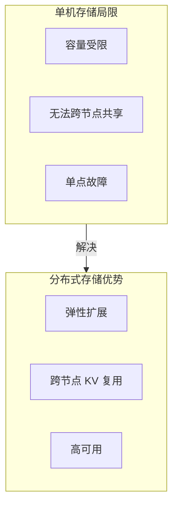
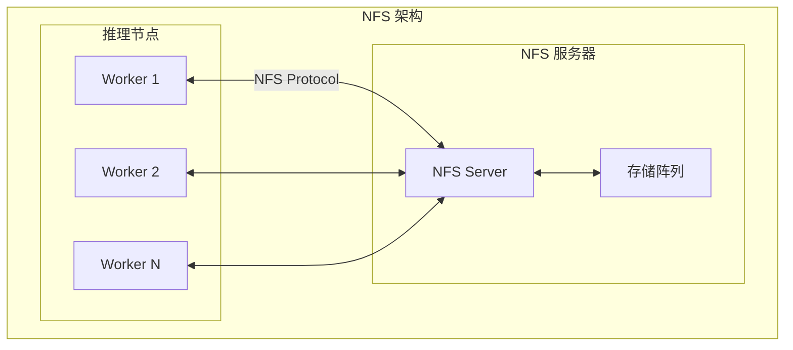
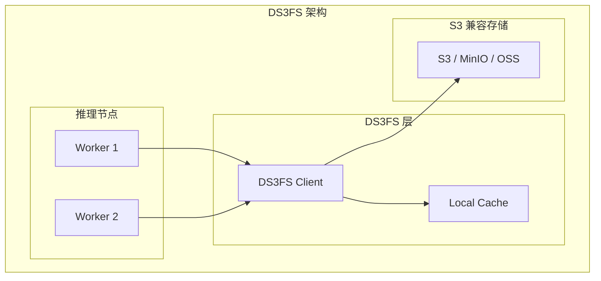
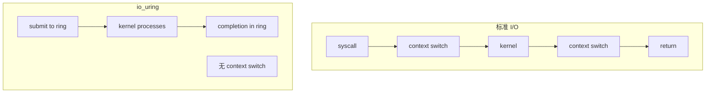
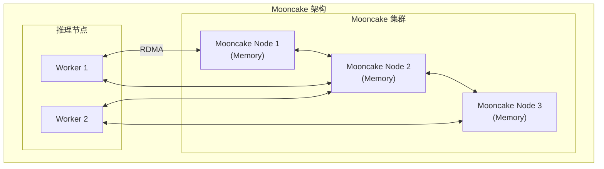
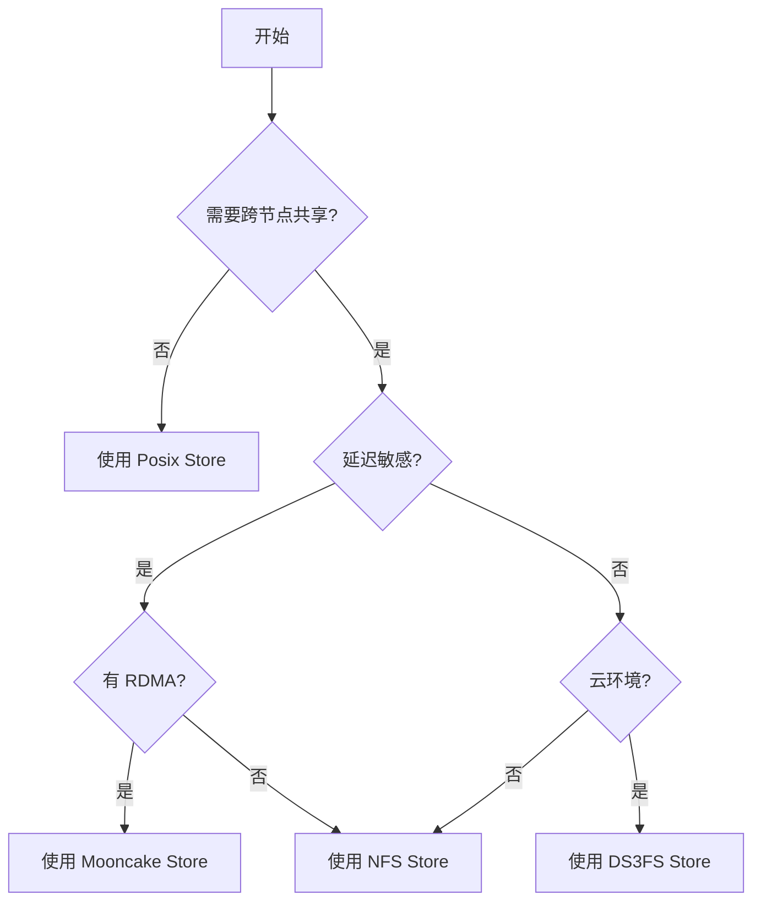

> **阅读时间**: 约 15 分钟
> **前置要求**: [Pipeline 组合](./05-pipeline-composition.md)

---

## 概述

本文介绍 UCM 支持的分布式存储后端，包括 NFS、DS3FS 和 Mooncake，以及如何选择合适的后端。

---

## 1. 分布式存储概览

### 1.1 为什么需要分布式存储


### 1.2 支持的后端
| 后端 | 类型 | 适用场景 | 特点 |
|------|------|----------|------|
| NFS Store | 网络文件系统 | 企业内网 | 简单、兼容性好 |
| DS3FS Store | 对象存储 | 云环境 | S3 兼容、弹性 |
| Mooncake Store | 分布式内存 | 高性能集群 | 超低延迟 |
---
## 2. NFS Store

### 2.1 架构



### 2.2 实现

**代码位置**: `ucm/store/nfsstore/connector.py`

```python
class UcmNfsStore(UcmKVStoreBase):
    """NFS 存储后端"""

    def __init__(self, config: dict):
        self.storage_paths = config.get('storage_backends', [])
        self.path_strategy = config.get('path_strategy', 'round_robin')

        # 初始化空间管理器
        self.space_manager = SpaceManager(self.storage_paths)

        # 初始化传输管理器
        self.trans_manager = TransManager(config)

        # 热度管理
        self.hotness_manager = HotnessManager(config)

    def lookup(self, block_ids: List[bytes]) -> List[bool]:
        """查询 Block 是否存在"""
        results = []
        for block_id in block_ids:
            path = self.space_manager.get_block_path(block_id)
            results.append(os.path.exists(path))
        return results

    def load(self, block_ids, offset, dst_tensor) -> Task:
        """从 NFS 加载"""
        return self.trans_manager.async_load(
            block_ids, offset, dst_tensor
        )

    def dump(self, block_ids, offset, src_tensor) -> Task:
        """保存到 NFS"""
        return self.trans_manager.async_dump(
            block_ids, offset, src_tensor
        )
```

### 2.3 多路径支持

```yaml
ucm_connectors:
  - ucm_connector_name: "UcmNfsStore"
    ucm_connector_config:
      storage_backends:
        - "/mnt/nfs1/ucm_cache"
        - "/mnt/nfs2/ucm_cache"
        - "/mnt/nfs3/ucm_cache"

      # 路径选择策略
      path_strategy: "round_robin"  # 或 "tiered", "random"
```

### 2.4 NFS 配置建议

```bash
192.168.1.100:/data/ucm_cache /mnt/nfs1 nfs4 \
    rw,sync,hard,intr,rsize=1048576,wsize=1048576 0 0
```

---
## 3. DS3FS Store
### 3.1 架构

### 3.2 实现
**代码位置**: `ucm/store/ds3fs/connector.py`
```python
class UcmDs3fsStore(UcmKVStoreBase):
    """DS3FS (S3 兼容) 存储后端"""
    def __init__(self, config: dict):
        self.endpoint = config.get('s3_endpoint')
        self.bucket = config.get('storage_backends')
        self.access_key = config.get('s3_access_key')
        self.secret_key = config.get('s3_secret_key')
        # 初始化 S3 客户端
        self.client = self._init_s3_client()

        # io_uring 优化（Linux 5.1+）
        self.use_io_uring = config.get('use_io_uring', True)
    def lookup(self, block_ids: List[bytes]) -> List[bool]:
        """查询对象是否存在"""
        results = []
        for block_id in block_ids:
            key = self._get_object_key(block_id)
            exists = self.client.object_exists(self.bucket, key)
            results.append(exists)
        return results

    def load(self, block_ids, offset, dst_tensor) -> Task:
        """从 S3 加载"""
        if self.use_io_uring:
            return self._load_with_io_uring(block_ids, offset, dst_tensor)
        else:
            return self._load_standard(block_ids, offset, dst_tensor)
```

### 3.3 io_uring 优化



### 3.4 DS3FS 配置

```yaml
ucm_connectors:
  - ucm_connector_name: "UcmDs3fsStore"
    ucm_connector_config:
      # S3 端点
      s3_endpoint: "https://s3.amazonaws.com"
      # 或 MinIO: "http://minio.local:9000"

      # Bucket 名称
      storage_backends: "ucm-cache-bucket"
      # 认证
      s3_access_key: "${AWS_ACCESS_KEY_ID}"
      s3_secret_key: "${AWS_SECRET_ACCESS_KEY}"
      # 优化选项
      use_io_uring: true
      connection_pool_size: 32
      max_concurrent_requests: 64
```
---
## 4. Mooncake Store

### 4.1 架构



### 4.2 特点

| 特点 | 说明 |
|------|------|
| 全内存 | 数据存储在分布式内存中 |
| RDMA | 支持 RDMA 低延迟传输 |
| 一致性 | 分布式一致性协议 |
| 自动分片 | 数据自动分布 |

### 4.3 配置

```yaml
ucm_connectors:
  - ucm_connector_name: "UcmMooncakeStore"
    ucm_connector_config:
      # Mooncake 集群地址
      cluster_endpoints:
        - "mooncake-1.local:9100"
        - "mooncake-2.local:9100"
        - "mooncake-3.local:9100"

      # RDMA 配置
      use_rdma: true
      rdma_device: "mlx5_0"

      # 复制因子
      replication_factor: 2
```

---
## 5. 后端选择指南
### 5.1 决策流程


### 5.2 对比表

| 维度 | NFS | DS3FS | Mooncake |
|------|-----|-------|----------|
| 延迟 | 中 (1-10ms) | 高 (10-100ms) | 低 (<1ms) |
| 吞吐 | 中 | 高 | 极高 |
| 容量 | 中 | 极大 | 中 |
| 成本 | 中 | 低 | 高 |
| 复杂度 | 低 | 中 | 高 |
| 运维 | 简单 | 中等 | 复杂 |
### 5.3 典型配置
```yaml
store_pipeline: "Cache|NFS"
storage_backends: "192.168.1.100:/data/ucm_cache"
# 云环境 - DS3FS
store_pipeline: "Cache|Ds3fs"
storage_backends: "s3://my-bucket/ucm_cache"
# 高性能集群 - Mooncake
store_pipeline: "Cache|Mooncake"
cluster_endpoints: ["node1:9100", "node2:9100"]
```

---

## 6. 性能调优

### 6.1 NFS 调优

```bash
# 增大 NFS 读写缓冲
rsize=1048576,wsize=1048576

nfsvers=4.1

fsc
```
### 6.2 DS3FS 调优
```yaml
connection_pool_size: 64
max_concurrent_requests: 128
# 启用分块传输
multipart_threshold: 8388608  # 8 MB
multipart_chunk_size: 8388608
# 启用压缩（可选）
enable_compression: true
```
### 6.3 Mooncake 调优
```yaml
rdma_max_send_wr: 128
rdma_max_recv_wr: 128
# 批量操作
batch_size: 32

prefetch_enabled: true
prefetch_depth: 4
```
