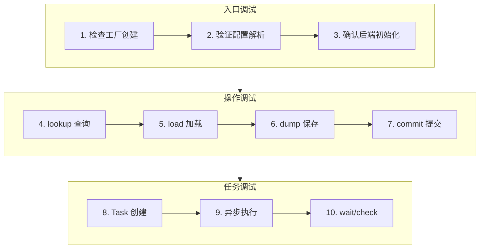

> **阅读时间**: 约 15 分钟
> **适用人群**: 需要调试存储相关问题的开发者

---

## 概述

本文提供存储层的调试入口点、常用技巧和常见问题解决方案。

---

## 1. 调试入口点

### 1.1 核心入口点列表

```
存储层调试入口
==============

1. 存储工厂创建
   └── ucm/store/factory.py:50
       UcmConnectorFactory.create_connector()

2. Pipeline 存储初始化
   └── ucm/store/pipeline/connector.py:56
       UcmPipelineStore.__init__()

3. Block 查找
   └── ucm/store/ucmstore.py:72
       UcmKVStoreBase.lookup()

4. KV 加载
   └── ucm/store/ucmstore.py:95
       UcmKVStoreBase.load()

5. KV 保存
   └── ucm/store/ucmstore.py:115
       UcmKVStoreBase.dump()

6. 任务等待
   └── ucm/store/ucmstore.py:135
       UcmKVStoreBase.wait()

7. POSIX 后端
   └── ucm/store/posix/connector.py:30
       UcmPosixStore.__init__()

8. Cache 后端
   └── ucm/store/cache/connector.py:25
       UcmCacheStore.__init__()
```
### 1.2 调试流程图

---
## 2. 开启调试日志

### 2.1 日志级别设置

```bash
export UNIFIED_CACHE_LOG_LEVEL=DEBUG

python your_script.py
```

### 2.2 关键日志标记

```python
[UCM.Store]        # 存储层通用日志
[UCM.Posix]        # POSIX 后端日志
[UCM.Cache]        # Cache 后端日志
[UCM.Pipeline]     # Pipeline 日志
[UCM.Factory]      # 工厂日志
```

### 2.3 日志示例

```
[UCM.Factory] Creating connector: UcmPipelineStore
[UCM.Pipeline] Pipeline stages: ['Cache', 'Posix']
[UCM.Cache] Buffer pool initialized: 1024 buffers
[UCM.Posix] Storage path: /tmp/ucm_cache
[UCM.Store] lookup: 32 blocks, hit: 28
[UCM.Store] load: task_id=1, blocks=4
[UCM.Store] dump: task_id=2, blocks=32
```

---
## 3. 常用调试代码
### 3.1 打印存储配置
```python
from ucm.store.factory import UcmConnectorFactory

print("Registered backends:")
for name in UcmConnectorFactory._registry:
    print(f"  - {name}")

store = UcmConnectorFactory.create_connector(
    "UcmPipelineStore",
    config
)
print(f"Store type: {type(store)}")
print(f"CC store ptr: {store.cc_store()}")
```

### 3.2 测试 lookup 操作

```python
import hashlib
# 生成测试 Block ID
test_block_ids = [
    hashlib.md5(f"test_block_{i}".encode()).digest()
    for i in range(10)
]
# 测试 lookup
results = store.lookup(test_block_ids)
print(f"Lookup results: {results}")
print(f"Hit count: {sum(results)}")
print(f"Miss count: {len(results) - sum(results)}")
```

### 3.3 测试 load/dump 操作

```python
import torch
# 准备测试张量
block_size = 16
num_layers = 32
head_dim = 128
num_heads = 32
# 模拟 KV Cache 张量
kv_tensor = torch.zeros(
    (num_layers * 2, block_size, num_heads, head_dim),
    dtype=torch.float16,
    device='cuda'
)

block_ids = [hashlib.md5(f"block_{i}".encode()).digest() for i in range(1)]
task = store.dump(block_ids, offset=0, src_tensor=kv_tensor)
print(f"Dump task: {task}")

status = store.wait(task)
print(f"Dump status: {status}")
# 测试 load
load_tensor = torch.zeros_like(kv_tensor)
task = store.load(block_ids, offset=0, dst_tensor=load_tensor)
status = store.wait(task)
print(f"Load status: {status}")
# 验证数据
if torch.allclose(kv_tensor, load_tensor):
    print("Data verification: PASSED")
else:
    print("Data verification: FAILED")
```

---

## 4. 断点位置推荐

### 4.1 工厂创建

```python
# ucm/store/factory.py
def create_connector(cls, connector_name: str, config: dict):
    # 断点 1: 检查 connector_name 和 config
    if connector_name not in cls._registry:
        raise ValueError(f"Unknown connector: {connector_name}")
    # 断点 2: 检查类加载
    connector_cls = cls._get_connector_class(connector_name)

    # 断点 3: 检查实例化
    return connector_cls(config)
```

### 4.2 Pipeline 初始化

```python
# ucm/store/pipeline/connector.py
def __init__(self, config: dict):
    # 断点 1: 解析 pipeline 配置
    pipeline_spec = config.get("store_pipeline", "Cache|Posix")

    # 断点 2: 检查各阶段创建
    for stage_name in pipeline_spec.split("|"):
        stage = self._create_stage(stage_name, config)
        self.stages.append(stage)
```

### 4.3 Load/Dump 操作

```python
# ucm/store/ucmstore.py
def load(self, block_ids, offset, dst_tensor):
    # 断点 1: 检查参数
    print(f"block_ids: {len(block_ids)}")
    print(f"offset: {offset}")
    print(f"tensor shape: {dst_tensor.shape}")
    print(f"tensor device: {dst_tensor.device}")
    # 断点 2: 检查任务创建
    task = self._create_load_task(block_ids, offset, dst_tensor)

    return task
```
---
## 5. 常见问题排查

### 5.1 问题: "Unknown connector" 错误

**症状**:
```
ValueError: Unknown connector: UcmPipelineStore
```

**排查步骤**:
```python
from ucm.store.factory import UcmConnectorFactory
print(list(UcmConnectorFactory._registry.keys()))

import ucm.store.pipeline.connector  # 触发注册

```

### 5.2 问题: lookup 总是返回 False

**症状**:
- 所有 Block 都显示未命中
- KV Cache 无法复用

**排查步骤**:
```python
print(f"Storage path: {store.storage_path}")
import os
print(f"Path exists: {os.path.exists(store.storage_path)}")

import subprocess
result = subprocess.run(['ls', '-la', store.storage_path], capture_output=True)
print(result.stdout.decode())

# 相同的 token 序列应该产生相同的哈希
```

### 5.3 问题: load 超时或卡住

**症状**:
- `wait(task)` 长时间不返回
- 程序卡在加载阶段

**排查步骤**:
```python
import time
task = store.load(block_ids, offset, tensor)

for i in range(100):
    status, done = store.check(task)
    print(f"Check {i}: status={status}, done={done}")
    if done:
        break
    time.sleep(0.1)

import torch
print(f"CUDA available: {torch.cuda.is_available()}")
print(f"Current device: {torch.cuda.current_device()}")

# 查看 ucm/shared/trans/ 相关日志
```

### 5.4 问题: 数据损坏

**症状**:
- 加载后的数据与保存的不一致
- 模型输出异常

**排查步骤**:
```python
original = torch.randn(100, dtype=torch.float16, device='cuda')
block_id = hashlib.md5(b"test").digest()

task = store.dump([block_id], 0, original)
store.wait(task)
store.commit([block_id], [True])

loaded = torch.zeros_like(original)
task = store.load([block_id], 0, loaded)
store.wait(task)

diff = (original - loaded).abs().max()
print(f"Max diff: {diff}")
if diff > 1e-5:
    print("WARNING: Data mismatch!")

print(f"Original ptr: {original.data_ptr()}")
print(f"Loaded ptr: {loaded.data_ptr()}")
print(f"Aligned: {original.data_ptr() % 512 == 0}")
```

---
## 6. 性能分析
### 6.1 测量 lookup 性能
```python
import time

block_ids = generate_block_ids(1000)

start = time.time()
for _ in range(100):
    results = store.lookup(block_ids)
elapsed = time.time() - start
print(f"Lookup 1000 blocks x 100 times: {elapsed:.3f}s")
print(f"Average per lookup: {elapsed / 100 * 1000:.2f}ms")
```
### 6.2 测量传输速度
```python
import time
import torch
# 准备大块数据
size_mb = 100
data = torch.randn(size_mb * 1024 * 1024 // 2, dtype=torch.float16, device='cuda')
block_ids = [hashlib.md5(f"block_{i}".encode()).digest() for i in range(100)]

start = time.time()
task = store.dump(block_ids, 0, data)
store.wait(task)
elapsed = time.time() - start
speed = size_mb / elapsed
print(f"Dump speed: {speed:.2f} MB/s")

loaded = torch.zeros_like(data)
start = time.time()
task = store.load(block_ids, 0, loaded)
store.wait(task)
elapsed = time.time() - start

speed = size_mb / elapsed
print(f"Load speed: {speed:.2f} MB/s")
```

---

## 7. 调试清单

### 7.1 初始化检查

- [ ] 配置文件路径正确
- [ ] 存储目录存在且可写
- [ ] 后端名称拼写正确
- [ ] 依赖的 C++ 库已编译
### 7.2 运行时检查
- [ ] Block ID 生成一致
- [ ] 张量设备正确（CPU/GPU）
- [ ] 张量 dtype 正确
- [ ] 内存对齐正确

### 7.3 性能检查

- [ ] lookup 延迟合理（< 10ms）
- [ ] load/dump 速度正常
- [ ] 无内存泄漏
- [ ] GPU 利用率正常