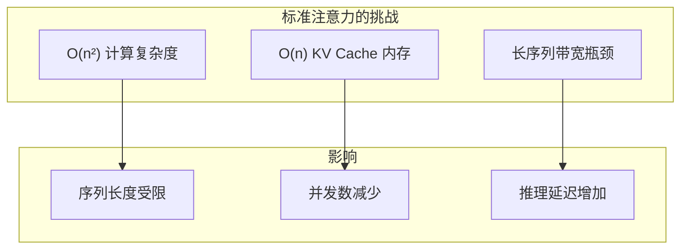
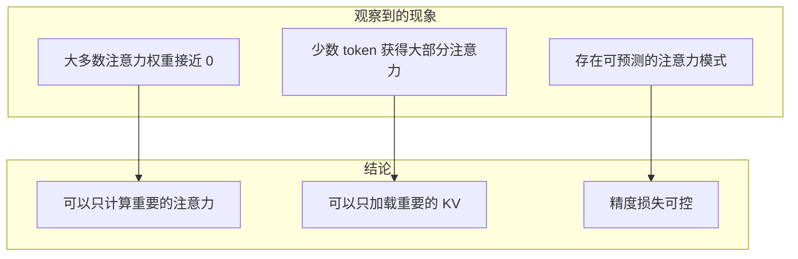
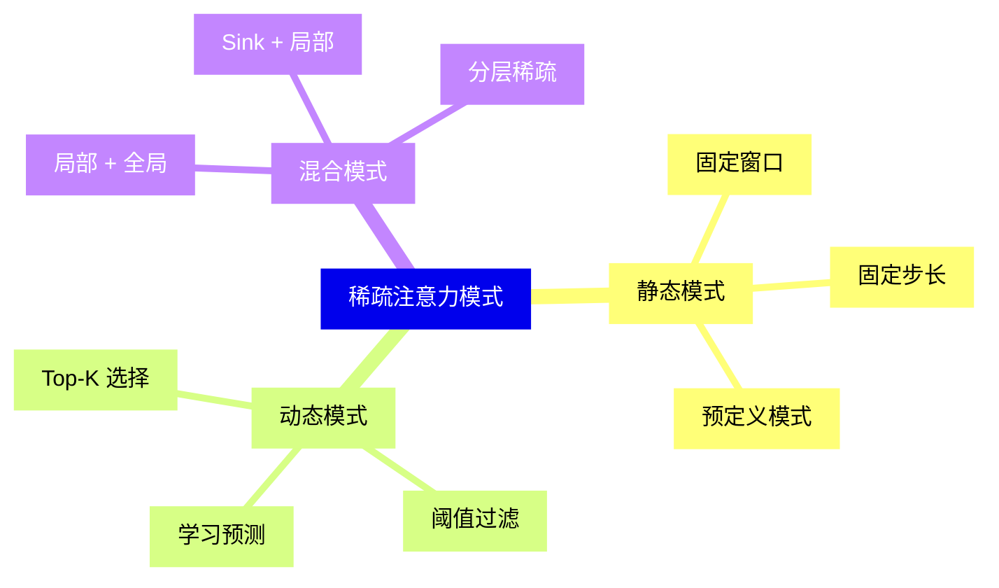
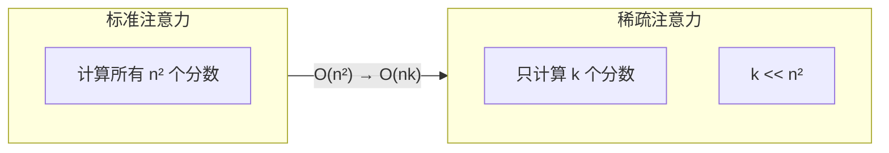
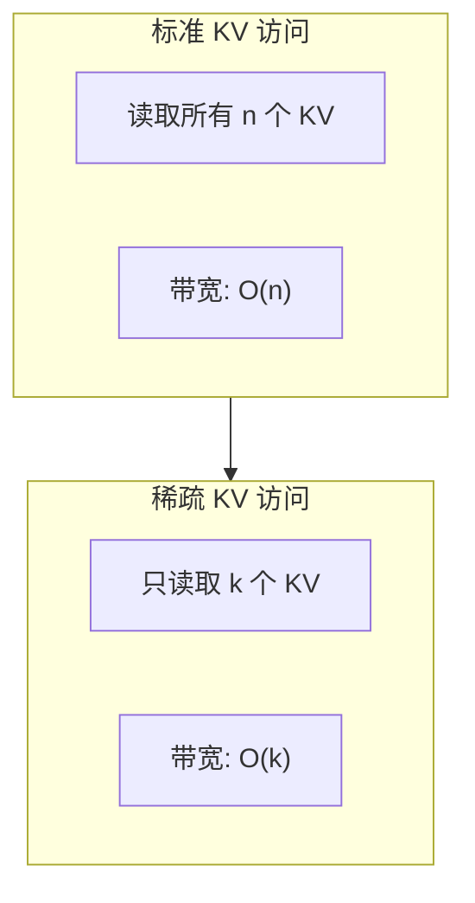
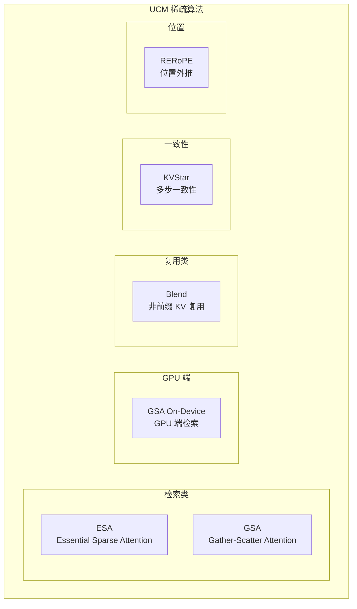
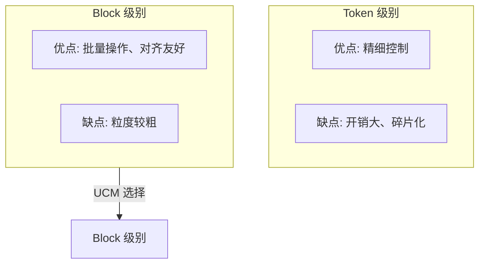
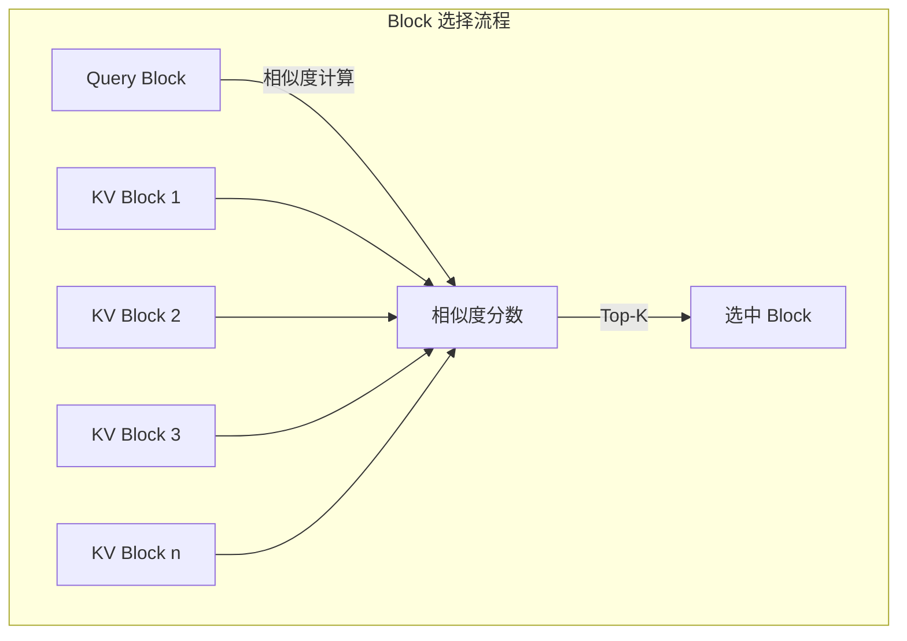
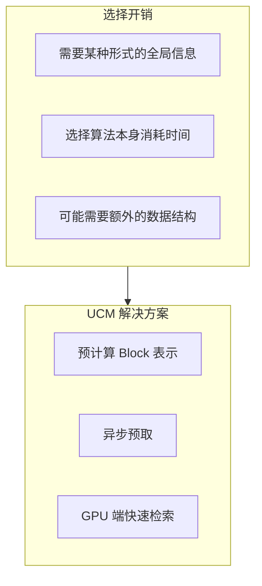

> **阅读时间**: 约 15 分钟
> **前置要求**: [Transformer 与注意力机制](../00-prerequisites/01-transformer-attention.md)

---

## 概述

本文介绍稀疏注意力的理论基础，包括为什么稀疏注意力有效、常见的稀疏模式以及 UCM 支持的稀疏算法概览。

---

## 1. 为什么需要稀疏注意力

### 1.1 标准注意力的问题


**具体数据**:
- 4K 序列长度: 需要计算 16M 个注意力分数
- 32K 序列长度: 需要计算 1B 个注意力分数
- 128K 序列长度: 需要计算 16B 个注意力分数

### 1.2 稀疏注意力的核心洞察

研究发现，注意力权重在实践中通常是**高度稀疏**的：


---
## 2. 注意力稀疏模式

### 2.1 局部注意力（Local Attention）

相邻的 token 倾向于相互关注：

```
注意力矩阵示意（对角带状）：
     T1  T2  T3  T4  T5  T6  T7  T8
T1 [  1   ·   ·   ·   ·   ·   ·   · ]
T2 [  1   1   ·   ·   ·   ·   ·   · ]
T3 [  ·   1   1   ·   ·   ·   ·   · ]
T4 [  ·   ·   1   1   ·   ·   ·   · ]
T5 [  ·   ·   ·   1   1   ·   ·   · ]
T6 [  ·   ·   ·   ·   1   1   ·   · ]
T7 [  ·   ·   ·   ·   ·   1   1   · ]
T8 [  ·   ·   ·   ·   ·   ·   1   1 ]

局部窗口大小 = 2
```

### 2.2 Sink Token（锚点 Token）

序列开始的 token 通常获得较高注意力：

```
     T1  T2  T3  T4  T5  T6  T7  T8
T8 [  1   ·   ·   ·   ·   ·   1   1 ]
      ↑                       ↑   ↑
    Sink Token            局部 Token
```

### 2.3 语义锚点

关键词和重要实体获得更多注意力：

```
输入: "北京是中国的首都，它有着悠久的历史"

注意力分布（对于"它"）:
  "北京" → 高
  "是" → 低
  "中国" → 中
  "的" → 低
  "首都" → 高
  ...
```

### 2.4 稀疏模式分类



---
## 3. 稀疏注意力的优化原理
### 3.1 减少计算

### 3.2 减少内存读取


### 3.3 精度与效率权衡

| 稀疏比例 | 计算节省 | 内存节省 | 精度影响 |
|----------|----------|----------|----------|
| 10% | 10x | 10x | 可能较大 |
| 30% | 3.3x | 3.3x | 通常可接受 |
| 50% | 2x | 2x | 较小 |
| 70% | 1.4x | 1.4x | 很小 |
---
## 4. UCM 稀疏算法概览

### 4.1 算法分类



### 4.2 算法对比

| 算法 | 核心思想 | 适用场景 | 稀疏选择方式 |
|------|----------|----------|--------------|
| **ESA** | 检索重要 Block | 长上下文 | CPU 端预计算 |
| **GSA** | 收集-分散注意力 | 通用 | Prefetch 引擎 |
| **GSA On-Device** | GPU 端检索 | 低延迟 | Hash + Top-K |
| **Blend** | 非前缀复用 | RAG、多轮对话 | 位置校正 |
| **KVStar** | 多步一致 | 推测解码 | 状态跟踪 |
| **RERoPE** | 位置外推 | 超长序列 | RoPE 修正 |

---
## 5. Block 表示法
### 5.1 为什么用 Block
UCM 以 Block（而非单个 Token）为单位管理 KV Cache：


### 5.2 Block 表示的稀疏选择


### 5.3 Block 表示方法
| 方法 | 说明 | UCM 应用 |
|------|------|----------|
| 均值池化 | Block 内 KV 平均 | ESA |
| Hash 编码 | 二进制编码 | GSA On-Device |
| 首 Token | 使用首个 Token | 简单场景 |
| 加权 | 注意力加权平均 | 高精度场景 |

---

## 6. 稀疏注意力的挑战

### 6.1 选择开销

选择哪些 Token/Block 是重要的，本身也有计算开销：


### 6.2 精度保证
如何确保稀疏不会损害生成质量：
| 策略 | 说明 |
|------|------|
| 保留 Sink Token | 始终包含序列开始的 token |
| 保留局部窗口 | 始终包含最近的 token |
| 自适应稀疏比例 | 根据任务动态调整 |
| 质量监控 | 监控输出质量指标 |

---

## 7. 关键概念总结

| 概念 | 说明 | 重要性 |
|------|------|--------|
| 注意力稀疏性 | 权重集中在少数 token | 稀疏优化的理论基础 |
| 局部注意力 | 关注相邻 token | 保证局部一致性 |
| Sink Token | 序列开始的锚点 | 避免信息丢失 |
| Block 表示 | 块级别的稀疏选择 | UCM 的管理单位 |
| Top-K 选择 | 选择最相关的 K 个 | 常用的稀疏方法 |

---

## 延伸阅读

- [Longformer: The Long-Document Transformer](https://arxiv.org/abs/2004.05150)
- [BigBird: Transformers for Longer Sequences](https://arxiv.org/abs/2007.14062)
- [Efficient Attention: Attention with Linear Complexities](https://arxiv.org/abs/1812.01243)
