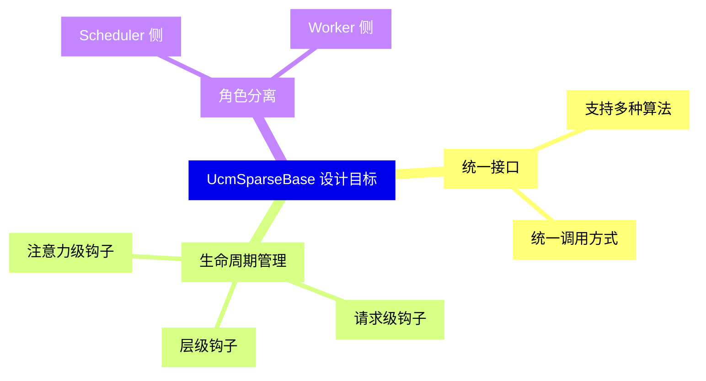
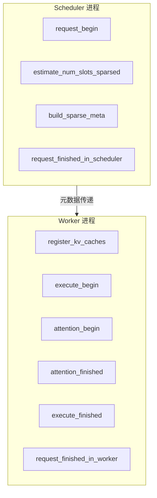
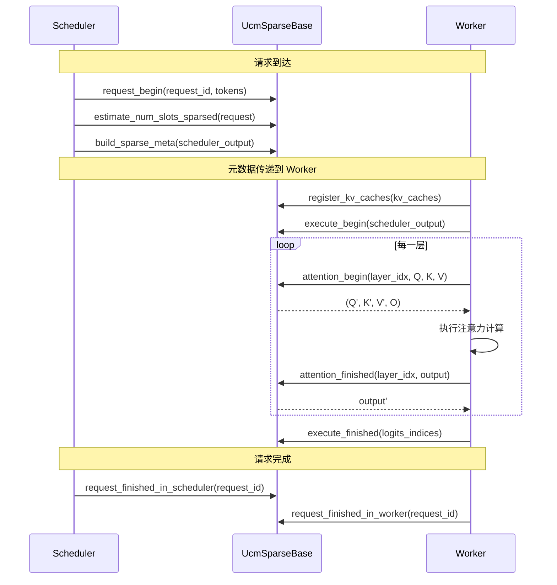
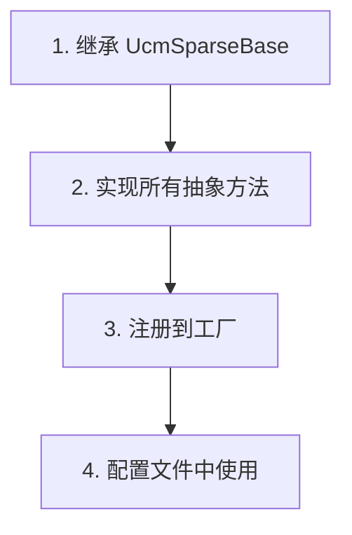

> **阅读时间**: 约 15 分钟
> **前置要求**: [稀疏注意力理论](./01-sparse-fundamentals.md)

---

## 概述

本文详解 UCM 稀疏注意力框架的核心接口 `UcmSparseBase`，包括角色分离、生命周期钩子和扩展机制。

---

## 1. 设计理念

### 1.1 核心设计目标


### 1.2 角色分离


---

## 2. 接口定义

### 2.1 UcmSparseBase 类

**代码位置**: `ucm/sparse/base.py:1-245`

```python
class UcmSparseRole(enum.Enum):
    """稀疏算法运行角色"""
    SCHEDULER = 0  # 在 Scheduler 进程中
    WORKER = 1     # 在 Worker 进程中

class UcmSparseBase(ABC):
    """稀疏注意力算法基类"""

    def __init__(self, role: UcmSparseRole, config: dict):
        self.role = role
        self.config = config

    # ============= Scheduler 侧方法 =============

    @abstractmethod
    def request_begin(
        self,
        request_id: str,
        prompt_token_ids: List[int]
    ) -> None:
        """请求开始时调用

        Args:
            request_id: 请求唯一标识
            prompt_token_ids: 输入 token ID 列表
        """
        pass

    @abstractmethod
    def estimate_num_slots_sparsed(
        self,
        request: Any
    ) -> int:
        """估计稀疏后需要的 slot 数量
        Args:
            request: 请求对象

        Returns:
            预估的 slot 数量
        """
        pass
    @abstractmethod
    def build_sparse_meta(
        self,
        scheduler_output: Any,
        seq_group_metadata_list: List[Any],
        request_metas: Dict[str, Any]
    ) -> Any:
        """构建稀疏元数据

        Args:
            scheduler_output: 调度器输出
            seq_group_metadata_list: 序列组元数据列表
            request_metas: 请求元数据字典
        Returns:
            稀疏元数据，将传递给 Worker
        """
        pass

    @abstractmethod
    def request_finished_in_scheduler(
        self,
        request_id: str
    ) -> None:
        """请求在 Scheduler 侧完成"""
        pass

    # ============= Worker 侧方法 =============

    @abstractmethod
    def register_kv_caches(
        self,
        kv_caches: Dict[int, torch.Tensor]
    ) -> None:
        """注册 KV Cache 张量
        Args:
            kv_caches: 层索引 -> KV Cache 张量的映射
        """
        pass

    @abstractmethod
    def execute_begin(
        self,
        scheduler_output: Any
    ) -> None:
        """模型执行开始前调用"""
        pass

    @abstractmethod
    def attention_begin(
        self,
        layer_idx: int,
        query: torch.Tensor,
        key: torch.Tensor,
        value: torch.Tensor,
        attn_metadata: Any
    ) -> Tuple[torch.Tensor, torch.Tensor, torch.Tensor, torch.Tensor]:
        """注意力计算开始前调用
        Args:
            layer_idx: 层索引
            query: Query 张量
            key: Key 张量
            value: Value 张量
            attn_metadata: 注意力元数据

        Returns:
            (query, key, value, output_buffer) 可能被修改的张量
        """
        pass
    @abstractmethod
    def attention_finished(
        self,
        layer_idx: int,
        output: torch.Tensor
    ) -> torch.Tensor:
        """注意力计算完成后调用
        Args:
            layer_idx: 层索引
            output: 注意力输出
        Returns:
            可能被修改的输出
        """
        pass

    @abstractmethod
    def execute_finished(
        self,
        logits_indices: torch.Tensor
    ) -> torch.Tensor:
        """模型执行完成后调用
        Args:
            logits_indices: logits 索引

        Returns:
            可能被修改的索引
        """
        pass
    @abstractmethod
    def request_finished_in_worker(
        self,
        request_id: str
    ) -> None:
        """请求在 Worker 侧完成"""
        pass
```

---

## 3. 生命周期钩子

### 3.1 完整生命周期


### 3.2 钩子用途
| 钩子 | 位置 | 典型用途 |
|------|------|----------|
| `request_begin` | Scheduler | 初始化请求状态、计算 Block Hash |
| `estimate_num_slots_sparsed` | Scheduler | 预估稀疏后的资源需求 |
| `build_sparse_meta` | Scheduler | 构建稀疏选择信息 |
| `register_kv_caches` | Worker | 获取 KV Cache 引用 |
| `execute_begin` | Worker | 预处理、预取 |
| `attention_begin` | Worker | 选择稀疏 KV、修改输入 |
| `attention_finished` | Worker | 后处理、结果校正 |
| `execute_finished` | Worker | 清理临时状态 |
| `request_finished_*` | 两侧 | 清理请求相关资源 |
---
## 4. 稀疏工厂

### 4.1 工厂模式

**代码位置**: `ucm/sparse/factory.py:13-57`

```python
class UcmSparseFactory:
    """稀疏算法工厂"""

    _registry: Dict[str, Tuple[str, str]] = {}

    @classmethod
    def register_sparse_method(
        cls,
        name: str,
        module_path: str,
        class_name: str
    ) -> None:
        """注册稀疏算法"""
        cls._registry[name] = (module_path, class_name)

    @classmethod
    def create_sparse_method(
        cls,
        name: str,
        role: UcmSparseRole,
        config: dict
    ) -> UcmSparseBase:
        """创建稀疏算法实例"""
        if name not in cls._registry:
            raise ValueError(f"Unknown sparse method: {name}")

        module_path, class_name = cls._registry[name]
        module = importlib.import_module(module_path)
        sparse_cls = getattr(module, class_name)

        return sparse_cls(role, config)


UcmSparseFactory.register_sparse_method(
    "ESA", "ucm.sparse.esa.esa", "ESA"
)
UcmSparseFactory.register_sparse_method(
    "GSA", "ucm.sparse.gsa.gsa", "GSA"
)
UcmSparseFactory.register_sparse_method(
    "GSAOnDevice", "ucm.sparse.gsa_on_device.gsa_on_device", "GSAOnDevice"
)
UcmSparseFactory.register_sparse_method(
    "Blend", "ucm.sparse.blend.blend", "Blend"
)
UcmSparseFactory.register_sparse_method(
    "KVStarMultiStep", "ucm.sparse.kvstar.multistep", "KVStarMultiStep"
)
```

### 4.2 使用示例

```python
from ucm.sparse.factory import UcmSparseFactory
from ucm.sparse.base import UcmSparseRole

scheduler_sparse = UcmSparseFactory.create_sparse_method(
    "ESA",
    UcmSparseRole.SCHEDULER,
    {"sparse_ratio": 0.3, "local_window_sz": 2}
)

worker_sparse = UcmSparseFactory.create_sparse_method(
    "ESA",
    UcmSparseRole.WORKER,
    {"sparse_ratio": 0.3, "local_window_sz": 2}
)
```

---
## 5. 实现自定义算法
### 5.1 实现步骤


### 5.2 示例实现

```python
from ucm.sparse.base import UcmSparseBase, UcmSparseRole
import torch

class MySparsAlgorithm(UcmSparseBase):
    """自定义稀疏算法示例"""
    def __init__(self, role: UcmSparseRole, config: dict):
        super().__init__(role, config)
        self.sparse_ratio = config.get('sparse_ratio', 0.3)
        self._request_states = {}

    # ---- Scheduler 侧 ----

    def request_begin(self, request_id, prompt_token_ids):
        self._request_states[request_id] = {
            'token_ids': prompt_token_ids,
            'num_tokens': len(prompt_token_ids)
        }

    def estimate_num_slots_sparsed(self, request):
        # 估计稀疏后的 slot 数
        state = self._request_states.get(request.request_id, {})
        total = state.get('num_tokens', 0)
        return int(total * self.sparse_ratio)

    def build_sparse_meta(self, scheduler_output, seq_group_metadata_list, request_metas):
        # 构建稀疏元数据
        sparse_meta = {}
        for meta in seq_group_metadata_list:
            request_id = meta.request_id
            state = self._request_states.get(request_id)
            if state:
                # 选择 Top-K 块
                selected = self._select_blocks(state)
                sparse_meta[request_id] = selected
        return sparse_meta

    def request_finished_in_scheduler(self, request_id):
        self._request_states.pop(request_id, None)
    # ---- Worker 侧 ----
    def register_kv_caches(self, kv_caches):
        self._kv_caches = kv_caches

    def execute_begin(self, scheduler_output):
        # 获取稀疏元数据
        self._current_sparse_meta = scheduler_output.ucm_sparse_meta

    def attention_begin(self, layer_idx, query, key, value, attn_metadata):
        # 根据稀疏元数据过滤 K, V
        sparse_k, sparse_v = self._filter_kv(key, value)
        output_buffer = torch.empty_like(query)
        return query, sparse_k, sparse_v, output_buffer

    def attention_finished(self, layer_idx, output):
        return output
    def execute_finished(self, logits_indices):
        self._current_sparse_meta = None
        return logits_indices
    def request_finished_in_worker(self, request_id):
        pass

    # ---- 私有方法 ----

    def _select_blocks(self, state):
        # 实现块选择逻辑
        pass

    def _filter_kv(self, key, value):
        # 实现 KV 过滤逻辑
        pass
```
### 5.3 注册和使用
```python
from ucm.sparse.factory import UcmSparseFactory

UcmSparseFactory.register_sparse_method(
    "MySparse",
    "my_package.my_sparse",
    "MySparsAlgorithm"
)

# ucm_sparse_config:
#   MySparse:
```

---

## 6. 配置参考

### 6.1 通用配置

```yaml
ucm_sparse_config:
  # 选择算法
  algorithm: "ESA"  # ESA, GSA, GSAOnDevice, Blend, KVStarMultiStep
  # 通用参数
  enabled: true
  min_seq_len: 256  # 最小启用序列长度
  # 算法特定参数
  ESA:
    sparse_ratio: 0.3
    local_window_sz: 2
    retrieval_stride: 5
```
