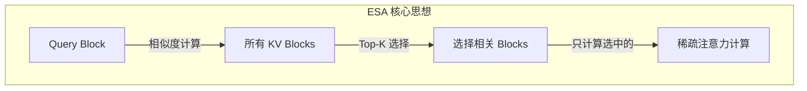
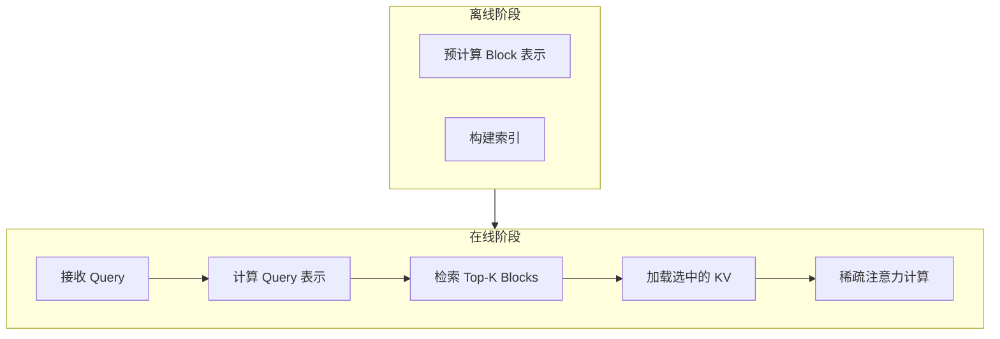
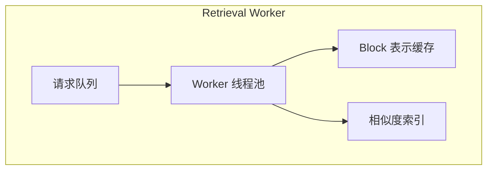

> **阅读时间**: 约 15 分钟
> **前置要求**: [UcmSparseBase 接口](./02-base-interface.md)

---

## 概述

ESA（Essential Sparse Attention）是 UCM 的核心稀疏注意力算法，通过检索重要的 KV Block 来减少注意力计算量。

---

## 1. 算法原理

### 1.1 核心思想



### 1.2 算法流程


---
## 2. 核心组件

### 2.1 ESA 类结构

**代码位置**: `ucm/sparse/esa/esa.py`

```python
class ESA(UcmSparseBase):
    """Essential Sparse Attention 实现"""

    def __init__(self, role: UcmSparseRole, config: dict):
        super().__init__(role, config)

        # 算法参数
        self.sparse_ratio = config.get('sparse_ratio', 0.3)
        self.local_window_sz = config.get('local_window_sz', 2)
        self.init_window_sz = config.get('init_window_sz', 1)
        self.min_blocks = config.get('min_blocks', 4)
        self.retrieval_stride = config.get('retrieval_stride', 5)

        # 状态管理
        self._request_metas: Dict[str, ReqMeta] = {}

        # Worker 侧组件
        if role == UcmSparseRole.WORKER:
            self.retrieval_worker = RetrievalWorker(config)
```

### 2.2 请求元数据

```python
@dataclass
class ReqMeta:
    """ESA 请求元数据"""
    request_id: str
    index_in_batch: int
    num_scheduled_tokens: int
    num_computed_tokens: int
    vllm_block_ids: List[int]
    ucm_block_hashes: List[str]  # MD5 哈希
    selected_blocks: List[int]   # 选中的块索引
```

---
## 3. 检索机制
### 3.1 Block 表示
ESA 使用 Block 的平均向量作为表示：
```python
def compute_block_representation(block_kv: torch.Tensor) -> torch.Tensor:
    """计算 Block 的表示向量
    Args:
        block_kv: [block_size, num_heads, head_dim]

    Returns:
        表示向量 [num_heads, head_dim]
    """
    # 平均池化
    return block_kv.mean(dim=0)
```
### 3.2 相似度计算
```python
def compute_similarity(
    query_repr: torch.Tensor,
    block_reprs: torch.Tensor
) -> torch.Tensor:
    """计算 Query 与 Blocks 的相似度

    Args:
        query_repr: [num_heads, head_dim]
        block_reprs: [num_blocks, num_heads, head_dim]

    Returns:
        相似度分数 [num_blocks]
    """
    # 点积相似度
    scores = torch.einsum('hd,nhd->n', query_repr, block_reprs)
    return scores
```

### 3.3 Top-K 选择

```python
def select_top_k_blocks(
    scores: torch.Tensor,
    k: int,
    local_window: int,
    total_blocks: int
) -> List[int]:
    """选择 Top-K Blocks
    Args:
        scores: 相似度分数
        k: 选择数量
        local_window: 局部窗口大小
        total_blocks: 总 Block 数
    Returns:
        选中的 Block 索引列表
    """
    # 始终包含局部窗口
    local_blocks = list(range(max(0, total_blocks - local_window), total_blocks))
    # 始终包含起始 Blocks (Sink)
    sink_blocks = [0]

    # Top-K 选择（排除已选中的）
    mask = torch.ones_like(scores, dtype=torch.bool)
    for idx in local_blocks + sink_blocks:
        mask[idx] = False
    remaining_scores = scores.clone()
    remaining_scores[~mask] = float('-inf')

    k_remaining = k - len(local_blocks) - len(sink_blocks)
    if k_remaining > 0:
        _, top_indices = remaining_scores.topk(k_remaining)
        selected = top_indices.tolist()
    else:
        selected = []
    return sorted(set(sink_blocks + selected + local_blocks))
```

---

## 4. Retrieval Worker

### 4.1 架构

**代码位置**: `ucm/sparse/esa/retrieval/retrieval_worker.py`



### 4.2 实现

```python
class RetrievalWorker:
    """异步检索 Worker"""

    def __init__(self, config: dict):
        self.num_workers = config.get('retrieval_workers', 4)
        self.cache_size = config.get('retrieval_cache_size', 10000)

        # 线程池
        self.thread_pool = ThreadPoolExecutor(max_workers=self.num_workers)
        # Block 表示缓存
        self.repr_cache = LRUCache(self.cache_size)

        # 任务队列
        self.task_queue = queue.Queue()
    def submit_retrieval(
        self,
        request_id: str,
        query_repr: torch.Tensor,
        block_hashes: List[str],
        k: int
    ) -> Future:
        """提交检索任务"""
        return self.thread_pool.submit(
            self._do_retrieval,
            request_id, query_repr, block_hashes, k
        )

    def _do_retrieval(
        self,
        request_id: str,
        query_repr: torch.Tensor,
        block_hashes: List[str],
        k: int
    ) -> List[int]:
        """执行检索"""
        # 获取 Block 表示
        block_reprs = []
        for hash_id in block_hashes:
            repr = self.repr_cache.get(hash_id)
            if repr is None:
                repr = self._load_block_repr(hash_id)
                self.repr_cache.put(hash_id, repr)
            block_reprs.append(repr)
        block_reprs = torch.stack(block_reprs)
        # 计算相似度并选择
        scores = compute_similarity(query_repr, block_reprs)
        selected = select_top_k_blocks(scores, k, ...)
        return selected
```

---

## 5. 配置参数

### 5.1 参数说明

| 参数 | 默认值 | 说明 |
|------|--------|------|
| `sparse_ratio` | 0.3 | 选择的 Block 比例 |
| `local_window_sz` | 2 | 局部窗口大小（始终包含） |
| `init_window_sz` | 1 | 起始窗口大小（Sink Token） |
| `min_blocks` | 4 | 最小选择 Block 数 |
| `retrieval_stride` | 5 | 检索步长 |
| `retrieval_workers` | 4 | 检索线程数 |
### 5.2 配置示例
```yaml
ucm_sparse_config:
  ESA:
    # 稀疏比例
    sparse_ratio: 0.3
    # 窗口设置
    local_window_sz: 2
    init_window_sz: 1
    # 最小 Block 数
    min_blocks: 4

    # 检索设置
    retrieval_stride: 5
    retrieval_workers: 4
    retrieval_cache_size: 10000
```

---

## 6. 使用示例

### 6.1 基本使用

```python
from ucm.sparse.factory import UcmSparseFactory
from ucm.sparse.base import UcmSparseRole

esa = UcmSparseFactory.create_sparse_method(
    "ESA",
    UcmSparseRole.WORKER,
    {
        "sparse_ratio": 0.3,
        "local_window_sz": 2
    }
)
# 注册 KV Cache
esa.register_kv_caches(kv_caches)

q, k, v, output = esa.attention_begin(layer_idx, query, key, value, metadata)
# ... 执行注意力计算 ...
output = esa.attention_finished(layer_idx, output)
```
---
## 7. 性能特点

### 7.1 复杂度分析

| 操作 | 复杂度 | 说明 |
|------|--------|------|
| Block 表示计算 | O(B × S × D) | B=块数, S=块大小, D=维度 |
| 相似度计算 | O(B × D) | 与块数线性相关 |
| Top-K 选择 | O(B × log K) | 堆排序 |
| 稀疏注意力 | O(K × S × D) | K << B |

### 7.2 适用场景

| 场景 | 效果 | 原因 |
|------|------|------|
| 长上下文 (>4K) | 最佳 | 稀疏比例节省显著 |
| 短上下文 (<1K) | 一般 | 开销可能超过收益 |
| 多轮对话 | 良好 | 历史信息可选择性保留 |
