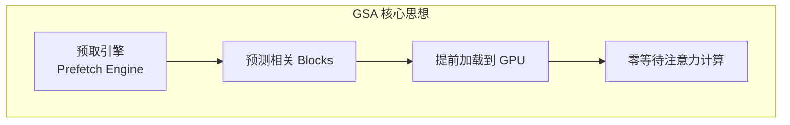
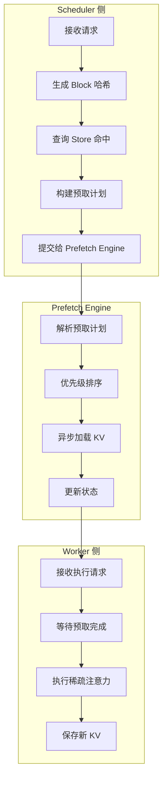
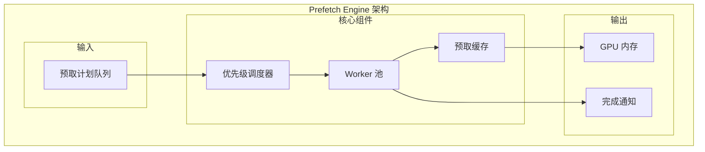
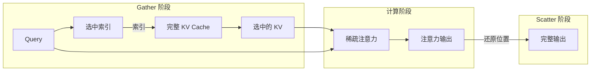
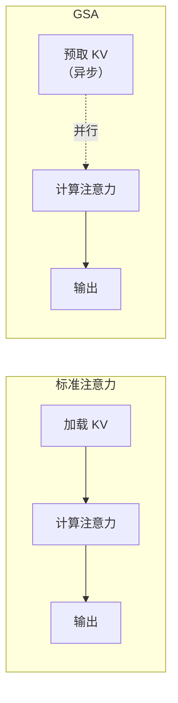

> **阅读时间**: 约 20 分钟
> **前置要求**: [UcmSparseBase 接口](./02-base-interface.md)

---

## 概述

GSA（Gather-Scatter Attention）是 UCM 的高性能稀疏注意力算法，通过预取引擎实现智能的 KV Block 预加载，显著降低推理延迟。

---

## 1. 算法原理

### 1.1 核心思想



GSA 的核心创新在于**预测性预取**：在模型执行前，预测哪些 KV Block 将被使用，提前加载到 GPU 内存。

### 1.2 与 ESA 的区别

| 维度 | ESA | GSA |
|------|-----|-----|
| 检索时机 | 运行时动态检索 | 预取引擎提前预测 |
| 延迟特性 | 检索引入延迟 | 零等待（预取完成时） |
| 内存使用 | 按需加载 | 预取缓冲区 |
| 适用场景 | 通用场景 | 对延迟敏感的场景 |
### 1.3 算法流程


---

## 2. 核心组件

### 2.1 GSA 类结构

**代码位置**: `ucm/sparse/gsa/gsa.py`

```python
class GSA(UcmSparseBase):
    """Gather-Scatter Attention 实现"""

    def __init__(self, role: UcmSparseRole, config: dict):
        super().__init__(role, config)
        # 算法参数
        self.sparse_ratio = config.get('sparse_ratio', 0.3)
        self.local_window_sz = config.get('local_window_sz', 2)
        self.init_window_sz = config.get('init_window_sz', 1)
        self.min_blocks = config.get('min_blocks', 4)
        # 请求状态管理
        self._request_stats: Dict[str, GSAReqStat] = {}

        # Worker 侧组件
        if role == UcmSparseRole.WORKER:
            self.prefetch_engine = PrefetchEngine(config)
            self.sparse_attention_kernel = GSASparseKernel(config)
```

### 2.2 请求状态

**代码位置**: `ucm/sparse/gsa/gsa.py:86`

```python
@dataclass
class GSAReqStat:
    """GSA 请求状态追踪"""
    request_id: str
    index_in_batch: int
    # Token 计数
    num_scheduled_tokens: int
    num_computed_tokens: int
    # Block 信息
    vllm_block_ids: List[int]      # vLLM 分配的 Block ID
    ucm_block_hashes: List[str]    # UCM 内容哈希
    # 选择结果
    selected_blocks: List[int]     # 选中的 Block 索引

    # 预取状态
    prefetch_task: Optional[Task] = None
    prefetch_ready: bool = False
```
---
## 3. Prefetch Engine

### 3.1 架构设计

**代码位置**: `ucm/sparse/gsa/prefetch/prefetch_engine.py`



### 3.2 实现

```python
class PrefetchEngine:
    """GSA 预取引擎"""

    def __init__(self, config: dict):
        self.num_workers = config.get('prefetch_workers', 4)
        self.max_pending = config.get('max_pending_prefetch', 64)

        # 线程池
        self.executor = ThreadPoolExecutor(max_workers=self.num_workers)

        # 任务队列（优先级队列）
        self.task_queue = PriorityQueue()

        # 状态追踪
        self.pending_tasks: Dict[str, PrefetchTask] = {}
        self.completed_tasks: Dict[str, torch.Tensor] = {}

        # 启动调度线程
        self.scheduler_thread = Thread(target=self._scheduler_loop)
        self.scheduler_thread.start()

    def submit_prefetch(
        self,
        request_id: str,
        block_hashes: List[str],
        priority: int = 0
    ) -> PrefetchHandle:
        """提交预取任务"""
        task = PrefetchTask(
            request_id=request_id,
            block_hashes=block_hashes,
            priority=priority,
            submit_time=time.time()
        )

        self.task_queue.put((priority, task))
        self.pending_tasks[request_id] = task

        return PrefetchHandle(request_id, self)

    def wait_for_completion(
        self,
        request_id: str,
        timeout: float = None
    ) -> bool:
        """等待预取完成"""
        task = self.pending_tasks.get(request_id)
        if task is None:
            return True  # 已完成

        return task.event.wait(timeout)

    def get_prefetched_kv(self, request_id: str) -> Optional[torch.Tensor]:
        """获取预取的 KV"""
        return self.completed_tasks.get(request_id)

    def _scheduler_loop(self):
        """调度循环"""
        while not self.shutdown:
            try:
                priority, task = self.task_queue.get(timeout=0.1)
                self.executor.submit(self._do_prefetch, task)
            except Empty:
                continue

    def _do_prefetch(self, task: PrefetchTask):
        """执行预取"""
        try:
            # 从 Store 加载
            kv_data = self._load_blocks(task.block_hashes)

            # 保存到完成列表
            self.completed_tasks[task.request_id] = kv_data

            # 通知完成
            task.event.set()

        except Exception as e:
            task.error = e
            task.event.set()
```

### 3.3 优先级策略

```python
class PrefetchPriority:
    """预取优先级策略"""

    URGENT = 0      # 即将执行的请求
    HIGH = 1        # 下一批次的请求
    NORMAL = 2      # 普通请求
    LOW = 3         # 投机性预取

    @staticmethod
    def compute_priority(
        request: Request,
        current_step: int,
        queue_position: int
    ) -> int:
        """计算请求的预取优先级"""
        # 即将执行
        if queue_position == 0:
            return PrefetchPriority.URGENT

        # 下一批次
        if queue_position <= 4:
            return PrefetchPriority.HIGH

        # 普通请求
        if queue_position <= 16:
            return PrefetchPriority.NORMAL

        return PrefetchPriority.LOW
```

---
## 4. 稀疏注意力计算
### 4.1 Gather-Scatter 模式


### 4.2 Kernel 实现

```python
class GSASparseKernel:
    """GSA 稀疏注意力 Kernel"""

    def __init__(self, config: dict):
        self.head_dim = config.get('head_dim', 128)
        self.num_heads = config.get('num_heads', 32)
        self.block_size = config.get('block_size', 16)
    def forward(
        self,
        query: torch.Tensor,           # [batch, heads, seq, dim]
        key_cache: torch.Tensor,       # [batch, blocks, block_size, heads, dim]
        value_cache: torch.Tensor,     # [batch, blocks, block_size, heads, dim]
        selected_indices: torch.Tensor, # [batch, num_selected]
        attention_mask: torch.Tensor   # [batch, seq, total_kv_len]
    ) -> torch.Tensor:
        """执行稀疏注意力"""
        batch_size = query.shape[0]
        num_selected = selected_indices.shape[1]
        # Gather: 收集选中的 KV
        selected_k = self._gather_kv(key_cache, selected_indices)
        selected_v = self._gather_kv(value_cache, selected_indices)
        # Compute: 稀疏注意力
        # selected_k: [batch, num_selected * block_size, heads, dim]
        scores = torch.einsum('bshd,bkhd->bshk', query, selected_k)
        scores = scores / math.sqrt(self.head_dim)

        # 应用 mask
        sparse_mask = self._build_sparse_mask(
            selected_indices, attention_mask
        )
        scores = scores.masked_fill(~sparse_mask, float('-inf'))

        # Softmax
        attn_weights = F.softmax(scores, dim=-1)
        # 加权求和
        output = torch.einsum('bshk,bkhd->bshd', attn_weights, selected_v)

        return output

    def _gather_kv(
        self,
        kv_cache: torch.Tensor,
        indices: torch.Tensor
    ) -> torch.Tensor:
        """收集选中的 KV"""
        batch_size = kv_cache.shape[0]
        num_selected = indices.shape[1]
        # 使用 index_select 收集
        gathered = []
        for b in range(batch_size):
            selected = kv_cache[b, indices[b]]  # [num_selected, block_size, heads, dim]
            gathered.append(selected)
        return torch.stack(gathered)  # [batch, num_selected, block_size, heads, dim]
```

---

## 5. Scheduler 侧流程

### 5.1 构建稀疏元数据

```python
class GSA(UcmSparseBase):
    def build_sparse_meta(
        self,
        requests: List[Request],
        scheduler_output: SchedulerOutput
    ) -> SparseMeta:
        """构建稀疏元数据（Scheduler 侧）"""
        meta = SparseMeta()
        for req in requests:
            # 获取或创建请求状态
            stat = self._get_or_create_stat(req)
            # 更新 Token 计数
            stat.num_scheduled_tokens = req.num_scheduled_tokens
            stat.num_computed_tokens = req.num_computed_tokens
            # 生成 Block 哈希
            stat.ucm_block_hashes = self._generate_block_hashes(req)

            # 执行 Block 选择
            selected = self._select_blocks(stat)
            stat.selected_blocks = selected

            # 添加到元数据
            meta.add_request(
                request_id=req.request_id,
                selected_blocks=selected,
                block_hashes=stat.ucm_block_hashes
            )
            # 提交预取（如果需要）
            if self._should_prefetch(stat):
                self._submit_prefetch(stat)
        return meta
    def _select_blocks(self, stat: GSAReqStat) -> List[int]:
        """选择要计算的 Blocks"""
        total_blocks = len(stat.ucm_block_hashes)
        # 计算需要选择的数量
        k = max(
            self.min_blocks,
            int(total_blocks * self.sparse_ratio)
        )
        k = min(k, total_blocks)

        # 始终包含的 Blocks
        sink_blocks = list(range(self.init_window_sz))
        local_blocks = list(range(
            max(0, total_blocks - self.local_window_sz),
            total_blocks
        ))
        # 计算剩余需要选择的数量
        required_blocks = set(sink_blocks + local_blocks)
        k_remaining = k - len(required_blocks)
        if k_remaining > 0:
            # 使用评分选择额外的 Blocks
            scores = self._compute_block_scores(stat)
            # 排除已选择的
            for idx in required_blocks:
                scores[idx] = float('-inf')
            # Top-K 选择
            _, top_indices = torch.topk(scores, k_remaining)
            selected = top_indices.tolist()
        else:
            selected = []
        return sorted(set(sink_blocks + selected + local_blocks))
```

### 5.2 Block 评分

```python
def _compute_block_scores(self, stat: GSAReqStat) -> torch.Tensor:
    """计算 Block 评分"""
    num_blocks = len(stat.ucm_block_hashes)
    scores = torch.zeros(num_blocks)

    # 基于历史访问模式
    if stat.request_id in self._access_history:
        history = self._access_history[stat.request_id]
        for idx, count in history.items():
            if idx < num_blocks:
                scores[idx] += count * 0.5
    # 基于位置（最近的 Block 更重要）
    position_weight = torch.linspace(0.1, 1.0, num_blocks)
    scores += position_weight
    return scores
```

---

## 6. Worker 侧流程

### 6.1 注意力计算钩子

```python
class GSA(UcmSparseBase):
    def attention_begin(
        self,
        layer_idx: int,
        query: torch.Tensor,
        key: torch.Tensor,
        value: torch.Tensor,
        metadata: AttentionMetadata
    ) -> Tuple[torch.Tensor, ...]:
        """注意力计算前处理（Worker 侧）"""
        # 等待预取完成
        for request_id in self._active_requests:
            stat = self._request_stats.get(request_id)
            if stat and stat.prefetch_task:
                self.prefetch_engine.wait_for_completion(request_id)

        # 获取选中的 Block 索引
        selected_indices = self._get_selected_indices(metadata)
        # 存储供 Kernel 使用
        self._current_selected_indices = selected_indices

        return query, key, value

    def attention_finished(
        self,
        layer_idx: int,
        output: torch.Tensor
    ) -> torch.Tensor:
        """注意力计算后处理"""
        # 清理当前状态
        self._current_selected_indices = None
        return output
```

---

## 7. 配置参数

### 7.1 参数说明

| 参数 | 默认值 | 说明 |
|------|--------|------|
| `sparse_ratio` | 0.3 | 选择的 Block 比例 |
| `local_window_sz` | 2 | 局部窗口大小 |
| `init_window_sz` | 1 | 起始窗口大小（Sink） |
| `min_blocks` | 4 | 最小选择数 |
| `prefetch_workers` | 4 | 预取线程数 |
| `max_pending_prefetch` | 64 | 最大待处理预取数 |
| `prefetch_ahead` | 2 | 预取提前批次数 |

### 7.2 配置示例

```yaml
ucm_sparse_config:
  GSA:
    # 稀疏参数
    sparse_ratio: 0.3
    local_window_sz: 2
    init_window_sz: 1
    min_blocks: 4
    # 预取配置
    prefetch_workers: 4
    max_pending_prefetch: 64
    prefetch_ahead: 2

    # 缓存配置
    prefetch_cache_size: 1000
```

---

## 8. 性能特点

### 8.1 复杂度分析

| 操作 | 复杂度 | 说明 |
|------|--------|------|
| Block 选择 | O(B × log K) | B=块数, K=选择数 |
| 预取调度 | O(P × log P) | P=待处理任务数 |
| Gather 操作 | O(K × S × D) | S=块大小, D=维度 |
| 稀疏注意力 | O(K × S × D) | K << B 时高效 |
### 8.2 延迟对比


### 8.3 适用场景

| 场景 | 效果 | 原因 |
|------|------|------|
| 批处理推理 | 最佳 | 预取与计算充分重叠 |
| 流式推理 | 良好 | 预取减少等待时间 |
| 短序列 | 一般 | 预取开销相对较大 |

---

## 9. 使用示例

```python
from ucm.sparse.factory import UcmSparseFactory
from ucm.sparse.base import UcmSparseRole

gsa = UcmSparseFactory.create_sparse_method(
    "GSA",
    UcmSparseRole.WORKER,
    {
        "sparse_ratio": 0.3,
        "prefetch_workers": 4
    }
)
# 注册 KV Cache
gsa.register_kv_caches(kv_caches)

q, k, v, output = gsa.attention_begin(layer_idx, query, key, value, metadata)
# ... 执行注意力计算 ...
output = gsa.attention_finished(layer_idx, output)
```