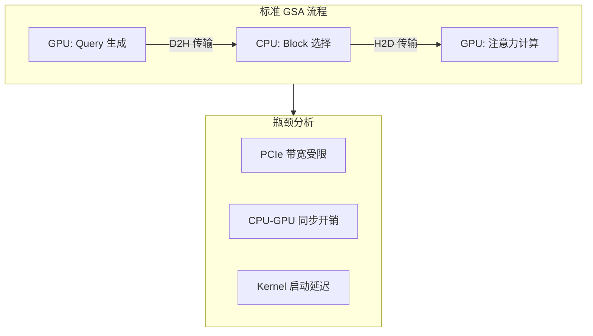
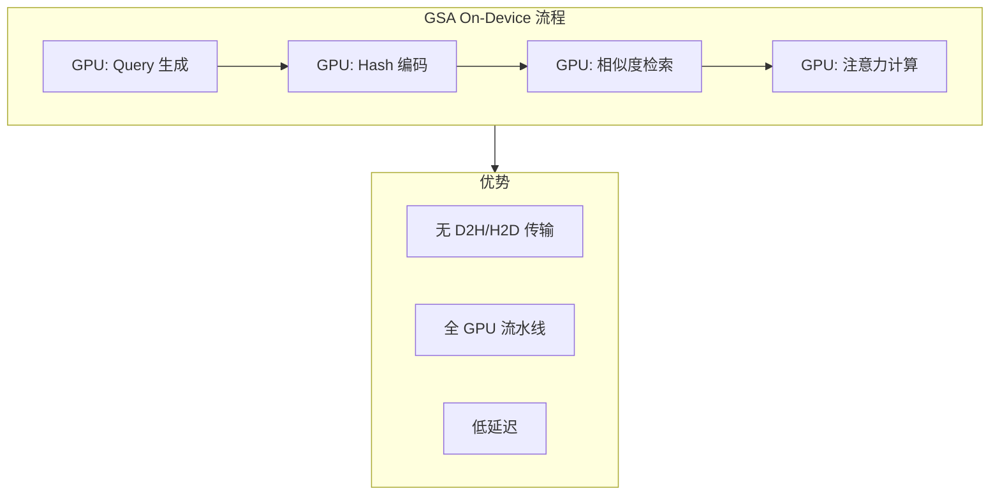
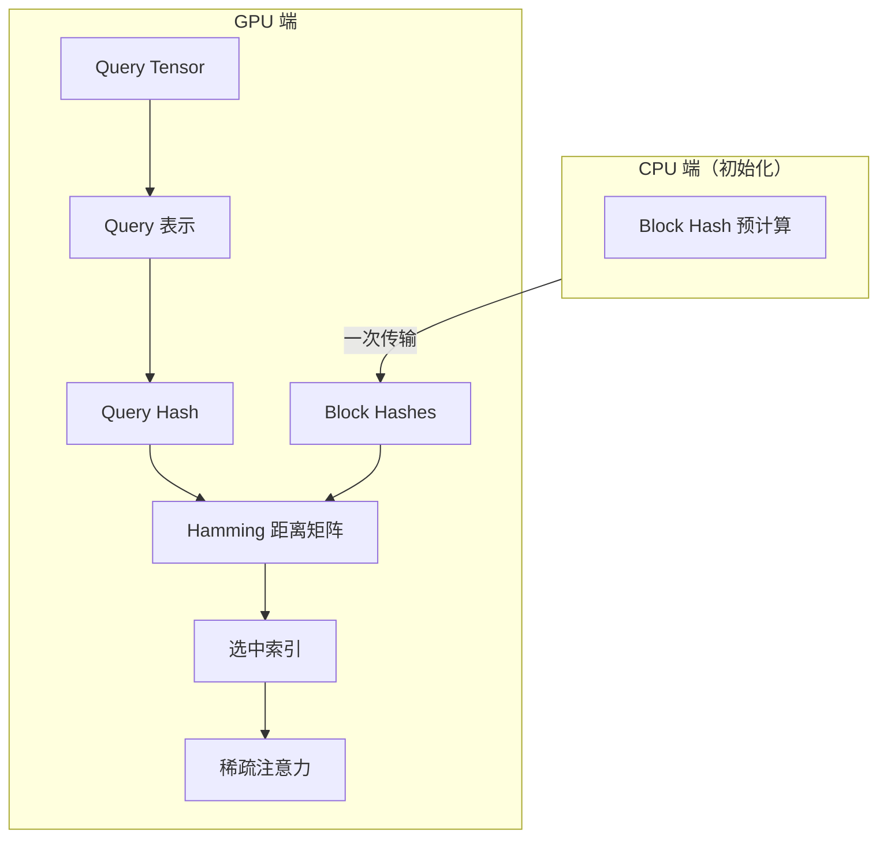

> **阅读时间**: 约 15 分钟
> **前置要求**: [GSA 算法](./04-gsa-algorithm.md)

---

## 概述

GSA On-Device 是 GSA 的 GPU 端优化版本，将 Block 检索逻辑移至 GPU 执行，避免 CPU-GPU 数据传输延迟。

---

## 1. 设计动机

### 1.1 标准 GSA 的瓶颈



### 1.2 On-Device 解决方案



---

## 2. 核心技术

### 2.1 Hash 编码

将浮点向量编码为紧凑的二进制 Hash，支持高效的 GPU 端相似度计算。

**代码位置**: `ucm/sparse/gsa_on_device/hash_encoder.py`

```python
class HashEncoder:
    """向量到 Hash 的编码器"""

    def __init__(self, config: dict):
        self.num_bits = config.get('hash_bits', 64)
        self.num_planes = config.get('hash_planes', 64)
        self.head_dim = config.get('head_dim', 128)
        # 随机超平面（LSH）
        self.planes = self._init_random_planes()

    def _init_random_planes(self) -> torch.Tensor:
        """初始化随机超平面"""
        planes = torch.randn(self.num_planes, self.head_dim)
        planes = F.normalize(planes, dim=-1)
        return planes.cuda()

    def encode(self, vectors: torch.Tensor) -> torch.Tensor:
        """编码向量为 Hash
        Args:
            vectors: [batch, num_vectors, head_dim]

        Returns:
            hashes: [batch, num_vectors, num_bits // 64] (uint64)
        """
        # 投影到超平面
        projections = torch.matmul(vectors, self.planes.T)
        # [batch, num_vectors, num_planes]
        # 二值化
        bits = (projections > 0).to(torch.int32)

        # 打包为 uint64
        hashes = self._pack_bits(bits)
        return hashes
    def _pack_bits(self, bits: torch.Tensor) -> torch.Tensor:
        """将比特打包为 uint64"""
        batch, num_vecs, num_bits = bits.shape
        num_words = num_bits // 64

        # 重塑为 64-bit 组
        bits = bits.view(batch, num_vecs, num_words, 64)
        # 打包
        powers = (2 ** torch.arange(64, device=bits.device)).view(1, 1, 1, 64)
        packed = (bits * powers).sum(dim=-1)
        return packed.to(torch.int64)
```

### 2.2 Hamming 距离计算

使用 GPU 的 `popcount` 指令高效计算 Hamming 距离。

```python
@triton.jit
def hamming_distance_kernel(
    query_hash_ptr,    # [num_queries, num_words]
    block_hash_ptr,    # [num_blocks, num_words]
    distances_ptr,     # [num_queries, num_blocks]
    num_queries: tl.constexpr,
    num_blocks: tl.constexpr,
    num_words: tl.constexpr,
    BLOCK_SIZE: tl.constexpr,
):
    """Triton Kernel: 计算 Hamming 距离"""
    # 获取工作项索引
    query_idx = tl.program_id(0)
    block_start = tl.program_id(1) * BLOCK_SIZE

    # 加载 Query Hash
    query_offsets = query_idx * num_words + tl.arange(0, num_words)
    query_hash = tl.load(query_hash_ptr + query_offsets)

    # 遍历 Block Hashes
    for i in range(BLOCK_SIZE):
        block_idx = block_start + i
        if block_idx < num_blocks:
            # 加载 Block Hash
            block_offsets = block_idx * num_words + tl.arange(0, num_words)
            block_hash = tl.load(block_hash_ptr + block_offsets)

            # XOR + popcount
            xor_result = query_hash ^ block_hash
            distance = tl.zeros([1], dtype=tl.int32)

            for w in range(num_words):
                distance += tl.popcount(xor_result[w])
            # 存储结果
            out_offset = query_idx * num_blocks + block_idx
            tl.store(distances_ptr + out_offset, distance)

def compute_hamming_distances(
    query_hashes: torch.Tensor,
    block_hashes: torch.Tensor
) -> torch.Tensor:
    """计算 Hamming 距离矩阵"""
    num_queries, num_words = query_hashes.shape
    num_blocks = block_hashes.shape[0]

    distances = torch.empty(
        (num_queries, num_blocks),
        dtype=torch.int32,
        device=query_hashes.device
    )

    BLOCK_SIZE = 32
    grid = (num_queries, (num_blocks + BLOCK_SIZE - 1) // BLOCK_SIZE)
    hamming_distance_kernel[grid](
        query_hashes, block_hashes, distances,
        num_queries, num_blocks, num_words,
        BLOCK_SIZE
    )
    return distances
```

### 2.3 Top-K 选择

基于 Hamming 距离的高效 Top-K 选择。

```python
@triton.jit
def topk_by_hamming_kernel(
    distances_ptr,     # [num_queries, num_blocks]
    indices_ptr,       # [num_queries, k]
    num_queries: tl.constexpr,
    num_blocks: tl.constexpr,
    k: tl.constexpr,
    BLOCK_SIZE: tl.constexpr,
):
    """Triton Kernel: 基于 Hamming 距离的 Top-K"""
    query_idx = tl.program_id(0)
    # 初始化 Top-K 堆
    top_distances = tl.full([k], 0x7FFFFFFF, dtype=tl.int32)
    top_indices = tl.full([k], -1, dtype=tl.int32)
    # 遍历所有 Blocks
    for block_start in range(0, num_blocks, BLOCK_SIZE):
        block_end = tl.minimum(block_start + BLOCK_SIZE, num_blocks)
        for i in range(BLOCK_SIZE):
            block_idx = block_start + i
            if block_idx < num_blocks:
                # 加载距离
                offset = query_idx * num_blocks + block_idx
                distance = tl.load(distances_ptr + offset)

                # 检查是否进入 Top-K
                max_in_topk = tl.max(top_distances)
                if distance < max_in_topk:
                    # 替换最大元素
                    max_pos = tl.argmax(top_distances)
                    top_distances[max_pos] = distance
                    top_indices[max_pos] = block_idx

    # 存储结果
    for i in range(k):
        out_offset = query_idx * k + i
        tl.store(indices_ptr + out_offset, top_indices[i])

class TopKSelector:
    """GPU 端 Top-K 选择器"""
    def __init__(self, k: int):
        self.k = k

    def select(
        self,
        distances: torch.Tensor
    ) -> torch.Tensor:
        """选择距离最小的 K 个 Blocks"""
        num_queries, num_blocks = distances.shape
        indices = torch.empty(
            (num_queries, self.k),
            dtype=torch.int32,
            device=distances.device
        )
        BLOCK_SIZE = 64
        grid = (num_queries,)

        topk_by_hamming_kernel[grid](
            distances, indices,
            num_queries, num_blocks, self.k,
            BLOCK_SIZE
        )

        return indices
```
---
## 3. 完整架构

### 3.1 GSA On-Device 类

**代码位置**: `ucm/sparse/gsa_on_device/gsa_on_device.py`

```python
class GSAOnDevice(UcmSparseBase):
    """GPU 端 GSA 实现"""

    def __init__(self, role: UcmSparseRole, config: dict):
        super().__init__(role, config)

        # Hash 编码器
        self.hash_encoder = HashEncoder(config)

        # Top-K 选择器
        self.k = self._compute_k(config)
        self.topk_selector = TopKSelector(self.k)

        # Block Hash 缓存（GPU 端）
        self.block_hash_cache: Dict[str, torch.Tensor] = {}

        # 配置
        self.local_window_sz = config.get('local_window_sz', 2)
        self.init_window_sz = config.get('init_window_sz', 1)

    def attention_begin(
        self,
        layer_idx: int,
        query: torch.Tensor,
        key: torch.Tensor,
        value: torch.Tensor,
        metadata: AttentionMetadata
    ) -> Tuple[torch.Tensor, ...]:
        """注意力前处理 - GPU 端检索"""
        batch_size = query.shape[0]

        # 1. 编码 Query
        query_repr = self._compute_query_repr(query)
        query_hashes = self.hash_encoder.encode(query_repr)

        # 2. 获取 Block Hashes
        block_hashes = self._get_block_hashes(metadata)

        # 3. 计算 Hamming 距离
        distances = compute_hamming_distances(query_hashes, block_hashes)

        # 4. Top-K 选择
        selected_indices = self.topk_selector.select(distances)

        # 5. 添加固定窗口
        selected_indices = self._add_fixed_windows(
            selected_indices,
            metadata.num_blocks
        )

        # 存储供注意力计算使用
        self._current_selection = selected_indices

        return query, key, value

    def _compute_query_repr(self, query: torch.Tensor) -> torch.Tensor:
        """计算 Query 表示"""
        # 使用最后一个 token 的平均
        return query[:, -1, :, :].mean(dim=1)  # [batch, head_dim]

    def _get_block_hashes(self, metadata) -> torch.Tensor:
        """获取 Block Hashes（GPU 端）"""
        request_id = metadata.request_id

        if request_id not in self.block_hash_cache:
            # 从 CPU 传输并缓存
            cpu_hashes = self._compute_block_hashes_cpu(metadata)
            self.block_hash_cache[request_id] = cpu_hashes.cuda()

        return self.block_hash_cache[request_id]

    def _add_fixed_windows(
        self,
        selected: torch.Tensor,
        num_blocks: int
    ) -> torch.Tensor:
        """添加固定窗口（Sink + Local）"""
        batch_size = selected.shape[0]

        # Sink Blocks
        sink = torch.arange(self.init_window_sz, device=selected.device)
        sink = sink.expand(batch_size, -1)

        # Local Blocks
        local_start = max(0, num_blocks - self.local_window_sz)
        local = torch.arange(local_start, num_blocks, device=selected.device)
        local = local.expand(batch_size, -1)

        # 合并并去重
        combined = torch.cat([sink, selected, local], dim=1)

        # 排序并去重
        combined, _ = torch.sort(combined, dim=1)
        unique = self._unique_per_row(combined)

        return unique
```

### 3.2 数据流



---
## 4. 性能优化
### 4.1 内存优化
```python
class BlockHashCache:
    """Block Hash 缓存管理"""
    def __init__(self, max_size: int = 10000):
        self.max_size = max_size
        self.cache: Dict[str, torch.Tensor] = {}
        self.access_order: List[str] = []

    def get(self, key: str) -> Optional[torch.Tensor]:
        if key in self.cache:
            # LRU: 移到末尾
            self.access_order.remove(key)
            self.access_order.append(key)
            return self.cache[key]
        return None

    def put(self, key: str, value: torch.Tensor):
        if key in self.cache:
            self.access_order.remove(key)
        elif len(self.cache) >= self.max_size:
            # 淘汰最久未使用
            oldest = self.access_order.pop(0)
            del self.cache[oldest]

        self.cache[key] = value
        self.access_order.append(key)
```

### 4.2 Kernel 融合

```python
@triton.jit
def fused_hash_distance_topk_kernel(
    query_ptr,         # Query 向量
    planes_ptr,        # LSH 超平面
    block_hash_ptr,    # Block Hashes
    output_ptr,        # 选中索引
    # ... 参数
):
    """融合 Kernel: Hash + Distance + Top-K"""
    query_idx = tl.program_id(0)

    # 1. 加载 Query
    query = tl.load(query_ptr + query_idx * head_dim + tl.arange(0, head_dim))
    # 2. 投影到超平面
    projections = tl.zeros([num_planes], dtype=tl.float32)
    for p in range(num_planes):
        plane = tl.load(planes_ptr + p * head_dim + tl.arange(0, head_dim))
        projections[p] = tl.sum(query * plane)
    # 3. 二值化
    query_hash = (projections > 0).to(tl.int32)

    # 4. 计算与所有 Block 的距离并选择 Top-K
    # ... 内联 Hamming 距离和 Top-K 逻辑
```

---

## 5. 配置参数

### 5.1 参数说明

| 参数 | 默认值 | 说明 |
|------|--------|------|
| `hash_bits` | 64 | Hash 比特数 |
| `hash_planes` | 64 | LSH 超平面数 |
| `sparse_ratio` | 0.3 | 稀疏比例 |
| `local_window_sz` | 2 | 局部窗口 |
| `init_window_sz` | 1 | 起始窗口 |
| `hash_cache_size` | 10000 | Hash 缓存大小 |
### 5.2 配置示例
```yaml
ucm_sparse_config:
  GSA_OnDevice:
    # Hash 配置
    hash_bits: 64
    hash_planes: 64

    # 稀疏配置
    sparse_ratio: 0.3
    local_window_sz: 2
    init_window_sz: 1
    # 缓存配置
    hash_cache_size: 10000
```
---
## 6. 性能对比

### 6.1 延迟对比

| 操作 | GSA (CPU) | GSA On-Device |
|------|-----------|---------------|
| Block 选择 | 2-5 ms | 0.1-0.3 ms |
| D2H 传输 | 0.5-1 ms | 0 ms |
| H2D 传输 | 0.5-1 ms | 0 ms |
| **总延迟** | 3-7 ms | 0.1-0.3 ms |

### 6.2 适用场景

| 场景 | 推荐 | 原因 |
|------|------|------|
| 低延迟推理 | On-Device | 避免 CPU-GPU 同步 |
| 大 Batch | GSA | CPU 并行检索 |
| 显存受限 | GSA | Hash 缓存在 CPU |
