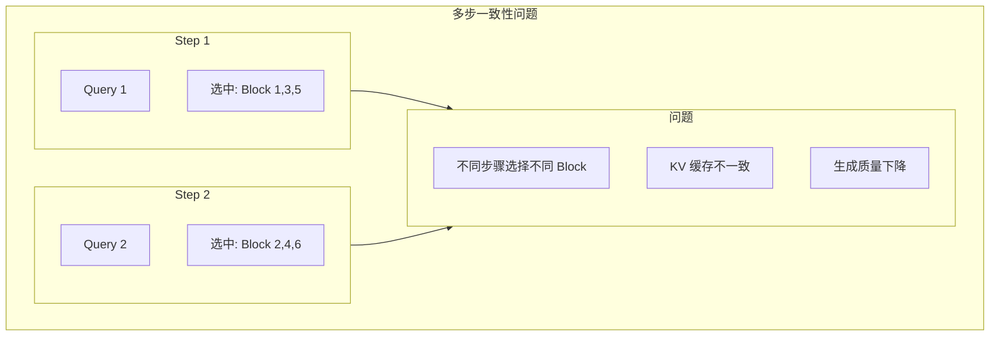
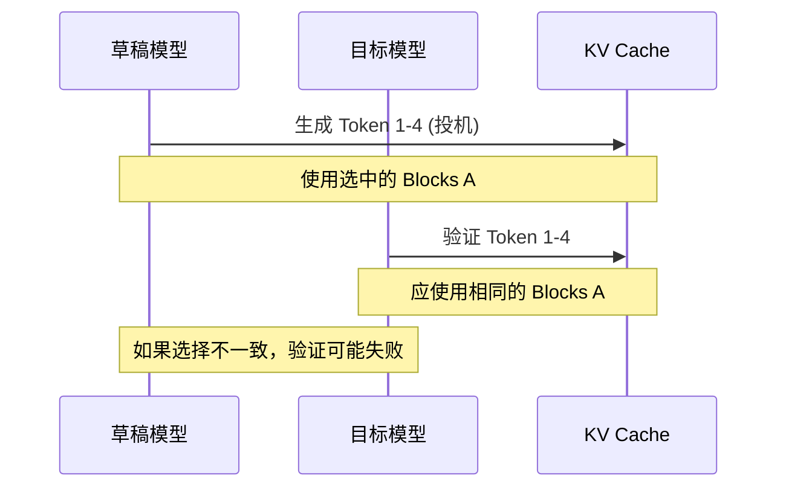
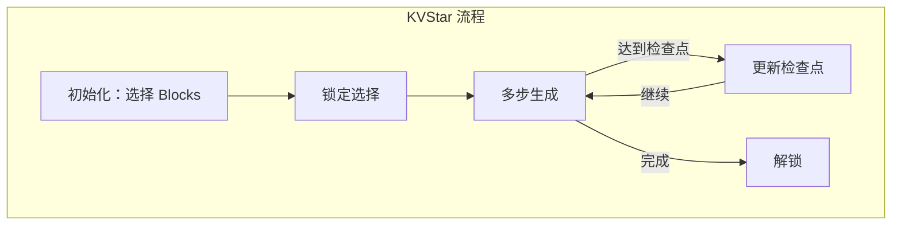
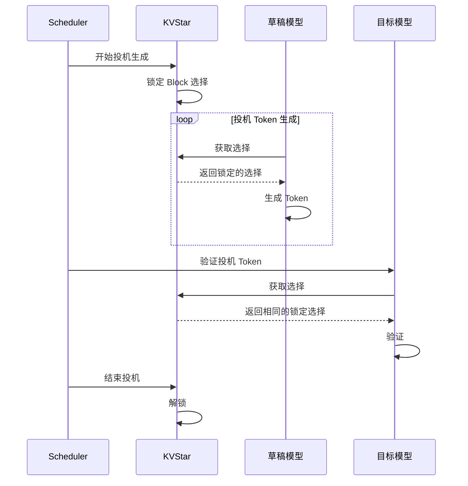
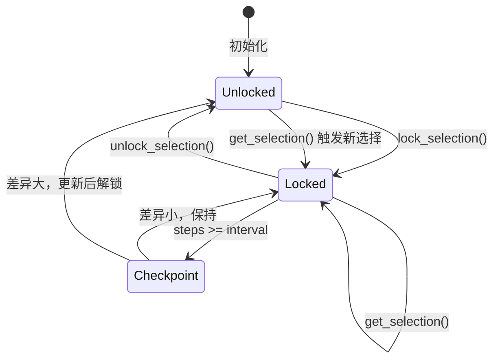

> **阅读时间**: 约 12 分钟
> **前置要求**: [GSA On-Device](./05-gsa-on-device.md)

---

## 概述

KVStar 解决稀疏注意力中的多步一致性问题：当使用投机解码或多步生成时，确保 KV 选择在多个步骤间保持一致。

---

## 1. 问题背景

### 1.1 多步一致性问题



### 1.2 投机解码场景

在投机解码中，多个 Token 被并行验证，需要保持一致的 KV 视图：


---
## 2. KVStar 解决方案

### 2.1 核心思想

KVStar 通过**锁定机制**确保多步生成期间使用一致的 Block 选择：



### 2.2 状态管理

**代码位置**: `ucm/sparse/kvstar/kvstar.py`

```python
@dataclass
class KVStarState:
    """KVStar 请求状态"""
    request_id: str

    # 锁定的 Block 选择
    locked_selection: Optional[List[int]] = None

    # 锁定时的 Token 位置
    lock_position: int = 0

    # 检查点配置
    checkpoint_interval: int = 8

    # 生成计数
    steps_since_lock: int = 0

    # 是否处于锁定状态
    is_locked: bool = False


class KVStar(UcmSparseBase):
    """KVStar 多步一致性管理"""

    def __init__(self, role: UcmSparseRole, config: dict):
        super().__init__(role, config)

        # 状态管理
        self._states: Dict[str, KVStarState] = {}

        # 配置
        self.checkpoint_interval = config.get('checkpoint_interval', 8)
        self.lock_duration = config.get('lock_duration', 16)

        # 底层稀疏方法（如 GSA）
        self.base_sparse = self._create_base_sparse(config)

    def _create_base_sparse(self, config: dict) -> UcmSparseBase:
        """创建底层稀疏方法"""
        base_method = config.get('base_method', 'GSA')
        return UcmSparseFactory.create_sparse_method(
            base_method,
            self.role,
            config
        )
```

---
## 3. 核心机制
### 3.1 锁定机制
```python
class KVStar(UcmSparseBase):

    def lock_selection(
        self,
        request_id: str,
        selection: List[int],
        position: int
    ):
        """锁定 Block 选择"""
        state = self._get_or_create_state(request_id)
        state.locked_selection = selection.copy()
        state.lock_position = position
        state.steps_since_lock = 0
        state.is_locked = True

        logger.debug(f"KVStar: Locked selection for {request_id} at position {position}")

    def unlock_selection(self, request_id: str):
        """解锁 Block 选择"""
        state = self._states.get(request_id)
        if state:
            state.is_locked = False
            state.locked_selection = None
            logger.debug(f"KVStar: Unlocked selection for {request_id}")

    def get_selection(
        self,
        request_id: str,
        current_position: int,
        fallback_selector: Callable[[], List[int]]
    ) -> List[int]:
        """获取 Block 选择（考虑锁定状态）"""
        state = self._get_or_create_state(request_id)
        # 如果已锁定且在有效期内
        if state.is_locked and state.locked_selection is not None:
            state.steps_since_lock += 1
            # 检查是否需要更新
            if state.steps_since_lock >= self.checkpoint_interval:
                return self._checkpoint_update(state, fallback_selector)
            return state.locked_selection
        # 未锁定，执行新选择
        new_selection = fallback_selector()
        self.lock_selection(request_id, new_selection, current_position)
        return new_selection
    def _checkpoint_update(
        self,
        state: KVStarState,
        fallback_selector: Callable[[], List[int]]
    ) -> List[int]:
        """检查点更新"""
        # 获取新选择
        new_selection = fallback_selector()

        # 计算与锁定选择的差异
        old_set = set(state.locked_selection)
        new_set = set(new_selection)

        added = new_set - old_set
        removed = old_set - new_set
        # 如果差异较小，保持锁定
        if len(added) + len(removed) <= 2:
            state.steps_since_lock = 0
            return state.locked_selection

        # 差异较大，更新锁定
        state.locked_selection = new_selection
        state.steps_since_lock = 0

        logger.debug(f"KVStar: Updated selection, +{len(added)}, -{len(removed)}")

        return new_selection
```
### 3.2 与注意力计算集成
```python
class KVStar(UcmSparseBase):

    def attention_begin(
        self,
        layer_idx: int,
        query: torch.Tensor,
        key: torch.Tensor,
        value: torch.Tensor,
        metadata: AttentionMetadata
    ) -> Tuple[torch.Tensor, ...]:
        """注意力前处理"""
        request_id = metadata.request_id
        current_position = metadata.num_computed_tokens

        # 获取一致的 Block 选择
        selection = self.get_selection(
            request_id,
            current_position,
            fallback_selector=lambda: self.base_sparse.select_blocks(metadata)
        )
        # 设置选择供底层使用
        self.base_sparse.set_selection(selection)

        # 调用底层方法
        return self.base_sparse.attention_begin(
            layer_idx, query, key, value, metadata
        )
    def attention_finished(
        self,
        layer_idx: int,
        output: torch.Tensor
    ) -> torch.Tensor:
        """注意力后处理"""
        return self.base_sparse.attention_finished(layer_idx, output)
```

---

## 4. 投机解码支持

### 4.1 投机解码流程


### 4.2 实现
```python
class KVStarSpeculative:
    """KVStar 投机解码支持"""
    def __init__(self, kvstar: KVStar):
        self.kvstar = kvstar
        self._speculative_sessions: Dict[str, SpeculativeSession] = {}
    def begin_speculation(
        self,
        request_id: str,
        num_speculative_tokens: int
    ):
        """开始投机生成"""
        session = SpeculativeSession(
            request_id=request_id,
            num_tokens=num_speculative_tokens,
            start_position=self._get_current_position(request_id)
        )
        self._speculative_sessions[request_id] = session

        # 确保选择被锁定
        if not self.kvstar._states.get(request_id, KVStarState(request_id)).is_locked:
            self.kvstar.lock_selection(
                request_id,
                self.kvstar.base_sparse.select_blocks_for(request_id),
                session.start_position
            )

    def end_speculation(
        self,
        request_id: str,
        accepted_tokens: int
    ):
        """结束投机生成"""
        session = self._speculative_sessions.pop(request_id, None)

        if session:
            # 根据接受的 Token 数决定是否更新
            if accepted_tokens == session.num_tokens:
                # 全部接受，保持锁定继续
                pass
            else:
                # 部分接受，解锁并重新选择
                self.kvstar.unlock_selection(request_id)
    def verify_consistency(
        self,
        request_id: str,
        draft_selection: List[int],
        target_selection: List[int]
    ) -> bool:
        """验证草稿和目标使用的选择一致"""
        return set(draft_selection) == set(target_selection)
```
---
## 5. 状态追踪

### 5.1 状态机



### 5.2 监控指标

```python
class KVStarMetrics:
    """KVStar 监控指标"""

    def __init__(self):
        self.lock_count = 0
        self.unlock_count = 0
        self.checkpoint_updates = 0
        self.checkpoint_maintains = 0

    def record_lock(self):
        self.lock_count += 1

    def record_unlock(self):
        self.unlock_count += 1

    def record_checkpoint(self, updated: bool):
        if updated:
            self.checkpoint_updates += 1
        else:
            self.checkpoint_maintains += 1

    def get_stats(self) -> Dict[str, Any]:
        total_checkpoints = self.checkpoint_updates + self.checkpoint_maintains
        return {
            'lock_count': self.lock_count,
            'unlock_count': self.unlock_count,
            'checkpoint_updates': self.checkpoint_updates,
            'checkpoint_maintains': self.checkpoint_maintains,
            'checkpoint_update_rate': (
                self.checkpoint_updates / total_checkpoints
                if total_checkpoints > 0 else 0
            )
        }
```

---
## 6. 配置参数
### 6.1 参数说明
| 参数 | 默认值 | 说明 |
|------|--------|------|
| `checkpoint_interval` | 8 | 检查点间隔（步数） |
| `lock_duration` | 16 | 最大锁定时长 |
| `base_method` | "GSA" | 底层稀疏方法 |
| `update_threshold` | 2 | 触发更新的最小差异 |

### 6.2 配置示例

```yaml
ucm_sparse_config:
  KVStar:
    # 锁定配置
    checkpoint_interval: 8
    lock_duration: 16
    update_threshold: 2

    # 底层方法配置
    base_method: "GSA"
    sparse_ratio: 0.3
```
---
## 7. 使用场景

### 7.1 投机解码

```python
config = {
    "ucm_sparse_method": "KVStar",
    "ucm_sparse_config": {
        "KVStar": {
            "checkpoint_interval": 8,
            "base_method": "GSA"
        }
    }
}

kvstar = UcmSparseFactory.create_sparse_method("KVStar", role, config)

speculative = KVStarSpeculative(kvstar)
speculative.begin_speculation(request_id, num_speculative=4)

# ... 目标模型验证 ...

speculative.end_speculation(request_id, accepted_tokens=3)
```

### 7.2 多步生成

```python
for step in range(max_steps):
    # KVStar 自动管理一致性
    output = model.forward(input_ids)

    # 每 checkpoint_interval 步自动检查
    if should_stop(output):
        break
```

---
## 8. 性能影响
### 8.1 开销分析
| 操作 | 开销 | 频率 |
|------|------|------|
| 状态查询 | O(1) | 每步 |
| 锁定/解锁 | O(K) | 每 N 步 |
| 检查点比较 | O(K) | 每 checkpoint_interval 步 |
### 8.2 收益
- **减少重复选择**：锁定期间无需重复执行 Block 选择
- **一致性保证**：投机解码验证成功率提高
- **生成质量**：避免选择抖动导致的输出不一致