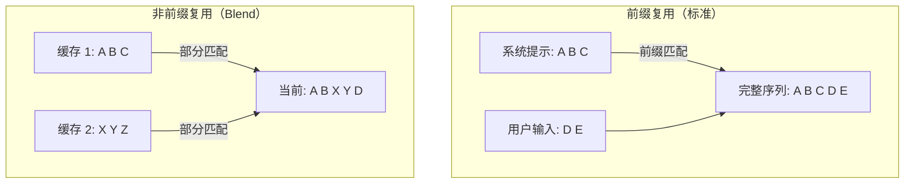
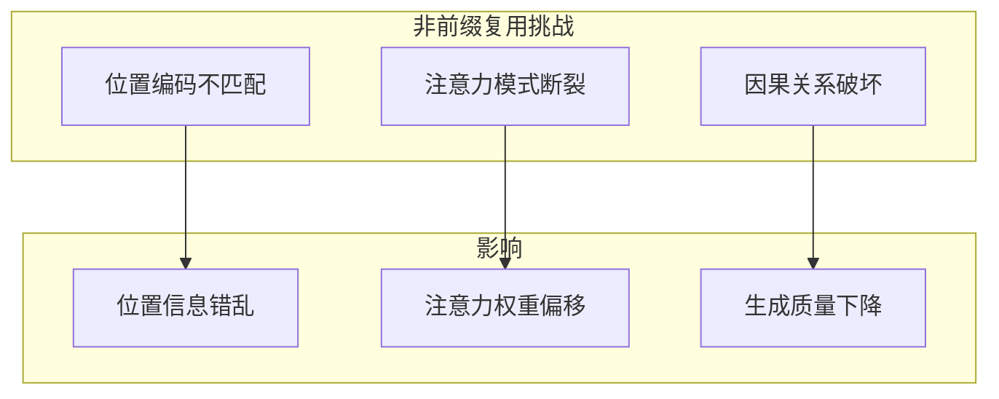
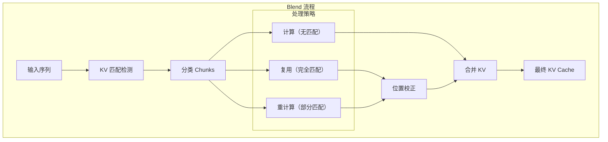
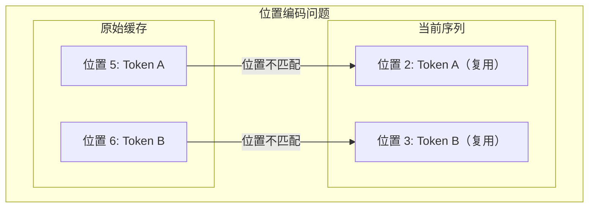
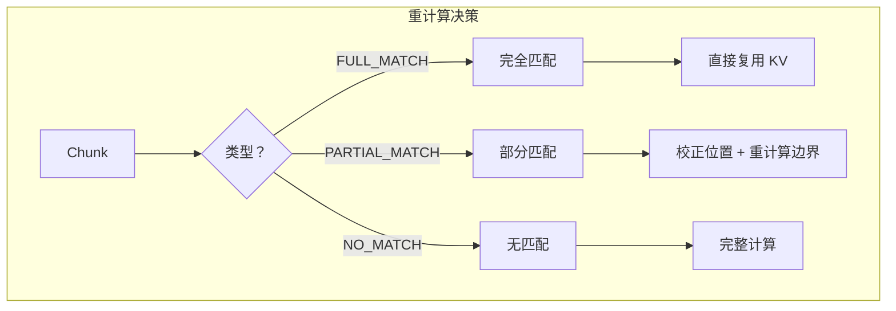
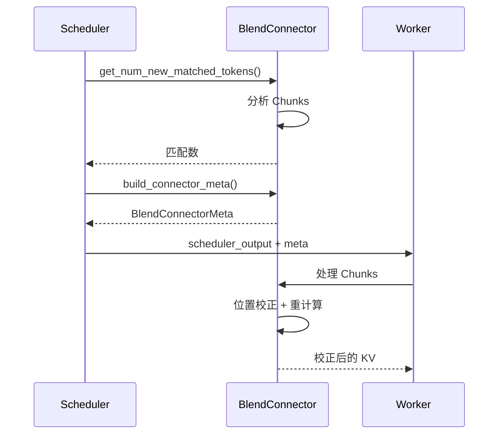

> **阅读时间**: 约 18 分钟
> **前置要求**: [KVStar 多步一致性](./06-kvstar-multistep.md)

---

## 概述

Cache Blend 解决**非前缀 KV 复用**问题：当复用的 KV Cache 并非当前序列的严格前缀时，如何正确地融合这些缓存。

---

## 1. 问题背景

### 1.1 前缀 vs 非前缀复用


### 1.2 为什么需要非前缀复用
| 场景 | 描述 |
|------|------|
| 多轮对话 | 复用之前轮次的上下文 |
| 文档问答 | 复用相同文档的不同片段 |
| 代码补全 | 复用相似代码模式 |
| 知识库 | 复用相关知识片段 |

### 1.3 核心挑战


---
## 2. Blend 解决方案

### 2.1 核心思想

Blend 通过**选择性重计算**和**位置校正**实现非前缀 KV 复用：



### 2.2 Chunk 分类

```python
from enum import Enum

class ChunkType(Enum):
    """Chunk 类型"""
    FULL_MATCH = "full_match"      # 完全匹配，可直接复用
    PARTIAL_MATCH = "partial_match" # 部分匹配，需要重计算
    NO_MATCH = "no_match"          # 无匹配，需要计算


@dataclass
class Chunk:
    """Blend 处理单元"""
    start_idx: int          # 起始位置
    end_idx: int            # 结束位置
    chunk_type: ChunkType   # 类型
    source_block_id: Optional[str] = None  # 来源 Block
    source_position: Optional[int] = None  # 来源位置
```

---
## 3. 核心组件
### 3.1 Blend 类结构
**代码位置**: `ucm/sparse/blend/blend.py`
```python
class Blend(UcmSparseBase):
    """Cache Blend 实现"""
    def __init__(self, role: UcmSparseRole, config: dict):
        super().__init__(role, config)

        # Chunk 管理
        self.chunk_size = config.get('blend_chunk_size', 64)
        self.min_match_ratio = config.get('min_match_ratio', 0.8)

        # 位置校正
        self.position_corrector = PositionCorrector(config)
        # 重计算引擎
        self.recompute_engine = RecomputeEngine(config)

        # 请求状态
        self._request_states: Dict[str, BlendState] = {}

@dataclass
class BlendState:
    """Blend 请求状态"""
    request_id: str
    chunks: List[Chunk]
    position_mapping: Dict[int, int]  # 原始位置 -> 校正后位置
    recompute_mask: torch.Tensor      # 需要重计算的位置
```
### 3.2 Chunk 分析
```python
class ChunkAnalyzer:
    """Chunk 分析器"""
    def __init__(self, chunk_size: int, min_match_ratio: float):
        self.chunk_size = chunk_size
        self.min_match_ratio = min_match_ratio
    def analyze(
        self,
        token_ids: List[int],
        cached_blocks: Dict[str, CachedBlock]
    ) -> List[Chunk]:
        """分析并分类 Chunks"""
        chunks = []
        num_tokens = len(token_ids)

        for start in range(0, num_tokens, self.chunk_size):
            end = min(start + self.chunk_size, num_tokens)
            chunk_tokens = token_ids[start:end]

            # 尝试匹配缓存
            match_result = self._find_best_match(chunk_tokens, cached_blocks)
            if match_result.ratio >= 1.0:
                # 完全匹配
                chunk = Chunk(
                    start_idx=start,
                    end_idx=end,
                    chunk_type=ChunkType.FULL_MATCH,
                    source_block_id=match_result.block_id,
                    source_position=match_result.position
                )
            elif match_result.ratio >= self.min_match_ratio:
                # 部分匹配
                chunk = Chunk(
                    start_idx=start,
                    end_idx=end,
                    chunk_type=ChunkType.PARTIAL_MATCH,
                    source_block_id=match_result.block_id,
                    source_position=match_result.position
                )
            else:
                # 无匹配
                chunk = Chunk(
                    start_idx=start,
                    end_idx=end,
                    chunk_type=ChunkType.NO_MATCH
                )
            chunks.append(chunk)
        return chunks
    def _find_best_match(
        self,
        tokens: List[int],
        cached_blocks: Dict[str, CachedBlock]
    ) -> MatchResult:
        """找到最佳匹配"""
        best_match = MatchResult(ratio=0.0)
        for block_id, block in cached_blocks.items():
            for offset in range(len(block.token_ids) - len(tokens) + 1):
                # 计算匹配率
                block_tokens = block.token_ids[offset:offset + len(tokens)]
                ratio = self._compute_match_ratio(tokens, block_tokens)
                if ratio > best_match.ratio:
                    best_match = MatchResult(
                        ratio=ratio,
                        block_id=block_id,
                        position=offset
                    )

        return best_match
```
---
## 4. 位置校正

### 4.1 位置编码问题

当复用非前缀位置的 KV 时，位置编码不正确会导致注意力计算错误：



### 4.2 RoPE 位置校正

**代码位置**: `ucm/sparse/blend/position_corrector.py`

```python
class PositionCorrector:
    """位置校正器（RoPE）"""

    def __init__(self, config: dict):
        self.head_dim = config.get('head_dim', 128)
        self.rope_theta = config.get('rope_theta', 10000.0)

        # 预计算旋转矩阵
        self._rotation_cache: Dict[Tuple[int, int], torch.Tensor] = {}

    def correct_kv(
        self,
        key: torch.Tensor,
        value: torch.Tensor,
        source_positions: torch.Tensor,
        target_positions: torch.Tensor
    ) -> Tuple[torch.Tensor, torch.Tensor]:
        """校正 KV 的位置编码

        将 KV 从 source_positions 校正到 target_positions
        """
        # 计算位置差
        position_diff = target_positions - source_positions

        # 应用 RoPE 逆旋转 + 正向旋转
        corrected_key = self._apply_rope_correction(key, position_diff)
        # Value 通常不需要校正（RoPE 只作用于 Q/K）

        return corrected_key, value

    def _apply_rope_correction(
        self,
        tensor: torch.Tensor,
        position_diff: torch.Tensor
    ) -> torch.Tensor:
        """应用 RoPE 位置校正"""
        # tensor: [batch, seq_len, num_heads, head_dim]
        batch, seq_len, num_heads, head_dim = tensor.shape

        # 获取或计算旋转矩阵
        rotation = self._get_rotation_matrix(position_diff, head_dim)

        # 应用旋转
        # 分割为实部和虚部
        x_r = tensor[..., ::2]   # [batch, seq, heads, head_dim//2]
        x_i = tensor[..., 1::2]  # [batch, seq, heads, head_dim//2]

        cos = rotation[..., 0]   # [seq, head_dim//2]
        sin = rotation[..., 1]   # [seq, head_dim//2]

        # 旋转
        y_r = x_r * cos - x_i * sin
        y_i = x_r * sin + x_i * cos

        # 合并
        result = torch.stack([y_r, y_i], dim=-1)
        result = result.flatten(-2)

        return result

    def _get_rotation_matrix(
        self,
        position_diff: torch.Tensor,
        head_dim: int
    ) -> torch.Tensor:
        """获取旋转矩阵"""
        # 计算频率
        inv_freq = 1.0 / (
            self.rope_theta ** (
                torch.arange(0, head_dim, 2, device=position_diff.device)
                / head_dim
            )
        )

        # 计算角度
        angles = position_diff.unsqueeze(-1) * inv_freq.unsqueeze(0)

        # 返回 [cos, sin]
        return torch.stack([torch.cos(angles), torch.sin(angles)], dim=-1)
```

---
## 5. 重计算引擎
### 5.1 选择性重计算
对于部分匹配的 Chunks，需要重计算注意力：
```python
class RecomputeEngine:
    """选择性重计算引擎"""
    def __init__(self, config: dict):
        self.model_config = config

    def recompute_attention(
        self,
        query: torch.Tensor,
        key: torch.Tensor,
        value: torch.Tensor,
        recompute_mask: torch.Tensor,
        original_output: torch.Tensor
    ) -> torch.Tensor:
        """选择性重计算注意力

        Args:
            query: [batch, seq, heads, dim]
            key: [batch, kv_len, heads, dim]
            value: [batch, kv_len, heads, dim]
            recompute_mask: [batch, seq] 布尔掩码
            original_output: [batch, seq, heads, dim] 原始输出
        Returns:
            校正后的输出
        """
        # 找出需要重计算的位置
        recompute_indices = recompute_mask.nonzero(as_tuple=True)
        if len(recompute_indices[0]) == 0:
            return original_output

        # 提取需要重计算的 Query
        recompute_query = query[recompute_indices]
        # 执行完整注意力计算
        recomputed = self._compute_attention(
            recompute_query, key, value
        )

        # 合并结果
        output = original_output.clone()
        output[recompute_indices] = recomputed

        return output

    def _compute_attention(
        self,
        query: torch.Tensor,
        key: torch.Tensor,
        value: torch.Tensor
    ) -> torch.Tensor:
        """计算标准注意力"""
        head_dim = query.shape[-1]
        # Q @ K^T
        scores = torch.matmul(query, key.transpose(-2, -1))
        scores = scores / math.sqrt(head_dim)
        # Softmax
        attn_weights = F.softmax(scores, dim=-1)

        # Weighted sum
        output = torch.matmul(attn_weights, value)
        return output
```

### 5.2 重计算决策


---
## 6. Blend Connector

### 6.1 与 vLLM 集成

**代码位置**: `ucm/integration/vllm/blend_connector.py`

```python
class BlendConnector(KVConnectorBase):
    """Blend 专用 Connector"""

    def __init__(self, rank: int, local_rank: int, config: KVTransferConfig):
        super().__init__(rank, local_rank, config)

        # 初始化 Blend 引擎
        self.blend = Blend(UcmSparseRole.WORKER, config.kv_connector_extra_config)

        # Chunk 分析器
        self.chunk_analyzer = ChunkAnalyzer(
            chunk_size=config.kv_connector_extra_config.get('blend_chunk_size', 64),
            min_match_ratio=config.kv_connector_extra_config.get('min_match_ratio', 0.8)
        )

        # 请求状态
        self._request_chunks: Dict[str, List[Chunk]] = {}

    def get_num_new_matched_tokens(self, request: Request) -> int:
        """计算匹配的 Token 数"""
        # 分析 Chunks
        chunks = self.chunk_analyzer.analyze(
            request.prompt_token_ids,
            self._get_cached_blocks()
        )
        self._request_chunks[request.request_id] = chunks

        # 统计匹配的 Token 数
        matched = sum(
            chunk.end_idx - chunk.start_idx
            for chunk in chunks
            if chunk.chunk_type in [ChunkType.FULL_MATCH, ChunkType.PARTIAL_MATCH]
        )

        return matched

    def build_connector_meta(
        self,
        scheduler_output: SchedulerOutput
    ) -> ConnectorMeta:
        """构建 Connector 元数据"""
        meta = BlendConnectorMeta()

        for request_id in scheduler_output.scheduled_request_ids:
            chunks = self._request_chunks.get(request_id, [])
            meta.add_chunks(request_id, chunks)

        return meta
```

### 6.2 数据流



---
## 7. 配置参数
### 7.1 参数说明
| 参数 | 默认值 | 说明 |
|------|--------|------|
| `blend_chunk_size` | 64 | Chunk 大小 |
| `min_match_ratio` | 0.8 | 最小匹配率 |
| `position_correction` | true | 启用位置校正 |
| `recompute_boundary` | 2 | 边界重计算范围 |
| `rope_theta` | 10000.0 | RoPE 基础频率 |
### 7.2 配置示例
```yaml
ucm_connector_config:
  # Blend 配置
  blend_chunk_size: 64
  min_match_ratio: 0.8
  position_correction: true
  recompute_boundary: 2
  # RoPE 配置
  rope_theta: 10000.0
  head_dim: 128
```

---

## 8. 性能特点

### 8.1 复杂度分析

| 操作 | 复杂度 | 说明 |
|------|--------|------|
| Chunk 分析 | O(N × M) | N=序列长, M=缓存数 |
| 位置校正 | O(K × D) | K=校正 Token 数, D=维度 |
| 选择性重计算 | O(R × L × D) | R=重计算数, L=KV 长度 |

### 8.2 适用场景

| 场景 | 效果 | 原因 |
|------|------|------|
| 多轮对话 | 优秀 | 有效复用历史上下文 |
| 文档 QA | 优秀 | 复用文档片段 |
| 代码补全 | 良好 | 复用相似模式 |
| 短序列 | 一般 | Chunk 开销相对较大 |
---
## 9. 使用示例

```python
from vllm.config import KVTransferConfig

ktc = KVTransferConfig(
    kv_connector="BlendConnector",
    kv_connector_module_path="ucm.integration.vllm.blend_connector",
    kv_role="kv_both",
    kv_connector_extra_config={
        "blend_chunk_size": 64,
        "min_match_ratio": 0.8,
        "position_correction": True
    }
)

llm = LLM(
    model="your-model",
    kv_transfer_config=ktc
)

outputs = llm.generate(prompts)
```
