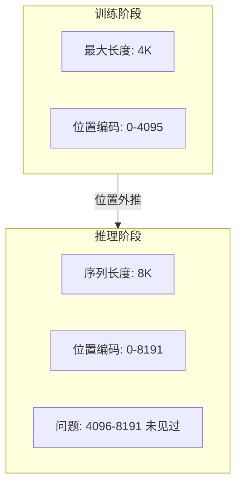
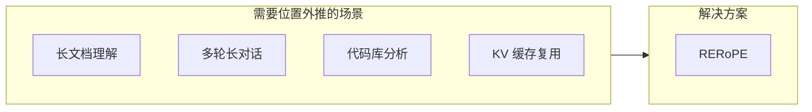
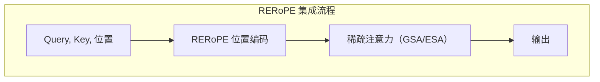
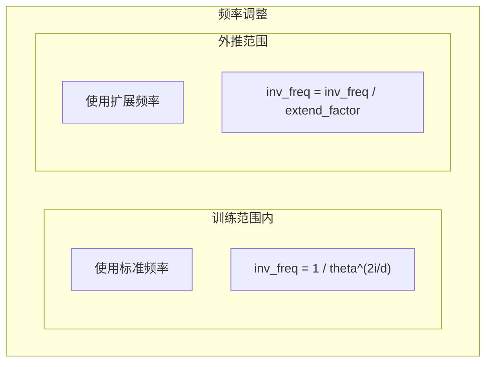

> **阅读时间**: 约 12 分钟
> **前置要求**: [Blend 算法](./07-blend-algorithm.md)

---

## 概述

RERoPE（Relative Extended Rotary Position Embedding）解决位置外推问题：当序列长度超过训练时的最大长度时，如何保持位置编码的有效性。

---

## 1. 问题背景

### 1.1 位置外推问题



### 1.2 标准 RoPE 的局限

| 问题 | 描述 |
|------|------|
| 频率失配 | 高频成分在长位置处失效 |
| 注意力稀释 | 远距离注意力权重异常 |
| 周期混淆 | 位置编码出现周期性混叠 |

### 1.3 为什么需要位置外推



---

## 2. RERoPE 原理

### 2.1 核心思想

RERoPE 通过**位置重映射**将超出训练范围的位置映射回有效范围：


### 2.2 位置重映射策略

**代码位置**: `ucm/sparse/rerope/rerope.py`

```python
class RERoPE:
    """Relative Extended RoPE 实现"""

    def __init__(self, config: dict):
        self.max_position = config.get('max_position', 4096)
        self.extend_factor = config.get('extend_factor', 2.0)
        self.head_dim = config.get('head_dim', 128)
        self.base_theta = config.get('rope_theta', 10000.0)

        # 预计算频率
        self._init_frequencies()
    def _init_frequencies(self):
        """初始化频率"""
        dim = self.head_dim // 2
        # 标准频率
        self.inv_freq = 1.0 / (
            self.base_theta ** (
                torch.arange(0, dim * 2, 2, dtype=torch.float32) / (dim * 2)
            )
        )

        # 扩展频率（用于外推）
        self.extended_inv_freq = self.inv_freq / self.extend_factor
    def remap_position(self, position: int) -> float:
        """重映射位置

        将超出训练范围的位置映射到有效范围
        """
        if position < self.max_position:
            # 在训练范围内，保持不变
            return float(position)

        # 超出范围，使用对数压缩
        overflow = position - self.max_position
        compressed = self.max_position + math.log1p(overflow) * self.extend_factor

        return compressed

    def get_rotary_embedding(
        self,
        positions: torch.Tensor
    ) -> Tuple[torch.Tensor, torch.Tensor]:
        """获取旋转嵌入

        Args:
            positions: [batch, seq_len]
        Returns:
            cos, sin: [batch, seq_len, head_dim // 2]
        """
        # 重映射位置
        remapped = torch.tensor([
            [self.remap_position(p.item()) for p in batch]
            for batch in positions
        ], device=positions.device, dtype=torch.float32)

        # 选择频率
        inv_freq = torch.where(
            positions < self.max_position,
            self.inv_freq,
            self.extended_inv_freq
        )
        # 计算角度
        angles = remapped.unsqueeze(-1) * inv_freq.unsqueeze(0)

        return torch.cos(angles), torch.sin(angles)
```
---
## 3. Triton Kernel 实现

### 3.1 高效实现

**代码位置**: `ucm/sparse/rerope/triton_kernel.py`

```python
@triton.jit
def rerope_forward_kernel(
    query_ptr,
    key_ptr,
    positions_ptr,
    output_q_ptr,
    output_k_ptr,
    inv_freq_ptr,
    max_position: tl.constexpr,
    extend_factor: tl.constexpr,
    batch_size: tl.constexpr,
    seq_len: tl.constexpr,
    num_heads: tl.constexpr,
    head_dim: tl.constexpr,
    BLOCK_SIZE: tl.constexpr,
):
    """Triton Kernel: RERoPE 前向计算"""
    # 工作项索引
    batch_idx = tl.program_id(0)
    seq_idx = tl.program_id(1)
    head_idx = tl.program_id(2)

    # 加载位置
    pos_offset = batch_idx * seq_len + seq_idx
    position = tl.load(positions_ptr + pos_offset)

    # 位置重映射
    if position < max_position:
        remapped_pos = position.to(tl.float32)
        use_extended = False
    else:
        overflow = position - max_position
        remapped_pos = max_position + tl.log(1.0 + overflow.to(tl.float32)) * extend_factor
        use_extended = True

    # 加载 Query 和 Key
    qk_offset = (
        batch_idx * seq_len * num_heads * head_dim +
        seq_idx * num_heads * head_dim +
        head_idx * head_dim
    )

    half_dim = head_dim // 2
    q_r = tl.load(query_ptr + qk_offset + tl.arange(0, half_dim) * 2)
    q_i = tl.load(query_ptr + qk_offset + tl.arange(0, half_dim) * 2 + 1)
    k_r = tl.load(key_ptr + qk_offset + tl.arange(0, half_dim) * 2)
    k_i = tl.load(key_ptr + qk_offset + tl.arange(0, half_dim) * 2 + 1)

    # 加载频率
    inv_freq = tl.load(inv_freq_ptr + tl.arange(0, half_dim))
    if use_extended:
        inv_freq = inv_freq / extend_factor

    # 计算角度
    angles = remapped_pos * inv_freq
    cos_val = tl.cos(angles)
    sin_val = tl.sin(angles)

    # 应用旋转
    out_q_r = q_r * cos_val - q_i * sin_val
    out_q_i = q_r * sin_val + q_i * cos_val
    out_k_r = k_r * cos_val - k_i * sin_val
    out_k_i = k_r * sin_val + k_i * cos_val

    # 存储结果
    tl.store(output_q_ptr + qk_offset + tl.arange(0, half_dim) * 2, out_q_r)
    tl.store(output_q_ptr + qk_offset + tl.arange(0, half_dim) * 2 + 1, out_q_i)
    tl.store(output_k_ptr + qk_offset + tl.arange(0, half_dim) * 2, out_k_r)
    tl.store(output_k_ptr + qk_offset + tl.arange(0, half_dim) * 2 + 1, out_k_i)


def apply_rerope(
    query: torch.Tensor,
    key: torch.Tensor,
    positions: torch.Tensor,
    inv_freq: torch.Tensor,
    max_position: int,
    extend_factor: float
) -> Tuple[torch.Tensor, torch.Tensor]:
    """应用 RERoPE"""
    batch_size, seq_len, num_heads, head_dim = query.shape

    output_q = torch.empty_like(query)
    output_k = torch.empty_like(key)

    grid = (batch_size, seq_len, num_heads)
    BLOCK_SIZE = 64

    rerope_forward_kernel[grid](
        query, key, positions,
        output_q, output_k,
        inv_freq,
        max_position, extend_factor,
        batch_size, seq_len, num_heads, head_dim,
        BLOCK_SIZE
    )

    return output_q, output_k
```

---
## 4. 与稀疏注意力集成
### 4.1 RERoPE 作为预处理

### 4.2 实现
```python
class RERoPESparse(UcmSparseBase):
    """RERoPE + 稀疏注意力"""
    def __init__(self, role: UcmSparseRole, config: dict):
        super().__init__(role, config)

        # RERoPE 组件
        self.rerope = RERoPE(config)
        # 底层稀疏方法
        self.base_sparse = self._create_base_sparse(config)

    def attention_begin(
        self,
        layer_idx: int,
        query: torch.Tensor,
        key: torch.Tensor,
        value: torch.Tensor,
        metadata: AttentionMetadata
    ) -> Tuple[torch.Tensor, ...]:
        """注意力前处理"""
        # 获取位置
        positions = metadata.positions

        # 应用 RERoPE
        query_rope, key_rope = apply_rerope(
            query, key, positions,
            self.rerope.inv_freq.to(query.device),
            self.rerope.max_position,
            self.rerope.extend_factor
        )

        # 调用底层稀疏方法
        return self.base_sparse.attention_begin(
            layer_idx, query_rope, key_rope, value, metadata
        )
    def attention_finished(
        self,
        layer_idx: int,
        output: torch.Tensor
    ) -> torch.Tensor:
        """注意力后处理"""
        return self.base_sparse.attention_finished(layer_idx, output)
```

---

## 5. 配置参数

### 5.1 参数说明

| 参数 | 默认值 | 说明 |
|------|--------|------|
| `max_position` | 4096 | 训练时最大位置 |
| `extend_factor` | 2.0 | 扩展因子 |
| `rope_theta` | 10000.0 | RoPE 基础频率 |
| `head_dim` | 128 | 注意力头维度 |
### 5.2 配置示例
```yaml
ucm_sparse_config:
  RERoPE:
    # 位置配置
    max_position: 4096
    extend_factor: 2.0

    # RoPE 配置
    rope_theta: 10000.0
    head_dim: 128

    # 底层稀疏方法
    base_method: "GSA"
    sparse_ratio: 0.3
```
---
## 6. 位置映射可视化

### 6.1 映射曲线

```
位置映射函数
============

标准映射 (position < max_position):
  f(x) = x

外推映射 (position >= max_position):
  f(x) = max_position + log(1 + (x - max_position)) * extend_factor

示例 (max_position=4096, extend_factor=2):
  f(4096) = 4096.0
  f(5000) = 4096 + log(905) * 2 ≈ 4109.6
  f(8192) = 4096 + log(4097) * 2 ≈ 4112.5
  f(16384) = 4096 + log(12289) * 2 ≈ 4115.5
```

### 6.2 频率调整



---
## 7. 性能特点
### 7.1 计算开销
| 操作 | 复杂度 | 说明 |
|------|--------|------|
| 位置重映射 | O(S) | S=序列长度 |
| 旋转嵌入 | O(S × D) | D=head_dim |
| 总开销 | < 1% | 相对于注意力计算 |
### 7.2 效果对比
| 序列长度 | 标准 RoPE | RERoPE |
|----------|-----------|--------|
| 4K（训练内） | 正常 | 正常 |
| 8K | 质量下降 | 保持 |
| 16K | 严重退化 | 轻微下降 |
| 32K | 失效 | 可用 |

---

## 8. 使用示例

### 8.1 基本使用

```python
from ucm.sparse.rerope import RERoPE
# 创建 RERoPE
rerope = RERoPE({
    'max_position': 4096,
    'extend_factor': 2.0,
    'head_dim': 128
})

positions = torch.arange(8192).unsqueeze(0)  # [1, 8192]
cos, sin = rerope.get_rotary_embedding(positions)
# 应用到 Query/Key
query_rope = apply_rope(query, cos, sin)
key_rope = apply_rope(key, cos, sin)
```

### 8.2 与稀疏方法结合

```python
from ucm.sparse.factory import UcmSparseFactory
# 配置
config = {
    "ucm_sparse_method": "RERoPE",
    "ucm_sparse_config": {
        "RERoPE": {
            "max_position": 4096,
            "extend_factor": 2.0,
            "base_method": "GSA"
        }
    }
}
# 创建
sparse = UcmSparseFactory.create_sparse_method(
    "RERoPE",
    UcmSparseRole.WORKER,
    config
)

q, k, v = sparse.attention_begin(layer_idx, query, key, value, metadata)
```
---
## 9. 注意事项

### 9.1 与 KV 缓存的兼容性

- 使用 RERoPE 时，缓存的 KV 包含位置信息
- 复用缓存时需要考虑位置重映射
- 建议与 Blend 配合使用处理位置校正

### 9.2 模型兼容性

| 模型 | 兼容性 | 说明 |
|------|--------|------|
| LLaMA | 完全兼容 | 使用 RoPE |
| Qwen | 完全兼容 | 使用 RoPE |
| GPT-NeoX | 完全兼容 | 使用 RoPE |
| GPT-2 | 不适用 | 绝对位置编码 |
