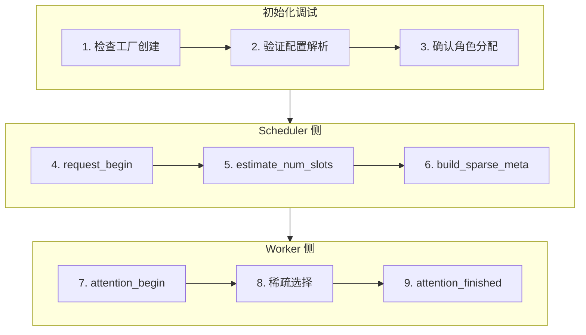

> **阅读时间**: 约 15 分钟
> **适用人群**: 需要调试稀疏注意力相关问题的开发者

---

## 概述

本文提供稀疏注意力算法的调试入口点、常用技巧和问题排查方法。

---

## 1. 调试入口点

### 1.1 核心入口点列表

```
稀疏算法调试入口
================

1. 稀疏工厂创建
   └── ucm/sparse/factory.py:31
       UcmSparseFactory.create_sparse_method()

2. 基类生命周期钩子
   ├── ucm/sparse/base.py:60
   │   UcmSparseBase.request_begin()
   ├── ucm/sparse/base.py:85
   │   UcmSparseBase.build_sparse_meta()
   ├── ucm/sparse/base.py:126
   │   UcmSparseBase.attention_begin()
   └── ucm/sparse/base.py:145
       UcmSparseBase.attention_finished()

3. ESA 算法
   ├── ucm/sparse/esa/esa.py:50
   │   ESA.__init__()
   ├── ucm/sparse/esa/esa.py:120
   │   ESA.build_sparse_meta()
   └── ucm/sparse/esa/retrieval/retrieval_worker.py:30
       RetrievalWorker.run()

4. GSA 算法
   ├── ucm/sparse/gsa/gsa.py:45
   │   GSA.__init__()
   ├── ucm/sparse/gsa/gsa.py:86
   │   GSAReqStat (请求状态)
   └── ucm/sparse/gsa/prefetch/prefetch_engine.py:25
       PrefetchEngine.start()

5. GSA On-Device
   ├── ucm/sparse/gsa_on_device/gsa_on_device.py:40
   │   GSAOnDevice.__init__()
   ├── ucm/sparse/gsa_on_device/hash_encoder.py:20
   │   HashEncoder.encode()
   └── ucm/sparse/gsa_on_device/hamming_topk.py:15
       hamming_topk()

6. Blend 算法
   ├── ucm/sparse/blend/blend.py:35
   │   Blend.__init__()
   └── ucm/sparse/blend/blockwise_rope.py:20
       BlockwiseRoPE.apply()
```
### 1.2 调试流程图


---

## 2. 开启调试日志

### 2.1 日志级别设置

```bash
# 设置全局日志级别
export UNIFIED_CACHE_LOG_LEVEL=DEBUG

python your_script.py
```
### 2.2 关键日志标记
```python
[UCM.Sparse]       # 稀疏算法通用日志
[UCM.ESA]          # ESA 算法日志
[UCM.GSA]          # GSA 算法日志
[UCM.Blend]        # Blend 算法日志
[UCM.Prefetch]     # 预取引擎日志
[UCM.Retrieval]    # 检索 Worker 日志
```

### 2.3 日志示例

```
[UCM.Sparse] Creating sparse method: ESA
[UCM.ESA] Config: sparse_ratio=0.3, local_window=2
[UCM.ESA] request_begin: req_id=1, prompt_len=512
[UCM.ESA] build_sparse_meta: selected 128/512 blocks
[UCM.ESA] attention_begin: layer=0, num_tokens=32
[UCM.ESA] attention_finished: layer=0, latency=1.2ms
```
---
## 3. 各算法调试技巧

### 3.1 ESA 调试

```python
from ucm.sparse.esa.esa import ESA

esa = ESA(
    role="worker",
    sparse_config={
        "sparse_ratio": 0.3,
        "local_window_sz": 2,
        "retrieval_stride": 5
    }
)

def debug_request_meta(esa, request_id):
    meta = esa._request_metas.get(request_id)
    if meta:
        print(f"Request {request_id}:")
        print(f"  num_scheduled_tokens: {meta.num_scheduled_tokens}")
        print(f"  num_computed_tokens: {meta.num_computed_tokens}")
        print(f"  ucm_block_hashes: {len(meta.ucm_block_hashes)}")
```

### 3.2 GSA 调试

```python
from ucm.sparse.gsa.gsa import GSA, GSAReqStat

def debug_gsa_request(gsa, request_id):
    stat = gsa._request_stats.get(request_id)
    if stat:
        print(f"Request {request_id}:")
        print(f"  is_use_gsa: {stat.is_use_gsa}")
        print(f"  stage: {stat.stage}")
        print(f"  calc_block_table: {stat.calc_block_table}")
        print(f"  repre_slot_mapping: {stat.repre_slot_mapping}")
```

### 3.3 Prefetch Engine 调试

```python
from ucm.sparse.gsa.prefetch.prefetch_engine import PrefetchEngine

def debug_prefetch_engine(engine):
    print(f"Running: {engine.is_running}")
    print(f"Queue size: {engine.queue_size()}")
    print(f"Cache hit rate: {engine.get_hit_rate()}")
```

---
## 4. 常见问题排查
### 4.1 问题: 稀疏算法未生效
**症状**:
- 所有 Block 都被读取
- 没有性能提升
**排查步骤**:
```python
# 1. 检查配置是否正确加载
print(f"Sparse config: {ucm_config.get('ucm_sparse_config')}")

print(f"Sparse role: {sparse_method.role}")

# 例如: 序列长度是否足够长
print(f"Sequence length: {seq_len}")
print(f"Min blocks for sparse: {sparse_method.min_blocks}")
```
### 4.2 问题: 输出质量下降
**症状**:
- 生成结果不连贯
- 回答缺失关键信息
**排查步骤**:
```python
# 1. 检查稀疏比例
print(f"Sparse ratio: {sparse_method.sparse_ratio}")
# 如果太低，尝试提高到 0.5 或更高
# 2. 检查是否保留了 Sink Token
print(f"Sink token enabled: {sparse_method.keep_sink_token}")

print(f"Local window: {sparse_method.local_window_sz}")
# 尝试增大局部窗口
# 4. 验证选中的 Block
def verify_selection(sparse_meta, expected_important_indices):
    selected = set(sparse_meta.selected_blocks)
    for idx in expected_important_indices:
        if idx not in selected:
            print(f"WARNING: Expected block {idx} not selected")
```
### 4.3 问题: 预取失败
**症状**:
- 预取未命中
- 加载延迟增加
**排查步骤**:
```python
# 1. 检查预取引擎状态
engine = sparse_method.prefetch_engine
print(f"Engine running: {engine.is_running}")
print(f"Prefetch queue: {engine.queue_size()}")

hits, misses = engine.get_stats()
print(f"Hit rate: {hits / (hits + misses) * 100:.1f}%")
# 3. 检查预取时机
print(f"Prefetch latency: {engine.avg_latency()}ms")
print(f"Compute latency: {compute_latency}ms")
```

### 4.4 问题: Hash 编码不一致

**症状**:
- Block 无法匹配
- 相同内容产生不同哈希

**排查步骤**:
```python
print(f"Token IDs: {token_ids[:10]}")

encoder = sparse_method.hash_encoder
print(f"Encoder config: {encoder.config}")
# 3. 测试编码一致性
import torch
test_input = torch.tensor([[1, 2, 3, 4]])
hash1 = encoder.encode(test_input)
hash2 = encoder.encode(test_input)
print(f"Consistent: {torch.equal(hash1, hash2)}")
```
---
## 5. 性能分析

### 5.1 测量稀疏选择开销

```python
import time

start = time.time()
meta = sparse_method.build_sparse_meta(scheduler_output, ...)
elapsed = time.time() - start
print(f"build_sparse_meta: {elapsed * 1000:.2f}ms")
```

### 5.2 测量注意力开销

```python
import torch

with torch.profiler.profile() as prof:
    sparse_method.attention_begin(layer_idx, q, k, v, ...)
    output = sparse_method.attention_finished(...)

print(prof.key_averages().table(sort_by="cuda_time_total"))
```

### 5.3 稀疏效率指标

```python
def calculate_sparse_efficiency(sparse_method, request):
    total_blocks = request.total_blocks
    selected_blocks = len(sparse_method.get_selected_blocks(request.id))

    efficiency = 1 - (selected_blocks / total_blocks)
    print(f"Sparse efficiency: {efficiency * 100:.1f}%")
    print(f"Blocks: {selected_blocks}/{total_blocks}")

    return efficiency
```

---
## 6. 调试清单
### 6.1 初始化检查
- [ ] 稀疏配置正确解析
- [ ] 算法名称拼写正确
- [ ] 角色分配正确（Scheduler/Worker）
- [ ] 依赖模块已加载

### 6.2 运行时检查

- [ ] 序列长度满足最小要求
- [ ] Block 哈希生成一致
- [ ] 选择的 Block 数量合理
- [ ] Sink Token 被保留
### 6.3 质量检查
- [ ] 输出质量可接受
- [ ] 关键信息未丢失
- [ ] 性能提升明显
- [ ] 无内存问题

---

## 7. 快速参考

### 7.1 各算法配置参数

```yaml
# ESA 配置
ESA:
  sparse_ratio: 0.3       # 选择比例
  local_window_sz: 2      # 局部窗口
  retrieval_stride: 5     # 检索步长
  min_blocks: 4           # 最小 Block 数

GSA:
  sparse_ratio: 0.3
  prefetch_size: 16       # 预取批大小
  cache_size: 1024        # 预取缓存大小
# Blend 配置
Blend:
  recompute_ratio: 0.1    # 重计算比例
  position_correction: true
```
### 7.2 常用环境变量
```bash
UNIFIED_CACHE_LOG_LEVEL=DEBUG    # 日志级别
UCM_SPARSE_DISABLE=1             # 禁用稀疏
UCM_SPARSE_PROFILE=1             # 启用性能分析
```