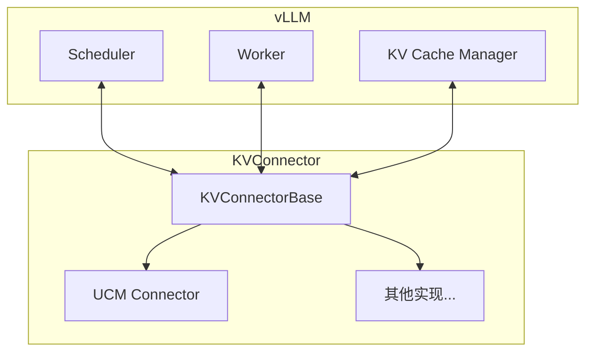
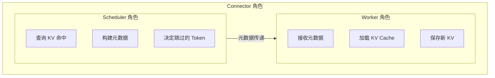
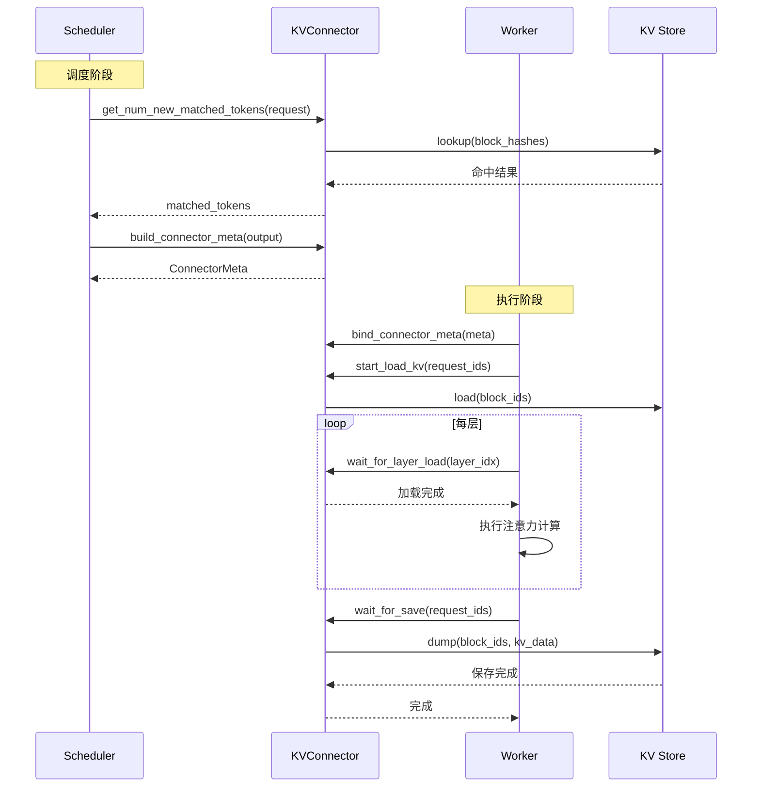
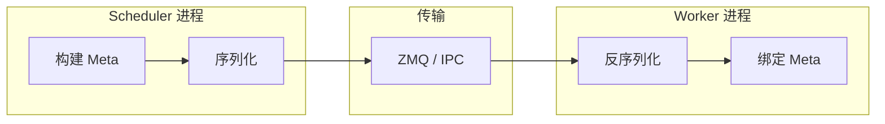
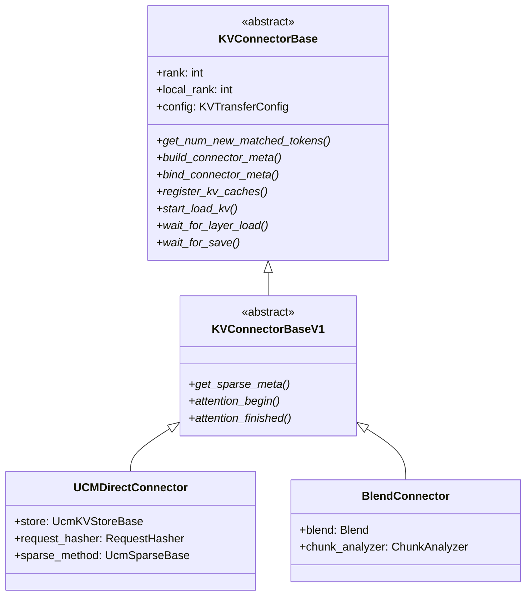

> **阅读时间**: 约 12 分钟
> **前置要求**: [vLLM 架构概览](../00-prerequisites/03-vllm-architecture.md)

---

## 概述

本文介绍 vLLM 的 KVConnector 接口设计，这是 UCM 与 vLLM 集成的基础。

---

## 1. KVConnector 概念

### 1.1 什么是 KVConnector

KVConnector 是 vLLM 提供的扩展点，允许外部系统参与 KV Cache 的管理：


### 1.2 设计目标
| 目标 | 说明 |
|------|------|
| 可插拔 | 不修改 vLLM 源码 |
| 透明 | 对上层应用无感知 |
| 高效 | 最小化性能开销 |
| 灵活 | 支持多种 KV 管理策略 |

---

## 2. 接口定义

### 2.1 KVConnectorBase

**代码位置**: vLLM `vllm/distributed/kv_transfer/kv_connector/base.py`

```python
from abc import ABC, abstractmethod
from typing import List, Optional, Tuple

class KVConnectorBase(ABC):
    """KV Connector 基类"""
    def __init__(
        self,
        rank: int,
        local_rank: int,
        config: "KVTransferConfig"
    ):
        """初始化 Connector
        Args:
            rank: 全局进程排名
            local_rank: 本地进程排名（当前节点内）
            config: KV 传输配置
        """
        self.rank = rank
        self.local_rank = local_rank
        self.config = config

    @abstractmethod
    def get_num_new_matched_tokens(
        self,
        request: "Request"
    ) -> int:
        """获取请求匹配的 Token 数
        Scheduler 侧调用，用于确定可以跳过计算的 Token 数量。
        Args:
            request: vLLM 请求对象

        Returns:
            匹配的 Token 数量（可以从缓存加载）
        """
        pass
    @abstractmethod
    def build_connector_meta(
        self,
        scheduler_output: "SchedulerOutput"
    ) -> Optional["ConnectorMeta"]:
        """构建 Connector 元数据

        Scheduler 侧调用，构建传递给 Worker 的元数据。

        Args:
            scheduler_output: 调度器输出
        Returns:
            Connector 元数据，将附加到 scheduler_output
        """
        pass

    @abstractmethod
    def bind_connector_meta(
        self,
        connector_meta: "ConnectorMeta"
    ):
        """绑定 Connector 元数据
        Worker 侧调用，接收来自 Scheduler 的元数据。
        Args:
            connector_meta: 从 Scheduler 传来的元数据
        """
        pass

    @abstractmethod
    def register_kv_caches(
        self,
        kv_caches: List["torch.Tensor"]
    ):
        """注册 KV Cache
        Worker 侧调用，注册 vLLM 的 KV Cache 张量。
        Args:
            kv_caches: KV Cache 张量列表（每层一个）
        """
        pass

    @abstractmethod
    def start_load_kv(
        self,
        request_ids: List[str]
    ):
        """开始加载 KV
        Worker 侧调用，开始异步加载 KV Cache。
        Args:
            request_ids: 需要加载 KV 的请求 ID 列表
        """
        pass

    @abstractmethod
    def wait_for_layer_load(
        self,
        layer_idx: int
    ):
        """等待指定层的 KV 加载完成
        Worker 侧调用，等待特定层的 KV 加载完成。
        Args:
            layer_idx: 层索引
        """
        pass

    @abstractmethod
    def wait_for_save(
        self,
        request_ids: List[str]
    ):
        """等待 KV 保存完成
        Worker 侧调用，等待 KV Cache 保存到存储。
        Args:
            request_ids: 需要保存 KV 的请求 ID 列表
        """
        pass

    def close(self):
        """关闭 Connector"""
        pass
```
### 2.2 角色设计


---

## 3. 调用流程

### 3.1 完整调用序列


### 3.2 Scheduler 侧流程
```python
class Scheduler:
    def schedule(self):
        # 1. 查询每个请求的 KV 命中情况
        for request in self.waiting:
            matched = self.connector.get_num_new_matched_tokens(request)
            request.set_matched_tokens(matched)
        # 2. 执行调度逻辑
        output = self._do_schedule()

        # 3. 构建 Connector 元数据
        connector_meta = self.connector.build_connector_meta(output)
        output.connector_meta = connector_meta

        return output
```
### 3.3 Worker 侧流程
```python
class ModelRunner:
    def execute_model(self, scheduler_output):
        # 1. 绑定元数据
        if scheduler_output.connector_meta:
            self.connector.bind_connector_meta(scheduler_output.connector_meta)

        # 2. 开始加载 KV
        request_ids = [req.request_id for req in scheduler_output.requests]
        self.connector.start_load_kv(request_ids)

        # 3. 逐层执行
        for layer_idx, layer in enumerate(self.model.layers):
            # 等待该层 KV 加载完成
            self.connector.wait_for_layer_load(layer_idx)
            # 执行注意力计算
            output = layer.forward(...)

        # 4. 等待 KV 保存
        self.connector.wait_for_save(request_ids)
```

---

## 4. 元数据设计

### 4.1 ConnectorMeta 结构

```python
@dataclass
class ConnectorMeta:
    """Connector 元数据基类"""
    pass

@dataclass
class UCMConnectorMeta(ConnectorMeta):
    """UCM Connector 元数据"""
    # 请求级信息
    request_metas: Dict[str, RequestMeta]

    @dataclass
    class RequestMeta:
        request_id: str
        # 需要加载的 Block
        load_block_ids: List[bytes]     # UCM Block 哈希
        load_vllm_slots: List[int]      # vLLM slot 索引
        # 需要保存的 Block
        dump_block_ids: List[bytes]
        dump_vllm_slots: List[int]
        # 匹配信息
        matched_tokens: int
```
### 4.2 元数据传递


---

## 5. KVTransferConfig

### 5.1 配置结构

```python
@dataclass
class KVTransferConfig:
    """KV 传输配置"""
    # Connector 类名
    kv_connector: str = "UCMConnector"

    # Connector 模块路径
    kv_connector_module_path: str = "ucm.integration.vllm.ucm_connector"
    # 角色：kv_producer / kv_consumer / kv_both
    kv_role: str = "kv_both"

    # 额外配置
    kv_connector_extra_config: Dict[str, Any] = field(default_factory=dict)
```

### 5.2 使用示例

```python
from vllm import LLM
from vllm.config import KVTransferConfig

ktc = KVTransferConfig(
    kv_connector="UCMConnector",
    kv_connector_module_path="ucm.integration.vllm.ucm_connector",
    kv_role="kv_both",
    kv_connector_extra_config={
        "UCM_CONFIG_FILE": "./ucm_config.yaml"
    }
)
# 创建 LLM 实例
llm = LLM(
    model="your-model",
    kv_transfer_config=ktc
)
```

---

## 6. 版本演进

### 6.1 V0 vs V1 接口

| 特性 | V0 接口 | V1 接口 |
|------|---------|---------|
| 调用时机 | 同步调用 | 支持异步 |
| 层级支持 | 全局 | 逐层 |
| 元数据 | 简单字典 | 结构化类 |
| 稀疏注意力 | 不支持 | 原生支持 |
### 6.2 V1 接口新增方法
```python
class KVConnectorBaseV1(KVConnectorBase):
    """V1 接口扩展"""
    @abstractmethod
    def get_sparse_meta(
        self,
        scheduler_output: "SchedulerOutput"
    ) -> Optional["SparseMeta"]:
        """获取稀疏注意力元数据"""
        pass
    @abstractmethod
    def attention_begin(
        self,
        layer_idx: int,
        query: "torch.Tensor",
        key: "torch.Tensor",
        value: "torch.Tensor"
    ) -> Tuple["torch.Tensor", ...]:
        """注意力计算前钩子"""
        pass

    @abstractmethod
    def attention_finished(
        self,
        layer_idx: int,
        output: "torch.Tensor"
    ) -> "torch.Tensor":
        """注意力计算后钩子"""
        pass
```

---

## 7. 接口类层次


---
## 8. 实现要点

### 8.1 线程安全

```python
class ThreadSafeConnector(KVConnectorBase):
    """线程安全的 Connector 实现模板"""

    def __init__(self, ...):
        self._lock = threading.Lock()
        self._request_states = {}

    def get_num_new_matched_tokens(self, request):
        with self._lock:
            # 线程安全的状态访问
            return self._do_lookup(request)
```

### 8.2 异步操作

```python
class AsyncConnector(KVConnectorBase):
    """异步 Connector 实现模板"""

    def start_load_kv(self, request_ids):
        # 提交异步加载任务
        self._load_tasks = {}
        for req_id in request_ids:
            task = self._async_load(req_id)
            self._load_tasks[req_id] = task

    def wait_for_layer_load(self, layer_idx):
        # 等待特定层完成
        for req_id, task in self._load_tasks.items():
            task.wait_for_layer(layer_idx)
```
