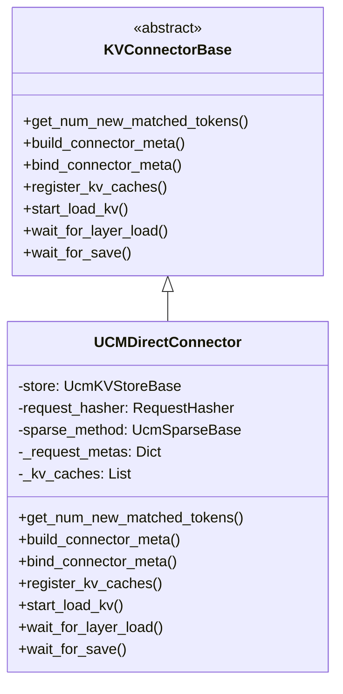
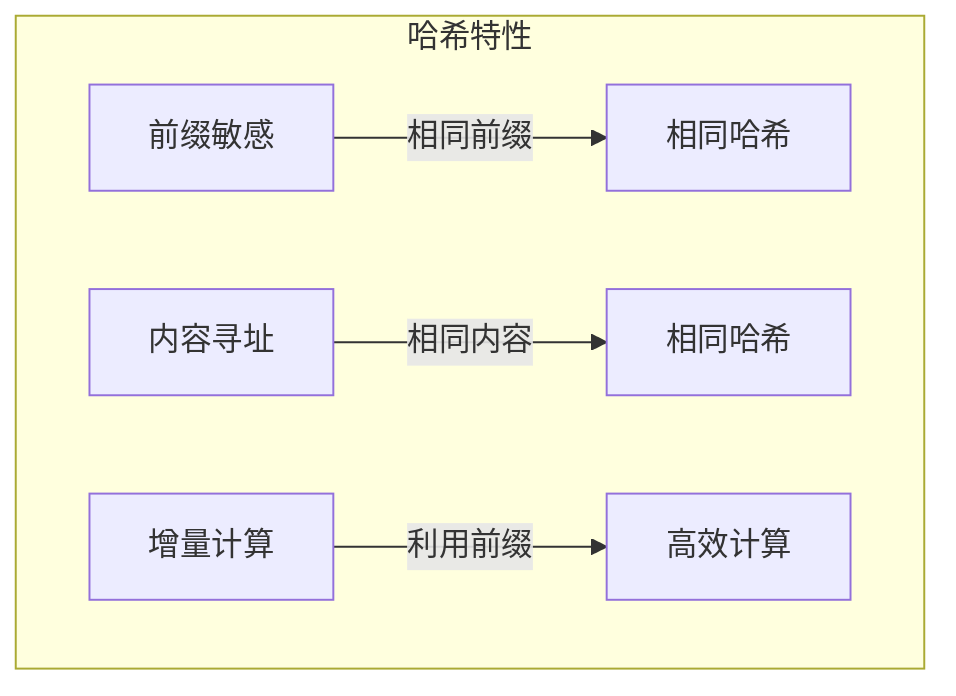
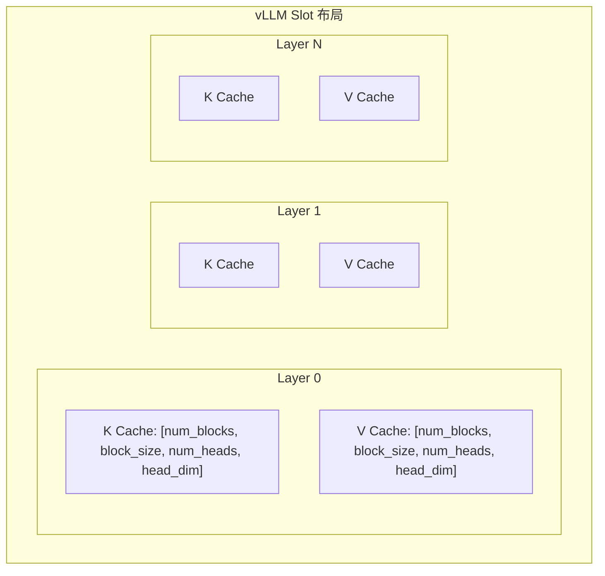
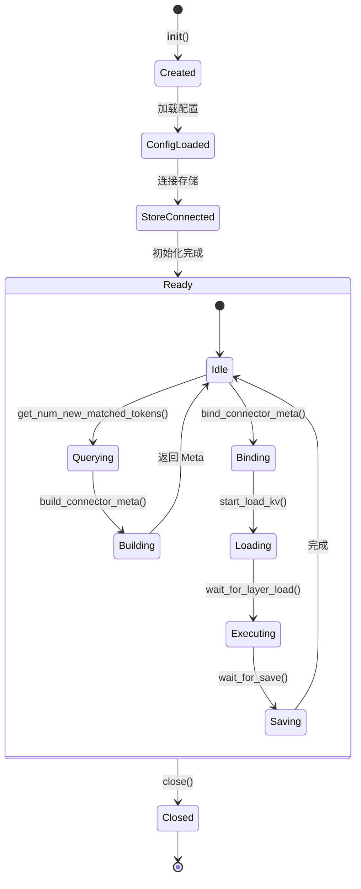

> **阅读时间**: 约 15 分钟
> **前置要求**: [KVConnector 接口](./01-connector-interface.md)

---

## 概述

UCMDirectConnector 是 UCM 的主要 vLLM Connector 实现，提供完整的 KV Cache 持久化和复用功能。

---

## 1. 类结构

### 1.1 继承关系


### 1.2 核心组件
**代码位置**: `ucm/integration/vllm/ucm_connector.py:85`
```python
class UCMDirectConnector(KVConnectorBase):
    """UCM 直接连接器"""
    def __init__(
        self,
        rank: int,
        local_rank: int,
        config: KVTransferConfig
    ):
        super().__init__(rank, local_rank, config)
        # 解析配置
        extra_config = config.kv_connector_extra_config
        ucm_config_file = extra_config.get("UCM_CONFIG_FILE")
        # 加载 UCM 配置
        self.ucm_config = self._load_config(ucm_config_file)

        # 初始化存储后端
        self.store = UcmConnectorFactory.create_connector(
            self.ucm_config,
            local_rank
        )

        # 初始化请求哈希器
        self.request_hasher = RequestHasher(self.ucm_config)
        # 初始化稀疏方法（可选）
        self.sparse_method = self._init_sparse_method()

        # 请求元数据存储
        self._request_metas: Dict[str, RequestMeta] = {}
        # KV Cache 引用（Worker 侧）
        self._kv_caches: List[torch.Tensor] = []

        # 加载任务追踪
        self._load_tasks: Dict[str, LoadTask] = {}
```

---

## 2. 请求哈希

### 2.1 RequestHasher

**代码位置**: `ucm/integration/vllm/ucm_connector.py:50`

```python
class RequestHasher:
    """请求哈希生成器"""

    def __init__(self, config: dict):
        self.block_size = config.get('block_size', 16)
        self.hash_method = config.get('hash_method', 'md5')

    def generate_block_hashes(
        self,
        token_ids: List[int],
        block_size: Optional[int] = None
    ) -> List[bytes]:
        """生成 Block 哈希列表
        Args:
            token_ids: Token ID 序列
            block_size: Block 大小
        Returns:
            Block 哈希列表（MD5）
        """
        if block_size is None:
            block_size = self.block_size
        hashes = []
        prefix = b""

        for i in range(0, len(token_ids), block_size):
            block_tokens = token_ids[i:i + block_size]
            # 构建前缀哈希（包含之前所有内容）
            block_bytes = self._tokens_to_bytes(block_tokens)
            content = prefix + block_bytes
            # 计算 MD5
            hash_value = hashlib.md5(content).digest()
            hashes.append(hash_value)
            # 更新前缀
            prefix = content

        return hashes

    def _tokens_to_bytes(self, tokens: List[int]) -> bytes:
        """将 Token 列表转换为字节"""
        return b''.join(t.to_bytes(4, 'little') for t in tokens)
```
### 2.2 哈希特性


---

## 3. Scheduler 侧实现

### 3.1 查询匹配 Token

**代码位置**: `ucm/integration/vllm/ucm_connector.py:150`

```python
def get_num_new_matched_tokens(self, request: Request) -> int:
    """获取匹配的 Token 数量"""
    # 获取请求的 Token IDs
    token_ids = request.prompt_token_ids

    # 生成 Block 哈希
    block_hashes = self.request_hasher.generate_block_hashes(token_ids)
    # 查询存储后端
    hit_results = self.store.lookup(block_hashes)

    # 计算连续命中的 Token 数
    matched_tokens = 0
    for i, is_hit in enumerate(hit_results):
        if is_hit:
            # 计算该 Block 覆盖的 Token 数
            block_start = i * self.request_hasher.block_size
            block_end = min(
                (i + 1) * self.request_hasher.block_size,
                len(token_ids)
            )
            matched_tokens = block_end
        else:
            # 非连续命中时停止
            break
    # 保存状态供后续使用
    self._cache_request_state(request.request_id, block_hashes, hit_results)

    return matched_tokens
```
### 3.2 构建元数据
**代码位置**: `ucm/integration/vllm/ucm_connector.py:200`
```python
def build_connector_meta(
    self,
    scheduler_output: SchedulerOutput
) -> UCMConnectorMeta:
    """构建 Connector 元数据"""
    meta = UCMConnectorMeta()
    for req in scheduler_output.scheduled_requests:
        request_id = req.request_id

        # 获取缓存的状态
        cached_state = self._get_cached_state(request_id)
        # 计算需要加载和保存的 Blocks
        load_blocks, dump_blocks = self._compute_block_operations(
            cached_state,
            req.num_computed_tokens,
            req.num_scheduled_tokens
        )

        # 映射到 vLLM slot
        load_vllm_slots = self._map_to_vllm_slots(req, load_blocks)
        dump_vllm_slots = self._map_to_vllm_slots(req, dump_blocks)

        # 创建请求元数据
        request_meta = UCMConnectorMeta.RequestMeta(
            request_id=request_id,
            load_block_ids=[cached_state.block_hashes[i] for i in load_blocks],
            load_vllm_slots=load_vllm_slots,
            dump_block_ids=[cached_state.block_hashes[i] for i in dump_blocks],
            dump_vllm_slots=dump_vllm_slots,
            matched_tokens=cached_state.matched_tokens
        )

        meta.request_metas[request_id] = request_meta

    return meta

def _compute_block_operations(
    self,
    state: CachedState,
    computed_tokens: int,
    scheduled_tokens: int
) -> Tuple[List[int], List[int]]:
    """计算需要加载和保存的 Block 索引"""
    block_size = self.request_hasher.block_size
    # 需要加载的：命中且尚未计算的 Blocks
    load_blocks = []
    for i, is_hit in enumerate(state.hit_results):
        block_start = i * block_size
        if is_hit and block_start >= computed_tokens:
            load_blocks.append(i)

    # 需要保存的：新计算的 Blocks
    dump_blocks = []
    computed_end = computed_tokens + scheduled_tokens
    for i in range(len(state.block_hashes)):
        block_start = i * block_size
        block_end = (i + 1) * block_size
        if not state.hit_results[i] and block_end <= computed_end:
            dump_blocks.append(i)
    return load_blocks, dump_blocks
```

---

## 4. Worker 侧实现

### 4.1 绑定元数据

```python
def bind_connector_meta(self, connector_meta: UCMConnectorMeta):
    """绑定 Connector 元数据（Worker 侧）"""
    self._connector_meta = connector_meta
    # 更新本地请求状态
    for request_id, req_meta in connector_meta.request_metas.items():
        self._request_metas[request_id] = req_meta
```

### 4.2 注册 KV Cache

```python
def register_kv_caches(self, kv_caches: List[torch.Tensor]):
    """注册 KV Cache（Worker 侧）"""
    self._kv_caches = kv_caches
    # 注册到存储后端（用于直接访问）
    self.store.register_kv_tensors(kv_caches)

    # 注册到稀疏方法（如果启用）
    if self.sparse_method:
        self.sparse_method.register_kv_caches(kv_caches)
```
### 4.3 加载 KV
**代码位置**: `ucm/integration/vllm/ucm_connector.py:250`
```python
def start_load_kv(self, request_ids: List[str]):
    """开始加载 KV Cache"""
    for request_id in request_ids:
        req_meta = self._request_metas.get(request_id)
        if req_meta is None or not req_meta.load_block_ids:
            continue
        # 计算加载参数
        block_ids = req_meta.load_block_ids
        vllm_slots = req_meta.load_vllm_slots
        # 计算目标张量的偏移和大小
        for layer_idx, kv_cache in enumerate(self._kv_caches):
            # 计算该层的偏移
            layer_offset = self._compute_layer_offset(layer_idx, vllm_slots)

            # 提交异步加载任务
            task = self.store.load(
                block_ids=block_ids,
                offset=layer_offset,
                dst_tensor=kv_cache
            )
            # 保存任务引用
            if request_id not in self._load_tasks:
                self._load_tasks[request_id] = {}
            self._load_tasks[request_id][layer_idx] = task

def wait_for_layer_load(self, layer_idx: int):
    """等待指定层的 KV 加载完成"""
    for request_id, layer_tasks in self._load_tasks.items():
        task = layer_tasks.get(layer_idx)
        if task:
            self.store.wait(task)
```

### 4.4 保存 KV

**代码位置**: `ucm/integration/vllm/ucm_connector.py:280`

```python
def wait_for_save(self, request_ids: List[str]):
    """保存 KV Cache 并等待完成"""
    dump_tasks = []
    for request_id in request_ids:
        req_meta = self._request_metas.get(request_id)
        if req_meta is None or not req_meta.dump_block_ids:
            continue

        block_ids = req_meta.dump_block_ids
        vllm_slots = req_meta.dump_vllm_slots
        # 为每层提交保存任务
        for layer_idx, kv_cache in enumerate(self._kv_caches):
            layer_offset = self._compute_layer_offset(layer_idx, vllm_slots)
            task = self.store.dump(
                block_ids=block_ids,
                offset=layer_offset,
                src_tensor=kv_cache
            )
            dump_tasks.append(task)

    # 等待所有保存完成
    for task in dump_tasks:
        self.store.wait(task)

    # 提交 Blocks
    for request_id in request_ids:
        req_meta = self._request_metas.get(request_id)
        if req_meta and req_meta.dump_block_ids:
            success_flags = [True] * len(req_meta.dump_block_ids)
            self.store.commit(req_meta.dump_block_ids, success_flags)
```

---

## 5. vLLM Slot 映射

### 5.1 Slot 布局



### 5.2 映射逻辑

```python
def _map_to_vllm_slots(
    self,
    request: Request,
    block_indices: List[int]
) -> List[int]:
    """将 UCM Block 索引映射到 vLLM slot"""
    vllm_block_table = request.block_table
    slots = []

    for block_idx in block_indices:
        if block_idx < len(vllm_block_table):
            vllm_block_id = vllm_block_table[block_idx]
            # 计算 slot 范围
            slot_start = vllm_block_id * self.block_size
            slots.extend(range(slot_start, slot_start + self.block_size))
    return slots
def _compute_layer_offset(
    self,
    layer_idx: int,
    vllm_slots: List[int]
) -> int:
    """计算层偏移（字节）"""
    # KV Cache 布局：[num_layers, 2, num_blocks, block_size, num_heads, head_dim]
    bytes_per_element = 2  # float16
    head_dim = self.ucm_config.get('head_dim', 128)
    num_heads = self.ucm_config.get('num_kv_heads', 32)

    slot_size = num_heads * head_dim * bytes_per_element
    layer_size = len(vllm_slots) * slot_size * 2  # K + V
    return layer_idx * layer_size + min(vllm_slots) * slot_size
```

---

## 6. 生命周期

### 6.1 状态管理



### 6.2 清理

```python
def close(self):
    """关闭 Connector"""
    # 等待所有待处理任务
    for request_id, layer_tasks in self._load_tasks.items():
        for task in layer_tasks.values():
            try:
                self.store.wait(task)
            except Exception:
                pass
    # 关闭存储连接
    if self.store:
        self.store.close()
    # 清理稀疏方法
    if self.sparse_method:
        self.sparse_method.close()
    # 清理状态
    self._request_metas.clear()
    self._load_tasks.clear()
```

---

## 7. 配置示例

### 7.1 完整配置

```yaml
# ucm_config.yaml
ucm_connectors:
  - ucm_connector_name: "UcmPipelineStore"
    ucm_connector_config:
      store_pipeline: "Cache|Posix"
      storage_backends: "/data/ucm_cache"
      buffer_number: 2048
      block_size: 16
      shard_size: 2048
      tensor_size: 65536

ucm_sparse_method: "GSA"
ucm_sparse_config:
  GSA:
    sparse_ratio: 0.3
    prefetch_workers: 4
```
### 7.2 vLLM 集成
```python
from vllm import LLM
from vllm.config import KVTransferConfig
ktc = KVTransferConfig(
    kv_connector="UCMConnector",
    kv_connector_module_path="ucm.integration.vllm.ucm_connector",
    kv_role="kv_both",
    kv_connector_extra_config={
        "UCM_CONFIG_FILE": "./ucm_config.yaml"
    }
)

llm = LLM(
    model="meta-llama/Llama-2-7b-hf",
    kv_transfer_config=ktc,
    tensor_parallel_size=1
)
```