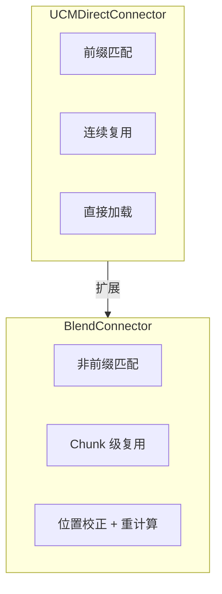
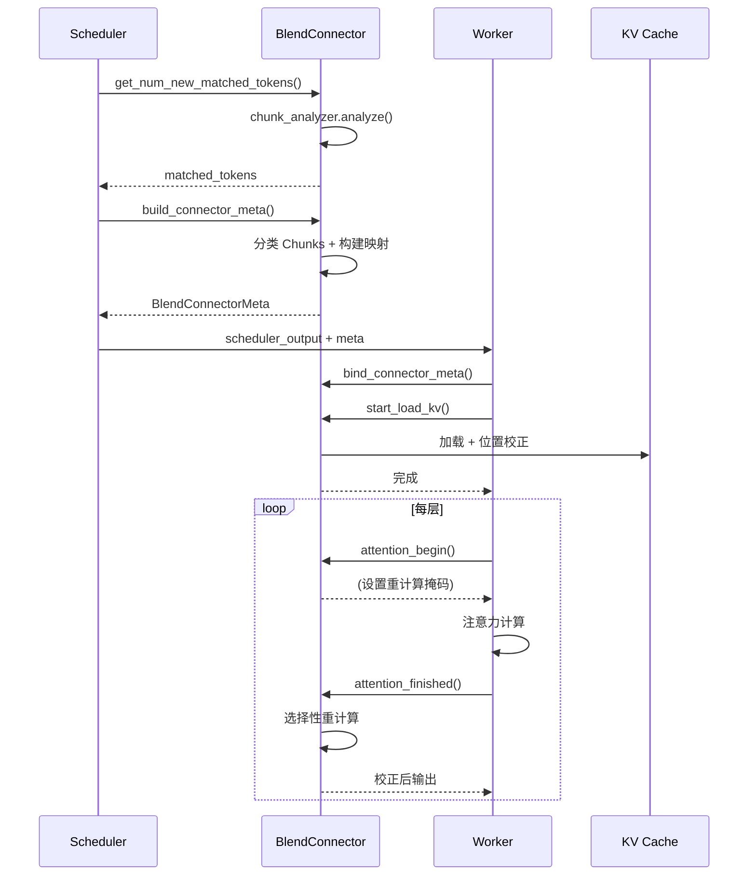

> **阅读时间**: 约 12 分钟
> **前置要求**: [UCMDirectConnector](./02-ucm-connector.md)、[Blend 算法](../03-sparse-attention/07-blend-algorithm.md)

---

## 概述

BlendConnector 是专门用于 Cache Blend 算法的 Connector，支持非前缀 KV 复用场景。

---

## 1. 设计目标

### 1.1 与 UCMDirectConnector 的区别


### 1.2 适用场景
| 场景 | UCMDirectConnector | BlendConnector |
|------|-------------------|----------------|
| 系统提示复用 | 适合 | 适合 |
| 多轮对话历史 | 部分支持 | 完全支持 |
| 文档片段复用 | 不支持 | 支持 |
| 代码模式复用 | 不支持 | 支持 |

---

## 2. 类结构

**代码位置**: `ucm/integration/vllm/blend_connector.py:40`

```python
class BlendConnector(KVConnectorBase):
    """Cache Blend 专用 Connector"""

    def __init__(
        self,
        rank: int,
        local_rank: int,
        config: KVTransferConfig
    ):
        super().__init__(rank, local_rank, config)

        extra_config = config.kv_connector_extra_config

        # 初始化存储后端
        self.store = UcmConnectorFactory.create_connector(
            extra_config,
            local_rank
        )

        # Chunk 分析器
        self.chunk_analyzer = ChunkAnalyzer(
            chunk_size=extra_config.get('blend_chunk_size', 64),
            min_match_ratio=extra_config.get('min_match_ratio', 0.8)
        )

        # Blend 引擎
        self.blend = Blend(
            UcmSparseRole.BOTH,
            extra_config
        )

        # 请求状态
        self._request_chunks: Dict[str, List[Chunk]] = {}
        self._request_metas: Dict[str, BlendRequestMeta] = {}

        # Worker 侧组件
        self._kv_caches: List[torch.Tensor] = []
        self._position_corrector = PositionCorrector(extra_config)
```
---
## 3. Scheduler 侧流程

### 3.1 Chunk 分析与匹配

```python
def get_num_new_matched_tokens(self, request: Request) -> int:
    """分析 Chunks 并计算匹配 Token 数"""
    token_ids = request.prompt_token_ids

    # 分析 Chunks
    chunks = self.chunk_analyzer.analyze(
        token_ids,
        self._get_cached_blocks()
    )

    # 保存分析结果
    self._request_chunks[request.request_id] = chunks

    # 统计匹配的 Token 数
    matched_tokens = 0
    for chunk in chunks:
        if chunk.chunk_type in [ChunkType.FULL_MATCH, ChunkType.PARTIAL_MATCH]:
            matched_tokens += chunk.end_idx - chunk.start_idx

    return matched_tokens
```

### 3.2 构建元数据

```python
def build_connector_meta(
    self,
    scheduler_output: SchedulerOutput
) -> BlendConnectorMeta:
    """构建 Blend Connector 元数据"""
    meta = BlendConnectorMeta()

    for req in scheduler_output.scheduled_requests:
        request_id = req.request_id
        chunks = self._request_chunks.get(request_id, [])

        # 分类 Chunks
        full_match_chunks = []
        partial_match_chunks = []
        no_match_chunks = []

        for chunk in chunks:
            if chunk.chunk_type == ChunkType.FULL_MATCH:
                full_match_chunks.append(chunk)
            elif chunk.chunk_type == ChunkType.PARTIAL_MATCH:
                partial_match_chunks.append(chunk)
            else:
                no_match_chunks.append(chunk)

        # 构建请求元数据
        request_meta = BlendRequestMeta(
            request_id=request_id,
            full_match_chunks=full_match_chunks,
            partial_match_chunks=partial_match_chunks,
            no_match_chunks=no_match_chunks,
            position_mapping=self._build_position_mapping(chunks),
            recompute_ranges=self._compute_recompute_ranges(partial_match_chunks)
        )

        meta.request_metas[request_id] = request_meta

    return meta

def _build_position_mapping(
    self,
    chunks: List[Chunk]
) -> Dict[int, int]:
    """构建位置映射（原始位置 -> 校正后位置）"""
    mapping = {}

    for chunk in chunks:
        if chunk.source_position is not None:
            # 计算位置偏移
            offset = chunk.start_idx - chunk.source_position
            for i in range(chunk.start_idx, chunk.end_idx):
                original_pos = chunk.source_position + (i - chunk.start_idx)
                mapping[i] = original_pos

    return mapping

def _compute_recompute_ranges(
    self,
    partial_chunks: List[Chunk]
) -> List[Tuple[int, int]]:
    """计算需要重计算的范围"""
    ranges = []

    for chunk in partial_chunks:
        # 边界需要重计算
        boundary_size = 2  # 可配置

        # Chunk 起始边界
        start = chunk.start_idx
        end = min(chunk.start_idx + boundary_size, chunk.end_idx)
        ranges.append((start, end))

        # Chunk 结束边界
        start = max(chunk.end_idx - boundary_size, chunk.start_idx)
        end = chunk.end_idx
        if start < end:
            ranges.append((start, end))

    return self._merge_ranges(ranges)
```

---
## 4. Worker 侧流程
### 4.1 绑定与加载
```python
def bind_connector_meta(self, meta: BlendConnectorMeta):
    """绑定元数据"""
    self._connector_meta = meta
    self._request_metas = meta.request_metas
def start_load_kv(self, request_ids: List[str]):
    """开始加载 KV（考虑位置校正）"""
    for request_id in request_ids:
        req_meta = self._request_metas.get(request_id)
        if req_meta is None:
            continue

        # 加载完全匹配的 Chunks
        for chunk in req_meta.full_match_chunks:
            self._load_chunk(request_id, chunk, need_correction=True)

        # 加载部分匹配的 Chunks
        for chunk in req_meta.partial_match_chunks:
            self._load_chunk(request_id, chunk, need_correction=True)

def _load_chunk(
    self,
    request_id: str,
    chunk: Chunk,
    need_correction: bool
):
    """加载单个 Chunk"""
    if chunk.source_block_id is None:
        return

    # 从存储加载
    kv_data = self.store.load_sync(
        block_ids=[chunk.source_block_id],
        offset=chunk.source_position
    )

    if need_correction and chunk.source_position != chunk.start_idx:
        # 应用位置校正
        kv_data = self._position_corrector.correct_kv(
            kv_data,
            source_positions=torch.arange(
                chunk.source_position,
                chunk.source_position + (chunk.end_idx - chunk.start_idx)
            ),
            target_positions=torch.arange(chunk.start_idx, chunk.end_idx)
        )
    # 写入 KV Cache
    self._write_to_kv_cache(request_id, chunk.start_idx, kv_data)
```
### 4.2 注意力钩子
```python
def attention_begin(
    self,
    layer_idx: int,
    query: torch.Tensor,
    key: torch.Tensor,
    value: torch.Tensor,
    metadata: AttentionMetadata
) -> Tuple[torch.Tensor, ...]:
    """注意力前处理 - 应用 Blend 逻辑"""
    # 获取当前请求的元数据
    request_id = metadata.request_id
    req_meta = self._request_metas.get(request_id)
    if req_meta is None:
        return query, key, value

    # 构建重计算掩码
    recompute_mask = self._build_recompute_mask(
        req_meta.recompute_ranges,
        metadata.seq_len
    )

    # 保存供后续使用
    self._current_recompute_mask = recompute_mask
    self._current_position_mapping = req_meta.position_mapping

    return query, key, value

def attention_finished(
    self,
    layer_idx: int,
    output: torch.Tensor
) -> torch.Tensor:
    """注意力后处理 - 选择性重计算"""
    if self._current_recompute_mask is None:
        return output
    # 对需要重计算的位置执行完整注意力
    if self._current_recompute_mask.any():
        output = self.blend.recompute_engine.recompute_attention(
            query=self._current_query,
            key=self._kv_caches[layer_idx][0],
            value=self._kv_caches[layer_idx][1],
            recompute_mask=self._current_recompute_mask,
            original_output=output
        )
    # 清理状态
    self._current_recompute_mask = None
    self._current_position_mapping = None
    return output
```

---

## 5. 元数据结构

### 5.1 BlendConnectorMeta

```python
@dataclass
class BlendConnectorMeta:
    """Blend Connector 元数据"""
    request_metas: Dict[str, 'BlendRequestMeta'] = field(default_factory=dict)

@dataclass
class BlendRequestMeta:
    """Blend 请求元数据"""
    request_id: str

    # Chunk 分类
    full_match_chunks: List[Chunk]      # 完全匹配
    partial_match_chunks: List[Chunk]   # 部分匹配
    no_match_chunks: List[Chunk]        # 无匹配
    # 位置映射
    position_mapping: Dict[int, int]    # 当前位置 -> 源位置

    # 重计算范围
    recompute_ranges: List[Tuple[int, int]]
```

### 5.2 数据流



---

## 6. 配置参数

### 6.1 参数说明

| 参数 | 默认值 | 说明 |
|------|--------|------|
| `blend_chunk_size` | 64 | Chunk 大小 |
| `min_match_ratio` | 0.8 | 最小匹配率 |
| `position_correction` | true | 启用位置校正 |
| `recompute_boundary` | 2 | 边界重计算范围 |
### 6.2 配置示例
```yaml
kv_connector: "BlendConnector"
kv_connector_module_path: "ucm.integration.vllm.blend_connector"
kv_connector_extra_config:
  # 存储配置
  store_pipeline: "Cache|Posix"
  storage_backends: "/data/ucm_cache"
  # Blend 配置
  blend_chunk_size: 64
  min_match_ratio: 0.8
  position_correction: true
  recompute_boundary: 2
  # RoPE 配置
  rope_theta: 10000.0
  head_dim: 128
```

---

## 7. 使用示例

```python
from vllm import LLM
from vllm.config import KVTransferConfig

ktc = KVTransferConfig(
    kv_connector="BlendConnector",
    kv_connector_module_path="ucm.integration.vllm.blend_connector",
    kv_role="kv_both",
    kv_connector_extra_config={
        "store_pipeline": "Cache|Posix",
        "storage_backends": "/data/ucm_cache",
        "blend_chunk_size": 64,
        "min_match_ratio": 0.8
    }
)

llm = LLM(
    model="meta-llama/Llama-2-7b-hf",
    kv_transfer_config=ktc
)
# 多轮对话（Blend 自动处理非前缀复用）
conversation = [
    "User: What is machine learning?",
    "Assistant: Machine learning is...",
    "User: Can you give an example?",  # Blend 复用第一轮的上下文
]

for turn in conversation:
    output = llm.generate([turn])
```

---

## 8. 性能考量

### 8.1 开销分析

| 操作 | 开销 | 频率 |
|------|------|------|
| Chunk 分析 | O(N × M) | 每请求一次 |
| 位置校正 | O(K × D) | 每层一次 |
| 选择性重计算 | O(R × L × D) | 每层一次 |

### 8.2 何时使用

| 条件 | 推荐 |
|------|------|
| 纯前缀复用 | UCMDirectConnector |
| 多轮对话 | BlendConnector |
| 文档 QA | BlendConnector |
| 低延迟要求 | UCMDirectConnector |