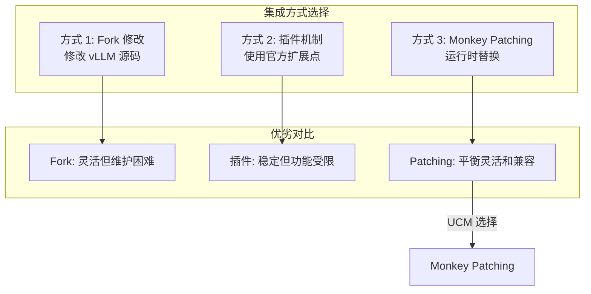
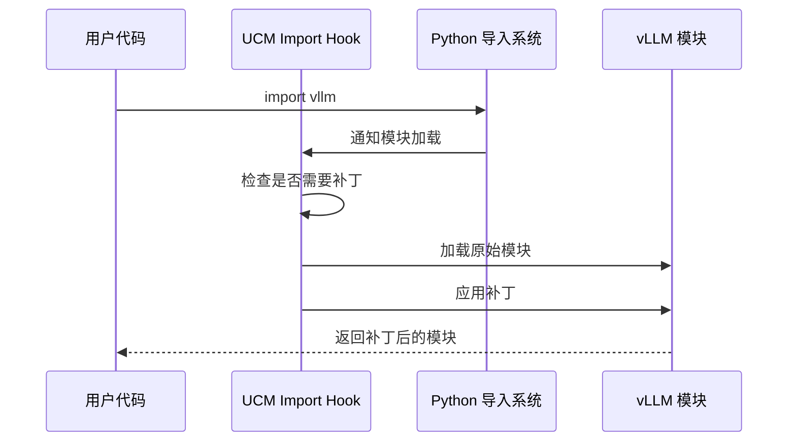
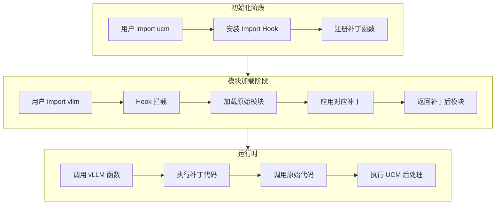

> **阅读时间**: 约 15 分钟
> **前置要求**: [vLLM 架构概览](../00-prerequisites/03-vllm-architecture.md)

---

## 概述

UCM 通过 Monkey Patching 实现与 vLLM 的非侵入式集成。本文详细讲解这一机制的原理和实现。

---

## 1. 为什么选择 Monkey Patching

### 1.1 集成方式对比


### 1.2 优势分析
| 优势 | 说明 |
|------|------|
| **非侵入式** | 不需要修改 vLLM 源码 |
| **易于升级** | vLLM 升级时只需调整补丁 |
| **灵活性高** | 可以修改任意代码路径 |
| **可选择性** | 可以按需启用/禁用补丁 |

---

## 2. Import Hook 机制

### 2.1 工作原理

UCM 使用 Python 的 Import Hook 机制，在模块加载时注入补丁：


### 2.2 代码实现
**代码位置**: `ucm/integration/vllm/patch/apply_patch.py`
```python
import sys
from importlib.abc import MetaPathFinder, Loader
from importlib.machinery import ModuleSpec

class UCMPatchFinder(MetaPathFinder):
    """UCM 的 Import Hook Finder"""
    # 需要补丁的模块列表
    PATCH_MODULES = {
        'vllm.attention': 'patch_attention',
        'vllm.core.scheduler': 'patch_scheduler',
        'vllm.worker.model_runner': 'patch_model_runner',
    }

    def find_spec(self, fullname, path, target=None):
        if fullname in self.PATCH_MODULES:
            return ModuleSpec(
                fullname,
                UCMPatchLoader(self.PATCH_MODULES[fullname]),
                origin=fullname
            )
        return None

class UCMPatchLoader(Loader):
    """UCM 的 Import Hook Loader"""
    def __init__(self, patch_func_name):
        self.patch_func_name = patch_func_name

    def create_module(self, spec):
        return None  # 使用默认创建
    def exec_module(self, module):
        # 先执行原始模块
        original_loader = self._find_original_loader(module.__name__)
        original_loader.exec_module(module)

        # 然后应用补丁
        patch_func = getattr(patch_funcs, self.patch_func_name)
        patch_func(module)

def install_import_hook():
    """安装 Import Hook"""
    sys.meta_path.insert(0, UCMPatchFinder())
```

---

## 3. 补丁应用流程

### 3.1 完整流程



### 3.2 补丁注册

```python
# ucm/integration/vllm/patch/apply_patch.py
def apply_all_patches():
    """应用所有补丁"""
    from . import patch_funcs
    patches = [
        ('vllm.attention', patch_funcs.patch_attention),
        ('vllm.core.scheduler', patch_funcs.patch_scheduler),
        ('vllm.worker.model_runner', patch_funcs.patch_model_runner),
        ('vllm.v1.core.sched.output', patch_funcs.patch_scheduler_output),
    ]

    for module_name, patch_func in patches:
        try:
            module = sys.modules.get(module_name)
            if module:
                patch_func(module)
                logger.info(f"Patched: {module_name}")
        except Exception as e:
            logger.error(f"Failed to patch {module_name}: {e}")
```

---

## 4. 典型补丁示例

### 4.1 函数替换补丁

```python
# 补丁模式 1: 完全替换函数
def patch_attention(module):
    """补丁注意力层"""
    original_forward = module.Attention.forward

    def patched_forward(self, query, key, value, ...):
        # UCM 前置处理
        sparse = get_sparse_method()
        if sparse:
            query, key, value = sparse.attention_begin(
                layer_idx, query, key, value
            )

        # 调用原始函数
        output = original_forward(self, query, key, value, ...)
        # UCM 后置处理
        if sparse:
            output = sparse.attention_finished(output)
        return output
    module.Attention.forward = patched_forward
```

### 4.2 包装器补丁

```python
# 补丁模式 2: 包装器模式
def patch_scheduler(module):
    """补丁调度器"""
    OriginalScheduler = module.Scheduler

    class PatchedScheduler(OriginalScheduler):
        def __init__(self, *args, **kwargs):
            super().__init__(*args, **kwargs)
            # UCM 初始化
            self.ucm_connector = create_ucm_connector()

        def schedule(self):
            # 调用 UCM 查询 KV 命中
            for request in self.waiting:
                matched = self.ucm_connector.get_num_new_matched_tokens(
                    request
                )
                request.ucm_matched_tokens = matched

            # 调用原始调度
            output = super().schedule()
            # 附加 UCM 元数据
            self.ucm_connector.build_connector_meta(output)

            return output

    module.Scheduler = PatchedScheduler
```
### 4.3 属性注入补丁
```python
def patch_scheduler_output(module):
    """补丁调度器输出结构"""
    OriginalOutput = module.SchedulerOutput

    # 动态添加属性
    OriginalOutput.ucm_connector_meta = None
    OriginalOutput.ucm_sparse_meta = None

    # 修改序列化方法
    original_to_dict = OriginalOutput.to_dict
    def patched_to_dict(self):
        result = original_to_dict(self)
        result['ucm_connector_meta'] = self.ucm_connector_meta
        result['ucm_sparse_meta'] = self.ucm_sparse_meta
        return result
    OriginalOutput.to_dict = patched_to_dict
```

---

## 5. vLLM v0.9.2 补丁详解

### 5.1 补丁文件结构

```
ucm/integration/vllm/patch/
├── apply_patch.py              # 补丁入口
├── __init__.py
└── patch_funcs/
    └── v092/                   # vLLM v0.9.2 专用补丁
        ├── __init__.py
        ├── vllm_patch.py       # 核心 vLLM 补丁
        ├── vllm_ascend_patch.py # Ascend 平台补丁
        └── vllm_rerope_patch.py # RERoPE 补丁
```

### 5.2 核心补丁点

**代码位置**: `ucm/integration/vllm/patch/patch_funcs/v092/vllm_patch.py`

```python
def apply_v092_patches():
    """应用 vLLM v0.9.2 的所有补丁"""

    # 1. 补丁调度器输出
    _patch_scheduler_output()
    # 2. 补丁注意力层
    _patch_attention_layer()

    # 3. 补丁 KV Cache 管理器
    _patch_kv_cache_manager()
    # 4. 补丁模型执行器
    _patch_model_runner()

def _patch_attention_layer():
    """补丁注意力计算层"""
    from vllm.attention import Attention
    original_forward = Attention.forward
    @functools.wraps(original_forward)
    def patched_forward(self, *args, **kwargs):
        # 获取当前稀疏方法
        sparse = get_current_sparse_method()

        if sparse:
            # 前置钩子
            args = sparse.attention_begin(
                self.layer_idx, *args, **kwargs
            )

        # 执行原始注意力
        output = original_forward(self, *args, **kwargs)
        if sparse:
            # 后置钩子
            output = sparse.attention_finished(
                self.layer_idx, output
            )
        return output
    Attention.forward = patched_forward
```

---

## 6. 版本兼容性管理

### 6.1 版本检测

```python
def get_vllm_version():
    """获取 vLLM 版本"""
    import vllm
    return vllm.__version__

def select_patch_module():
    """根据版本选择补丁模块"""
    version = get_vllm_version()
    if version.startswith('0.9.2'):
        from .v092 import vllm_patch
        return vllm_patch
    elif version.startswith('0.9.1'):
        from .v091 import vllm_patch
        return vllm_patch
    else:
        raise RuntimeError(f"Unsupported vLLM version: {version}")
```
### 6.2 补丁兼容性矩阵
| vLLM 版本 | UCM 补丁版本 | 状态 |
|-----------|-------------|------|
| v0.9.2 | v092 | 完全支持 |
| v0.9.1 | v091 | 部分支持 |
| v0.9.0 | v090 | 实验性 |
| < v0.9.0 | - | 不支持 |

---

## 7. 调试补丁

### 7.1 检查补丁是否生效

```python
def verify_patches():
    """验证补丁是否正确应用"""
    import vllm.attention
    # 检查函数是否被补丁
    forward = vllm.attention.Attention.forward
    if hasattr(forward, '__wrapped__'):
        print("Attention.forward: PATCHED")
    else:
        print("Attention.forward: NOT PATCHED")

    # 检查类是否被补丁
    from vllm.core.scheduler import Scheduler
    if hasattr(Scheduler, 'ucm_connector'):
        print("Scheduler: PATCHED")
    else:
        print("Scheduler: NOT PATCHED")
```

### 7.2 禁用补丁（调试用）

```bash
# 环境变量禁用所有补丁
export UCM_DISABLE_PATCHES=1

export UCM_DISABLE_ATTENTION_PATCH=1
export UCM_DISABLE_SCHEDULER_PATCH=1
```

### 7.3 补丁日志

```bash
# 启用补丁详细日志
export UCM_PATCH_VERBOSE=1
```
---
## 8. 注意事项

### 8.1 补丁顺序

补丁的应用顺序很重要：

```python
1. 安装 Import Hook
2. import vllm (触发补丁)
3. 使用补丁后的模块

1. import vllm (未补丁)
2. 安装 Import Hook (太晚)
3. 模块未被补丁
```

### 8.2 多线程安全

```python
import threading

_patch_lock = threading.Lock()
_patches_applied = False

def ensure_patches():
    """确保补丁只应用一次"""
    global _patches_applied
    with _patch_lock:
        if not _patches_applied:
            apply_all_patches()
            _patches_applied = True
```

### 8.3 清理补丁

```python
def remove_patches():
    """移除补丁（恢复原始行为）"""
    # 保存原始函数引用
    original_functions = {}

    def patch_with_restore(module, attr, new_func):
        original = getattr(module, attr)
        original_functions[(module, attr)] = original
        setattr(module, attr, new_func)

    # 恢复时
    for (module, attr), original in original_functions.items():
        setattr(module, attr, original)
```
