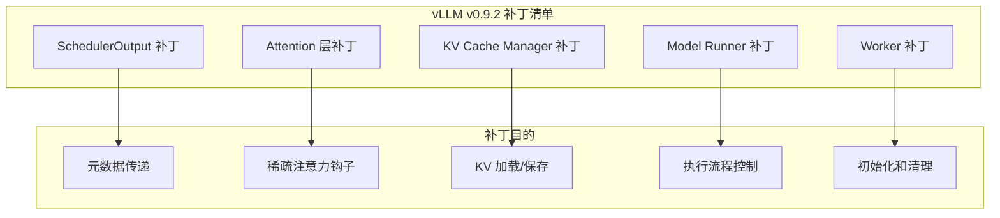
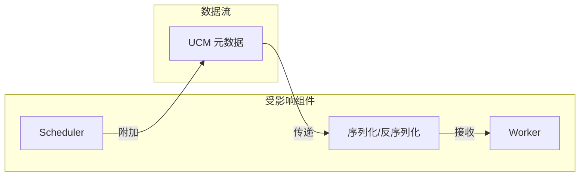
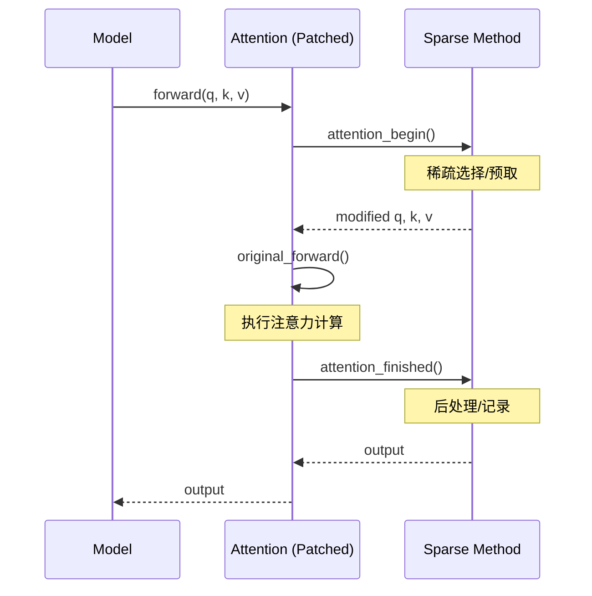
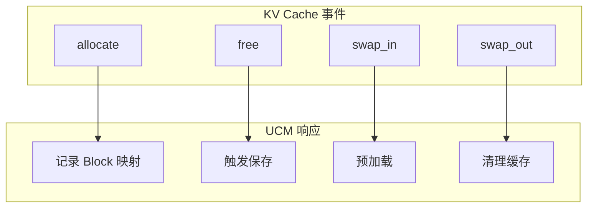
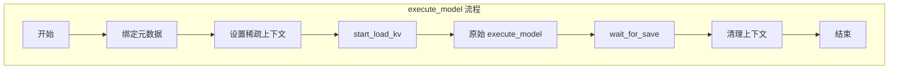

> **阅读时间**: 约 15 分钟
> **前置要求**: [Monkey Patching 机制](./04-monkey-patching.md)

---

## 概述

本文详细分析 UCM 对 vLLM v0.9.2 的各个补丁点，包括补丁目的、实现细节和影响范围。

---

## 1. 补丁概览

### 1.1 补丁文件结构

```
ucm/integration/vllm/patch/
├── apply_patch.py              # 补丁入口
├── __init__.py
└── patch_funcs/
    └── v092/                   # vLLM v0.9.2 专用补丁
        ├── __init__.py
        ├── vllm_patch.py       # 核心 vLLM 补丁
        ├── vllm_ascend_patch.py # Ascend 平台补丁
        └── vllm_rerope_patch.py # RERoPE 补丁
```

### 1.2 补丁清单


---
## 2. SchedulerOutput 补丁

### 2.1 补丁目的

将 UCM 元数据附加到调度器输出，以便传递给 Worker。

### 2.2 实现

**代码位置**: `ucm/integration/vllm/patch/patch_funcs/v092/vllm_patch.py:60`

```python
def _patch_scheduler_output():
    """补丁 SchedulerOutput 类"""
    from vllm.v1.core.sched.output import SchedulerOutput

    # 添加 UCM 属性
    SchedulerOutput.ucm_connector_meta = None
    SchedulerOutput.ucm_sparse_meta = None

    # 保存原始 __init__
    original_init = SchedulerOutput.__init__

    def patched_init(self, *args, **kwargs):
        original_init(self, *args, **kwargs)
        self.ucm_connector_meta = None
        self.ucm_sparse_meta = None

    SchedulerOutput.__init__ = patched_init

    # 补丁序列化方法
    if hasattr(SchedulerOutput, 'to_dict'):
        original_to_dict = SchedulerOutput.to_dict

        def patched_to_dict(self):
            result = original_to_dict(self)
            result['ucm_connector_meta'] = self.ucm_connector_meta
            result['ucm_sparse_meta'] = self.ucm_sparse_meta
            return result

        SchedulerOutput.to_dict = patched_to_dict

    # 补丁反序列化方法
    if hasattr(SchedulerOutput, 'from_dict'):
        original_from_dict = SchedulerOutput.from_dict

        @classmethod
        def patched_from_dict(cls, data):
            obj = original_from_dict(data)
            obj.ucm_connector_meta = data.get('ucm_connector_meta')
            obj.ucm_sparse_meta = data.get('ucm_sparse_meta')
            return obj

        SchedulerOutput.from_dict = patched_from_dict

    logger.info("Patched: SchedulerOutput")
```

### 2.3 影响范围



---
## 3. Attention 层补丁
### 3.1 补丁目的
在注意力计算前后插入 UCM 稀疏注意力钩子。
### 3.2 实现
**代码位置**: `ucm/integration/vllm/patch/patch_funcs/v092/vllm_patch.py:138`
```python
def _patch_attention_layer():
    """补丁 Attention 层"""
    from vllm.attention import Attention

    original_forward = Attention.forward

    @functools.wraps(original_forward)
    def patched_forward(
        self,
        query: torch.Tensor,
        key: torch.Tensor,
        value: torch.Tensor,
        kv_cache: torch.Tensor,
        attn_metadata: AttentionMetadata,
        **kwargs
    ) -> torch.Tensor:
        """补丁后的 forward 方法"""

        # 获取当前稀疏方法
        sparse_method = get_current_sparse_method()
        if sparse_method is not None:
            # 前置钩子
            query, key, value = sparse_method.attention_begin(
                layer_idx=self.layer_idx,
                query=query,
                key=key,
                value=value,
                attn_metadata=attn_metadata
            )
        # 调用原始 forward
        output = original_forward(
            self,
            query=query,
            key=key,
            value=value,
            kv_cache=kv_cache,
            attn_metadata=attn_metadata,
            **kwargs
        )

        if sparse_method is not None:
            # 后置钩子
            output = sparse_method.attention_finished(
                layer_idx=self.layer_idx,
                output=output
            )
        return output
    Attention.forward = patched_forward
    logger.info("Patched: Attention.forward")

def get_current_sparse_method():
    """获取当前线程的稀疏方法"""
    from ucm.sparse.context import get_sparse_context
    ctx = get_sparse_context()
    return ctx.sparse_method if ctx else None
```

### 3.3 数据流



---

## 4. KV Cache Manager 补丁

### 4.1 补丁目的

在 KV Cache 分配和释放时通知 UCM。

### 4.2 实现

**代码位置**: `ucm/integration/vllm/patch/patch_funcs/v092/vllm_patch.py:100`

```python
def _patch_kv_cache_manager():
    """补丁 KV Cache Manager"""
    from vllm.core.block_manager import BlockSpaceManager
    # 补丁 allocate
    original_allocate = BlockSpaceManager.allocate

    def patched_allocate(self, seq_group):
        """补丁后的 allocate 方法"""
        result = original_allocate(self, seq_group)

        # 通知 UCM
        connector = get_current_connector()
        if connector:
            connector.on_blocks_allocated(
                request_id=seq_group.request_id,
                block_ids=result.block_ids
            )

        return result

    BlockSpaceManager.allocate = patched_allocate

    # 补丁 free
    original_free = BlockSpaceManager.free
    def patched_free(self, seq):
        """补丁后的 free 方法"""
        # 通知 UCM（在释放前）
        connector = get_current_connector()
        if connector:
            connector.on_blocks_freeing(
                request_id=seq.request_id,
                block_ids=seq.block_ids
            )
        return original_free(self, seq)
    BlockSpaceManager.free = patched_free
    logger.info("Patched: BlockSpaceManager")

def get_current_connector():
    """获取当前连接器"""
    from ucm.integration.vllm.context import get_connector_context
    ctx = get_connector_context()
    return ctx.connector if ctx else None
```

### 4.3 事件通知



---

## 5. Model Runner 补丁

### 5.1 补丁目的

在模型执行前后进行 UCM 初始化和清理。

### 5.2 实现

```python
def _patch_model_runner():
    """补丁 Model Runner"""
    from vllm.worker.model_runner import ModelRunner
    # 补丁 execute_model
    original_execute = ModelRunner.execute_model

    def patched_execute_model(self, scheduler_output, **kwargs):
        """补丁后的 execute_model 方法"""
        # 绑定 UCM 元数据
        connector = get_current_connector()
        if connector and scheduler_output.ucm_connector_meta:
            connector.bind_connector_meta(scheduler_output.ucm_connector_meta)

        # 设置稀疏上下文
        sparse_method = get_sparse_method_for_output(scheduler_output)
        if sparse_method:
            set_sparse_context(sparse_method)
        try:
            # 开始加载 KV
            if connector:
                request_ids = [
                    req.request_id
                    for req in scheduler_output.scheduled_requests
                ]
                connector.start_load_kv(request_ids)

            # 执行模型
            result = original_execute(self, scheduler_output, **kwargs)
            # 等待保存完成
            if connector:
                connector.wait_for_save(request_ids)
            return result
        finally:
            # 清理上下文
            clear_sparse_context()
    ModelRunner.execute_model = patched_execute_model
    logger.info("Patched: ModelRunner.execute_model")
```
### 5.3 执行流程

---
## 6. Worker 补丁

### 6.1 补丁目的

在 Worker 初始化时注册 KV Cache。

### 6.2 实现

```python
def _patch_worker():
    """补丁 Worker"""
    from vllm.worker.worker import Worker

    # 补丁初始化
    original_init_model = Worker.init_model

    def patched_init_model(self):
        """补丁后的 init_model 方法"""
        # 调用原始初始化
        original_init_model(self)

        # 注册 KV Cache 到 UCM
        connector = get_current_connector()
        if connector and hasattr(self, 'model_runner'):
            kv_caches = self.model_runner.kv_caches
            connector.register_kv_caches(kv_caches)

    Worker.init_model = patched_init_model
    logger.info("Patched: Worker.init_model")
```

---
## 7. 平台特定补丁
### 7.1 Ascend 补丁
**代码位置**: `ucm/integration/vllm/patch/patch_funcs/v092/vllm_ascend_patch.py`
```python
def apply_ascend_patches():
    """应用 Ascend 平台补丁"""
    if not is_ascend_platform():
        return
    # 补丁 Ascend 特定的 Attention 实现
    from vllm.attention.backends.ascend import AscendAttention

    original_forward = AscendAttention.forward

    def patched_forward(self, *args, **kwargs):
        # Ascend 特定的前置处理
        sparse_method = get_current_sparse_method()
        if sparse_method:
            args = sparse_method.ascend_attention_begin(*args)

        output = original_forward(self, *args, **kwargs)

        if sparse_method:
            output = sparse_method.ascend_attention_finished(output)
        return output
    AscendAttention.forward = patched_forward
    logger.info("Patched: AscendAttention (Ascend platform)")
```
### 7.2 RERoPE 补丁
**代码位置**: `ucm/integration/vllm/patch/patch_funcs/v092/vllm_rerope_patch.py`
```python
def apply_rerope_patches():
    """应用 RERoPE 补丁"""
    from vllm.model_executor.layers.rotary_embedding import RotaryEmbedding

    original_forward = RotaryEmbedding.forward

    def patched_forward(self, positions, query, key):
        """补丁后的 forward 方法"""
        rerope = get_current_rerope()

        if rerope is not None:
            # 使用 RERoPE 位置编码
            cos, sin = rerope.get_rotary_embedding(positions)
            query = apply_rotary_pos_emb(query, cos, sin)
            key = apply_rotary_pos_emb(key, cos, sin)
            return query, key
        else:
            return original_forward(self, positions, query, key)
    RotaryEmbedding.forward = patched_forward
    logger.info("Patched: RotaryEmbedding (RERoPE)")
```
---
## 8. 补丁验证

### 8.1 验证脚本

```python
def verify_all_patches():
    """验证所有补丁是否正确应用"""
    results = {}

    # 1. SchedulerOutput
    try:
        from vllm.v1.core.sched.output import SchedulerOutput
        results['SchedulerOutput'] = hasattr(SchedulerOutput, 'ucm_connector_meta')
    except ImportError:
        results['SchedulerOutput'] = 'Import Error'

    # 2. Attention
    try:
        from vllm.attention import Attention
        forward = Attention.forward
        results['Attention'] = hasattr(forward, '__wrapped__')
    except ImportError:
        results['Attention'] = 'Import Error'

    # 3. BlockSpaceManager
    try:
        from vllm.core.block_manager import BlockSpaceManager
        allocate = BlockSpaceManager.allocate
        results['BlockSpaceManager'] = 'patched' in str(allocate)
    except ImportError:
        results['BlockSpaceManager'] = 'Import Error'

    # 4. ModelRunner
    try:
        from vllm.worker.model_runner import ModelRunner
        execute = ModelRunner.execute_model
        results['ModelRunner'] = 'patched' in str(execute)
    except ImportError:
        results['ModelRunner'] = 'Import Error'

    return results
```

### 8.2 验证输出

```
=== UCM Patch Verification ===

SchedulerOutput:    PATCHED ✓
Attention:          PATCHED ✓
BlockSpaceManager:  PATCHED ✓
ModelRunner:        PATCHED ✓

All patches applied successfully!
```

---
## 9. 补丁兼容性
### 9.1 版本矩阵
| vLLM 版本 | 补丁状态 | 说明 |
|-----------|---------|------|
| v0.9.2 | 完全支持 | 当前主要版本 |
| v0.9.1 | 部分支持 | 需要调整 |
| v0.9.0 | 实验性 | 可能有问题 |
| < v0.9.0 | 不支持 | 接口不兼容 |

### 9.2 升级指南

当 vLLM 升级时：

1. 检查被补丁类/方法的签名变化
2. 更新补丁实现以匹配新签名
3. 运行验证脚本确认补丁生效
4. 执行完整测试套件