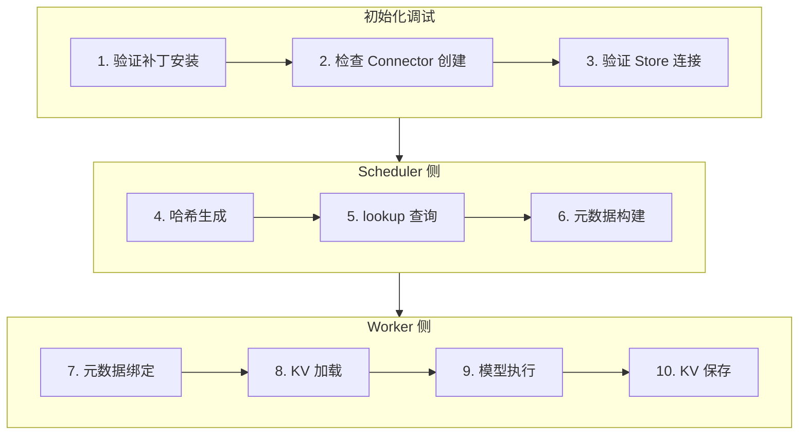

> **阅读时间**: 约 15 分钟
> **适用人群**: 需要调试 vLLM 集成问题的开发者

---

## 概述

本文提供 vLLM 集成层的调试入口点、验证方法和问题排查技巧。

---

## 1. 调试入口点

### 1.1 核心入口点列表

```
vLLM 集成调试入口
=================

1. 补丁系统
   ├── ucm/integration/vllm/patch/apply_patch.py:84
   │   apply_all_patches()
   └── ucm/integration/vllm/patch/apply_patch.py:20
       install_import_hook()

2. UCM Connector
   ├── ucm/integration/vllm/ucm_connector.py:85
   │   UCMDirectConnector.__init__()
   ├── ucm/integration/vllm/ucm_connector.py:150
   │   UCMDirectConnector.get_num_new_matched_tokens()
   ├── ucm/integration/vllm/ucm_connector.py:200
   │   UCMDirectConnector.start_load_kv()
   └── ucm/integration/vllm/ucm_connector.py:280
       UCMDirectConnector.wait_for_save()

3. Blend Connector
   └── ucm/integration/vllm/blend_connector.py:40
       BlendConnector.__init__()

4. 请求哈希
   └── ucm/integration/vllm/ucm_connector.py:50
       RequestHasher.generate_block_hashes()

5. vLLM 补丁点
   ├── ucm/integration/vllm/patch/patch_funcs/v092/vllm_patch.py:60
   │   _patch_scheduler_output()
   ├── ucm/integration/vllm/patch/patch_funcs/v092/vllm_patch.py:100
   │   _patch_kv_cache_manager()
   └── ucm/integration/vllm/patch/patch_funcs/v092/vllm_patch.py:138
       _patch_attention_layer()
```
### 1.2 调试流程

---
## 2. 验证补丁生效

### 2.1 快速验证脚本

```python
#!/usr/bin/env python
"""验证 UCM 补丁是否正确应用"""

def verify_ucm_patches():
    print("=== UCM Patch Verification ===\n")

    # 1. 检查 Import Hook
    import sys
    hook_installed = any(
        'UCMPatchFinder' in str(type(finder))
        for finder in sys.meta_path
    )
    print(f"1. Import Hook: {'INSTALLED' if hook_installed else 'NOT FOUND'}")

    # 2. 检查核心补丁
    try:
        from vllm.v1.core.sched.output import SchedulerOutput
        has_ucm_meta = hasattr(SchedulerOutput, 'ucm_connector_meta')
        print(f"2. SchedulerOutput patch: {'APPLIED' if has_ucm_meta else 'MISSING'}")
    except ImportError as e:
        print(f"2. SchedulerOutput patch: ERROR - {e}")

    # 3. 检查 Attention 补丁
    try:
        from vllm.attention import Attention
        forward = Attention.forward
        is_patched = hasattr(forward, '__wrapped__') or 'patched' in str(forward)
        print(f"3. Attention patch: {'APPLIED' if is_patched else 'UNKNOWN'}")
    except ImportError as e:
        print(f"3. Attention patch: ERROR - {e}")

    # 4. 检查 UCM Connector 可用
    try:
        from ucm.integration.vllm.ucm_connector import UCMDirectConnector
        print(f"4. UCMDirectConnector: AVAILABLE")
    except ImportError as e:
        print(f"4. UCMDirectConnector: ERROR - {e}")

    print("\n=== Verification Complete ===")


if __name__ == "__main__":
    # 先导入 UCM 触发补丁安装
    import ucm

    verify_ucm_patches()
```

### 2.2 运行验证

```bash
python verify_patches.py
```

预期输出:
```
=== UCM Patch Verification ===

1. Import Hook: INSTALLED
2. SchedulerOutput patch: APPLIED
3. Attention patch: APPLIED
4. UCMDirectConnector: AVAILABLE

=== Verification Complete ===
```

---
## 3. 调试 Connector
### 3.1 检查 Connector 初始化
```python
from vllm.config import KVTransferConfig

ktc = KVTransferConfig(
    kv_connector="UCMConnector",
    kv_connector_module_path="ucm.integration.vllm.ucm_connector",
    kv_role="kv_both",
    kv_connector_extra_config={
        "UCM_CONFIG_FILE": "./ucm_config.yaml"
    }
)
# 手动创建 Connector 进行调试
from ucm.integration.vllm.ucm_connector import UCMDirectConnector

connector = UCMDirectConnector(
    rank=0,
    local_rank=0,
    config=ktc,
)

print(f"Connector type: {type(connector)}")
print(f"Store: {connector.store}")
print(f"Hasher: {connector.request_hasher}")
```
### 3.2 调试 lookup 流程
```python
import torch

class MockRequest:
    def __init__(self, request_id, prompt_token_ids):
        self.request_id = request_id
        self.prompt_token_ids = prompt_token_ids
request = MockRequest(
    request_id="test_001",
    prompt_token_ids=[1, 2, 3, 4, 5, 6, 7, 8, 9, 10] * 10
)

matched = connector.get_num_new_matched_tokens(request)
print(f"Matched tokens: {matched}")
print(f"Total tokens: {len(request.prompt_token_ids)}")
print(f"Hit rate: {matched / len(request.prompt_token_ids) * 100:.1f}%")
```

### 3.3 调试加载/保存

```python
# 准备测试数据
kv_tensor = torch.zeros(
    (32 * 2, 16, 32, 128),  # layers*2, block_size, heads, head_dim
    dtype=torch.float16,
    device='cuda'
)

class MockMeta:
    def __init__(self):
        self.load_block_ids = ([b"hash1", b"hash2"], [0, 1])
        self.dump_block_ids = ([b"hash3", b"hash4"], [2, 3])
connector._request_metas["test_001"] = MockMeta()
# 测试加载
connector.start_load_kv(["test_001"])
print("Load started")
# 测试保存
connector.wait_for_save(["test_001"])
print("Save completed")
```

---

## 4. 常见问题排查

### 4.1 问题: Connector 未被识别

**症状**:
```
ValueError: Unknown kv_connector: UCMConnector
```
**排查步骤**:
```python
# 1. 检查模块路径
import importlib
try:
    module = importlib.import_module("ucm.integration.vllm.ucm_connector")
    print("Module found")
    print(f"Classes: {dir(module)}")
except ImportError as e:
    print(f"Import error: {e}")

from ucm.integration.vllm.ucm_connector import UCMConnector
print(f"UCMConnector available: {UCMConnector is not None}")
# 3. 确认配置
print(f"kv_connector: {ktc.kv_connector}")
print(f"module_path: {ktc.kv_connector_module_path}")
```

### 4.2 问题: 补丁未生效

**症状**:
- UCM 功能不工作
- 日志中没有 UCM 相关输出

**排查步骤**:
```python
import sys
print("Import order check:")
print(f"  'ucm' in modules: {'ucm' in sys.modules}")
print(f"  'vllm' in modules: {'vllm' in sys.modules}")
# 正确顺序: ucm 在 vllm 之前

# 2. 手动应用补丁
from ucm.integration.vllm.patch.apply_patch import apply_all_patches
apply_all_patches()
# 3. 强制重新加载
import importlib
importlib.reload(sys.modules['vllm.attention'])
```

### 4.3 问题: KV 命中率为 0

**症状**:
- lookup 总是返回空
- 所有请求都完整计算

**排查步骤**:
```python
print(f"Store: {connector.store}")
print(f"Store type: {type(connector.store)}")
# 2. 检查存储路径
import os
storage_path = connector.store.storage_path
print(f"Storage path: {storage_path}")
print(f"Path exists: {os.path.exists(storage_path)}")
print(f"Files: {os.listdir(storage_path) if os.path.exists(storage_path) else 'N/A'}")

test_ids = connector.request_hasher.generate_block_hashes([1, 2, 3, 4], 4)
results = connector.store.lookup(test_ids)
print(f"Lookup results: {results}")

test_tensor = torch.zeros(1000, dtype=torch.float16, device='cuda')
task = connector.store.dump(test_ids[:1], 0, test_tensor)
connector.store.wait(task)
connector.store.commit(test_ids[:1], [True])
results = connector.store.lookup(test_ids[:1])
print(f"After dump lookup: {results}")
```
### 4.4 问题: 数据传输失败
**症状**:
- load/dump 超时
- CUDA 错误
**排查步骤**:
```python
# 1. 检查 CUDA 状态
import torch
print(f"CUDA available: {torch.cuda.is_available()}")
print(f"Current device: {torch.cuda.current_device()}")
print(f"Device name: {torch.cuda.get_device_name()}")
# 2. 检查张量设备
print(f"Tensor device: {kv_tensor.device}")
print(f"Tensor dtype: {kv_tensor.dtype}")
# 3. 测试小数据传输
small_tensor = torch.zeros(100, dtype=torch.float16, device='cuda')
task = connector.store.dump([b"test"], 0, small_tensor)
status = connector.store.wait(task)
print(f"Small dump status: {status}")
# 4. 检查错误日志
import logging
logging.basicConfig(level=logging.DEBUG)
```

---

## 5. 性能分析

### 5.1 测量 Connector 开销

```python
import time
# 测量 lookup 时间
start = time.time()
for _ in range(100):
    connector.get_num_new_matched_tokens(request)
lookup_time = (time.time() - start) / 100
print(f"Average lookup: {lookup_time * 1000:.2f}ms")

start = time.time()
for _ in range(10):
    connector.start_load_kv(["test_001"])
load_time = (time.time() - start) / 10
print(f"Average load: {load_time * 1000:.2f}ms")
```
### 5.2 使用 Profiler
```python
import torch

with torch.profiler.profile(
    activities=[
        torch.profiler.ProfilerActivity.CPU,
        torch.profiler.ProfilerActivity.CUDA,
    ],
    record_shapes=True
) as prof:
    connector.start_load_kv(["test_001"])
    connector.wait_for_save(["test_001"])

print(prof.key_averages().table(sort_by="cuda_time_total", row_limit=10))
```
---
## 6. 调试清单

### 6.1 初始化检查

- [ ] UCM 模块正确导入
- [ ] Import Hook 已安装
- [ ] 补丁已应用
- [ ] Connector 已创建
- [ ] Store 已连接

### 6.2 运行时检查

- [ ] Block 哈希生成一致
- [ ] lookup 返回正确结果
- [ ] 数据传输正常
- [ ] 元数据正确传递

### 6.3 性能检查

- [ ] lookup 延迟 < 10ms
- [ ] load/dump 速度正常
- [ ] 命中率符合预期
- [ ] 无内存泄漏

---
## 7. 快速参考
### 7.1 环境变量
```bash
UNIFIED_CACHE_LOG_LEVEL=DEBUG

UCM_DISABLE_PATCHES=1

UCM_PATCH_VERBOSE=1
```
### 7.2 关键日志标记
```
[UCM.Connector]   # Connector 日志
[UCM.Patch]       # 补丁日志
[UCM.Hasher]      # 哈希生成日志
[UCM.Load]        # 加载日志
[UCM.Save]        # 保存日志
```