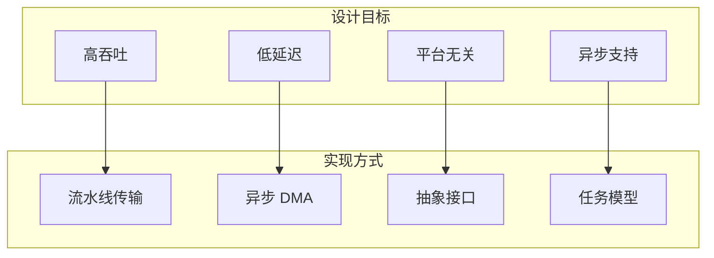
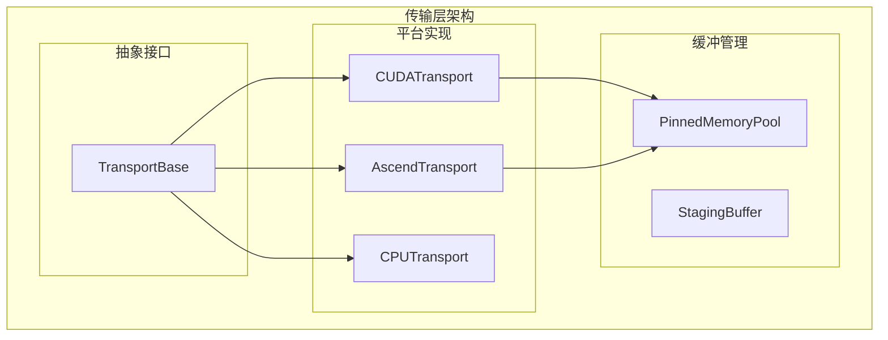
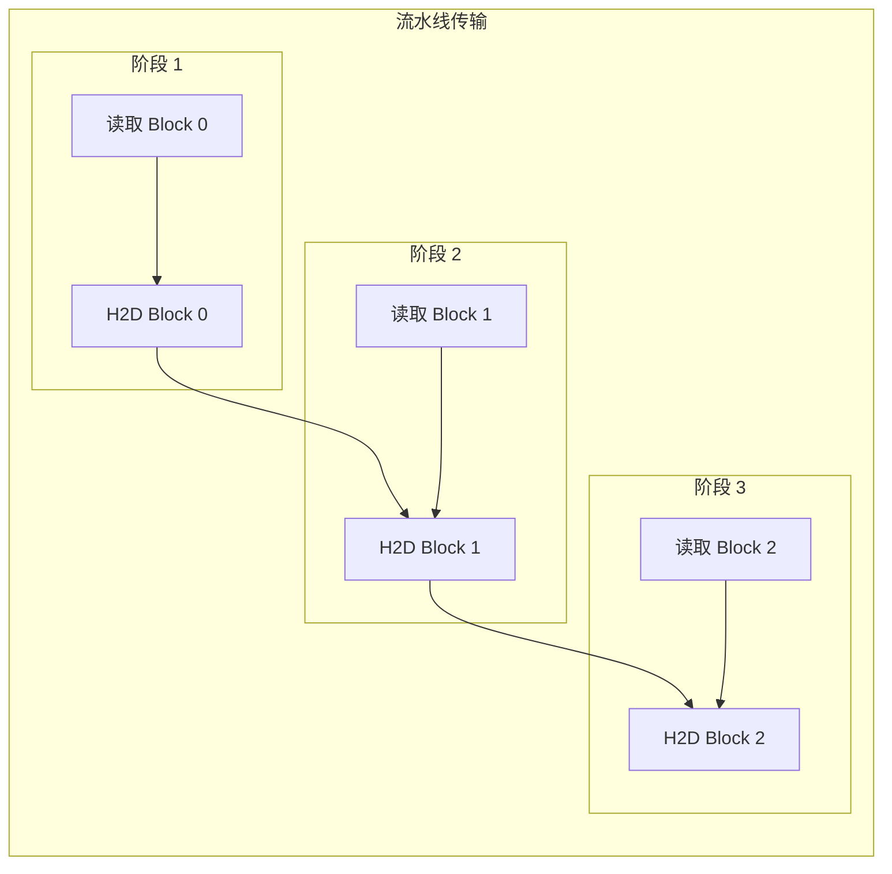
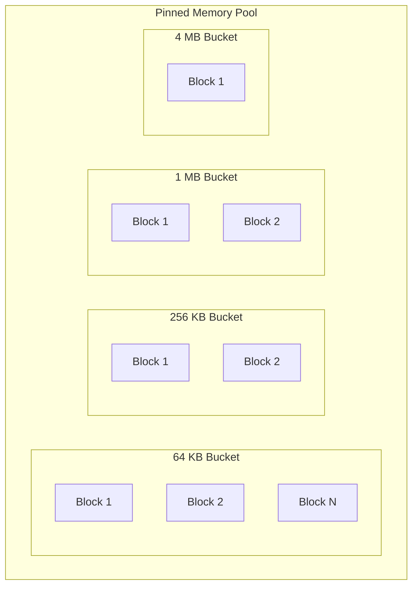
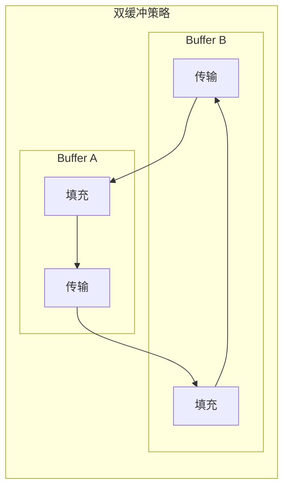

> **阅读时间**: 约 12 分钟
> **前置要求**: [内存层级](../00-prerequisites/04-memory-hierarchy.md)

---

## 概述

本文介绍 UCM 的设备传输层设计，包括 CUDA 传输、Ascend NPU 传输和 Pinned Memory 管理。

---

## 1. 传输层架构

### 1.1 设计目标



### 1.2 层次结构


---
## 2. 抽象接口

### 2.1 TransportBase

**代码位置**: `ucm/shared/trans/base.py`

```python
from abc import ABC, abstractmethod
from typing import Optional
import torch

class TransportBase(ABC):
    """传输层抽象基类"""

    @abstractmethod
    def h2d(
        self,
        src: torch.Tensor,
        dst: torch.Tensor,
        stream: Optional[Any] = None
    ) -> "TransferTask":
        """Host to Device 传输

        Args:
            src: 源张量（CPU/Pinned Memory）
            dst: 目标张量（Device Memory）
            stream: 可选的执行流

        Returns:
            传输任务句柄
        """
        pass

    @abstractmethod
    def d2h(
        self,
        src: torch.Tensor,
        dst: torch.Tensor,
        stream: Optional[Any] = None
    ) -> "TransferTask":
        """Device to Host 传输

        Args:
            src: 源张量（Device Memory）
            dst: 目标张量（CPU/Pinned Memory）
            stream: 可选的执行流

        Returns:
            传输任务句柄
        """
        pass

    @abstractmethod
    def d2d(
        self,
        src: torch.Tensor,
        dst: torch.Tensor,
        stream: Optional[Any] = None
    ) -> "TransferTask":
        """Device to Device 传输

        Args:
            src: 源张量
            dst: 目标张量
            stream: 可选的执行流

        Returns:
            传输任务句柄
        """
        pass

    @abstractmethod
    def synchronize(self, task: "TransferTask"):
        """等待传输完成"""
        pass

    @abstractmethod
    def get_pinned_buffer(self, size: int) -> torch.Tensor:
        """获取 Pinned Memory 缓冲区"""
        pass

    @abstractmethod
    def release_pinned_buffer(self, buffer: torch.Tensor):
        """释放 Pinned Memory 缓冲区"""
        pass
```

### 2.2 TransferTask

```python
@dataclass
class TransferTask:
    """传输任务"""
    task_id: str
    src_ptr: int
    dst_ptr: int
    size: int
    stream: Any
    event: Any
    status: TransferStatus = TransferStatus.PENDING

    def wait(self):
        """等待完成"""
        if self.event:
            self.event.synchronize()
        self.status = TransferStatus.COMPLETED

    def is_completed(self) -> bool:
        """检查是否完成"""
        if self.event:
            return self.event.query()
        return self.status == TransferStatus.COMPLETED
```

---
## 3. CUDA 传输实现
### 3.1 CUDATransport
**代码位置**: `ucm/shared/trans/cuda_transport.py`
```python
import torch
import torch.cuda as cuda
class CUDATransport(TransportBase):
    """CUDA 传输实现"""

    def __init__(self, device_id: int = 0):
        self.device_id = device_id
        self.device = torch.device(f'cuda:{device_id}')

        # 创建传输流
        self.h2d_stream = cuda.Stream(device=self.device)
        self.d2h_stream = cuda.Stream(device=self.device)

        # Pinned Memory 池
        self.pinned_pool = PinnedMemoryPool(
            device_id=device_id,
            initial_size=1024 * 1024 * 1024  # 1 GB
        )

    def h2d(
        self,
        src: torch.Tensor,
        dst: torch.Tensor,
        stream: Optional[cuda.Stream] = None
    ) -> TransferTask:
        """Host to Device"""
        stream = stream or self.h2d_stream
        with cuda.stream(stream):
            # 异步复制
            dst.copy_(src, non_blocking=True)
            # 创建事件
            event = cuda.Event()
            event.record(stream)
        return TransferTask(
            task_id=f"h2d_{id(dst)}",
            src_ptr=src.data_ptr(),
            dst_ptr=dst.data_ptr(),
            size=src.numel() * src.element_size(),
            stream=stream,
            event=event
        )

    def d2h(
        self,
        src: torch.Tensor,
        dst: torch.Tensor,
        stream: Optional[cuda.Stream] = None
    ) -> TransferTask:
        """Device to Host"""
        stream = stream or self.d2h_stream
        with cuda.stream(stream):
            dst.copy_(src, non_blocking=True)
            event = cuda.Event()
            event.record(stream)

        return TransferTask(
            task_id=f"d2h_{id(src)}",
            src_ptr=src.data_ptr(),
            dst_ptr=dst.data_ptr(),
            size=src.numel() * src.element_size(),
            stream=stream,
            event=event
        )
    def d2d(
        self,
        src: torch.Tensor,
        dst: torch.Tensor,
        stream: Optional[cuda.Stream] = None
    ) -> TransferTask:
        """Device to Device"""
        stream = stream or cuda.current_stream()

        with cuda.stream(stream):
            dst.copy_(src, non_blocking=True)
            event = cuda.Event()
            event.record(stream)
        return TransferTask(
            task_id=f"d2d_{id(src)}_{id(dst)}",
            src_ptr=src.data_ptr(),
            dst_ptr=dst.data_ptr(),
            size=src.numel() * src.element_size(),
            stream=stream,
            event=event
        )

    def synchronize(self, task: TransferTask):
        """同步等待"""
        task.wait()

    def get_pinned_buffer(self, size: int) -> torch.Tensor:
        """获取 Pinned 缓冲区"""
        return self.pinned_pool.allocate(size)

    def release_pinned_buffer(self, buffer: torch.Tensor):
        """释放 Pinned 缓冲区"""
        self.pinned_pool.free(buffer)
```
### 3.2 流水线传输

---
## 4. Pinned Memory 管理

### 4.1 PinnedMemoryPool

**代码位置**: `ucm/shared/trans/pinned_pool.py`

```python
class PinnedMemoryPool:
    """Pinned Memory 池"""

    def __init__(
        self,
        device_id: int,
        initial_size: int = 1024 * 1024 * 1024,
        max_size: int = 4 * 1024 * 1024 * 1024
    ):
        self.device_id = device_id
        self.max_size = max_size

        # 空闲块列表（按大小分桶）
        self.free_lists: Dict[int, List[torch.Tensor]] = defaultdict(list)

        # 已分配块
        self.allocated: Dict[int, torch.Tensor] = {}

        # 统计
        self.total_allocated = 0
        self.peak_allocated = 0

        # 锁
        self._lock = threading.Lock()

        # 预分配
        self._preallocate(initial_size)

    def _preallocate(self, size: int):
        """预分配 Pinned Memory"""
        block_sizes = [
            64 * 1024,      # 64 KB
            256 * 1024,     # 256 KB
            1024 * 1024,    # 1 MB
            4 * 1024 * 1024 # 4 MB
        ]

        for block_size in block_sizes:
            num_blocks = size // (4 * block_size)
            for _ in range(num_blocks):
                buffer = torch.empty(
                    block_size,
                    dtype=torch.uint8,
                    pin_memory=True
                )
                self.free_lists[block_size].append(buffer)

    def allocate(self, size: int) -> torch.Tensor:
        """分配 Pinned Buffer"""
        # 向上取整到最近的桶大小
        bucket_size = self._get_bucket_size(size)

        with self._lock:
            # 尝试从空闲列表获取
            if self.free_lists[bucket_size]:
                buffer = self.free_lists[bucket_size].pop()
            else:
                # 分配新的
                if self.total_allocated + bucket_size > self.max_size:
                    raise MemoryError("Pinned memory pool exhausted")

                buffer = torch.empty(
                    bucket_size,
                    dtype=torch.uint8,
                    pin_memory=True
                )
                self.total_allocated += bucket_size

            self.allocated[buffer.data_ptr()] = buffer
            self.peak_allocated = max(self.peak_allocated, len(self.allocated))

        # 返回视图（大小匹配请求）
        return buffer[:size]

    def free(self, buffer: torch.Tensor):
        """释放 Pinned Buffer"""
        ptr = buffer.data_ptr()

        with self._lock:
            if ptr in self.allocated:
                full_buffer = self.allocated.pop(ptr)
                bucket_size = full_buffer.numel()
                self.free_lists[bucket_size].append(full_buffer)

    def _get_bucket_size(self, size: int) -> int:
        """获取桶大小"""
        bucket_sizes = [
            64 * 1024,
            256 * 1024,
            1024 * 1024,
            4 * 1024 * 1024,
            16 * 1024 * 1024,
            64 * 1024 * 1024
        ]

        for bucket in bucket_sizes:
            if size <= bucket:
                return bucket

        # 向上取整到 64 MB 的倍数
        return ((size + 64 * 1024 * 1024 - 1) // (64 * 1024 * 1024)) * (64 * 1024 * 1024)

    def get_stats(self) -> Dict:
        """获取统计信息"""
        with self._lock:
            total_free = sum(
                len(blocks) * size
                for size, blocks in self.free_lists.items()
            )

            return {
                'total_allocated': self.total_allocated,
                'currently_used': len(self.allocated),
                'total_free': total_free,
                'peak_allocated': self.peak_allocated
            }
```

### 4.2 内存布局



---
## 5. Ascend NPU 传输
### 5.1 AscendTransport
**代码位置**: `ucm/shared/trans/ascend_transport.py`
```python
class AscendTransport(TransportBase):
    """Ascend NPU 传输实现"""
    def __init__(self, device_id: int = 0):
        self.device_id = device_id

        # Ascend 特定初始化
        import torch_npu
        self.device = torch.device(f'npu:{device_id}')

        # 创建流
        self.h2d_stream = torch_npu.npu.Stream(device=self.device)
        self.d2h_stream = torch_npu.npu.Stream(device=self.device)

        # Pinned Memory 池
        self.pinned_pool = PinnedMemoryPool(device_id=device_id)
    def h2d(
        self,
        src: torch.Tensor,
        dst: torch.Tensor,
        stream = None
    ) -> TransferTask:
        """Host to Device (NPU)"""
        import torch_npu

        stream = stream or self.h2d_stream

        with torch_npu.npu.stream(stream):
            dst.copy_(src, non_blocking=True)
            event = torch_npu.npu.Event()
            event.record(stream)
        return TransferTask(
            task_id=f"h2d_npu_{id(dst)}",
            src_ptr=src.data_ptr(),
            dst_ptr=dst.data_ptr(),
            size=src.numel() * src.element_size(),
            stream=stream,
            event=event
        )

    # d2h, d2d 类似...
```
---
## 6. 传输优化

### 6.1 批量传输

```python
class BatchTransport:
    """批量传输优化"""

    def __init__(self, transport: TransportBase):
        self.transport = transport
        self.pending_tasks: List[TransferTask] = []

    def batch_h2d(
        self,
        src_list: List[torch.Tensor],
        dst_list: List[torch.Tensor]
    ) -> List[TransferTask]:
        """批量 H2D 传输"""
        tasks = []

        for src, dst in zip(src_list, dst_list):
            task = self.transport.h2d(src, dst)
            tasks.append(task)

        return tasks

    def wait_all(self, tasks: List[TransferTask]):
        """等待所有任务完成"""
        for task in tasks:
            self.transport.synchronize(task)
```

### 6.2 双缓冲



---
## 7. 配置参数
### 7.1 参数说明
| 参数 | 默认值 | 说明 |
|------|--------|------|
| `pinned_pool_size` | 1 GB | Pinned Memory 池大小 |
| `max_pinned_size` | 4 GB | 最大 Pinned 内存 |
| `num_streams` | 2 | 传输流数量 |
| `batch_size` | 16 | 批量传输大小 |

### 7.2 配置示例

```yaml
transport:
  # 平台
  platform: "cuda"  # 或 "ascend"
  # Pinned Memory
  pinned_pool_size: 1073741824  # 1 GB
  max_pinned_size: 4294967296   # 4 GB
  # 流配置
  num_streams: 2

  # 优化
  enable_batch: true
  batch_size: 16
  enable_double_buffer: true
```

---

## 8. 使用示例

```python
from ucm.shared.trans import CUDATransport
# 创建传输实例
transport = CUDATransport(device_id=0)

cpu_tensor = torch.randn(1024, 1024)
gpu_tensor = torch.empty_like(cpu_tensor, device='cuda:0')
# 获取 Pinned Buffer
pinned = transport.get_pinned_buffer(cpu_tensor.numel() * 4)
pinned_tensor = pinned.view(cpu_tensor.shape).float()
pinned_tensor.copy_(cpu_tensor)

task = transport.h2d(pinned_tensor, gpu_tensor)


# 等待完成
transport.synchronize(task)

transport.release_pinned_buffer(pinned)
```