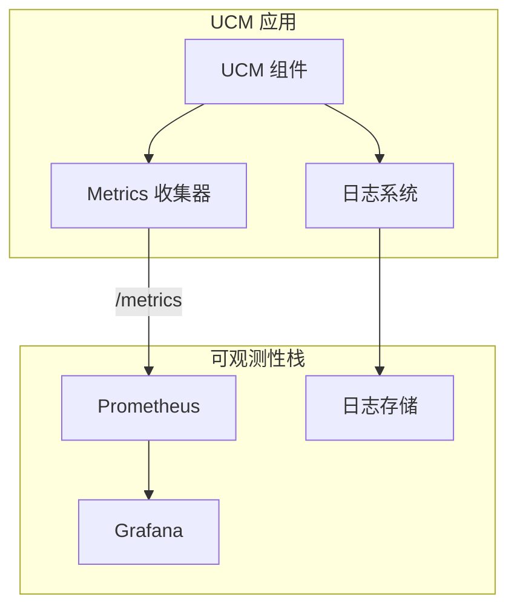
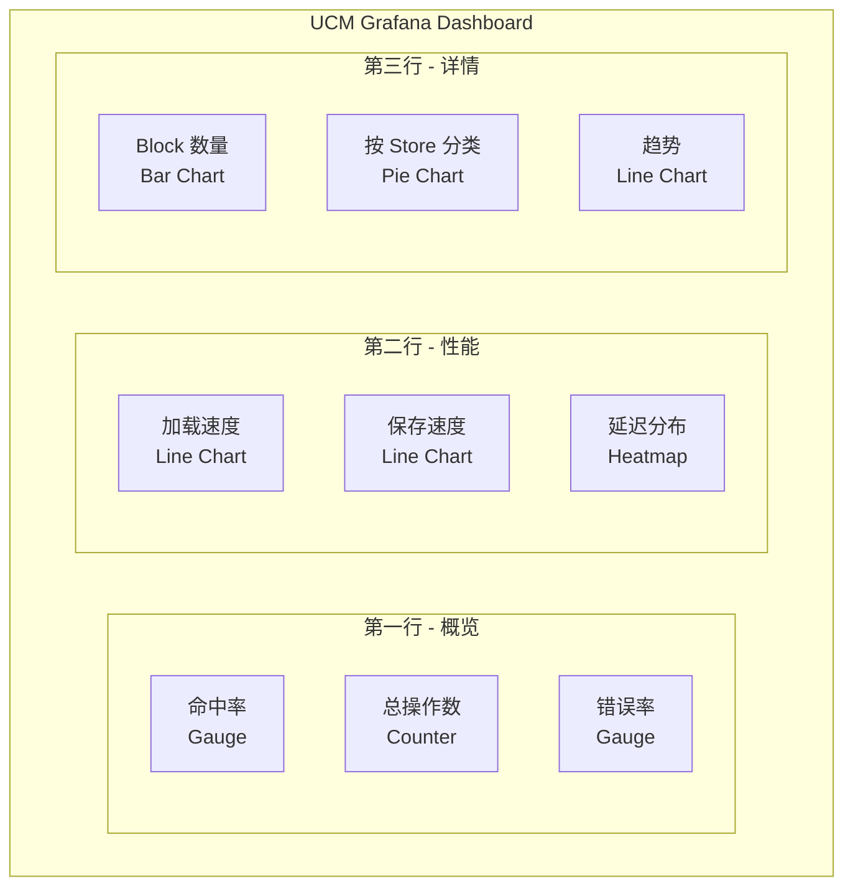

> **阅读时间**: 约 15 分钟
> **前置要求**: [架构概览](../01-overview/02-architecture-overview.md)

---

## 概述

本文介绍 UCM 的监控系统设计，包括 Prometheus 指标、日志系统和 Grafana 集成。

---

## 1. 监控架构

### 1.1 系统架构


### 1.2 核心组件
| 组件 | 职责 | 代码位置 |
|------|------|----------|
| PrometheusLogger | Prometheus 指标记录 | `ucm/shared/metrics/observability.py` |
| UCMStatsLogger | vLLM 风格的统计日志 | `ucm/shared/metrics/observability.py` |
| StatsMonitor | 实时统计监控 | `ucm/shared/metrics/ucmmonitor.py` |
| Logger | 日志系统 | `ucm/logger.py` |

---

## 2. Prometheus 指标

### 2.1 指标类型

**代码位置**: `ucm/shared/metrics/observability.py:46-150`

```python
class PrometheusLogger:
    """Prometheus 指标记录器"""

    def __init__(self, labels: Dict[str, str]):
        import prometheus_client as prom
        # Counter - 累计计数
        self.lookup_total = prom.Counter(
            'ucm_lookup_total',
            'Total number of lookup operations',
            labels.keys()
        )

        # Gauge - 当前值
        self.hit_rate = prom.Gauge(
            'ucm_lookup_hit_rate',
            'Current lookup hit rate',
            labels.keys()
        )
        # Histogram - 分布
        self.load_duration = prom.Histogram(
            'ucm_load_duration_seconds',
            'Load operation duration',
            labels.keys(),
            buckets=[0.001, 0.005, 0.01, 0.05, 0.1, 0.5, 1.0]
        )
```

### 2.2 UCM 核心指标

| 指标名称 | 类型 | 说明 | 标签 |
|----------|------|------|------|
| `ucm_lookup_total` | Counter | lookup 操作总次数 | connector, store |
| `ucm_lookup_hit_total` | Counter | lookup 命中总次数 | connector, store |
| `ucm_lookup_hit_rate` | Gauge | 当前命中率 | connector, store |
| `ucm_load_blocks_total` | Counter | 加载的 Block 总数 | connector, store |
| `ucm_load_duration_seconds` | Histogram | 加载耗时分布 | connector, store |
| `ucm_load_speed_bytes_per_second` | Gauge | 加载速度 | connector, store |
| `ucm_save_blocks_total` | Counter | 保存的 Block 总数 | connector, store |
| `ucm_save_duration_seconds` | Histogram | 保存耗时分布 | connector, store |
| `ucm_save_speed_bytes_per_second` | Gauge | 保存速度 | connector, store |

### 2.3 指标记录

```python
class PrometheusLogger:
    def log_lookup(self, total: int, hits: int):
        """记录 lookup 操作"""
        self.lookup_total.inc(total)
        self.lookup_hit_total.inc(hits)
        if total > 0:
            self.hit_rate.set(hits / total)
    def log_load(self, blocks: int, duration: float, bytes_loaded: int):
        """记录 load 操作"""
        self.load_blocks_total.inc(blocks)
        self.load_duration.observe(duration)
        if duration > 0:
            speed = bytes_loaded / duration
            self.load_speed.set(speed)
    def log_save(self, blocks: int, duration: float, bytes_saved: int):
        """记录 save 操作"""
        self.save_blocks_total.inc(blocks)
        self.save_duration.observe(duration)
        if duration > 0:
            speed = bytes_saved / duration
            self.save_speed.set(speed)
```

---

## 3. 日志系统

### 3.1 日志配置

**代码位置**: `ucm/logger.py:29-55`

```python
import logging
import os

def init_logger(name: str) -> logging.Logger:
    """初始化 UCM 日志器"""
    # 从环境变量获取日志级别
    level_str = os.environ.get("UNIFIED_CACHE_LOG_LEVEL", "INFO")
    level = getattr(logging, level_str.upper(), logging.INFO)
    # 创建日志器
    logger = logging.getLogger(name)
    logger.setLevel(level)
    # 配置格式
    formatter = logging.Formatter(
        '[%(asctime)s] [%(name)s] [%(levelname)s] %(message)s',
        datefmt='%Y-%m-%d %H:%M:%S'
    )
    # 控制台输出
    handler = logging.StreamHandler()
    handler.setFormatter(formatter)
    logger.addHandler(handler)

    return logger
```
### 3.2 使用示例
```python
from ucm.logger import init_logger

logger = init_logger(__name__)

logger.debug("Debug message: detailed info")
logger.info("Info message: normal operation")
logger.warning("Warning: potential issue")
logger.error("Error: operation failed")
```

### 3.3 日志级别

| 级别 | 环境变量值 | 用途 |
|------|-----------|------|
| DEBUG | `DEBUG` | 详细调试信息 |
| INFO | `INFO` | 正常运行信息（默认） |
| WARNING | `WARNING` | 警告信息 |
| ERROR | `ERROR` | 错误信息 |
```bash
export UNIFIED_CACHE_LOG_LEVEL=DEBUG
```
---
## 4. StatsMonitor 实时监控

### 4.1 设计

**代码位置**: `ucm/shared/metrics/ucmmonitor.py`

```python
class StatsMonitor:
    """实时统计监控器"""

    _instance = None

    @classmethod
    def get_instance(cls):
        if cls._instance is None:
            cls._instance = cls()
        return cls._instance

    def __init__(self):
        self.stats = {
            'lookup_count': 0,
            'lookup_hits': 0,
            'load_count': 0,
            'load_blocks': 0,
            'load_bytes': 0,
            'load_time': 0.0,
            'save_count': 0,
            'save_blocks': 0,
            'save_bytes': 0,
            'save_time': 0.0,
        }
        self._lock = threading.Lock()

    def record_lookup(self, total: int, hits: int):
        with self._lock:
            self.stats['lookup_count'] += 1
            self.stats['lookup_hits'] += hits

    def get_stats(self) -> Dict:
        with self._lock:
            stats = self.stats.copy()

        # 计算衍生指标
        if stats['lookup_count'] > 0:
            stats['hit_rate'] = stats['lookup_hits'] / stats['lookup_count']
        if stats['load_time'] > 0:
            stats['load_speed'] = stats['load_bytes'] / stats['load_time']

        return stats
```

### 4.2 使用示例

```python
from ucm.shared.metrics.ucmmonitor import StatsMonitor

monitor = StatsMonitor.get_instance()

monitor.record_lookup(total=100, hits=85)
monitor.record_load(blocks=10, bytes=1024000, duration=0.5)

stats = monitor.get_stats()
print(f"Hit rate: {stats['hit_rate'] * 100:.1f}%")
print(f"Load speed: {stats['load_speed'] / 1e6:.1f} MB/s")
```

---
## 5. Grafana 集成
### 5.1 仪表板配置
创建 `grafana-dashboard.json`:
```json
{
  "dashboard": {
    "title": "UCM Metrics",
    "panels": [
      {
        "title": "Lookup Hit Rate",
        "type": "gauge",
        "targets": [
          {
            "expr": "ucm_lookup_hit_rate",
            "legendFormat": "Hit Rate"
          }
        ]
      },
      {
        "title": "Load Speed",
        "type": "graph",
        "targets": [
          {
            "expr": "ucm_load_speed_bytes_per_second / 1e9",
            "legendFormat": "GB/s"
          }
        ]
      },
      {
        "title": "Load Duration Distribution",
        "type": "heatmap",
        "targets": [
          {
            "expr": "rate(ucm_load_duration_seconds_bucket[1m])",
            "legendFormat": "{{le}}"
          }
        ]
      }
    ]
  }
}
```
### 5.2 关键仪表板面板


---

## 6. 配置文件

### 6.1 指标配置

创建 `metrics_config.yaml`:

```yaml
# 指标配置
metrics:
  enabled: true
  # Prometheus 配置
  prometheus:
    enabled: true
    port: 9090
    path: /metrics
  # 标签
  labels:
    service: ucm
    environment: production

  # 收集间隔
  collection_interval: 10s
  # 直方图桶配置
  histogram_buckets:
    duration: [0.001, 0.005, 0.01, 0.05, 0.1, 0.5, 1.0, 5.0]
    size: [1024, 10240, 102400, 1048576, 10485760]
```
### 6.2 使用配置
```python
from ucm.shared.metrics.observability import PrometheusLogger
import yaml
# 加载配置
with open('metrics_config.yaml') as f:
    config = yaml.safe_load(f)
# 创建 logger
logger = PrometheusLogger(
    labels=config['metrics']['labels'],
    port=config['metrics']['prometheus']['port']
)
```

---

## 7. 监控最佳实践

### 7.1 关键告警规则

```yaml
# Prometheus 告警规则
groups:
  - name: ucm_alerts
    rules:
      - alert: LowHitRate
        expr: ucm_lookup_hit_rate < 0.5
        for: 5m
        labels:
          severity: warning
        annotations:
          summary: "UCM hit rate is low"
      - alert: HighLoadLatency
        expr: histogram_quantile(0.99, ucm_load_duration_seconds_bucket) > 1
        for: 5m
        labels:
          severity: warning
        annotations:
          summary: "UCM load latency is high"
      - alert: LowLoadSpeed
        expr: ucm_load_speed_bytes_per_second < 1e8
        for: 5m
        labels:
          severity: warning
        annotations:
          summary: "UCM load speed is low (< 100MB/s)"
```

### 7.2 监控清单

- [ ] Prometheus 指标端点可访问
- [ ] 核心指标正常采集
- [ ] Grafana 仪表板正常显示
- [ ] 告警规则已配置
- [ ] 日志收集正常
