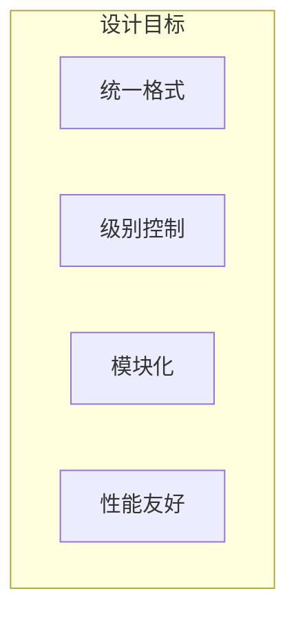
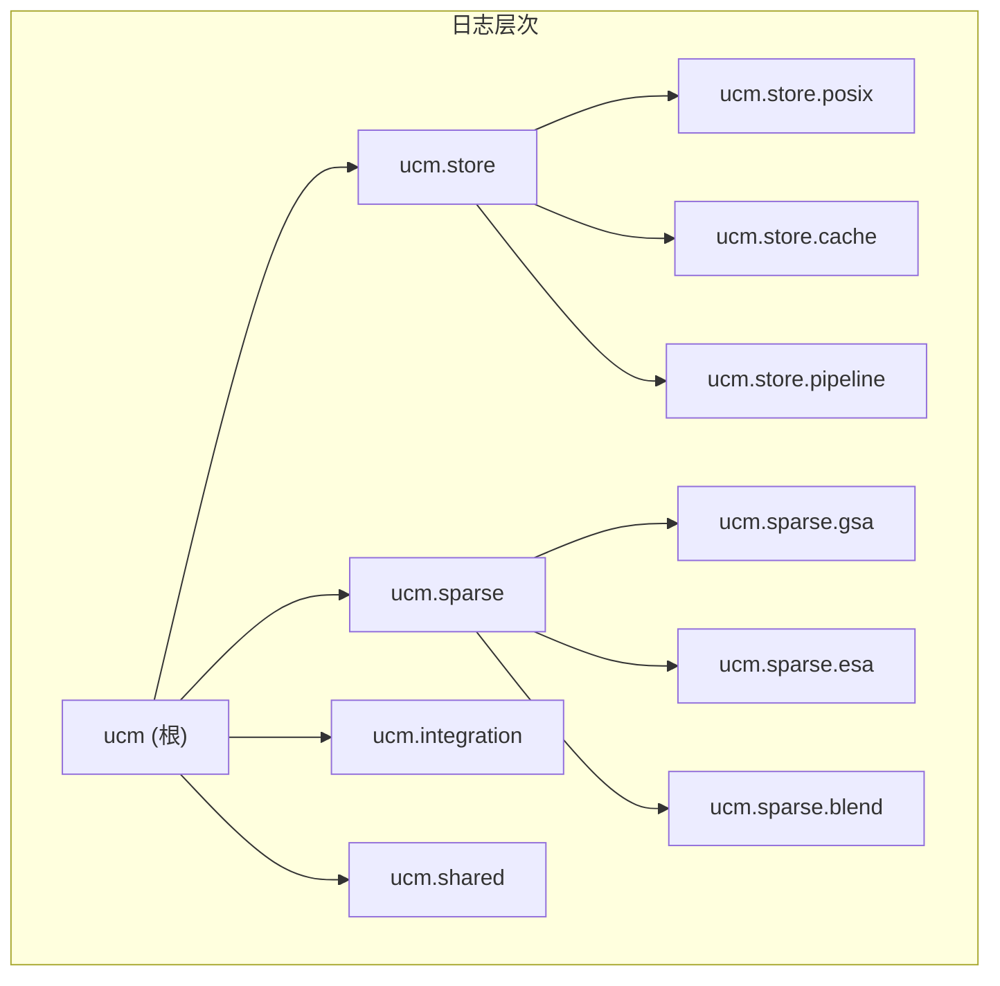

> **阅读时间**: 约 8 分钟
> **前置要求**: [监控与可观测性](./02-metrics-observability.md)

---

## 概述

本文介绍 UCM 的日志系统设计，包括日志初始化、级别配置和调试技巧。

---

## 1. 日志架构

### 1.1 设计目标



### 1.2 日志层次



---

## 2. Logger 实现

### 2.1 初始化

**代码位置**: `ucm/logger.py:29-55`

```python
import logging
import os
import sys
from typing import Optional

LOG_FORMAT = '[%(asctime)s] [%(name)s] [%(levelname)s] %(message)s'
DATE_FORMAT = '%Y-%m-%d %H:%M:%S'

def init_logger(name: str, level: Optional[str] = None) -> logging.Logger:
    """初始化 UCM 日志器
    Args:
        name: 日志器名称（通常是 __name__）
        level: 可选的日志级别覆盖
    Returns:
        配置好的 Logger 实例
    """
    # 获取日志级别
    if level is None:
        level_str = os.environ.get("UNIFIED_CACHE_LOG_LEVEL", "INFO")
    else:
        level_str = level

    level = getattr(logging, level_str.upper(), logging.INFO)

    # 创建日志器
    logger = logging.getLogger(name)
    logger.setLevel(level)

    # 避免重复添加 Handler
    if not logger.handlers:
        # 创建控制台 Handler
        handler = logging.StreamHandler(sys.stdout)
        handler.setLevel(level)

        # 设置格式
        formatter = logging.Formatter(LOG_FORMAT, datefmt=DATE_FORMAT)
        handler.setFormatter(formatter)

        logger.addHandler(handler)

    # 禁止传播到父 Logger
    logger.propagate = False
    return logger

_root_logger = init_logger('ucm')

def get_logger(name: str) -> logging.Logger:
    """获取子 Logger"""
    return init_logger(f'ucm.{name}')
```

### 2.2 使用方式

```python
from ucm.logger import get_logger
logger = get_logger(__name__)
# 不同级别的日志
logger.debug("Detailed debug information")
logger.info("Normal operation information")
logger.warning("Warning: potential issue detected")
logger.error("Error occurred during operation")
logger.exception("Exception with traceback")
```
---
## 3. 日志级别

### 3.1 级别定义

| 级别 | 数值 | 用途 |
|------|------|------|
| DEBUG | 10 | 详细调试信息 |
| INFO | 20 | 正常运行信息（默认） |
| WARNING | 30 | 警告信息 |
| ERROR | 40 | 错误信息 |
| CRITICAL | 50 | 严重错误 |

### 3.2 级别配置

```bash
export UNIFIED_CACHE_LOG_LEVEL=DEBUG

export UCM_STORE_LOG_LEVEL=INFO
export UCM_SPARSE_LOG_LEVEL=DEBUG
```

### 3.3 模块级别控制

```python
def configure_module_levels():
    """配置模块级别的日志"""
    module_levels = {
        'ucm.store': os.environ.get('UCM_STORE_LOG_LEVEL', 'INFO'),
        'ucm.sparse': os.environ.get('UCM_SPARSE_LOG_LEVEL', 'INFO'),
        'ucm.integration': os.environ.get('UCM_INTEGRATION_LOG_LEVEL', 'INFO'),
    }

    for module, level_str in module_levels.items():
        logger = logging.getLogger(module)
        level = getattr(logging, level_str.upper(), logging.INFO)
        logger.setLevel(level)
```

---
## 4. 日志输出
### 4.1 标准输出格式
```
[2024-01-15 10:30:45] [ucm.store.posix] [INFO] Initialized POSIX store at /data/cache
[2024-01-15 10:30:45] [ucm.store.cache] [INFO] Cache pool initialized with 2048 buffers
[2024-01-15 10:30:46] [ucm.sparse.gsa] [DEBUG] GSA initialized with sparse_ratio=0.3
[2024-01-15 10:30:47] [ucm.integration.vllm] [INFO] UCM Connector created for rank 0
```

### 4.2 文件输出

```python
def add_file_handler(
    logger: logging.Logger,
    filepath: str,
    level: int = logging.DEBUG
):
    """添加文件 Handler"""
    file_handler = logging.FileHandler(filepath)
    file_handler.setLevel(level)

    formatter = logging.Formatter(LOG_FORMAT, datefmt=DATE_FORMAT)
    file_handler.setFormatter(formatter)
    logger.addHandler(file_handler)

logger = get_logger('ucm')
add_file_handler(logger, '/var/log/ucm/ucm.log')
```

### 4.3 JSON 格式（可选）

```python
import json
class JSONFormatter(logging.Formatter):
    """JSON 格式化器"""

    def format(self, record):
        log_obj = {
            'timestamp': self.formatTime(record, self.datefmt),
            'name': record.name,
            'level': record.levelname,
            'message': record.getMessage(),
            'module': record.module,
            'line': record.lineno,
        }

        if record.exc_info:
            log_obj['exception'] = self.formatException(record.exc_info)
        return json.dumps(log_obj)
```

---

## 5. 调试技巧

### 5.1 临时调整日志级别

```python
import logging
# 临时开启 DEBUG
logger = logging.getLogger('ucm.store.posix')
original_level = logger.level
logger.setLevel(logging.DEBUG)

try:
    # 执行需要调试的操作
    store.lookup(block_ids)
finally:
    # 恢复原级别
    logger.setLevel(original_level)
```

### 5.2 上下文管理器

```python
from contextlib import contextmanager
@contextmanager
def debug_logging(module: str):
    """临时开启 DEBUG 日志的上下文管理器"""
    logger = logging.getLogger(module)
    original_level = logger.level
    logger.setLevel(logging.DEBUG)

    try:
        yield logger
    finally:
        logger.setLevel(original_level)

with debug_logging('ucm.sparse.gsa') as logger:
    # 此处 GSA 模块的日志级别为 DEBUG
    sparse.select_blocks(request)
```
### 5.3 条件日志
```python
if logger.isEnabledFor(logging.DEBUG):
    logger.debug(f"Block details: {expensive_computation()}")
# 或使用延迟格式化
logger.debug("Block details: %s", expensive_computation())
```
---
## 6. 性能考虑

### 6.1 日志开销

```python
logger.debug(f"Processing {len(items)} items: {items}")

logger.debug("Processing %d items: %s", len(items), items)

if logger.isEnabledFor(logging.DEBUG):
    logger.debug("Processing %d items: %s", len(items), items)
```

### 6.2 异步日志

```python
import queue
import threading

class AsyncLogger:
    """异步日志器"""

    def __init__(self, logger: logging.Logger):
        self.logger = logger
        self.queue = queue.Queue()
        self.running = True

        self.thread = threading.Thread(target=self._worker)
        self.thread.daemon = True
        self.thread.start()

    def _worker(self):
        while self.running:
            try:
                record = self.queue.get(timeout=0.1)
                self.logger.handle(record)
            except queue.Empty:
                continue

    def log(self, level: int, msg: str, *args, **kwargs):
        record = self.logger.makeRecord(
            self.logger.name, level, '', 0, msg, args, None
        )
        self.queue.put(record)

    def close(self):
        self.running = False
        self.thread.join()
```

---
## 7. 常用日志点
### 7.1 存储层
```python
logger.info(f"POSIX store initialized at {path}")
logger.debug(f"Lookup {len(block_ids)} blocks")
logger.debug(f"Load {len(block_ids)} blocks, offset={offset}")
logger.debug(f"Dump {len(block_ids)} blocks, size={size}")
logger.warning(f"Block {block_id} not found")
logger.error(f"Failed to load block {block_id}: {e}")
```

### 7.2 稀疏注意力

```python
# ucm/sparse/gsa/gsa.py
logger.info(f"GSA initialized: sparse_ratio={sparse_ratio}")
logger.debug(f"Selected {len(selected)} blocks out of {total}")
logger.debug(f"Prefetch submitted for request {request_id}")
logger.warning(f"Prefetch timeout for request {request_id}")
```

### 7.3 集成层

```python
# ucm/integration/vllm/ucm_connector.py
logger.info(f"UCM Connector created for rank {rank}")
logger.debug(f"Request {request_id}: matched {matched} tokens")
logger.debug(f"Building connector meta for {len(requests)} requests")
logger.error(f"Failed to load KV for request {request_id}: {e}")
```

---

## 8. 配置参考

### 8.1 开发环境

```bash
export UNIFIED_CACHE_LOG_LEVEL=DEBUG
export UCM_STORE_LOG_LEVEL=DEBUG
export UCM_SPARSE_LOG_LEVEL=DEBUG
```

### 8.2 生产环境

```bash
export UNIFIED_CACHE_LOG_LEVEL=INFO
export UCM_STORE_LOG_LEVEL=WARNING
export UCM_SPARSE_LOG_LEVEL=INFO
```

### 8.3 故障排查

```bash
export UNIFIED_CACHE_LOG_LEVEL=DEBUG
export UCM_LOG_FILE=/var/log/ucm/debug.log
```