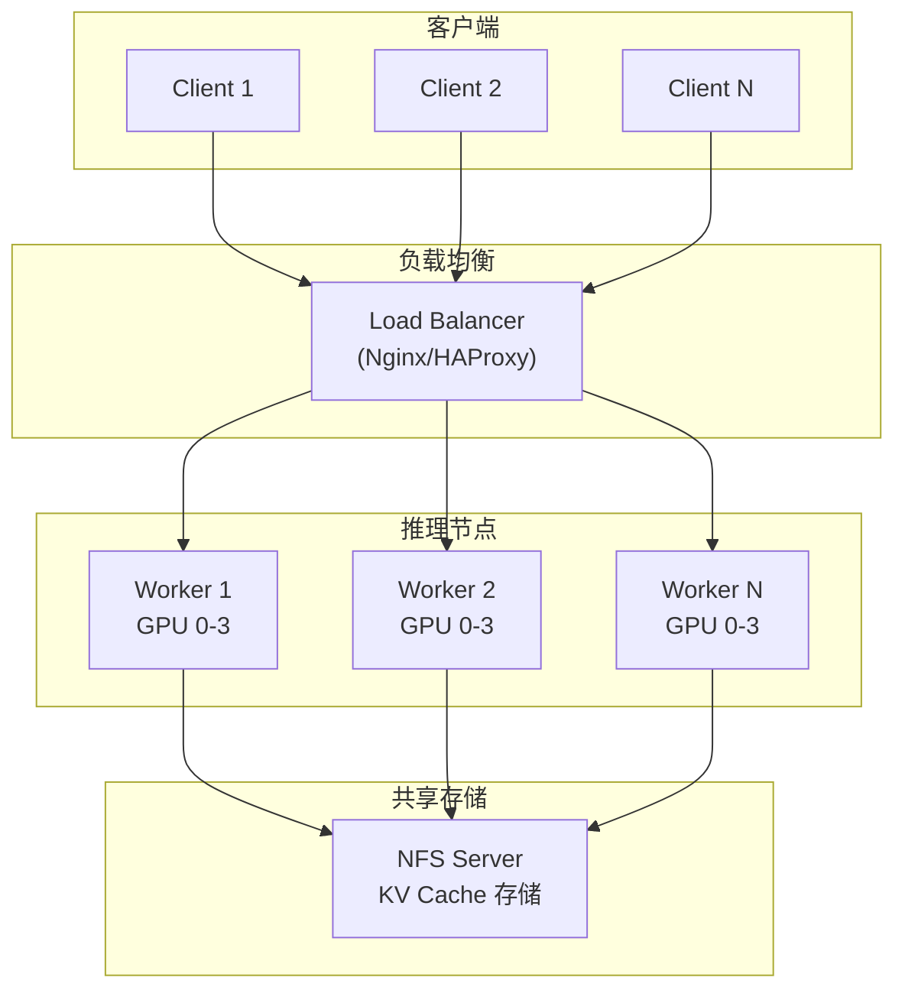

> **阅读时间**: 约 20 分钟
> **适用人群**: 运维工程师、DevOps

---

## 概述

本文提供 UCM 在生产环境中的部署指南，包括单机部署、分布式部署和容器化部署。

---

## 1. 部署准备

### 1.1 系统要求

| 组件 | 最低要求 | 推荐配置 |
|------|----------|----------|
| 操作系统 | Linux (Ubuntu 20.04+) | Ubuntu 22.04 LTS |
| CPU | 8 核 | 32+ 核 |
| 内存 | 32 GB | 128+ GB |
| GPU | 1x 16GB 显存 | 多卡 A100/H100 |
| 存储 | 100 GB SSD | NVMe SSD 1TB+ |
| 网络 | 1 Gbps | 25 Gbps+ (分布式) |
### 1.2 软件依赖
```bash
Python >= 3.10
PyTorch >= 2.0
vLLM == 0.9.2

CUDA >= 11.8
cuDNN >= 8.6
# 可选依赖
prometheus_client  # 监控
grafana           # 可视化
```

---

## 2. 安装 UCM

### 2.1 pip 安装

```bash
# 基础安装
pip install ucm

pip install ucm[full]
```
### 2.2 源码安装
```bash
git clone https://github.com/your-org/unified-cache-management.git
cd unified-cache-management
# 设置平台
export PLATFORM=cuda  # 或 ascend, musa, maca

pip install -e .
```
### 2.3 Docker 安装
```dockerfile
FROM nvidia/cuda:12.1-devel-ubuntu22.04

RUN apt-get update && apt-get install -y python3.10 python3-pip

COPY . /app
WORKDIR /app
RUN pip install -e .

EXPOSE 8000 9090

CMD ["python", "-m", "vllm.entrypoints.openai.api_server"]
```
---
## 3. 配置文件

### 3.1 基础配置

创建 `ucm_config.yaml`:

```yaml

ucm_connectors:
  - ucm_connector_name: "UcmPipelineStore"
    ucm_connector_config:
      # Pipeline 类型
      store_pipeline: "Cache|Posix"

      # 存储路径
      storage_backends: "/data/ucm_cache"

      # Pinned Memory 缓冲区
      buffer_number: 2048

      # Block 大小
      block_size: 16

      # Direct I/O
      io_direct: true

ucm_sparse_config:
  ESA:
    sparse_ratio: 0.3
    local_window_sz: 2
    min_blocks: 4

metrics_config_path: "./metrics_config.yaml"

load_only_first_rank: false
```

### 3.2 高级配置

```yaml
ucm_connectors:
  - ucm_connector_name: "UcmPipelineStore"
    ucm_connector_config:
      store_pipeline: "Cache|NFS"
      storage_backends:
        - "/mnt/nfs/ucm_cache"
        - "/mnt/nfs/ucm_cache_backup"
      buffer_number: 4096
      io_direct: true

      # NFS 特定配置
      nfs_config:
        retry_count: 3
        timeout_seconds: 30

multi_gpu:
  enabled: true
  strategy: "round_robin"

monitoring:
  prometheus:
    enabled: true
    port: 9090
  logging:
    level: INFO
    file: "/var/log/ucm/ucm.log"
```

---
## 4. 单机部署
### 4.1 启动脚本
创建 `start_server.sh`:
```bash
#!/bin/bash

export PLATFORM=cuda
export UNIFIED_CACHE_LOG_LEVEL=INFO
export CUDA_VISIBLE_DEVICES=0,1,2,3

MODEL_PATH="/models/llama-7b"
UCM_CONFIG="./ucm_config.yaml"
# 启动 vLLM + UCM
python -m vllm.entrypoints.openai.api_server \
    --model $MODEL_PATH \
    --kv-connector "UCMConnector" \
    --kv-connector-module-path "ucm.integration.vllm.ucm_connector" \
    --kv-role "kv_both" \
    --kv-connector-extra-config "{\"UCM_CONFIG_FILE\": \"$UCM_CONFIG\"}" \
    --tensor-parallel-size 4 \
    --max-model-len 8192 \
    --gpu-memory-utilization 0.8 \
    --port 8000
```

### 4.2 运行服务

```bash
chmod +x start_server.sh
./start_server.sh
```
### 4.3 验证部署
```bash
curl http://localhost:8000/health

curl http://localhost:8000/v1/chat/completions \
  -H "Content-Type: application/json" \
  -d '{
    "model": "llama-7b",
    "messages": [{"role": "user", "content": "Hello!"}]
  }'
```

---

## 5. 分布式部署

### 5.1 架构


### 5.2 NFS 服务器配置
```bash
# /etc/exports
/data/ucm_cache  *(rw,sync,no_subtree_check,no_root_squash)
# 启动 NFS
sudo systemctl start nfs-kernel-server
```
### 5.3 Worker 节点配置
```yaml
ucm_connectors:
  - ucm_connector_name: "UcmPipelineStore"
    ucm_connector_config:
      store_pipeline: "Cache|NFS"
      storage_backends: "192.168.1.100:/data/ucm_cache"
      buffer_number: 4096
```

### 5.4 负载均衡配置

```nginx
# nginx.conf
upstream ucm_backend {
    least_conn;
    server worker1:8000;
    server worker2:8000;
    server worker3:8000;
}
server {
    listen 80;
    location / {
        proxy_pass http://ucm_backend;
        proxy_http_version 1.1;
        proxy_set_header Connection "";
    }
}
```
---
## 6. Kubernetes 部署

### 6.1 Deployment

```yaml
apiVersion: apps/v1
kind: Deployment
metadata:
  name: ucm-server
spec:
  replicas: 3
  selector:
    matchLabels:
      app: ucm
  template:
    metadata:
      labels:
        app: ucm
    spec:
      containers:
      - name: ucm
        image: ucm:latest
        ports:
        - containerPort: 8000
        - containerPort: 9090
        resources:
          limits:
            nvidia.com/gpu: 4
        volumeMounts:
        - name: cache-storage
          mountPath: /data/ucm_cache
        - name: config
          mountPath: /app/config
        env:
        - name: UNIFIED_CACHE_LOG_LEVEL
          value: "INFO"
      volumes:
      - name: cache-storage
        persistentVolumeClaim:
          claimName: ucm-cache-pvc
      - name: config
        configMap:
          name: ucm-config
```

### 6.2 Service

```yaml
apiVersion: v1
kind: Service
metadata:
  name: ucm-service
spec:
  type: LoadBalancer
  ports:
  - name: api
    port: 8000
    targetPort: 8000
  - name: metrics
    port: 9090
    targetPort: 9090
  selector:
    app: ucm
```

### 6.3 ConfigMap

```yaml
apiVersion: v1
kind: ConfigMap
metadata:
  name: ucm-config
data:
  ucm_config.yaml: |
    ucm_connectors:
      - ucm_connector_name: "UcmPipelineStore"
        ucm_connector_config:
          store_pipeline: "Cache|Posix"
          storage_backends: "/data/ucm_cache"
          buffer_number: 2048
```

---
## 7. 多平台部署
### 7.1 NVIDIA GPU
```bash
export PLATFORM=cuda
export CUDA_VISIBLE_DEVICES=0,1,2,3
pip install -e .
```
### 7.2 Huawei Ascend NPU
```bash
export PLATFORM=ascend
export ASCEND_VISIBLE_DEVICES=0,1,2,3
pip install -e .
```
### 7.3 平台特定配置
```yaml
platform:
  type: ascend
  device_ids: [0, 1, 2, 3]

ucm_connectors:
  - ucm_connector_name: "UcmPipelineStore"
    ucm_connector_config:
      store_pipeline: "Cache|Posix"
      storage_backends: "/data/ucm_cache"
      # Ascend 特定配置
      ascend_config:
        enable_hccl: true
```

---

## 8. 生产环境清单

### 8.1 部署前检查

- [ ] 系统要求满足
- [ ] GPU 驱动正确安装
- [ ] CUDA/cuDNN 版本兼容
- [ ] 存储空间充足
- [ ] 网络配置正确

### 8.2 配置检查

- [ ] 配置文件语法正确
- [ ] 存储路径存在且可写
- [ ] 端口未被占用
- [ ] 权限设置正确
### 8.3 监控检查
- [ ] Prometheus 指标可访问
- [ ] 日志正常输出
- [ ] 告警规则已配置
- [ ] Grafana 仪表板可用
