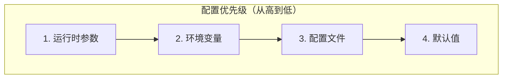

> **阅读时间**: 约 15 分钟
> **前置要求**: [部署指南](./01-deployment-guide.md)

---

## 概述

本文档提供 UCM 所有配置项的完整参考，包括 YAML 配置、环境变量和运行时配置。

---

## 1. 配置文件结构

### 1.1 YAML 配置文件

```yaml
# ucm_config.yaml - UCM 完整配置模板
# ========================================
# ========================================
ucm_connectors:
  - ucm_connector_name: "UcmPipelineStore"
    ucm_connector_config:
      # Pipeline 配置
      store_pipeline: "Cache|Posix"
      # 存储路径
      storage_backends: "/data/ucm_cache"

      # 缓冲池配置
      buffer_number: 2048
      # Block 配置
      block_size: 16
      shard_size: 2048
      tensor_size: 65536

# 稀疏注意力配置
# ========================================
ucm_sparse_method: "GSA"

ucm_sparse_config:
  GSA:
    sparse_ratio: 0.3
    local_window_sz: 2
    init_window_sz: 1
    min_blocks: 4
    prefetch_workers: 4

# 监控配置
# ========================================
metrics:
  enabled: true
  prometheus_port: 9090

# 日志配置
# ========================================
logging:
  level: "INFO"
  format: "[%(asctime)s] [%(name)s] [%(levelname)s] %(message)s"
```
### 1.2 配置优先级

---
## 2. 存储连接器配置

### 2.1 通用配置

| 参数 | 类型 | 默认值 | 说明 |
|------|------|--------|------|
| `ucm_connector_name` | string | - | 连接器名称 |
| `storage_backends` | string/list | - | 存储路径 |
| `store_pipeline` | string | "Posix" | Pipeline 组合 |
| `block_size` | int | 16 | Block 大小（Token 数） |
| `shard_size` | int | 2048 | 分片大小 |
| `tensor_size` | int | 65536 | 张量大小 |

### 2.2 Cache 层配置

```yaml
ucm_connector_config:
  # 缓冲池大小（必须 >= 1024）
  buffer_number: 2048

  # LRU 缓存容量
  cache_capacity: 10000

  # 预取配置
  prefetch_enabled: true
  prefetch_depth: 4
```

| 参数 | 类型 | 默认值 | 说明 |
|------|------|--------|------|
| `buffer_number` | int | 1024 | Pinned Buffer 数量 |
| `cache_capacity` | int | 10000 | LRU 缓存容量 |
| `prefetch_enabled` | bool | true | 启用预取 |
| `prefetch_depth` | int | 4 | 预取深度 |

### 2.3 Posix 后端配置

```yaml
ucm_connector_config:
  storage_backends: "/data/ucm_cache"

  # 文件配置
  file_mode: 0644
  dir_mode: 0755

  # I/O 配置
  use_direct_io: true
  io_block_size: 4096
```

| 参数 | 类型 | 默认值 | 说明 |
|------|------|--------|------|
| `storage_backends` | string | - | 存储路径 |
| `use_direct_io` | bool | true | 使用 Direct I/O |
| `io_block_size` | int | 4096 | I/O 块大小 |

### 2.4 NFS 后端配置

```yaml
ucm_connector_config:
  storage_backends:
    - "/mnt/nfs1/ucm_cache"
    - "/mnt/nfs2/ucm_cache"

  # 路径选择策略
  path_strategy: "round_robin"  # round_robin, random, tiered

  # NFS 特定配置
  nfs_rsize: 1048576
  nfs_wsize: 1048576
```

### 2.5 DS3FS 后端配置

```yaml
ucm_connector_config:
  # S3 配置
  s3_endpoint: "https://s3.amazonaws.com"
  storage_backends: "ucm-cache-bucket"
  s3_access_key: "${AWS_ACCESS_KEY_ID}"
  s3_secret_key: "${AWS_SECRET_ACCESS_KEY}"

  # 优化配置
  use_io_uring: true
  connection_pool_size: 32
  max_concurrent_requests: 64

  # 分块上传
  multipart_threshold: 8388608
  multipart_chunk_size: 8388608
```

### 2.6 Mooncake 后端配置

```yaml
ucm_connector_config:
  cluster_endpoints:
    - "mooncake-1.local:9100"
    - "mooncake-2.local:9100"

  # RDMA 配置
  use_rdma: true
  rdma_device: "mlx5_0"

  # 复制因子
  replication_factor: 2
```

---
## 3. Pipeline 配置
### 3.1 Pipeline 语法
```
store_pipeline: "<Layer1>|<Layer2>|..."
```
### 3.2 支持的组合
| Pipeline | 说明 | 适用场景 |
|----------|------|----------|
| `Posix` | 仅本地存储 | 单机测试 |
| `Cache` | 仅内存缓存 | 临时缓存 |
| `Cache\|Posix` | 缓存 + 本地 | 单机生产 |
| `Cache\|NFS` | 缓存 + NFS | 企业内网 |
| `Cache\|Ds3fs` | 缓存 + S3 | 云环境 |
| `Cache\|Mooncake` | 缓存 + 分布式 | 高性能集群 |

### 3.3 多级 Pipeline

```yaml
# 三级 Pipeline
store_pipeline: "Cache|NFS|Ds3fs"

# 1. 首先查找内存缓存
# 2. 未命中则查找 NFS
```

---

## 4. 稀疏注意力配置

### 4.1 方法选择

```yaml
# 可选值: GSA, ESA, Blend, KVStar, RERoPE
ucm_sparse_method: "GSA"
```
### 4.2 GSA 配置
```yaml
ucm_sparse_config:
  GSA:
    # 稀疏比例
    sparse_ratio: 0.3
    # 窗口配置
    local_window_sz: 2
    init_window_sz: 1
    # 最小 Block 数
    min_blocks: 4

    # 预取配置
    prefetch_workers: 4
    max_pending_prefetch: 64
    prefetch_ahead: 2
```

### 4.3 ESA 配置

```yaml
ucm_sparse_config:
  ESA:
    sparse_ratio: 0.3
    local_window_sz: 2
    init_window_sz: 1
    min_blocks: 4

    # 检索配置
    retrieval_stride: 5
    retrieval_workers: 4
    retrieval_cache_size: 10000
```

### 4.4 Blend 配置

```yaml
ucm_sparse_config:
  Blend:
    # Chunk 配置
    blend_chunk_size: 64
    min_match_ratio: 0.8
    # 位置校正
    position_correction: true
    recompute_boundary: 2
    # RoPE 配置
    rope_theta: 10000.0
```
### 4.5 KVStar 配置
```yaml
ucm_sparse_config:
  KVStar:
    checkpoint_interval: 8
    lock_duration: 16
    update_threshold: 2

    # 底层方法
    base_method: "GSA"
```

### 4.6 RERoPE 配置

```yaml
ucm_sparse_config:
  RERoPE:
    max_position: 4096
    extend_factor: 2.0
    rope_theta: 10000.0
    # 底层方法
    base_method: "GSA"
```
---
## 5. 环境变量

### 5.1 构建环境变量

| 变量 | 默认值 | 说明 |
|------|--------|------|
| `PLATFORM` | cuda | 硬件平台 |
| `ENABLE_SPARSE` | false | 启用稀疏模块 |

### 5.2 运行时环境变量

| 变量 | 默认值 | 说明 |
|------|--------|------|
| `UNIFIED_CACHE_LOG_LEVEL` | INFO | 日志级别 |
| `UCM_CONFIG_FILE` | - | 配置文件路径 |
| `UCM_DISABLE_PATCHES` | 0 | 禁用补丁 |
| `UCM_PATCH_VERBOSE` | 0 | 补丁详细日志 |

### 5.3 监控环境变量

| 变量 | 默认值 | 说明 |
|------|--------|------|
| `UCM_METRICS_ENABLED` | true | 启用监控 |
| `UCM_METRICS_PORT` | 9090 | Prometheus 端口 |

### 5.4 传输层环境变量

| 变量 | 默认值 | 说明 |
|------|--------|------|
| `UCM_PINNED_POOL_SIZE` | 1073741824 | Pinned 池大小 |
| `UCM_TRANSPORT_STREAMS` | 2 | 传输流数量 |

---
## 6. vLLM 集成配置
### 6.1 KVTransferConfig
```python
from vllm.config import KVTransferConfig

ktc = KVTransferConfig(
    # Connector 类名
    kv_connector="UCMConnector",

    # 模块路径
    kv_connector_module_path="ucm.integration.vllm.ucm_connector",
    # 角色
    kv_role="kv_both",  # kv_producer, kv_consumer, kv_both

    # 额外配置
    kv_connector_extra_config={
        "UCM_CONFIG_FILE": "./ucm_config.yaml"
    }
)
```
### 6.2 完整 vLLM 示例
```python
from vllm import LLM
from vllm.config import KVTransferConfig
# UCM 配置
ktc = KVTransferConfig(
    kv_connector="UCMConnector",
    kv_connector_module_path="ucm.integration.vllm.ucm_connector",
    kv_role="kv_both",
    kv_connector_extra_config={
        "UCM_CONFIG_FILE": "./ucm_config.yaml",
        # 或直接配置
        "store_pipeline": "Cache|Posix",
        "storage_backends": "/data/ucm_cache",
        "buffer_number": 2048,
    }
)
# 创建 LLM
llm = LLM(
    model="meta-llama/Llama-2-7b-hf",
    tensor_parallel_size=1,
    kv_transfer_config=ktc,
)
```
---
## 7. 配置验证

### 7.1 验证脚本

```python
#!/usr/bin/env python
"""验证 UCM 配置"""

import yaml
from pathlib import Path


def validate_config(config_path: str):
    """验证配置文件"""
    with open(config_path) as f:
        config = yaml.safe_load(f)

    errors = []
    warnings = []

    # 检查必需字段
    if 'ucm_connectors' not in config:
        errors.append("Missing 'ucm_connectors' field")
    else:
        for i, conn in enumerate(config['ucm_connectors']):
            if 'ucm_connector_name' not in conn:
                errors.append(f"Connector {i}: missing 'ucm_connector_name'")
            if 'ucm_connector_config' not in conn:
                errors.append(f"Connector {i}: missing 'ucm_connector_config'")
            else:
                cfg = conn['ucm_connector_config']
                if 'storage_backends' not in cfg:
                    errors.append(f"Connector {i}: missing 'storage_backends'")

                # 检查 buffer_number
                if cfg.get('buffer_number', 1024) < 1024:
                    warnings.append(f"Connector {i}: buffer_number < 1024")

    # 检查稀疏配置
    if 'ucm_sparse_method' in config:
        method = config['ucm_sparse_method']
        sparse_config = config.get('ucm_sparse_config', {})
        if method not in sparse_config:
            warnings.append(f"Sparse method '{method}' has no configuration")

    # 输出结果
    if errors:
        print("Errors:")
        for e in errors:
            print(f"  - {e}")
    if warnings:
        print("Warnings:")
        for w in warnings:
            print(f"  - {w}")
    if not errors and not warnings:
        print("Configuration is valid!")

    return len(errors) == 0


if __name__ == "__main__":
    import sys
    config_file = sys.argv[1] if len(sys.argv) > 1 else "ucm_config.yaml"
    validate_config(config_file)
```

### 7.2 运行验证

```bash
python validate_config.py ucm_config.yaml
```

---
## 8. 配置示例
### 8.1 开发环境
```yaml
ucm_connectors:
  - ucm_connector_name: "UcmPipelineStore"
    ucm_connector_config:
      store_pipeline: "Cache|Posix"
      storage_backends: "/tmp/ucm_cache"
      buffer_number: 1024
ucm_sparse_method: "GSA"
ucm_sparse_config:
  GSA:
    sparse_ratio: 0.3

logging:
  level: "DEBUG"
```

### 8.2 生产环境

```yaml
ucm_connectors:
  - ucm_connector_name: "UcmPipelineStore"
    ucm_connector_config:
      store_pipeline: "Cache|Posix"
      storage_backends: "/data/ucm_cache"
      buffer_number: 4096
      cache_capacity: 50000
ucm_sparse_method: "GSA"
ucm_sparse_config:
  GSA:
    sparse_ratio: 0.3
    prefetch_workers: 8
metrics:
  enabled: true
  prometheus_port: 9090
logging:
  level: "INFO"
```
### 8.3 云环境
```yaml
ucm_connectors:
  - ucm_connector_name: "UcmPipelineStore"
    ucm_connector_config:
      store_pipeline: "Cache|Ds3fs"
      s3_endpoint: "https://s3.amazonaws.com"
      storage_backends: "my-ucm-bucket"
      s3_access_key: "${AWS_ACCESS_KEY_ID}"
      s3_secret_key: "${AWS_SECRET_ACCESS_KEY}"
      buffer_number: 2048
      use_io_uring: true
ucm_sparse_method: "GSA"
```
