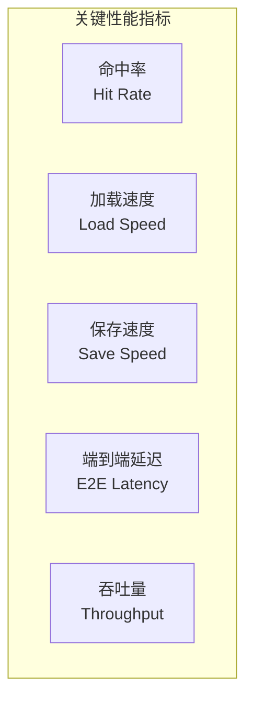
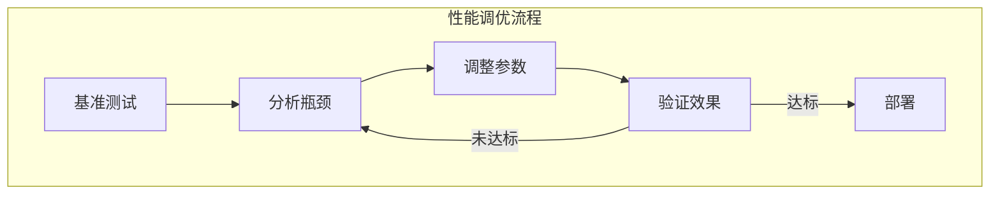
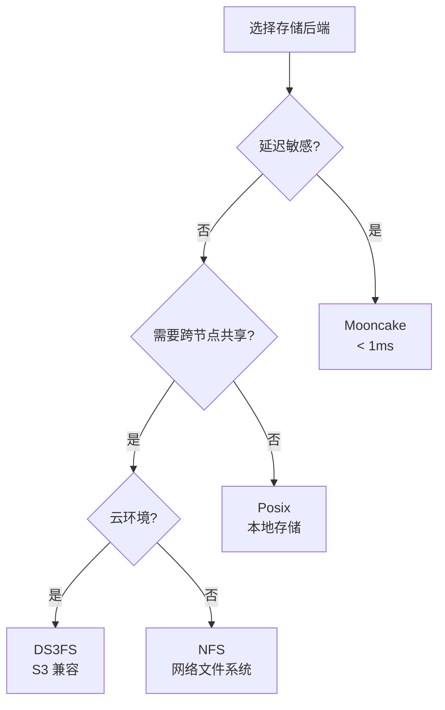
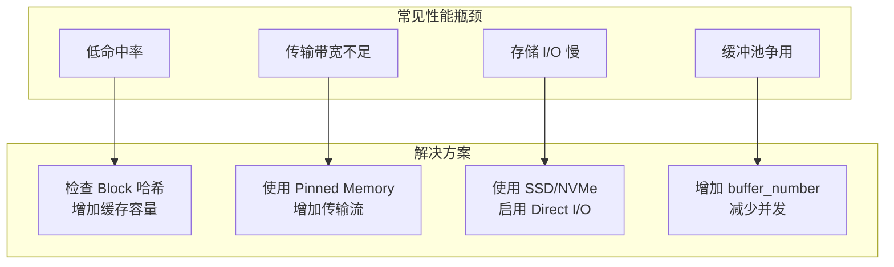

> **阅读时间**: 约 15 分钟
> **前置要求**: [配置参考](./02-configuration-reference.md)

---

## 概述

本文档提供 UCM 性能调优的最佳实践，包括缓冲池配置、Block 大小选择、Pipeline 优化和基准测试方法。

---

## 1. 性能调优框架

### 1.1 性能指标


### 1.2 调优流程


---

## 2. 缓冲池配置

### 2.1 buffer_number 调优

**影响因素**：
- 并发请求数
- 模型层数
- Block 大小
**计算公式**：
```
buffer_number = max(1024, 并发请求数 × 层数 × 2)
```

**配置示例**：
```yaml
buffer_number: 1024

buffer_number: 2048

buffer_number: 4096
```
### 2.2 Pinned Memory 池大小
```yaml
# 建议：可用内存的 10-20%
pinned_pool_size: 1073741824  # 1 GB
# 最大限制
max_pinned_size: 4294967296   # 4 GB
```
### 2.3 监控缓冲池使用
```python
from ucm.shared.trans.pinned_pool import PinnedMemoryPool

pool = PinnedMemoryPool.get_instance()
stats = pool.get_stats()
print(f"使用率: {stats['currently_used'] / stats['total_allocated'] * 100:.1f}%")
print(f"峰值: {stats['peak_allocated']}")

```

---

## 3. Block 大小选择

### 3.1 Block 大小权衡

| Block 大小 | 优点 | 缺点 |
|-----------|------|------|
| 小 (8-16) | 细粒度复用 | 元数据开销大 |
| 中 (16-32) | 平衡 | - |
| 大 (32-64) | 传输效率高 | 复用粒度粗 |

### 3.2 推荐配置

```yaml
# 短序列场景 (< 2K tokens)
block_size: 8

block_size: 16  # 默认推荐

block_size: 32
```
### 3.3 与 vLLM Block 大小对齐
```yaml
# UCM block_size 应与之匹配
block_size: 16  # 必须与 vLLM 一致
```

---

## 4. Pipeline 优化

### 4.1 Cache 层配置

```yaml
ucm_connector_config:
  store_pipeline: "Cache|Posix"

  # 增加缓存容量
  cache_capacity: 50000  # 根据可用内存调整
  # 启用预取
  prefetch_enabled: true
  prefetch_depth: 4
```

### 4.2 存储后端选择



### 4.3 NFS 性能优化

```bash
# /etc/fstab 挂载选项
192.168.1.100:/data /mnt/nfs nfs4 \
    rw,sync,hard,intr,\
    rsize=1048576,wsize=1048576,\
    nfsvers=4.1,\
    fsc 0 0
```
### 4.4 DS3FS 性能优化
```yaml
ucm_connector_config:
  # 增加并发
  connection_pool_size: 64
  max_concurrent_requests: 128
  # 启用 io_uring
  use_io_uring: true

  # 分块传输
  multipart_threshold: 8388608
  multipart_chunk_size: 8388608
```
---
## 5. 稀疏注意力调优

### 5.1 sparse_ratio 选择

```yaml
sparse_ratio: 0.5

sparse_ratio: 0.3

sparse_ratio: 0.2
```

### 5.2 预取配置

```yaml
ucm_sparse_config:
  GSA:
    # 增加预取并发
    prefetch_workers: 8

    # 提前预取批次数
    prefetch_ahead: 4

    # 最大待处理数
    max_pending_prefetch: 128
```

### 5.3 窗口配置

```yaml
ucm_sparse_config:
  GSA:
    # 局部窗口（始终包含）
    local_window_sz: 4  # 增加可提高质量

    # 起始窗口（Sink）
    init_window_sz: 1

    # 最小 Block 数
    min_blocks: 8
```

---
## 6. 基准测试
### 6.1 命中率测试
```python
#!/usr/bin/env python
"""测试 KV Cache 命中率"""
from ucm.store.factory import UcmConnectorFactory
import time

def benchmark_hit_rate():
    """命中率基准测试"""
    config = {
        "store_pipeline": "Cache|Posix",
        "storage_backends": "/data/ucm_cache",
        "buffer_number": 2048,
    }
    store = UcmConnectorFactory.create_connector(config, local_rank=0)
    # 生成测试数据
    num_blocks = 1000
    block_ids = [f"test_block_{i}".encode() for i in range(num_blocks)]
    # 第一次查询（全部未命中）
    results = store.lookup(block_ids)
    first_hits = sum(results)
    print(f"First lookup: {first_hits}/{num_blocks} hits")

    # 写入数据
    import torch
    test_tensor = torch.randn(1024 * 1024)
    for block_id in block_ids[:100]:  # 写入部分
        task = store.dump([block_id], 0, test_tensor)
        store.wait(task)
        store.commit([block_id], [True])

    # 第二次查询
    results = store.lookup(block_ids)
    second_hits = sum(results)
    print(f"Second lookup: {second_hits}/{num_blocks} hits ({second_hits/num_blocks*100:.1f}%)")

if __name__ == "__main__":
    benchmark_hit_rate()
```

### 6.2 传输速度测试

```python
def benchmark_transfer_speed():
    """传输速度基准测试"""
    import torch
    from ucm.shared.trans import CUDATransport

    transport = CUDATransport(device_id=0)
    sizes = [1, 4, 16, 64, 256]  # MB
    iterations = 20

    print("Transfer Speed Benchmark:")
    print("-" * 50)
    for size_mb in sizes:
        size = size_mb * 1024 * 1024

        pinned = transport.get_pinned_buffer(size)
        gpu = torch.empty(size, dtype=torch.uint8, device='cuda:0')
        # Warmup
        for _ in range(5):
            task = transport.h2d(pinned, gpu)
            transport.synchronize(task)

        # Benchmark
        start = time.time()
        for _ in range(iterations):
            task = transport.h2d(pinned, gpu)
            transport.synchronize(task)
        elapsed = time.time() - start
        bandwidth = (size * iterations) / elapsed / 1e9
        print(f"{size_mb:3d} MB: {bandwidth:.1f} GB/s")

        transport.release_pinned_buffer(pinned)
```
### 6.3 端到端测试
```python
def benchmark_e2e_latency():
    """端到端延迟测试"""
    from vllm import LLM
    from vllm.config import KVTransferConfig
    import time

    # 配置
    ktc = KVTransferConfig(
        kv_connector="UCMConnector",
        kv_connector_module_path="ucm.integration.vllm.ucm_connector",
        kv_role="kv_both",
        kv_connector_extra_config={
            "store_pipeline": "Cache|Posix",
            "storage_backends": "/data/ucm_cache",
        }
    )
    llm = LLM(
        model="meta-llama/Llama-2-7b-hf",
        kv_transfer_config=ktc,
    )

    # 测试提示
    prompts = [
        "What is the capital of France?",
        "Explain quantum computing in simple terms.",
        "Write a short poem about nature.",
    ]
    # 预热
    _ = llm.generate(prompts[:1])

    # 测试
    latencies = []
    for prompt in prompts:
        start = time.time()
        output = llm.generate([prompt])
        elapsed = time.time() - start
        latencies.append(elapsed)
        print(f"Prompt: {prompt[:30]}... -> {elapsed:.3f}s")
    print(f"\nAverage latency: {sum(latencies)/len(latencies):.3f}s")
```

---

## 7. 性能问题诊断

### 7.1 常见瓶颈



### 7.2 性能监控

```python
from ucm.shared.metrics.ucmmonitor import StatsMonitor
monitor = StatsMonitor.get_instance()
stats = monitor.get_stats()

print(f"命中率: {stats.get('hit_rate', 0) * 100:.1f}%")
print(f"加载速度: {stats.get('load_speed', 0) / 1e9:.1f} GB/s")
print(f"保存速度: {stats.get('save_speed', 0) / 1e9:.1f} GB/s")

if stats.get('hit_rate', 0) < 0.5:
    print("WARNING: 命中率低于 50%，检查缓存配置")
if stats.get('load_speed', 0) < 1e9:
    print("WARNING: 加载速度低于 1 GB/s，检查存储配置")
```

---

## 8. 推荐配置

### 8.1 单 GPU 开发环境

```yaml
ucm_connectors:
  - ucm_connector_name: "UcmPipelineStore"
    ucm_connector_config:
      store_pipeline: "Cache|Posix"
      storage_backends: "/data/ucm_cache"
      buffer_number: 1024
      cache_capacity: 10000
      block_size: 16
```
### 8.2 单 GPU 生产环境
```yaml
ucm_connectors:
  - ucm_connector_name: "UcmPipelineStore"
    ucm_connector_config:
      store_pipeline: "Cache|Posix"
      storage_backends: "/data/ucm_cache"
      buffer_number: 2048
      cache_capacity: 50000
      block_size: 16
      use_direct_io: true

ucm_sparse_method: "GSA"
ucm_sparse_config:
  GSA:
    sparse_ratio: 0.3
    prefetch_workers: 4
```
### 8.3 多 GPU 集群
```yaml
ucm_connectors:
  - ucm_connector_name: "UcmPipelineStore"
    ucm_connector_config:
      store_pipeline: "Cache|NFS"
      storage_backends:
        - "/mnt/nfs1/ucm_cache"
        - "/mnt/nfs2/ucm_cache"
      buffer_number: 4096
      cache_capacity: 100000
      block_size: 16
      path_strategy: "round_robin"

ucm_sparse_method: "GSA"
ucm_sparse_config:
  GSA:
    sparse_ratio: 0.3
    prefetch_workers: 8
    max_pending_prefetch: 256
```

---

## 9. 性能调优清单

- [ ] 设置合适的 `buffer_number`
- [ ] 配置 `cache_capacity` 匹配可用内存
- [ ] `block_size` 与 vLLM 对齐
- [ ] 选择合适的存储后端
- [ ] 启用预取功能
- [ ] 监控命中率和传输速度
- [ ] 运行基准测试验证性能
