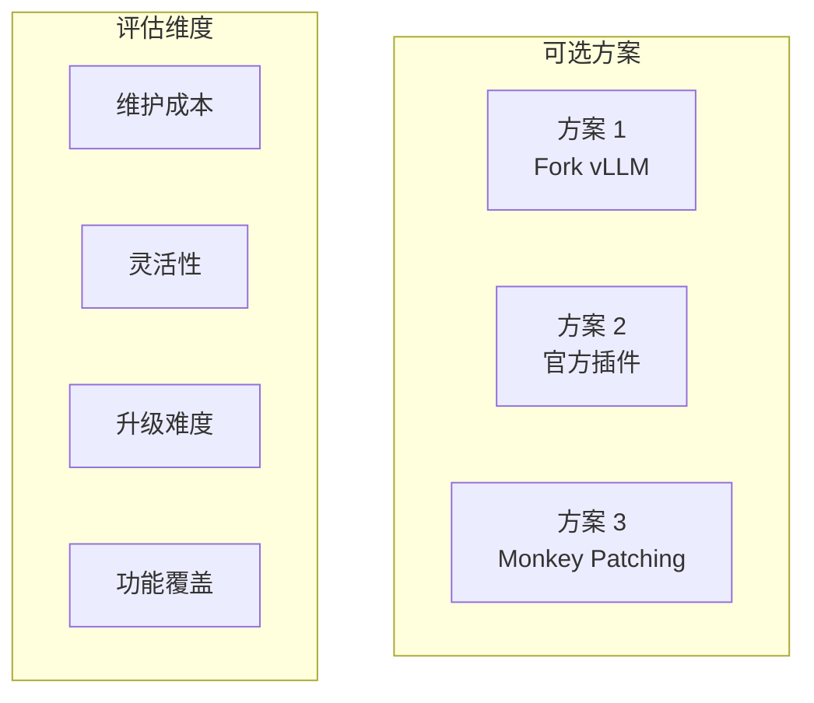
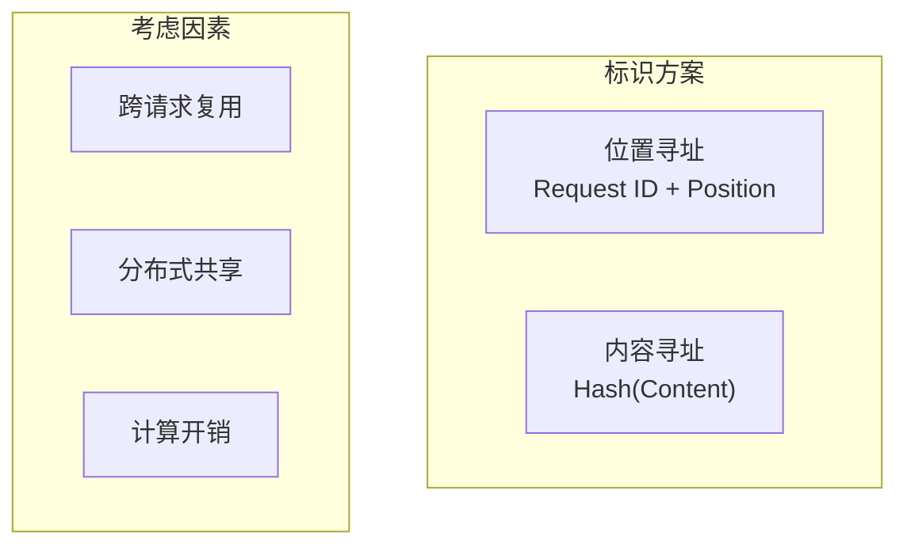
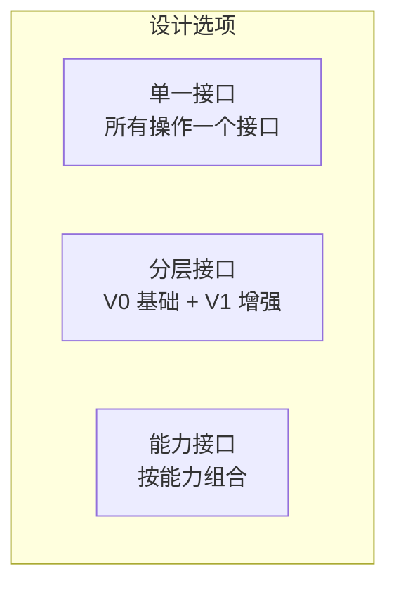
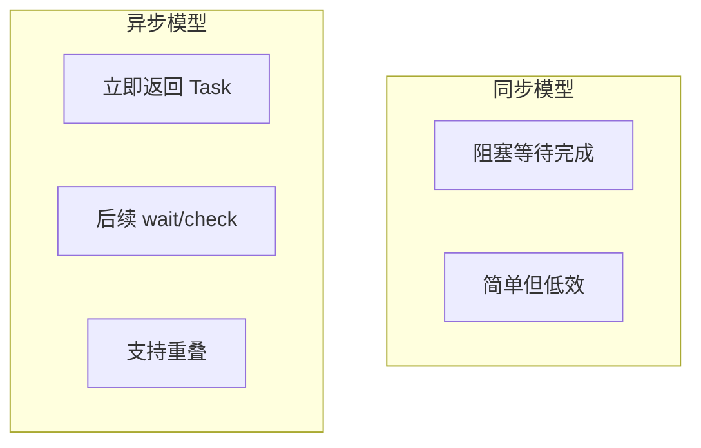
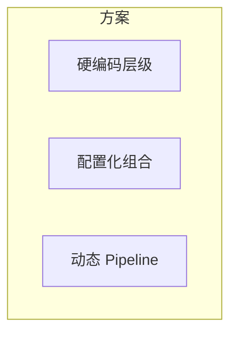
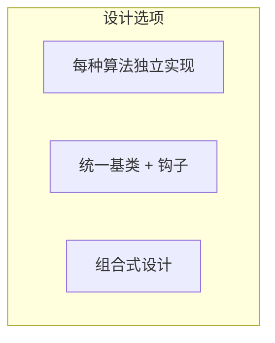

> **阅读时间**: 约 15 分钟
> **适用人群**: 架构师、高级开发者

---

## 概述

本文分析 UCM 项目中的关键架构决策，解释每个决策的背景、权衡和最终选择的原因。

---

## 1. vLLM 集成方式

### 1.1 决策背景

UCM 需要与 vLLM 深度集成，有三种可选方案：



### 1.2 方案对比

| 方案 | 维护成本 | 灵活性 | 升级难度 | 功能覆盖 |
|------|----------|--------|----------|----------|
| Fork vLLM | 高 | 最高 | 困难 | 完全 |
| 官方插件 | 低 | 有限 | 简单 | 有限 |
| Monkey Patching | 中 | 高 | 中等 | 几乎完全 |

### 1.3 最终选择: Monkey Patching

**选择理由**:

1. **非侵入式**: 不修改 vLLM 源码，保持独立性
2. **灵活性**: 可以修改几乎任何代码路径
3. **可升级**: vLLM 升级时只需调整补丁
4. **可选择性**: 可以按需启用/禁用特定功能
**权衡**:
- 需要跟踪 vLLM 内部实现变化
- 版本兼容性需要单独维护
- 调试时可能不够直观

---

## 2. Block 标识方案

### 2.1 决策背景

如何唯一标识 KV Cache Block，有两种主要思路：



### 2.2 方案对比

| 方案 | 跨请求复用 | 分布式共享 | 计算开销 | 碰撞风险 |
|------|------------|------------|----------|----------|
| 位置寻址 | 不支持 | 不支持 | 极低 | 无 |
| 内容寻址 | 支持 | 支持 | 低 | 极低 |
### 2.3 最终选择: MD5 内容寻址
**选择理由**:
1. **复用能力**: 相同内容自动共享，无需显式管理
2. **分布式友好**: 不依赖中心化 ID 分配
3. **版本无关**: 不同版本的请求可以共享相同前缀
**哈希算法选择: MD5**
| 算法 | 速度 | 碰撞率 | 输出长度 |
|------|------|--------|----------|
| MD5 | 快 | 极低 | 128 bit |
| SHA-256 | 中 | 更低 | 256 bit |
| xxHash | 最快 | 可接受 | 64/128 bit |
选择 MD5 因为:
- 速度足够快
- 128 bit 足以避免碰撞
- 广泛支持，无需额外依赖

---

## 3. 存储抽象设计

### 3.1 决策背景

如何设计存储接口以支持多种后端：


### 3.2 最终选择: 分层接口 (V0/V1)
**设计理由**:
```python
class UcmKVStoreBase:
    def lookup(self, block_ids) -> List[bool]
    def load(self, block_ids, offset, tensor) -> Task
    def dump(self, block_ids, offset, tensor) -> Task
# V1 接口 - 增强功能
class UcmKVStoreBaseV1(UcmKVStoreBase):
    def load_data(self, block_ids, shard_indices, ...) -> Task
    def dump_data(self, block_ids, shard_indices, ...) -> Task
```
**优势**:
1. **渐进增强**: 新功能不破坏旧实现
2. **简化实现**: 简单后端只需实现 V0
3. **清晰演进**: 版本化接口便于管理

---

## 4. 异步任务模型

### 4.1 决策背景

存储操作应该同步还是异步：



### 4.2 最终选择: 基于 Task 的异步模型

**设计理由**:

```python
# 异步操作返回 Task
task = store.load(block_ids, offset, tensor)

do_something_else()

status = store.wait(task)
```
**优势**:
1. **计算传输重叠**: 加载下一层的同时计算当前层
2. **批量操作**: 可以发起多个操作再统一等待
3. **非阻塞检查**: 可以轮询状态而不阻塞

---

## 5. Pipeline 存储组合

### 5.1 决策背景

如何支持多级存储层级：


### 5.2 最终选择: 可配置 Pipeline
**设计理由**:
```yaml
store_pipeline: "Cache|Posix"    # 内存缓存 + 本地存储
store_pipeline: "Cache|NFS"      # 内存缓存 + 网络存储
store_pipeline: "Cache|DS3FS"    # 内存缓存 + S3 存储
```
**优势**:
1. **灵活组合**: 用户可以按需选择
2. **易于扩展**: 新后端只需实现接口
3. **运行时配置**: 不需要重新编译

---

## 6. 稀疏算法框架

### 6.1 决策背景

如何设计一个支持多种稀疏算法的框架：


### 6.2 最终选择: 统一基类 + 生命周期钩子
**设计理由**:
```python
class UcmSparseBase:
    # Scheduler 侧钩子
    def request_begin(self, request_id, prompt_token_ids): ...
    def build_sparse_meta(self, scheduler_output): ...
    # Worker 侧钩子
    def attention_begin(self, layer_idx, q, k, v): ...
    def attention_finished(self, layer_idx, output): ...
```

**优势**:
1. **统一接口**: 所有算法实现相同接口
2. **易于切换**: 运行时切换算法
3. **可组合**: 可以组合多种策略
4. **清晰边界**: 明确 Scheduler/Worker 职责

---

## 7. 决策总结

| 决策领域 | 选择 | 关键理由 |
|----------|------|----------|
| vLLM 集成 | Monkey Patching | 非侵入、灵活、可升级 |
| Block 标识 | MD5 内容寻址 | 跨请求复用、分布式友好 |
| 存储接口 | 分层 V0/V1 | 渐进增强、简化实现 |
| 操作模型 | 异步 Task | 计算传输重叠、批量操作 |
| 存储层级 | Pipeline 组合 | 灵活配置、易扩展 |
| 稀疏框架 | 生命周期钩子 | 统一接口、可组合 |