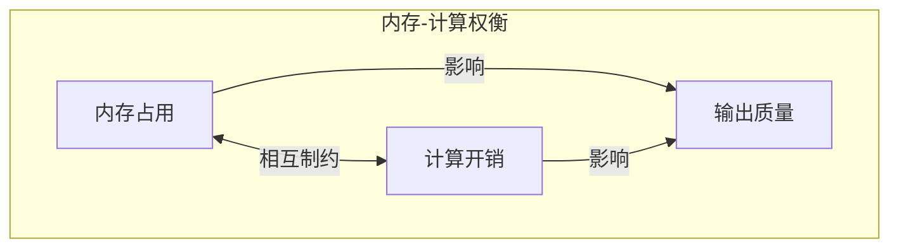
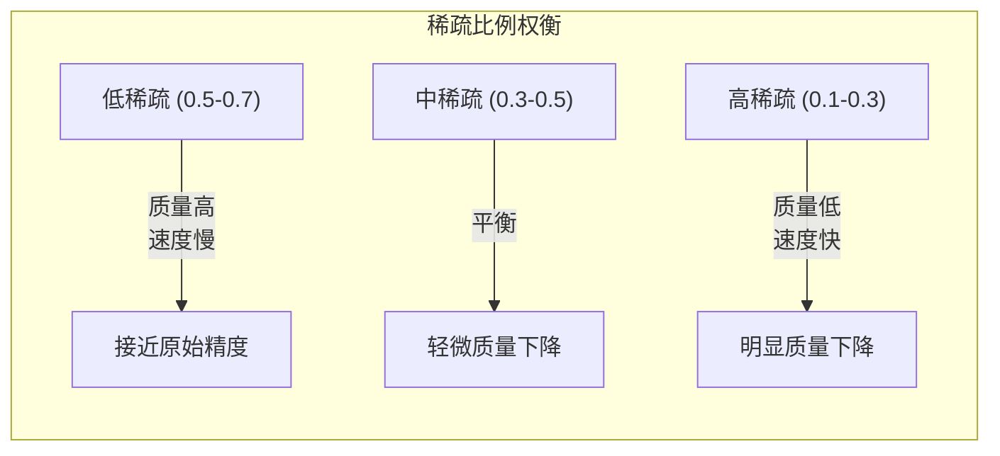
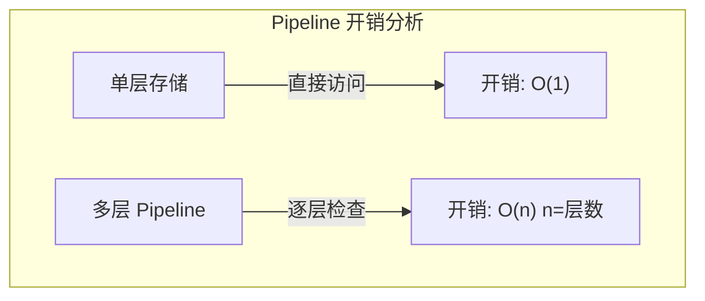
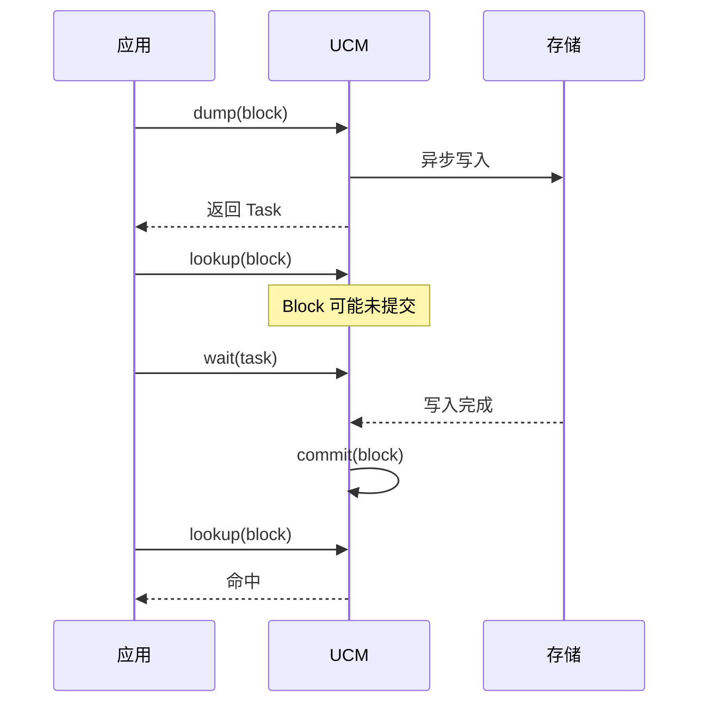
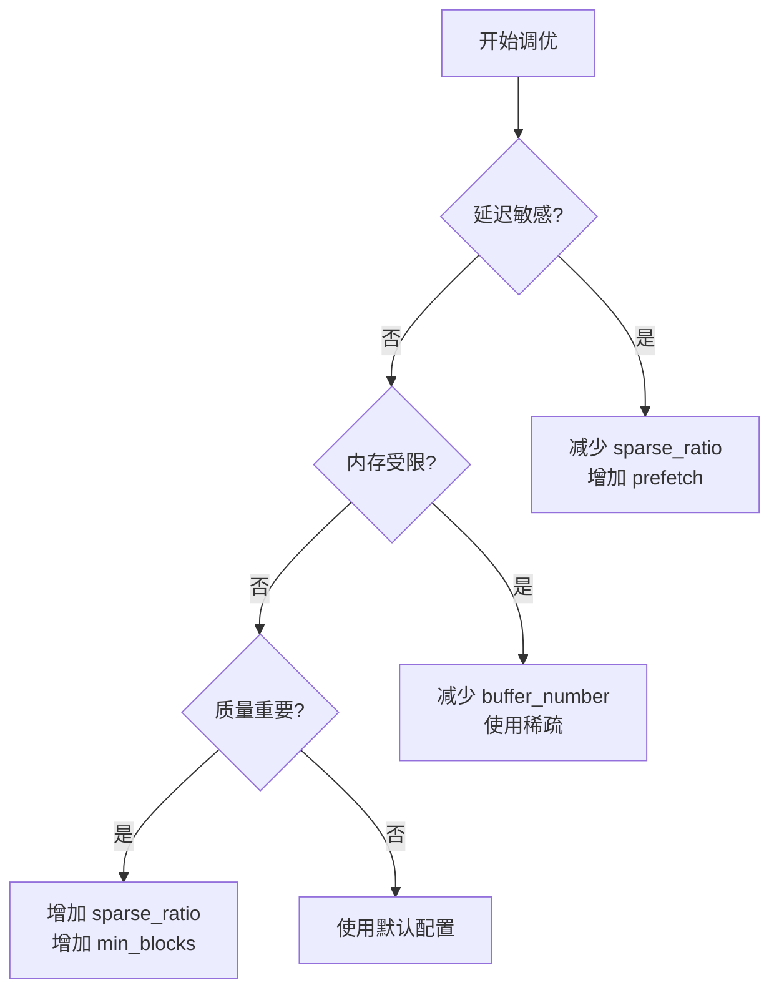

> **阅读时间**: 约 12 分钟
> **前置要求**: [架构决策分析](./01-architecture-decisions.md)

---

## 概述

本文分析 UCM 设计中的关键权衡取舍，帮助理解各种设计选择背后的考量。

---

## 1. 内存 vs 计算 权衡

### 1.1 核心问题


### 1.2 UCM 的选择
| 方面 | 选择 | 原因 |
|------|------|------|
| KV 持久化 | 存储换计算 | 首次计算后，后续请求可复用 |
| 稀疏注意力 | 牺牲部分精度 | 减少计算量，提升吞吐 |
| Pinned Memory | 占用 CPU 内存 | 加速 GPU 传输 |
### 1.3 可调参数
```yaml
sparse_ratio: 0.2       # 更激进的稀疏
buffer_number: 1024     # 减少缓冲区
# 倾向计算性能
sparse_ratio: 0.5       # 保守的稀疏
buffer_number: 4096     # 增加缓冲区
cache_capacity: 100000  # 大缓存
```
---
## 2. 精度 vs 速度 权衡

### 2.1 稀疏比例选择



### 2.2 实验数据参考

| sparse_ratio | 加速比 | 质量损失 (PPL) |
|--------------|--------|----------------|
| 0.7 | 1.2x | < 0.5% |
| 0.5 | 1.5x | < 1% |
| 0.3 | 2.0x | 1-3% |
| 0.2 | 2.5x | 3-5% |

### 2.3 选择建议

```yaml
sparse_ratio: 0.5
min_blocks: 8

sparse_ratio: 0.3
min_blocks: 4

sparse_ratio: 0.2
min_blocks: 2
```

---
## 3. 灵活性 vs 性能 权衡
### 3.1 工厂模式的代价
**优点**：
- 运行时选择后端
- 易于扩展新后端
- 统一接口

**代价**：
- 虚函数调用开销
- 无法内联优化
- 额外的间接层
### 3.2 性能影响量化
| 操作 | 直接调用 | 工厂模式 | 开销 |
|------|---------|---------|------|
| lookup | 10 μs | 10.5 μs | ~5% |
| load | 1 ms | 1.01 ms | ~1% |
| dump | 1 ms | 1.01 ms | ~1% |
**结论**：开销可接受，换取的灵活性价值更高。
### 3.3 Pipeline 组合的代价


**优化策略**：
- 命中率高的层放前面
- 短路返回（一旦命中立即返回）
- 批量操作减少调用次数
---
## 4. 一致性 vs 性能 权衡

### 4.1 异步操作的挑战



### 4.2 一致性模型

| 模型 | 性能 | 一致性 | UCM 选择 |
|------|------|--------|----------|
| 强一致 | 低 | 高 | 否 |
| 最终一致 | 高 | 低 | **是** |
| 因果一致 | 中 | 中 | 部分场景 |

### 4.3 实现策略

```python
# 1. dump 是异步的
task = store.dump(block_ids, offset, tensor)

store.wait(task)

store.commit(block_ids, success_flags)

results = store.lookup(block_ids)  # 命中
```

---
## 5. 通用性 vs 特化 权衡
### 5.1 存储后端抽象
**通用接口的代价**：
- 无法利用特定后端的高级特性
- 最低公约数 API
**UCM 的折中**：
```python
class UcmKVStoreBase:
    # 通用接口
    def lookup(self, block_ids): ...
    def load(self, block_ids, offset, dst): ...
    def dump(self, block_ids, offset, src): ...
    # 可选的特化接口
    def supports_batch_ops(self) -> bool: ...
    def batch_load(self, ...): ...  # 如果支持
```

### 5.2 平台抽象

| 平台 | 特化优化 | 通用回退 |
|------|---------|---------|
| CUDA | Pinned Memory + Streams | 同步复制 |
| Ascend | NPU Streams | 同步复制 |
| CPU | 直接内存访问 | 标准 copy |

---

## 6. 开发效率 vs 运行效率 权衡

### 6.1 Python vs C++

| 组件 | 语言 | 原因 |
|------|------|------|
| 接口层 | Python | 易于集成、快速迭代 |
| 存储层 | C++ | 性能关键路径 |
| 稀疏算法 | Python + Triton | 算法迭代 + GPU 性能 |
| 传输层 | C++ | 底层操作 |
### 6.2 Triton Kernel 的选择
**优点**：
- 比 CUDA C++ 开发快 5-10x
- 易于调试和迭代
- 自动向量化

**代价**：
- 可能比手写 CUDA 慢 10-20%
- 某些优化无法实现

**UCM 选择**：
- 大部分 Kernel 用 Triton
- 极致性能需求时用 CUDA

---

## 7. 侵入性 vs 功能性 权衡

### 7.1 Monkey Patching 的代价

**侵入性**：
- 修改运行时行为
- 可能与其他扩展冲突
- vLLM 升级可能破坏
**功能性收益**：
- 无需修改 vLLM 源码
- 透明集成
- 用户无感知

### 7.2 风险缓解

```python
# 1. 版本检测
def check_vllm_version():
    import vllm
    if not vllm.__version__.startswith('0.9.2'):
        logger.warning(f"UCM tested with vLLM 0.9.2, found {vllm.__version__}")
# 2. 补丁验证
def verify_patches():
    # 检查每个补丁是否正确应用
    ...

UCM_DISABLE_PATCHES=1  # 可禁用所有补丁
```
---
## 8. 权衡决策矩阵

### 8.1 场景化推荐

| 场景 | 推荐配置 | 权衡取向 |
|------|---------|---------|
| 实时对话 | sparse_ratio=0.3, buffer=2048 | 速度优先 |
| 批量处理 | sparse_ratio=0.2, buffer=4096 | 吞吐优先 |
| 高质量生成 | sparse_ratio=0.5, buffer=2048 | 质量优先 |
| 资源受限 | sparse_ratio=0.3, buffer=1024 | 内存优先 |

### 8.2 调优建议



---
## 9. 总结
### 9.1 关键权衡
1. **内存-计算**：通过持久化换取计算复用
2. **精度-速度**：通过稀疏注意力换取吞吐
3. **灵活-性能**：通过工厂模式换取扩展性
4. **一致-性能**：通过最终一致换取异步性能
5. **通用-特化**：通过抽象接口换取多平台支持
### 9.2 设计原则
- 提供合理默认值
- 允许用户按需调优
- 文档化所有权衡点
- 提供监控和调试工具
