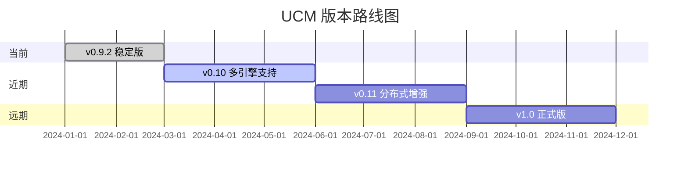
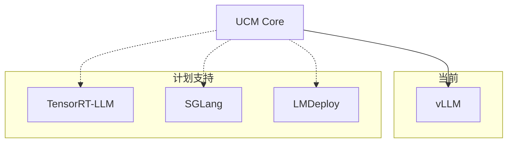
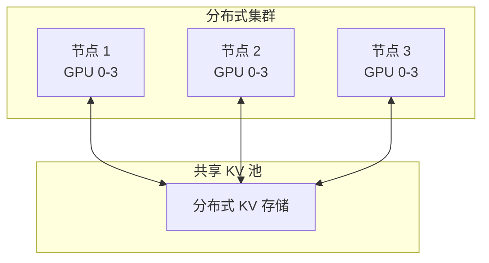
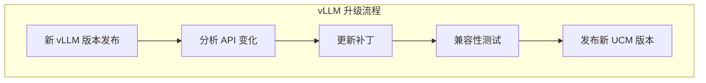

> **阅读时间**: 约 10 分钟
> **前置要求**: [权衡取舍分析](./02-tradeoffs-analysis.md)

---

## 概述

本文档描述 UCM 的未来发展方向，包括计划特性、版本兼容路线图和社区贡献指南。

---

## 1. 版本路线图

### 1.1 当前版本 (v0.9.x)


### 1.2 版本特性规划
| 版本 | 主要特性 | 状态 |
|------|---------|------|
| v0.9.2 | vLLM v0.9.2 集成, GSA/ESA 稀疏 | 已发布 |
| v0.10 | 多推理引擎支持, KV 压缩 | 开发中 |
| v0.11 | 分布式 KV 共享, 自动伸缩 | 规划中 |
| v1.0 | 稳定 API, 完整文档, 性能优化 | 规划中 |

---

## 2. 计划特性

### 2.1 多推理引擎支持


**设计方向**：
- 抽象推理引擎接口
- 引擎特定适配层
- 统一的 KV 管理 API

### 2.2 KV 压缩

**目标**：减少存储和传输开销

```yaml
# 计划配置
ucm_compression:
  enabled: true
  method: "quantize"  # quantize, sparse, learned
  bits: 4             # INT4 量化
  compression_ratio: 0.25
```
**技术方案**：
- INT4/INT8 量化
- 稀疏编码
- 学习型压缩

### 2.3 分布式 KV 共享


**设计要点**：
- 跨节点 KV 复用
- 一致性协议
- 负载均衡

### 2.4 自动调优

```python
# 计划 API
from ucm.autotune import AutoTuner

tuner = AutoTuner(
    workload="chat",
    constraints={
        "max_latency_ms": 100,
        "max_memory_gb": 16,
    }
)

optimal_config = tuner.tune(
    model="llama-2-7b",
    sample_requests=sample_data
)
```

---

## 3. 技术演进

### 3.1 存储层演进

| 阶段 | 特性 | 状态 |
|------|------|------|
| Phase 1 | 本地存储 (POSIX) | ✅ 完成 |
| Phase 2 | 分布式存储 (NFS/S3) | ✅ 完成 |
| Phase 3 | 分布式内存 (Mooncake) | ✅ 完成 |
| Phase 4 | 持久内存 (Intel Optane) | 规划中 |
| Phase 5 | 存储计算分离 | 规划中 |

### 3.2 稀疏注意力演进

| 阶段 | 算法 | 状态 |
|------|------|------|
| Phase 1 | ESA (检索式) | ✅ 完成 |
| Phase 2 | GSA (预取式) | ✅ 完成 |
| Phase 3 | Blend (非前缀) | ✅ 完成 |
| Phase 4 | 自适应稀疏 | 开发中 |
| Phase 5 | 学习型选择 | 规划中 |

### 3.3 集成层演进

| 阶段 | 特性 | 状态 |
|------|------|------|
| Phase 1 | Monkey Patching | ✅ 完成 |
| Phase 2 | 官方插件 API | 规划中 |
| Phase 3 | 多引擎统一接口 | 规划中 |

---

## 4. vLLM 版本兼容性

### 4.1 兼容性计划

| vLLM 版本 | UCM 支持 | 说明 |
|-----------|---------|------|
| v0.9.2 | ✅ 完全支持 | 当前主要版本 |
| v0.9.3+ | ⏳ 计划支持 | 跟随 vLLM 更新 |
| v1.0+ | ⏳ 计划支持 | 可能需要重大调整 |

### 4.2 升级策略


---
## 5. 社区贡献

### 5.1 贡献领域

| 领域 | 难度 | 影响 |
|------|------|------|
| 文档改进 | 低 | 高 |
| Bug 修复 | 中 | 高 |
| 新存储后端 | 中 | 中 |
| 新稀疏算法 | 高 | 高 |
| 新引擎支持 | 高 | 高 |

### 5.2 贡献指南

```bash
git clone https://github.com/your-fork/unified-cache-management

git checkout -b feature/your-feature

pip install -e .
pytest test/

git push origin feature/your-feature
```

### 5.3 代码规范

- Python: PEP 8, Black 格式化
- C++: Google Style Guide
- 提交信息: [类型] 简短描述

```bash
[Feat] Add support for Intel Optane storage
[Bugfix] Fix memory leak in pinned pool
[Doc] Update configuration reference
```

---
## 6. 研究方向
### 6.1 学术合作
| 方向 | 描述 |
|------|------|
| 自适应稀疏 | 根据工作负载动态调整稀疏比例 |
| KV 压缩 | 低精度量化对生成质量的影响 |
| 预测性预取 | 基于历史模式预测未来访问 |
| 跨请求共享 | 不同请求间的 KV 复用 |

### 6.2 性能目标

| 指标 | 当前 | v1.0 目标 |
|------|------|----------|
| 命中率 | ~70% | >80% |
| 加载速度 | 10 GB/s | 20 GB/s |
| 延迟开销 | <5% | <2% |
| 内存节省 | 30% | 50% |
---
## 7. 已知限制

### 7.1 当前限制

| 限制 | 描述 | 计划解决版本 |
|------|------|-------------|
| 单引擎 | 仅支持 vLLM | v0.10 |
| 前缀依赖 | 标准模式要求前缀匹配 | 已有 Blend 解决 |
| 版本耦合 | 补丁与 vLLM 版本耦合 | 持续跟进 |

### 7.2 已知问题

- 长序列（>32K）性能下降
- 某些 TP 配置下的 Block 对齐问题
- Ascend 平台部分功能未完全支持

---
## 8. 参与方式
### 8.1 反馈渠道
- GitHub Issues: Bug 报告和功能请求
- Discussions: 技术讨论和问答
- PR: 代码贡献
### 8.2 路线图讨论
社区成员可以通过以下方式参与路线图讨论：
1. 在 GitHub Discussions 提出新特性建议
2. 对现有规划提供反馈
3. 参与技术方案讨论
4. 贡献实现代码

---

## 9. 总结

UCM 的发展方向聚焦于：

1. **更广泛的兼容性**：支持更多推理引擎
2. **更高的效率**：KV 压缩和优化传输
3. **更强的扩展性**：分布式部署和自动伸缩
4. **更好的易用性**：自动调优和完善文档
我们欢迎社区的参与和贡献，共同推动 LLM 推理优化技术的发展。