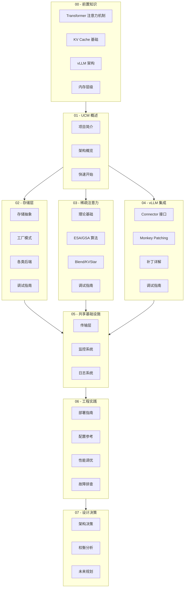

# UCM Deep-Dive 技术文档

> **版本**: v0.3.0
> **基于 vLLM 版本**: v0.9.2
> **文档更新日期**: 2026-01-30

---

## 文档概览

本文档系统性地介绍 UCM（Unified Cache Management）的设计原理、实现细节和工程实践。通过模块化的组织方式，帮助不同背景的读者快速定位所需内容。



---

## 目录结构

### 00 - 前置知识
> 在深入 UCM 之前需要掌握的基础概念

| 文档 | 内容 |
|------|------|
| [01-transformer-attention.md](./00-prerequisites/01-transformer-attention.md) | Transformer 架构与注意力机制原理 |
| [02-kv-cache-fundamentals.md](./00-prerequisites/02-kv-cache-fundamentals.md) | KV Cache 概念、计算公式与优化动机 |
| [03-vllm-architecture.md](./00-prerequisites/03-vllm-architecture.md) | vLLM 架构、PagedAttention 与 Block 管理 |
| [04-memory-hierarchy.md](./00-prerequisites/04-memory-hierarchy.md) | GPU/CPU 内存层级与数据传输 |

### 01 - UCM 概述
> 快速了解 UCM 的定位、架构和使用方法

| 文档 | 内容 |
|------|------|
| [01-introduction.md](./01-overview/01-introduction.md) | UCM 项目简介、设计目标与核心特性 |
| [02-architecture-overview.md](./01-overview/02-architecture-overview.md) | 四大支柱架构、模块关系与数据流 |
| [03-quick-start.md](./01-overview/03-quick-start.md) | 安装配置与首个推理示例 |

### 02 - 存储层
> 深入理解 UCM 的存储抽象和各类后端实现

| 文档 | 内容 |
|------|------|
| [01-storage-abstraction.md](./02-storage/01-storage-abstraction.md) | UcmKVStoreBase 接口设计与异步任务模型 |
| [02-factory-pattern.md](./02-storage/02-factory-pattern.md) | 存储工厂模式与延迟加载机制 |
| [03-posix-backend.md](./02-storage/03-posix-backend.md) | POSIX 本地文件系统存储实现 |
| [04-cache-backend.md](./02-storage/04-cache-backend.md) | 内存缓存层与 LRU 淘汰策略 |
| [05-pipeline-composition.md](./02-storage/05-pipeline-composition.md) | Pipeline 存储组合设计 |
| [06-distributed-backends.md](./02-storage/06-distributed-backends.md) | NFS、DS3FS、Mooncake 分布式后端 |
| [07-storage-debug.md](./02-storage/07-storage-debug.md) | 存储层调试入口与常见问题 |

### 03 - 稀疏注意力
> 各类稀疏注意力算法的原理与实现

| 文档 | 内容 |
|------|------|
| [01-sparse-fundamentals.md](./03-sparse-attention/01-sparse-fundamentals.md) | 稀疏注意力理论基础与分类 |
| [02-base-interface.md](./03-sparse-attention/02-base-interface.md) | UcmSparseBase 接口与生命周期钩子 |
| [03-esa-algorithm.md](./03-sparse-attention/03-esa-algorithm.md) | ESA 算法原理与 Retrieval Worker |
| [04-gsa-algorithm.md](./03-sparse-attention/04-gsa-algorithm.md) | GSA 算法与 Prefetch Engine |
| [05-gsa-on-device.md](./03-sparse-attention/05-gsa-on-device.md) | GPU 端 GSA 实现与 Hash 编码 |
| [06-kvstar-multistep.md](./03-sparse-attention/06-kvstar-multistep.md) | KVStar 多步一致性算法 |
| [07-blend-algorithm.md](./03-sparse-attention/07-blend-algorithm.md) | Cache Blend 非前缀 KV 复用 |
| [08-rerope.md](./03-sparse-attention/08-rerope.md) | RERoPE 位置外推实现 |
| [09-sparse-debug.md](./03-sparse-attention/09-sparse-debug.md) | 稀疏算法调试入口与技巧 |

### 04 - vLLM 集成
> UCM 与 vLLM 的无侵入式集成机制

| 文档 | 内容 |
|------|------|
| [01-connector-interface.md](./04-vllm-integration/01-connector-interface.md) | KVConnector 接口设计与版本演进 |
| [02-ucm-connector.md](./04-vllm-integration/02-ucm-connector.md) | UCMDirectConnector 实现详解 |
| [03-blend-connector.md](./04-vllm-integration/03-blend-connector.md) | BlendConnector 专用实现 |
| [04-monkey-patching.md](./04-vllm-integration/04-monkey-patching.md) | Monkey Patching 机制与 Import Hook |
| [05-patch-anatomy.md](./04-vllm-integration/05-patch-anatomy.md) | 各类补丁的详细分析 |
| [06-integration-debug.md](./04-vllm-integration/06-integration-debug.md) | 集成调试入口与验证方法 |

### 05 - 共享基础设施
> 跨模块的公共组件与服务

| 文档 | 内容 |
|------|------|
| [01-transport-layer.md](./05-shared-infrastructure/01-transport-layer.md) | 设备传输层与多平台支持 |
| [02-metrics-observability.md](./05-shared-infrastructure/02-metrics-observability.md) | Prometheus 监控与 Grafana 集成 |
| [03-logging-system.md](./05-shared-infrastructure/03-logging-system.md) | 日志配置与调试技巧 |
| [04-infrastructure-debug.md](./05-shared-infrastructure/04-infrastructure-debug.md) | 基础设施调试指南 |

### 06 - 工程实践
> 部署、配置、调优与故障排查

| 文档 | 内容 |
|------|------|
| [01-deployment-guide.md](./06-engineering-practice/01-deployment-guide.md) | 多平台部署与生产环境配置 |
| [02-configuration-reference.md](./06-engineering-practice/02-configuration-reference.md) | 完整配置参数参考手册 |
| [03-performance-tuning.md](./06-engineering-practice/03-performance-tuning.md) | 性能调优策略与基准测试 |
| [04-troubleshooting.md](./06-engineering-practice/04-troubleshooting.md) | 常见问题与解决方案 |

### 07 - 设计决策
> 架构选型背后的思考与权衡

| 文档 | 内容 |
|------|------|
| [01-architecture-decisions.md](./07-design-decisions/01-architecture-decisions.md) | 关键架构决策与原因分析 |
| [02-tradeoffs-analysis.md](./07-design-decisions/02-tradeoffs-analysis.md) | 性能、灵活性、复杂度权衡 |
| [03-future-roadmap.md](./07-design-decisions/03-future-roadmap.md) | 未来演进方向与规划 |

---

## 阅读路径

根据你的背景和目标，选择合适的阅读路径：

### 新手入门路径

适合首次接触 UCM 或 LLM 推理优化的读者。

```
00-prerequisites (全部) → 01-overview (全部) → 06-engineering-practice/01-deployment-guide.md
```

1. **前置知识**：理解 Transformer、KV Cache、vLLM 基础
2. **项目概述**：了解 UCM 的定位和架构
3. **快速开始**：动手运行第一个示例

### 存储开发者路径

适合需要开发新存储后端或理解存储层的工程师。

```
01-overview/02-architecture-overview.md → 02-storage (全部) → 05-shared-infrastructure/01-transport-layer.md
```

1. **架构概览**：理解存储层在整体架构中的位置
2. **存储模块**：深入存储抽象、工厂模式、各类后端
3. **传输层**：了解底层数据传输机制

### 算法研究者路径

适合研究稀疏注意力算法或需要实现新算法的研究者。

```
00-prerequisites/01-transformer-attention.md → 03-sparse-attention (全部) → 07-design-decisions/02-tradeoffs-analysis.md
```

1. **注意力基础**：回顾注意力机制原理
2. **稀疏算法**：学习各类算法的设计与实现
3. **权衡分析**：理解算法设计中的取舍

### 集成开发者路径

适合需要将 UCM 集成到其他框架或深度定制的开发者。

```
01-overview/02-architecture-overview.md → 04-vllm-integration (全部) → 03-sparse-attention/02-base-interface.md
```

1. **架构概览**：理解集成层的设计
2. **vLLM 集成**：掌握 Connector 和 Patch 机制
3. **稀疏接口**：了解算法扩展点

### 运维人员路径

适合负责 UCM 部署和运维的工程师。

```
01-overview/03-quick-start.md → 06-engineering-practice (全部) → 05-shared-infrastructure/02-metrics-observability.md
```

1. **快速开始**：了解基本部署流程
2. **工程实践**：掌握配置、调优、故障排查
3. **监控系统**：配置可观测性

### 调试专家路径

需要深入排查问题的开发者。

```
各模块的 debug.md 文件：
├── 02-storage/07-storage-debug.md
├── 03-sparse-attention/09-sparse-debug.md
├── 04-vllm-integration/06-integration-debug.md
└── 05-shared-infrastructure/04-infrastructure-debug.md
```

---

## 调试链路快速参考

```
初始化阶段
├── vLLM Import Hook ────→ ucm/integration/vllm/patch/apply_patch.py:install_import_hook()
├── 补丁应用 ────────────→ ucm/integration/vllm/patch/apply_patch.py:apply_all_patches()
├── Connector 创建 ──────→ ucm/integration/vllm/ucm_connector.py:UCMDirectConnector.__init__()
└── Store 工厂 ──────────→ ucm/store/factory.py:UcmConnectorFactory.create_connector()

请求处理阶段
├── 请求哈希 ────────────→ ucm/integration/vllm/ucm_connector.py:RequestHasher.__call__()
├── Block 查找 ──────────→ ucm/store/ucmstore.py:UcmKVStoreBase.lookup()
├── 稀疏元数据构建 ──────→ ucm/sparse/base.py:UcmSparseBase.build_sparse_meta()
└── Attention 钩子 ──────→ ucm/sparse/base.py:UcmSparseBase.attention_begin()

数据传输阶段
├── 加载 KV ─────────────→ ucm/store/ucmstore.py:UcmKVStoreBase.load()
├── 转储 KV ─────────────→ ucm/store/ucmstore.py:UcmKVStoreBase.dump()
├── Pipeline 路由 ───────→ ucm/store/pipeline/connector.py:UcmPipelineStore.load()
└── 任务完成 ────────────→ ucm/store/ucmstore.py:UcmKVStoreBase.wait()

指标收集阶段
├── 统计监控 ────────────→ ucm/shared/metrics/ucmmonitor.py:StatsMonitor.get_instance()
└── Prometheus 日志 ─────→ ucm/shared/metrics/observability.py:PrometheusLogger.log_prometheus()
```

---

## 文档约定

### 代码引用格式

文档中的代码引用使用 `文件路径:行号` 格式，例如：

- `ucm/store/ucmstore.py:72` - 表示 ucmstore.py 文件的第 72 行

### Mermaid 图表

所有图表遵循以下规范：
- 中文标签使用双引号包裹
- subgraph 使用 `subgraph id["中文标签"]` 格式
- 避免使用中文冒号，改用破折号

### 符号说明

| 符号 | 含义 |
|------|------|
| `→` | 数据流向或调用关系 |
| `├──` / `└──` | 层级结构 |
| `[必需]` | 必要的配置或步骤 |
| `[可选]` | 可选的配置或步骤 |

---

## 贡献指南

欢迎贡献文档改进！请参阅 [CONTRIBUTING.md](../../CONTRIBUTING.md) 了解贡献流程。

文档相关问题请在 GitHub Issues 中标记 `documentation` 标签。
