> 本章将带你了解 vLLM 的整体架构设计，包括核心组件、数据流程和代码目录结构。

---

## 引言

经过前两章的学习，我们已经了解了 LLM 推理面临的挑战以及 vLLM 的核心创新理念。本章将从系统架构的角度，全面介绍 vLLM 的设计。

理解架构是深入学习的基础。当你后续阅读代码或调试问题时，这张"地图"将帮助你快速定位。

---

## 1. 系统架构全景图

### 1.1 高层架构

vLLM 采用分层架构设计，从上到下分为四层：

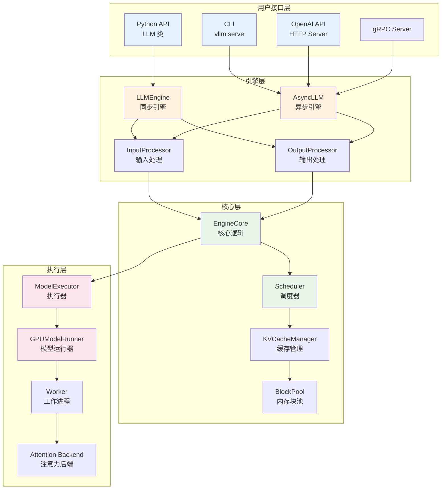

**各层职责**：

| 层级 | 职责 | 关键组件 |
|------|------|---------|
| 用户接口层 | 提供多种访问方式 | LLM、CLI、OpenAI API |
| 引擎层 | 协调输入输出处理 | LLMEngine、AsyncLLM |
| 核心层 | 调度与内存管理 | Scheduler、KVCacheManager |
| 执行层 | 模型计算与采样 | ModelExecutor、ModelRunner |

### 1.2 组件交互关系

让我们用一个更详细的流程图展示组件之间的交互：

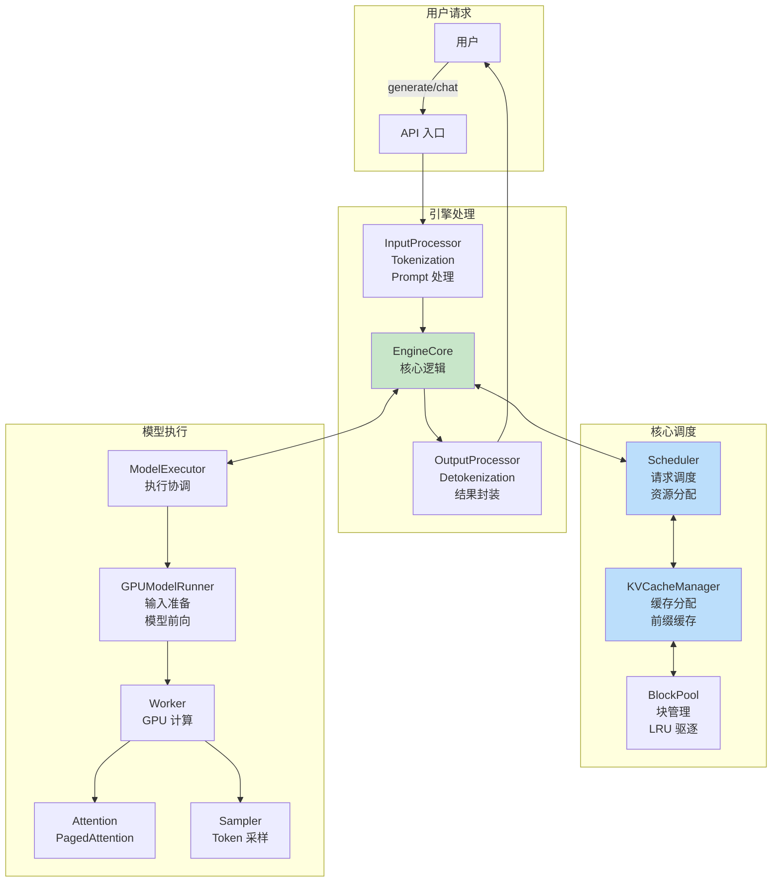

---

## 2. 核心组件详解

### 2.1 用户接口层

vLLM 提供多种使用方式，满足不同场景需求。

#### LLM 类（Python API）

**文件位置**：`vllm/entrypoints/llm.py`

这是最直接的使用方式，适合批量处理场景：

```python
from vllm import LLM, SamplingParams

llm = LLM(model="meta-llama/Llama-2-7b-hf")

sampling_params = SamplingParams(
    temperature=0.8,
    top_p=0.95,
    max_tokens=100
)

prompts = ["Hello, my name is", "The capital of France is"]
outputs = llm.generate(prompts, sampling_params)

for output in outputs:
    print(output.outputs[0].text)
```

#### CLI 命令

**文件位置**：`vllm/entrypoints/cli/main.py`

适合快速启动服务：

```bash
# 启动 OpenAI 兼容的 API 服务
vllm serve meta-llama/Llama-2-7b-hf --port 8000

vllm bench --model meta-llama/Llama-2-7b-hf
```

#### OpenAI 兼容 API

**文件位置**：`vllm/entrypoints/openai/`

提供与 OpenAI API 兼容的 HTTP 接口：

```python
import openai

client = openai.OpenAI(
    base_url="http://localhost:8000/v1",
    api_key="token-abc123"  # vLLM 不验证 API key
)

response = client.chat.completions.create(
    model="meta-llama/Llama-2-7b-hf",
    messages=[{"role": "user", "content": "Hello!"}]
)
```

### 2.2 引擎层

#### LLMEngine

**文件位置**：`vllm/v1/engine/llm_engine.py`

LLMEngine 是同步模式的核心协调器：

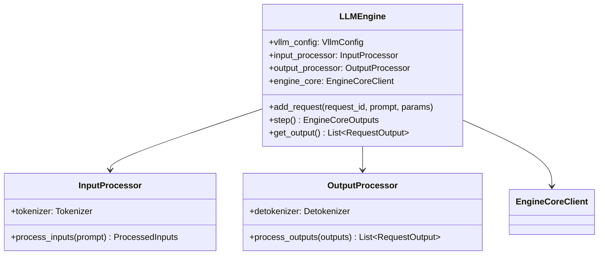

**核心职责**：
- 接收用户请求，通过 InputProcessor 处理
- 将请求发送给 EngineCore 执行
- 通过 OutputProcessor 处理输出结果

#### AsyncLLM

**文件位置**：`vllm/v1/engine/async_llm.py`

AsyncLLM 是异步模式的引擎，支持流式输出和高并发：

```python
# AsyncLLM 的典型使用场景
async for output in engine.generate(prompt, params):
    # 流式输出每个 token
    print(output.outputs[0].text, end="", flush=True)
```

### 2.3 核心层

#### EngineCore

**文件位置**：`vllm/v1/engine/core.py`

EngineCore 是整个系统的"大脑"，包含核心的调度和执行逻辑：

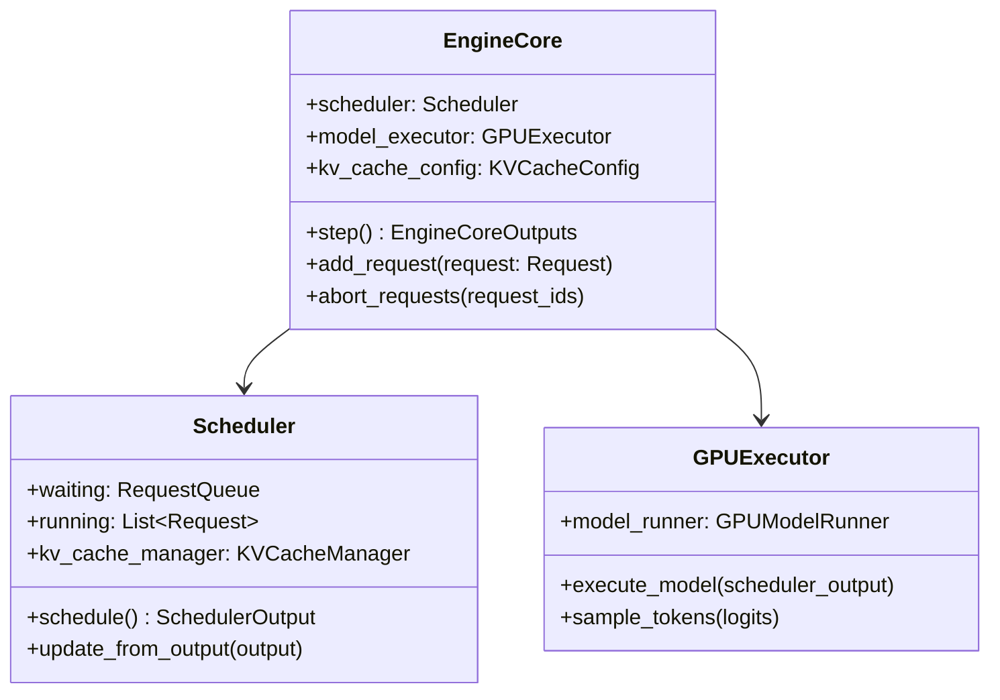

**EngineCore.step() 方法是核心循环**：

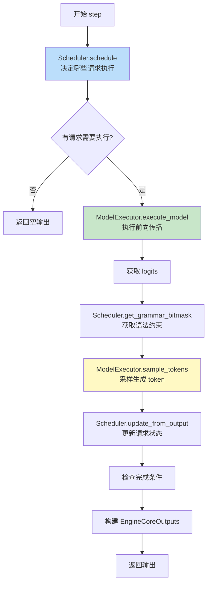

#### Scheduler（调度器）

**文件位置**：`vllm/v1/core/sched/scheduler.py`

Scheduler 负责决定每个 step 执行哪些请求：

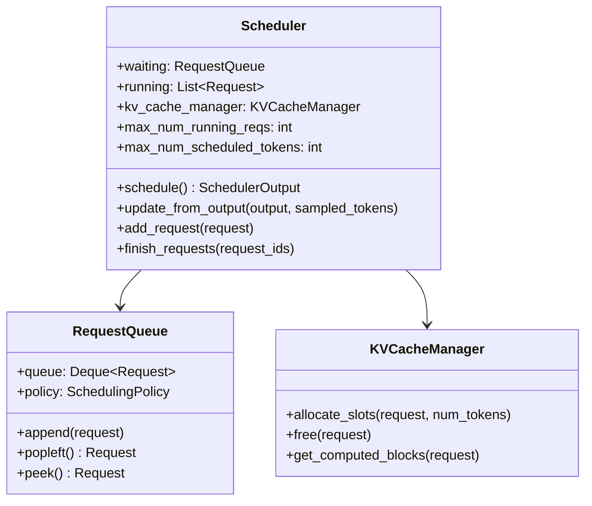

**调度流程简述**：

1. **处理 running 请求**：
   - 计算每个请求需要的新 token 数
   - 尝试分配 KV Cache
   - 内存不足时执行抢占

2. **处理 waiting 请求**：
   - 按优先级从队列取出请求
   - 检查资源是否足够
   - 分配资源并移入 running

3. **返回 SchedulerOutput**：
   - 包含需要执行的请求信息
   - 传递给 ModelExecutor 执行

#### KVCacheManager（KV Cache 管理器）

**文件位置**：`vllm/v1/core/kv_cache_manager.py`

KVCacheManager 管理 KV Cache 的分配和释放：

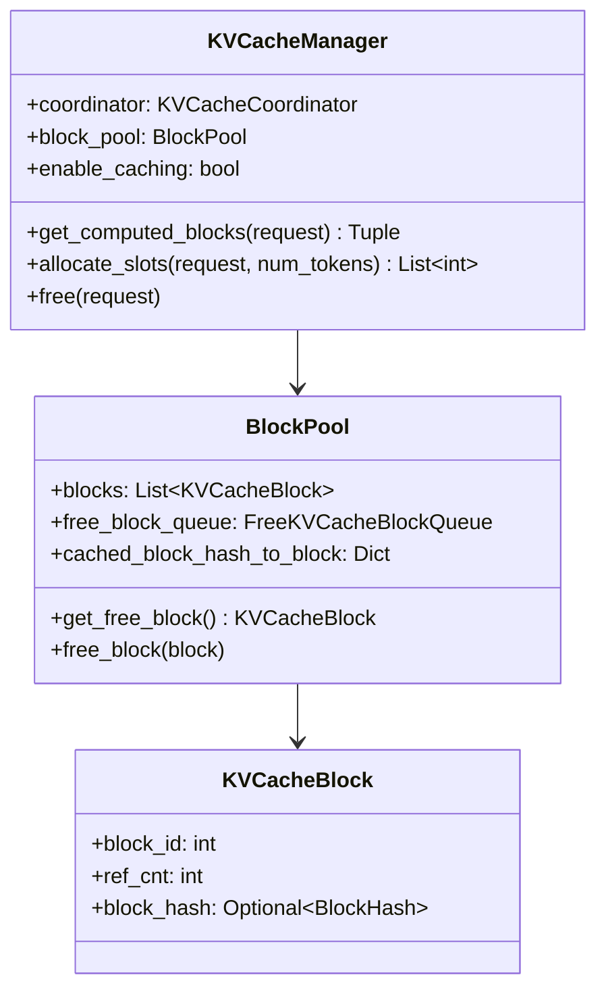

### 2.4 执行层

#### GPUModelRunner

**文件位置**：`vllm/v1/worker/gpu_model_runner.py`

GPUModelRunner 负责准备输入数据并执行模型前向传播：

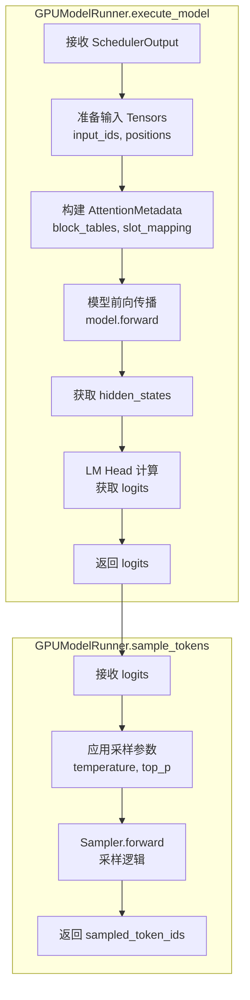

**关键数据结构**：

| 数据 | 说明 | 来源 |
|------|------|------|
| input_ids | 输入 token IDs | SchedulerOutput |
| positions | 位置编码索引 | 计算得到 |
| block_tables | 块表映射 | KVCacheManager |
| slot_mapping | 槽位映射 | KVCacheManager |
| kv_caches | KV Cache 张量 | GPU 显存 |

#### Attention Backend

**文件位置**：`vllm/v1/attention/backends/`

vLLM 支持多种注意力实现后端：

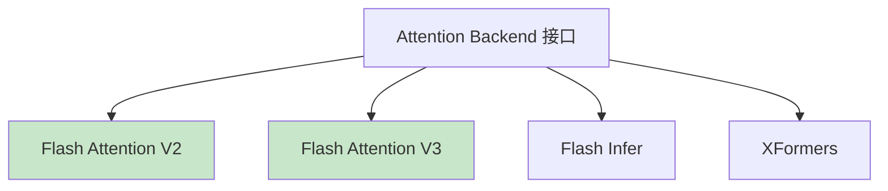

**Flash Attention** 是默认后端，提供高效的注意力计算和 PagedAttention 支持。

---

## 3. 数据流完整追踪

让我们用一个具体的例子追踪数据在系统中的完整流程：

### 3.1 完整请求处理时序图

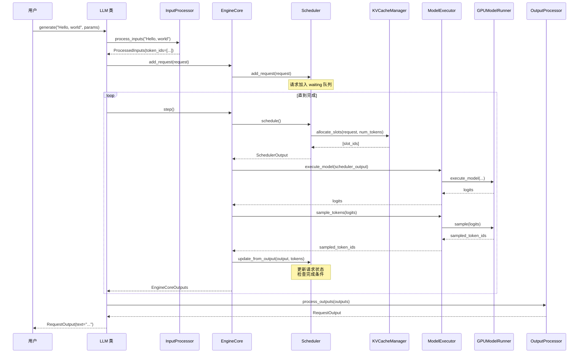

### 3.2 数据结构变化追踪

| 阶段 | 输入数据 | 输出数据 | 处理组件 |
|------|---------|---------|---------|
| 用户输入 | `"Hello, world"` | - | - |
| Tokenization | 字符串 | `token_ids=[15496, 11, 995]` | InputProcessor |
| 请求创建 | token_ids | `Request` 对象 | EngineCore |
| 调度 | Request | `SchedulerOutput` | Scheduler |
| 缓存分配 | Request | `slot_mapping, block_tables` | KVCacheManager |
| 模型执行 | Tensors | `logits` | GPUModelRunner |
| 采样 | logits | `token_id=318` | Sampler |
| 状态更新 | token_id | 更新 Request | Scheduler |
| 输出处理 | token_ids | `"I am..."` | OutputProcessor |

---

## 4. 代码目录结构详解

### 4.1 目录树概览

```
vllm/
├── entrypoints/                  # 用户接口层
│   ├── llm.py                    # LLM 类（Python API）
│   ├── cli/                      # CLI 命令
│   │   └── main.py               # CLI 入口
│   ├── openai/                   # OpenAI 兼容 API
│   │   ├── api_server.py         # HTTP 服务器
│   │   └── serving_*.py          # 各种 serving 实现
│   └── serve/                    # serve 相关
│
├── v1/                           # V1 架构（新版本）
│   ├── engine/                   # 引擎层
│   │   ├── llm_engine.py         # LLMEngine
│   │   ├── async_llm.py          # AsyncLLM
│   │   ├── core.py               # EngineCore
│   │   ├── core_client.py        # 核心客户端
│   │   ├── input_processor.py    # 输入处理
│   │   ├── output_processor.py   # 输出处理
│   │   └── detokenizer.py        # 解码器
│   │
│   ├── core/                     # 核心层
│   │   ├── sched/                # 调度相关
│   │   │   ├── scheduler.py      # Scheduler
│   │   │   ├── request_queue.py  # 请求队列
│   │   │   └── output.py         # 调度输出
│   │   ├── kv_cache_manager.py   # KV Cache 管理
│   │   ├── block_pool.py         # 内存块池
│   │   └── kv_cache_utils.py     # 缓存工具
│   │
│   ├── worker/                   # 执行层
│   │   ├── gpu_model_runner.py   # GPU 模型运行器
│   │   ├── gpu_worker.py         # GPU 工作进程
│   │   └── block_table.py        # 块表管理
│   │
│   ├── attention/                # 注意力实现
│   │   ├── backends/             # 后端实现
│   │   │   └── flash_attn.py     # Flash Attention
│   │   └── ops/                  # 底层操作
│   │       └── paged_attn.py     # PagedAttention
│   │
│   ├── sample/                   # 采样
│   │   └── sampler.py            # Sampler
│   │
│   ├── request.py                # Request 数据结构
│   └── outputs.py                # 输出数据结构
│
├── config/                       # 配置
│   └── vllm.py                   # VllmConfig
│
├── model_executor/               # 模型执行器
│   ├── models/                   # 模型实现
│   └── layers/                   # 层实现
│
├── sampling_params.py            # SamplingParams
│
└── csrc/                         # C++/CUDA 代码
    └── attention/                # 注意力 CUDA 内核
        ├── paged_attention_v1.cu
        └── paged_attention_v2.cu
```

### 4.2 关键文件索引

| 功能类别 | 文件路径 | 关键类/函数 |
|---------|---------|------------|
| **入口** | | |
| Python API | `vllm/entrypoints/llm.py` | `LLM`, `generate()` |
| CLI | `vllm/entrypoints/cli/main.py` | `main()` |
| **引擎** | | |
| 同步引擎 | `vllm/v1/engine/llm_engine.py` | `LLMEngine` |
| 异步引擎 | `vllm/v1/engine/async_llm.py` | `AsyncLLM` |
| 核心逻辑 | `vllm/v1/engine/core.py` | `EngineCore`, `step()` |
| **调度** | | |
| 调度器 | `vllm/v1/core/sched/scheduler.py` | `Scheduler`, `schedule()` |
| 请求队列 | `vllm/v1/core/sched/request_queue.py` | `RequestQueue` |
| **内存管理** | | |
| KV Cache | `vllm/v1/core/kv_cache_manager.py` | `KVCacheManager` |
| 块池 | `vllm/v1/core/block_pool.py` | `BlockPool` |
| **执行** | | |
| 模型运行 | `vllm/v1/worker/gpu_model_runner.py` | `GPUModelRunner` |
| Worker | `vllm/v1/worker/gpu_worker.py` | `GPUWorker` |
| **注意力** | | |
| PagedAttention | `vllm/v1/attention/ops/paged_attn.py` | `PagedAttention` |
| Flash Attention | `vllm/v1/attention/backends/flash_attn.py` | `FlashAttentionBackend` |
| **数据结构** | | |
| 请求 | `vllm/v1/request.py` | `Request`, `RequestStatus` |
| 采样参数 | `vllm/sampling_params.py` | `SamplingParams` |

---

## 5. 配置系统

### 5.1 VllmConfig

vLLM 使用统一的配置系统，主要配置包括：

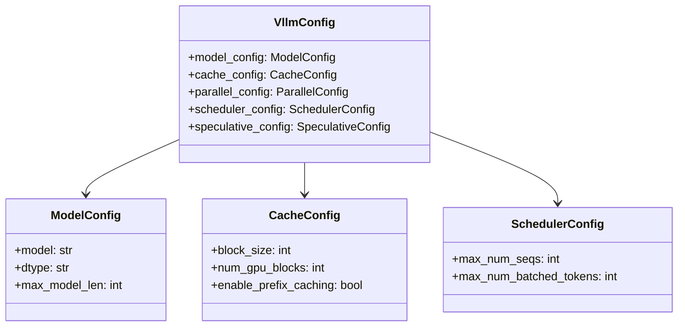

### 5.2 常用配置参数

| 参数 | 说明 | 默认值 |
|------|------|--------|
| `--model` | 模型路径或名称 | 必填 |
| `--dtype` | 数据精度 | auto |
| `--max-model-len` | 最大序列长度 | 模型默认 |
| `--gpu-memory-utilization` | GPU 显存利用率 | 0.9 |
| `--max-num-seqs` | 最大并发请求数 | 256 |
| `--block-size` | KV Cache 块大小 | 16 |
| `--enable-prefix-caching` | 启用前缀缓存 | False |
| `--tensor-parallel-size` | 张量并行大小 | 1 |

---

## 6. V1 vs 旧版架构

vLLM 当前主要使用 V1 架构，相比旧版有以下改进：

| 特性 | 旧版 | V1 |
|------|------|-----|
| 调度器 | BlockSpaceManager | KVCacheManager |
| 执行流程 | 同步为主 | 异步优化 |
| 内存管理 | 基础 PagedAttention | 更细粒度的块管理 |
| 前缀缓存 | 有限支持 | 完整支持 |
| 代码组织 | 分散 | 模块化 |

本文档系列主要基于 **V1 架构**进行讲解。

---

## 7. 本章小结

### 架构层次

1. **用户接口层**：提供 Python API、CLI、OpenAI API 等多种访问方式
2. **引擎层**：LLMEngine/AsyncLLM 协调输入输出处理
3. **核心层**：Scheduler 和 KVCacheManager 负责调度和内存管理
4. **执行层**：GPUModelRunner 执行模型计算

### 关键组件

- **EngineCore**：系统"大脑"，包含 step() 核心循环
- **Scheduler**：决定哪些请求在每个 step 执行
- **KVCacheManager**：管理 KV Cache 的分配和释放
- **GPUModelRunner**：准备输入并执行模型前向传播

### 数据流程

```
用户输入 → Tokenization → 请求调度 → 缓存分配
    → 模型执行 → 采样 → 状态更新 → Detokenization → 用户输出
```

### 代码定位

- 入口：`vllm/entrypoints/`
- 引擎：`vllm/v1/engine/`
- 调度：`vllm/v1/core/sched/`
- 执行：`vllm/v1/worker/`
- 注意力：`vllm/v1/attention/`

---

## 思考题

1. 为什么 vLLM 要将 EngineCore 和 LLMEngine 分开设计？
2. Scheduler 和 KVCacheManager 之间是如何协作的？
3. 如果你要添加一个新的用户接口（比如 WebSocket），需要修改哪些组件？

---

## 下一步

架构概览已经完成，接下来我们将进入深度学习基础部分，为理解核心算法打下理论基础：

👉 [下一章：神经网络基础](../02-dl-fundamentals/01-neural-network-basics.md)

---

## 附：快速参考卡片

### 请求处理流程

```
User → LLM.generate() → InputProcessor → EngineCore
     → Scheduler.schedule() → KVCacheManager.allocate_slots()
     → GPUModelRunner.execute_model() → Sampler
     → Scheduler.update_from_output() → OutputProcessor → User
```

### 核心文件速查

```
调度逻辑    → vllm/v1/core/sched/scheduler.py
缓存管理    → vllm/v1/core/kv_cache_manager.py
模型执行    → vllm/v1/worker/gpu_model_runner.py
核心循环    → vllm/v1/engine/core.py
```
