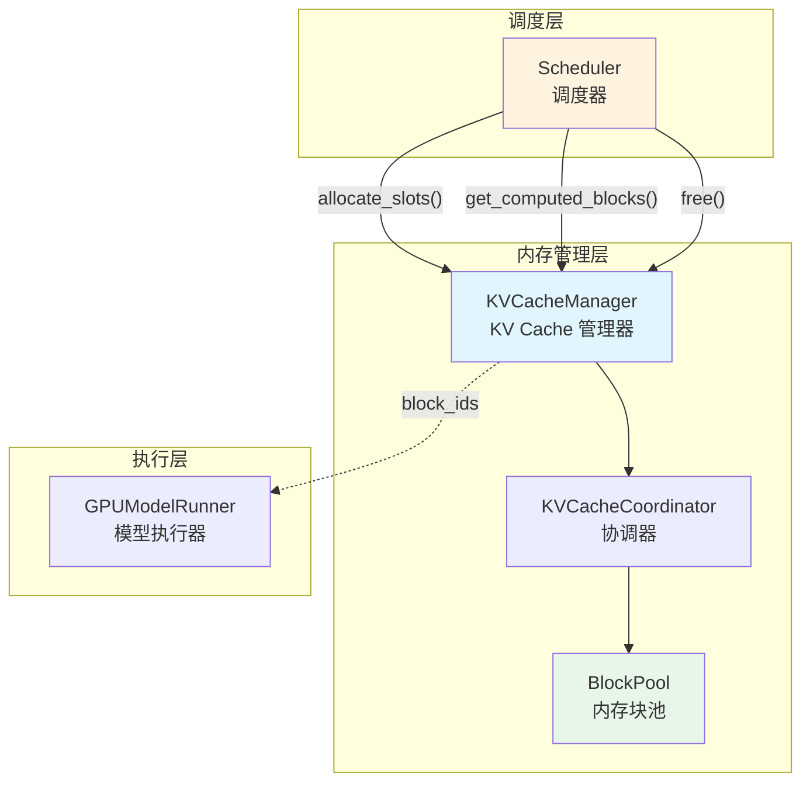
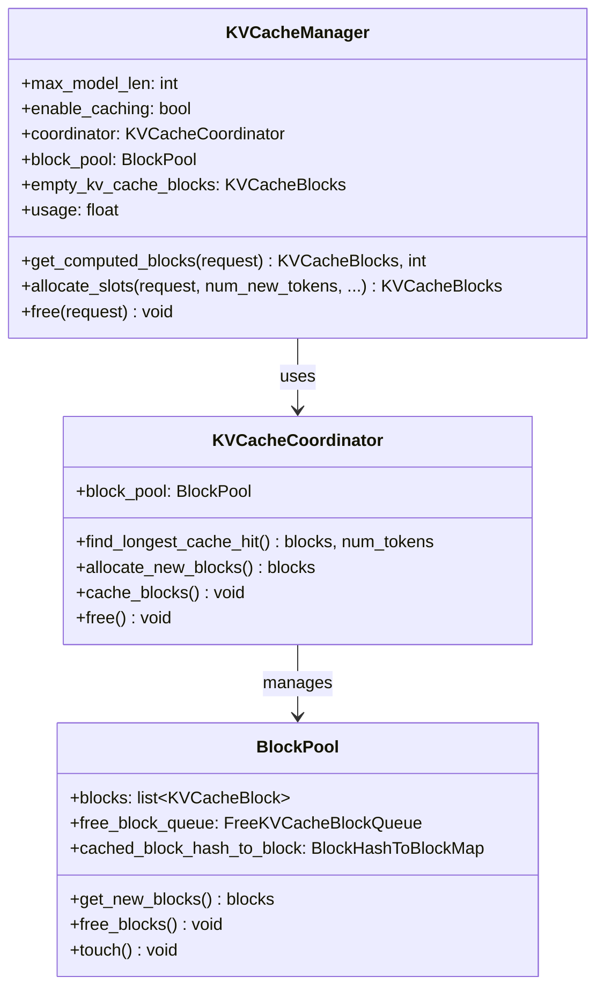
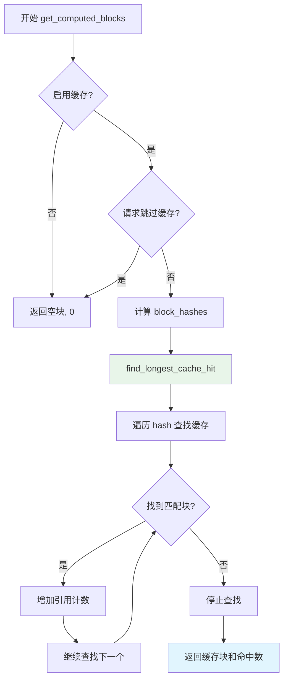
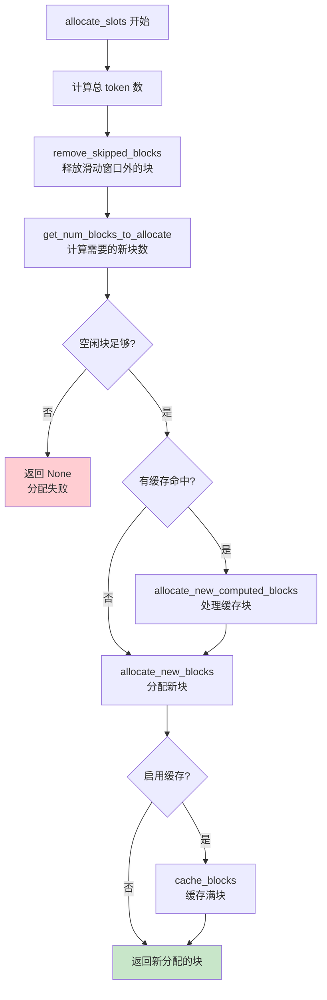
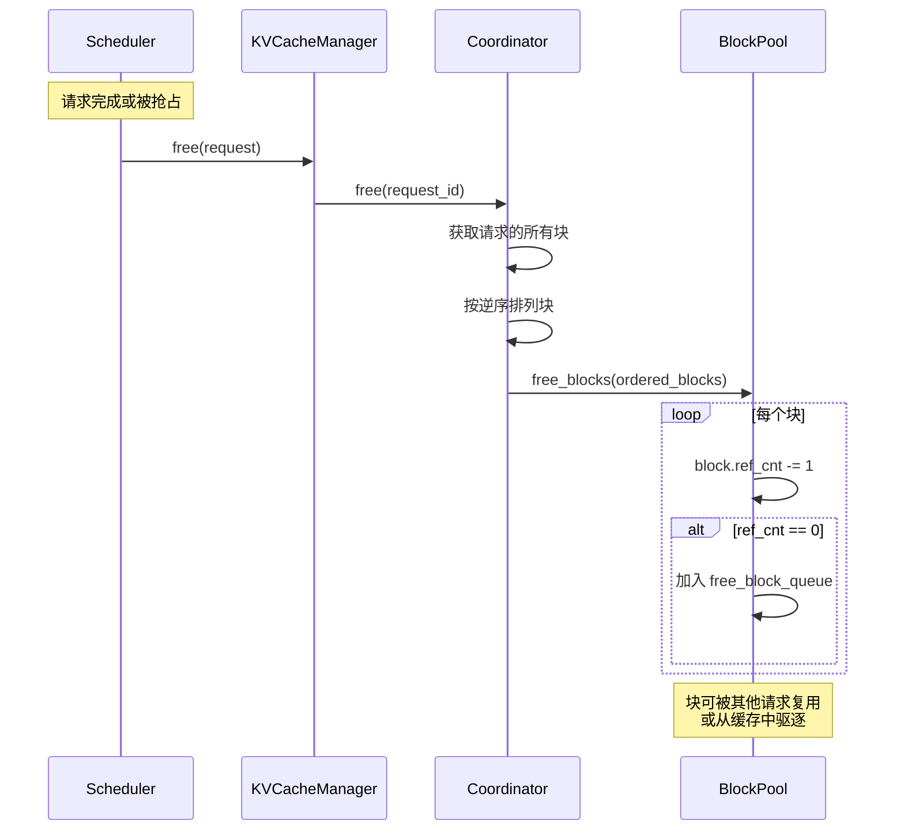
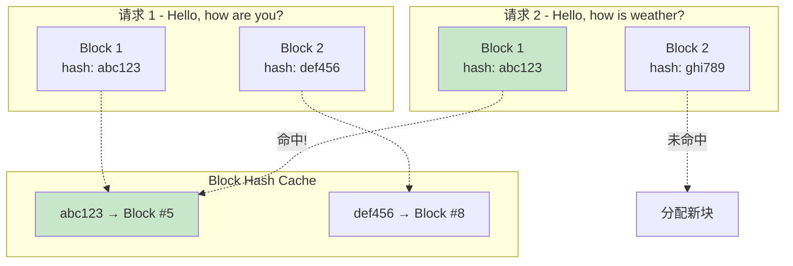
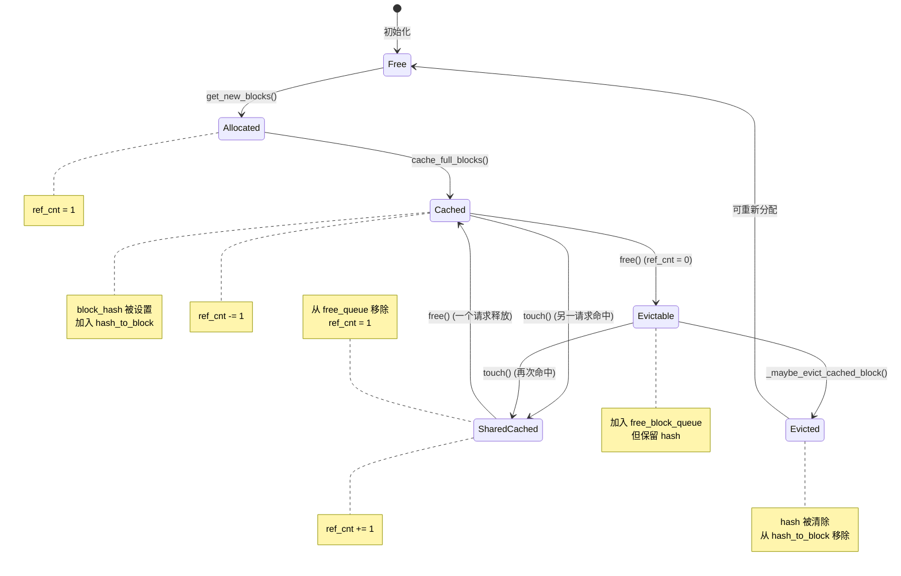
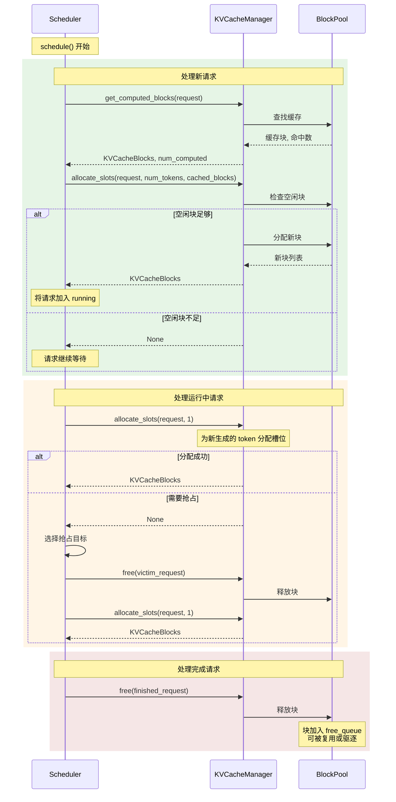

在上一章中，我们详细了解了 PagedAttention 的原理——它将 KV Cache 分成固定大小的 Block 来管理。但是，**谁来负责这些 Block 的分配、释放和缓存查找呢？** 答案就是本章的主角：**KVCacheManager**。

KVCacheManager 是 vLLM 内存管理的核心组件，它连接了调度器（Scheduler）和底层的内存池（BlockPool），为每个请求提供高效的 KV Cache 管理服务。

---

## 1. KVCacheManager 在架构中的位置



**KVCacheManager 的核心职责：**

1. **分配管理**：为请求分配 KV Cache 槽位
2. **前缀缓存**：查找和利用已缓存的前缀块
3. **生命周期管理**：跟踪和释放请求的内存块
4. **使用率监控**：提供 KV Cache 使用统计

---

## 2. 核心数据结构

### 2.1 KVCacheBlocks - 分配结果

`KVCacheBlocks` 是 KVCacheManager 返回给调度器的分配结果，它封装了实际的内存块列表：

```python
# vllm/v1/core/kv_cache_manager.py

@dataclass
class KVCacheBlocks:
    """
    KVCacheManager 的分配结果，作为 Scheduler 和 KVCacheManager
    之间的接口，隐藏 KVCacheManager 的内部数据结构。
    """

    blocks: tuple[Sequence[KVCacheBlock], ...]
    """
    blocks[i][j] 表示第 i 个 kv_cache_group 的第 j 个 block。

    使用 kv_cache_group 作为外层维度，因为不同 group 可能有
    不同数量的 blocks（为未来扩展预留）。
    """

    def get_block_ids(self) -> tuple[list[int], ...]:
        """将 KVCacheBlocks 转换为 block_ids 列表"""
        return tuple([blk.block_id for blk in group]
                     for group in self.blocks)
```

**为什么需要这个封装？**

- **接口隔离**：调度器不需要知道内部的 Block 结构细节
- **GC 优化**：预分配空的 KVCacheBlocks 避免频繁创建对象
- **多 Group 支持**：为混合精度等场景预留扩展能力

### 2.2 KVCacheManager 类结构

```python
# vllm/v1/core/kv_cache_manager.py

class KVCacheManager:
    def __init__(
        self,
        kv_cache_config: KVCacheConfig,
        max_model_len: int,
        hash_block_size: int,
        enable_caching: bool = True,    # 是否启用前缀缓存
        use_eagle: bool = False,        # 是否使用 EAGLE 投机解码
        log_stats: bool = False,        # 是否记录统计信息
        ...
    ):
        self.max_model_len = max_model_len
        self.enable_caching = enable_caching

        # 核心组件：协调器（封装了 BlockPool）
        self.coordinator = get_kv_cache_coordinator(
            kv_cache_config=kv_cache_config,
            max_model_len=self.max_model_len,
            enable_caching=self.enable_caching,
            ...
        )

        # BlockPool 引用（实际内存管理）
        self.block_pool = self.coordinator.block_pool

        # 预分配的空 KVCacheBlocks（避免 GC 开销）
        self.empty_kv_cache_blocks = KVCacheBlocks(
            tuple(() for _ in range(self.num_kv_cache_groups))
        )
```

**组件关系图：**



---

## 3. 核心方法详解

### 3.1 get_computed_blocks() - 查找前缀缓存

当新请求到来时，调度器首先调用 `get_computed_blocks()` 检查是否有可复用的缓存：

```python
def get_computed_blocks(self, request: Request) -> tuple[KVCacheBlocks, int]:
    """
    获取请求的已计算（缓存）块。

    Returns:
        - KVCacheBlocks: 命中的缓存块列表
        - int: 已计算的 token 数量
    """
    # 情况1：禁用缓存或请求明确跳过缓存
    if not self.enable_caching or request.skip_reading_prefix_cache:
        return self.empty_kv_cache_blocks, 0

    # 情况2：查找最长前缀匹配
    # 注意：即使全部命中，也需要保留最后一个 token 用于计算 logits
    max_cache_hit_length = request.num_tokens - 1

    computed_blocks, num_new_computed_tokens = (
        self.coordinator.find_longest_cache_hit(
            request.block_hashes,     # 请求的 block hash 列表
            max_cache_hit_length      # 最大命中长度
        )
    )

    # 记录统计信息
    if self.log_stats:
        self.prefix_cache_stats.record(
            num_tokens=request.num_tokens,
            num_hits=num_new_computed_tokens,
            preempted=request.num_preemptions > 0,
        )

    return self.create_kv_cache_blocks(computed_blocks), num_new_computed_tokens
```

**缓存查找流程图：**



**关键点：为什么 `max_cache_hit_length = num_tokens - 1`？**

```
输入: "Hello, how are you?"
Token IDs: [101, 102, 103, 104, 105]  (5个token)

假设全部命中缓存:
- 前4个token的KV已缓存 ✓
- 但我们仍需要"重新计算"最后1个token
- 因为我们需要得到最后位置的 logits 来采样下一个 token

所以最多只能利用 num_tokens - 1 = 4 个缓存
```

### 3.2 allocate_slots() - 分配缓存槽位

这是 KVCacheManager 最核心的方法，负责为请求分配 KV Cache 存储空间：

```python
def allocate_slots(
    self,
    request: Request,
    num_new_tokens: int,          # 新生成的 token 数
    num_new_computed_tokens: int = 0,  # 前缀缓存命中的 token 数
    new_computed_blocks: KVCacheBlocks | None = None,  # 缓存命中的块
    num_lookahead_tokens: int = 0,     # 投机解码的预测 token 数
    num_external_computed_tokens: int = 0,  # 外部（如 P/D）计算的 token
    delay_cache_blocks: bool = False,  # 是否延迟缓存
    num_encoder_tokens: int = 0,       # 编码器 token（如 Whisper）
) -> KVCacheBlocks | None:
    """
    为请求分配新的 KV Cache 槽位。

    Returns:
        - KVCacheBlocks: 新分配的块
        - None: 内存不足，分配失败
    """
```

**块布局说明：**

```
----------------------------------------------------------------------
| < comp > | < new_comp > | < ext_comp >  | < new >  | < lookahead > |
----------------------------------------------------------------------
                                          |   < 需要计算的 >          |
----------------------------------------------------------------------
                          |            < 需要分配的 >                 |
----------------------------------------------------------------------
                          | < 需要缓存的 >           |
----------------------------------------------------------------------

术语说明:
comp      = 已计算的 token（request.num_computed_tokens）
new_comp  = 新命中缓存的 token（前缀缓存）
ext_comp  = 外部计算的 token（如 P/D disaggregation）
new       = 新生成的 token
lookahead = 投机解码的预测 token
```

**allocate_slots 核心流程：**

```python
def allocate_slots(self, request, num_new_tokens, ...):
    # 1. 计算需要的总 token 数
    num_local_computed_tokens = request.num_computed_tokens + num_new_computed_tokens
    total_computed_tokens = num_local_computed_tokens + num_external_computed_tokens
    num_tokens_need_slot = total_computed_tokens + num_new_tokens + num_lookahead_tokens

    # 2. 释放滑动窗口外的块（如果有）
    # 这可以回收一些空间，减少需要新分配的块
    self.coordinator.remove_skipped_blocks(
        request.request_id, total_computed_tokens
    )

    # 3. 计算需要分配的新块数
    num_blocks_to_allocate = self.coordinator.get_num_blocks_to_allocate(
        request_id=request.request_id,
        num_tokens=num_tokens_need_slot,
        new_computed_blocks=new_computed_block_list,
        ...
    )

    # 4. 检查是否有足够的空闲块
    if num_blocks_to_allocate > self.block_pool.get_num_free_blocks():
        return None  # 内存不足！

    # 5. 处理前缀缓存命中的块（增加引用计数）
    if new_computed_block_list or num_external_computed_tokens > 0:
        self.coordinator.allocate_new_computed_blocks(
            request_id=request.request_id,
            new_computed_blocks=new_computed_block_list,
            ...
        )

    # 6. 分配新块
    new_blocks = self.coordinator.allocate_new_blocks(
        request.request_id,
        num_tokens_need_slot,
        num_tokens_main_model,
        num_encoder_tokens,
    )

    # 7. 缓存新的满块（用于后续请求复用）
    if self.enable_caching and not delay_cache_blocks:
        self.coordinator.cache_blocks(request, num_tokens_to_cache)

    return self.create_kv_cache_blocks(new_blocks)
```

**完整流程图：**



### 3.3 free() - 释放请求资源

当请求完成或被抢占时，需要释放其占用的 KV Cache：

```python
def free(self, request: Request) -> None:
    """
    释放请求占用的块。
    按逆序释放，这样当启用缓存时，尾部块会先被驱逐。
    """
    self.coordinator.free(request.request_id)
```

**释放流程：**



**为什么要逆序释放？**

```
假设请求占用块: [Block_A, Block_B, Block_C, Block_D]
                   ↑        ↑        ↑        ↑
                  前缀     ....    ....     尾部

如果另一个请求有相同前缀，它更可能复用 Block_A, Block_B
所以我们希望：
  - 先释放 Block_D（尾部，最不可能被复用）
  - 后释放 Block_A（前缀，最可能被复用）

这样 LRU 驱逐时，尾部块会先被驱逐，前缀块保留更久
```

---

## 4. 前缀缓存机制详解

前缀缓存（Prefix Caching）是 vLLM 的重要优化，它允许多个请求共享相同前缀的 KV Cache。

### 4.1 Block Hash 计算

每个 Block 的 hash 值基于其包含的 token 序列计算：

```python
# 简化示意
def compute_block_hash(token_ids: list[int], block_size: int) -> BlockHash:
    """
    计算一个 block 的 hash 值。

    hash 基于：
    1. block 内的 token IDs
    2. 之前所有 block 的 hash（形成链式依赖）
    """
    # 确保是完整的 block
    assert len(token_ids) % block_size == 0

    # 使用加密 hash 或高效 hash 算法
    return hash(tuple(token_ids))
```

### 4.2 缓存查找过程



### 4.3 缓存块的生命周期



---

## 5. 与调度器的协作

KVCacheManager 和 Scheduler 紧密协作，下面是典型的调度循环中的交互：



---

## 6. 配置与调优

### 6.1 关键配置参数

| 参数 | 说明 | 建议值 |
|-----|------|-------|
| `enable_prefix_caching` | 是否启用前缀缓存 | True（有重复前缀时） |
| `block_size` | 每个 Block 的 token 数 | 16（默认） |
| `gpu_memory_utilization` | GPU 显存利用率 | 0.9（90%） |
| `max_model_len` | 最大序列长度 | 根据需求设置 |

### 6.2 性能优化建议

**1. 前缀缓存优化**

```python
# 适合启用前缀缓存的场景：
# - RAG 应用（共享检索文档）

llm = LLM(
    model="meta-llama/Llama-2-7b",
    enable_prefix_caching=True
)
```

**2. 内存使用监控**

```python
# 获取 KV Cache 使用率
usage = kv_cache_manager.usage  # 0.0 ~ 1.0

stats = kv_cache_manager.make_prefix_cache_stats()
print(f"缓存命中率: {stats.hit_rate:.2%}")
```

**3. 显存不足时的调整**

```python
# 方案1：减小 block_size

llm = LLM(model="...", gpu_memory_utilization=0.8)

llm = LLM(model="...", max_model_len=2048)
```

---

## 7. 代码位置速查

| 功能 | 文件 | 关键函数/类 |
|-----|------|------------|
| KVCacheManager | `vllm/v1/core/kv_cache_manager.py` | `KVCacheManager` 类 |
| 分配结果 | `vllm/v1/core/kv_cache_manager.py` | `KVCacheBlocks` 数据类 |
| 协调器 | `vllm/v1/core/kv_cache_coordinator.py` | `KVCacheCoordinator` |
| BlockPool | `vllm/v1/core/block_pool.py` | `BlockPool` 类 |
| Block 数据结构 | `vllm/v1/core/kv_cache_utils.py` | `KVCacheBlock` |

---

## 8. 小结

本章我们深入了解了 KVCacheManager 的工作原理：

1. **核心职责**：管理 KV Cache 的分配、释放和前缀缓存
2. **分层设计**：KVCacheManager → Coordinator → BlockPool
3. **关键方法**：
   - `get_computed_blocks()`：查找前缀缓存
   - `allocate_slots()`：分配缓存槽位
   - `free()`：释放请求资源
4. **前缀缓存**：通过 Block Hash 实现多请求共享
5. **与调度器协作**：为调度决策提供内存管理支持

在下一章中，我们将深入 BlockPool，了解底层的内存块管理和 LRU 驱逐策略。

---

## 导航

- 上一篇：[PagedAttention 分页注意力](01-paged-attention.md)
- 下一篇：[Block Pool 内存块池](03-block-pool.md)
- [返回目录](../README.md)
