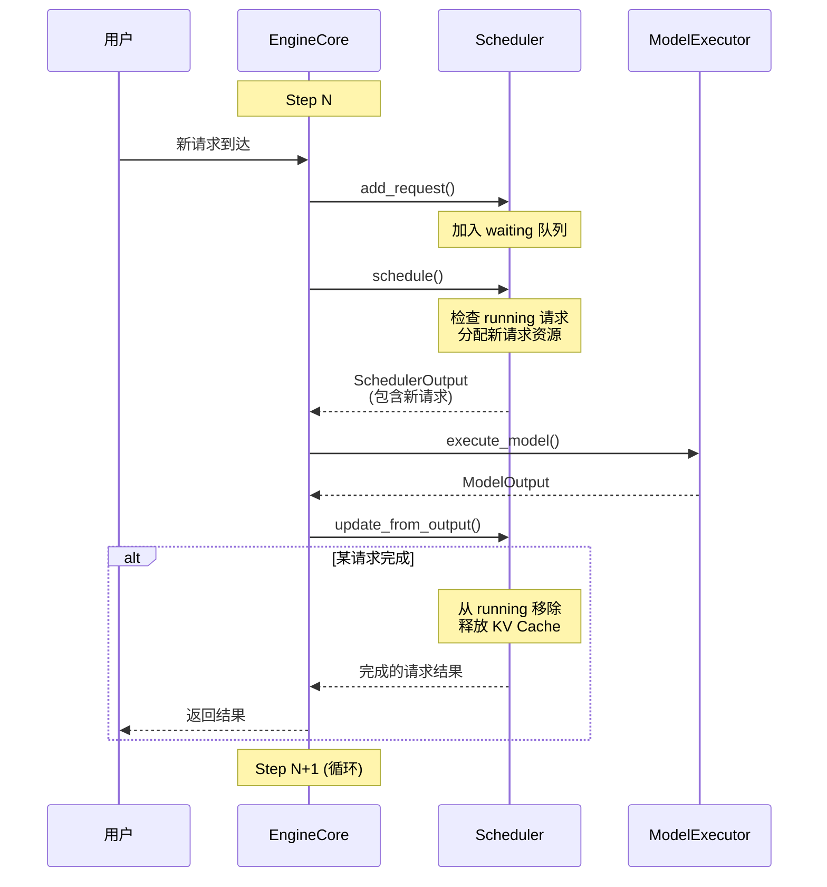
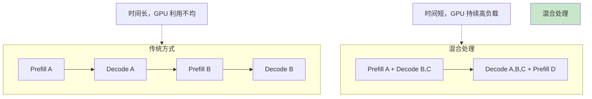
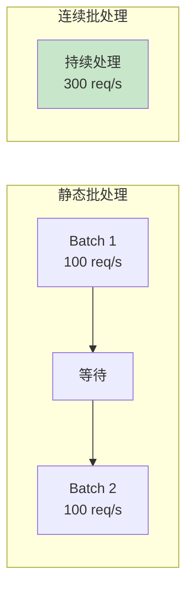

连续批处理（Continuous Batching）是 vLLM 实现高吞吐量的关键技术之一。与传统的静态批处理不同，连续批处理允许请求在推理过程中动态加入和退出，极大地提高了 GPU 利用率。

本章我们将深入了解连续批处理的原理、实现和优势。

---

## 1. 静态批处理的问题

### 1.1 什么是静态批处理

传统的 LLM 推理使用**静态批处理**：将一组请求打包成一个批次，等待所有请求完成后再处理下一批。

```
静态批处理示意:

Batch 1:
  请求 A: "你好" → 生成 50 个 token
  请求 B: "Hello, world" → 生成 100 个 token
  请求 C: "如何学习编程" → 生成 200 个 token

所有请求必须等待请求 C 完成才能返回结果
```

### 1.2 静态批处理的问题

```mermaid
gantt
    title 静态批处理的浪费
    dateFormat X
    axisFormat %s

    section Batch 1
    请求 A (50 tokens) :active, a1, 0, 50
    请求 A 等待       :done, a2, 50, 200
    请求 B (100 tokens) :active, b1, 0, 100
    请求 B 等待       :done, b2, 100, 200
    请求 C (200 tokens) :active, c1, 0, 200

    section Batch 2 (等待)
    请求 D           :crit, d1, 200, 250
    请求 E           :crit, e1, 200, 280
```



**问题分析：**

| 问题 | 说明 |
|-----|------|
| **GPU 空闲** | 短请求完成后，GPU 资源被浪费 |
| **高延迟** | 所有请求必须等待最长的请求完成 |
| **低吞吐量** | 新请求必须等待当前批次完成 |
| **内存浪费** | 必须为最长序列预分配内存 |

---

## 2. 连续批处理的解决方案

### 2.1 核心思想

连续批处理的核心思想是：**在每个推理步骤（iteration）级别进行调度**，而不是在批次级别。

```
连续批处理示意:

Step 1: [请求 A, 请求 B, 请求 C]
Step 2: [请求 A, 请求 B, 请求 C]
...
Step 50: 请求 A 完成 → 请求 D 加入
Step 51: [请求 D, 请求 B, 请求 C]  // 请求 D 立即开始！
...
Step 100: 请求 B 完成 → 请求 E 加入
Step 101: [请求 D, 请求 E, 请求 C]
...
```

### 2.2 优势对比

```mermaid
gantt
    title 连续批处理的高效性
    dateFormat X
    axisFormat %s

    section 请求流
    请求 A (50 tokens) :active, a1, 0, 50
    请求 B (100 tokens) :active, b1, 0, 100
    请求 C (200 tokens) :active, c1, 0, 200
    请求 D (立即开始) :active, d1, 50, 100
    请求 E (立即开始) :active, e1, 100, 180
    请求 F (立即开始) :active, f1, 100, 250
```



**优势分析：**

| 优势 | 说明 |
|-----|------|
| **高 GPU 利用率** | 完成的请求立即被新请求替换 |
| **低延迟** | 请求完成后立即返回，不等待其他请求 |
| **高吞吐量** | 新请求可以立即加入批次 |
| **按需分配** | 配合 PagedAttention，内存按需分配 |

---

## 3. vLLM 中的实现

### 3.1 迭代级调度（Iteration-Level Scheduling）

vLLM 的调度器在每个 step 都会重新调度：

```python
# vllm/v1/engine/core.py

def step(self) -> EngineCoreOutputs:
    """执行一个推理步骤"""

    # 1. 调度：决定这一步处理哪些请求
    scheduler_output = self.scheduler.schedule()

    # 2. 执行模型
    model_output = self.model_executor.execute_model(scheduler_output)

    # 3. 采样
    sampled_tokens = self.model_executor.sample_tokens(model_output)

    # 4. 更新状态：可能有请求完成或新请求加入
    outputs = self.scheduler.update_from_output(sampled_tokens)

    return outputs
```

### 3.2 动态请求管理



### 3.3 关键代码路径

```python
# vllm/v1/core/sched/scheduler.py

def schedule(self) -> SchedulerOutput:
    """每个 step 调用一次的调度方法"""

    scheduled_new_reqs = []
    scheduled_running_reqs = []
    token_budget = self.max_num_scheduled_tokens

    # 第一步：处理 running 请求
    for request in self.running:
        if token_budget <= 0:
            break

        # 计算需要的 token 数（通常是 1，decode 阶段）
        num_new_tokens = request.num_tokens - request.num_computed_tokens
        num_new_tokens = min(num_new_tokens, token_budget)

        # 分配 KV Cache
        new_blocks = self.kv_cache_manager.allocate_slots(
            request, num_new_tokens
        )

        if new_blocks is not None:
            scheduled_running_reqs.append(request)
            token_budget -= num_new_tokens

    # 第二步：处理 waiting 请求（动态加入！）
    while self.waiting and token_budget > 0:
        if len(self.running) >= self.max_num_running_reqs:
            break

        request = self.waiting.peek_request()

        # 查找缓存
        cached_blocks, num_cached = self.kv_cache_manager.get_computed_blocks(request)

        # 计算需要的 token 数
        num_new_tokens = request.num_tokens - num_cached
        num_new_tokens = min(num_new_tokens, token_budget)

        # 分配 KV Cache
        new_blocks = self.kv_cache_manager.allocate_slots(
            request, num_new_tokens, new_computed_blocks=cached_blocks
        )

        if new_blocks is None:
            break

        # 成功加入 running 队列
        self.waiting.pop_request()
        self.running.append(request)
        scheduled_new_reqs.append(request)
        token_budget -= num_new_tokens

    return SchedulerOutput(...)
```

---

## 4. Prefill 与 Decode 的混合处理

### 4.1 两阶段的特性回顾

| 阶段 | 计算类型 | GPU 利用率 | Token 数量 |
|-----|---------|-----------|-----------|
| Prefill | 计算密集型 | 高 | 多（整个 prompt） |
| Decode | 内存密集型 | 低 | 少（每次 1 个） |

### 4.2 混合处理示意

```
Step 1:
  请求 A: Prefill [token_1...token_100]  (100 tokens)
  请求 B: Decode [token_51]              (1 token)
  请求 C: Decode [token_30]              (1 token)

Step 2:
  请求 A: Decode [token_101]             (1 token)
  请求 B: Decode [token_52]              (1 token)
  请求 C: Decode [token_31]              (1 token)
  请求 D: Prefill [token_1...token_50]   (50 tokens，新加入！)
```

### 4.3 好处



---

## 5. 分块预填充与连续批处理

### 5.1 分块预填充（Chunked Prefill）

对于长输入，将 prefill 分成多个 chunk，与其他请求的 decode 交替执行：

```
请求 A: 长 prompt (1000 tokens)
请求 B, C, D: 正在 decode

Step 1:
  请求 A chunk 1: [token_1...token_256]
  请求 B, C, D: decode

Step 2:
  请求 A chunk 2: [token_257...token_512]
  请求 B, C, D: decode
  请求 E: 新加入

Step 3:
  请求 A chunk 3: [token_513...token_768]
  请求 B, C, D, E: decode

...
```

### 5.2 配置分块预填充

```python
llm = LLM(
    model="meta-llama/Llama-2-7b",
    enable_chunked_prefill=True,
    # 每个 chunk 的最大 token 数
    long_prefill_token_threshold=256,
)
```

### 5.3 分块预填充的实现

```python
# vllm/v1/core/sched/scheduler.py

def schedule(self):
    # 应用长 prefill 分块限制
    threshold = self.scheduler_config.long_prefill_token_threshold

    if 0 < threshold < num_new_tokens:
        # 限制每次处理的 token 数
        num_new_tokens = threshold
```

---

## 6. 性能对比

### 6.1 吞吐量对比



### 6.2 延迟对比

| 场景 | 静态批处理 | 连续批处理 |
|-----|-----------|-----------|
| 短请求在长请求批次中 | 高延迟（等待长请求） | 低延迟（立即返回） |
| 新请求到达 | 高延迟（等待当前批次） | 低延迟（立即加入） |
| 首 token 延迟 | 高（等待调度） | 低（可立即开始） |

### 6.3 GPU 利用率对比

```
静态批处理:
GPU: ████░░░░░░████░░░░░░████
     ^处理    ^空闲    ^处理

连续批处理:
GPU: ████████████████████████
     ^持续高效运行
```

---

## 7. 实现细节

### 7.1 请求完成检测

```python
# vllm/v1/core/sched/utils.py

def check_stop(request: Request, max_model_len: int) -> bool:
    """检查请求是否应该停止"""

    # 检查 EOS token
    if request.sampling_params.eos_token_id is not None:
        if request._all_token_ids[-1] == request.sampling_params.eos_token_id:
            return True

    # 检查最大长度
    if request.num_output_tokens >= request.max_tokens:
        return True

    # 检查模型最大长度
    if len(request._all_token_ids) >= max_model_len:
        return True

    # 检查停止字符串
    if request.sampling_params.stop:
        output_text = request.get_output_text()
        for stop_str in request.sampling_params.stop:
            if stop_str in output_text:
                return True

    return False
```

### 7.2 动态资源释放

```python
# vllm/v1/core/sched/scheduler.py

def update_from_output(self, model_output: ModelRunnerOutput) -> EngineCoreOutputs:
    """更新请求状态，处理完成的请求"""

    outputs = []
    finished_reqs = []

    for req_id, sampler_output in model_output.items():
        request = self.requests[req_id]

        # 追加输出 token
        request.append_output_token_ids(sampler_output.sampled_token_ids)

        # 检查停止条件
        if check_stop(request, self.max_model_len):
            finished_reqs.append(request)
            outputs.append(self._create_output(request))

    # 释放完成请求的资源
    for request in finished_reqs:
        self._free_request(request)
        self.running.remove(request)

    return EngineCoreOutputs(outputs=outputs)
```

### 7.3 Token 预算管理

```python
def schedule(self):
    token_budget = self.max_num_scheduled_tokens

    # 处理 running 请求
    for request in self.running:
        num_new_tokens = min(
            request.num_tokens - request.num_computed_tokens,
            token_budget
        )
        # 分配资源...
        token_budget -= num_new_tokens

    # 处理 waiting 请求
    while self.waiting and token_budget > 0:
        # 新请求可以使用剩余的预算
        num_new_tokens = min(num_required, token_budget)
        # 分配资源...
        token_budget -= num_new_tokens
```

---

## 8. 最佳实践

### 8.1 配置建议

```python
llm = LLM(
    model="meta-llama/Llama-2-7b",

    # 连续批处理相关
    max_num_seqs=256,              # 最大并发请求数
    max_num_batched_tokens=4096,   # 每步最大 token 数

    # 分块预填充
    enable_chunked_prefill=True,
    long_prefill_token_threshold=256,

    # 前缀缓存（配合连续批处理）
    enable_prefix_caching=True,
)
```

### 8.2 监控指标

| 指标 | 说明 | 健康范围 |
|-----|------|---------|
| `running_requests` | 运行中的请求数 | 接近 max_num_seqs |
| `waiting_requests` | 等待中的请求数 | 越小越好 |
| `gpu_utilization` | GPU 利用率 | > 80% |
| `tokens_per_second` | 吞吐量 | 取决于模型和硬件 |

---

## 9. 与其他技术的协同

### 9.1 连续批处理 + PagedAttention

```
连续批处理: 请求可以动态加入/退出
PagedAttention: 内存可以动态分配/释放

结合效果:
- 请求完成 → 立即释放 KV Cache → 新请求立即使用
- 无内存碎片，无预分配浪费
```

### 9.2 连续批处理 + 前缀缓存

```
场景: 多个请求有相同的系统提示

请求 A: [系统提示] + [用户问题 A]
请求 B: [系统提示] + [用户问题 B]

结合效果:
- 请求 A 处理系统提示，缓存 KV
- 请求 B 直接复用缓存，跳过系统提示的计算
- 连续批处理允许请求 B 立即加入并利用缓存
```

### 9.3 连续批处理 + 投机解码

```
结合效果:
- Draft 模型快速生成多个候选 token
- Target 模型验证
- 验证失败的 token 被拒绝，但其他请求不受影响
- 持续高效的批处理执行
```

---

## 10. 代码位置速查

| 功能 | 文件 | 关键函数 |
|-----|------|---------|
| 主调度循环 | `vllm/v1/engine/core.py` | `step()` |
| 调度器 | `vllm/v1/core/sched/scheduler.py` | `schedule()` |
| 状态更新 | `vllm/v1/core/sched/scheduler.py` | `update_from_output()` |
| 完成检测 | `vllm/v1/core/sched/utils.py` | `check_stop()` |
| 请求释放 | `vllm/v1/core/sched/scheduler.py` | `_free_request()` |

---

## 11. 小结

本章我们深入了解了连续批处理机制：

1. **静态批处理的问题**：GPU 空闲、高延迟、低吞吐量
2. **连续批处理的解决方案**：迭代级调度，动态加入/退出
3. **vLLM 的实现**：
   - 每个 step 重新调度
   - 完成的请求立即释放资源
   - 新请求立即加入批次
4. **Prefill 与 Decode 混合**：不同阶段的请求交替执行
5. **分块预填充**：长输入分成多个 chunk 处理
6. **与其他技术协同**：PagedAttention、前缀缓存、投机解码

连续批处理是 vLLM 实现高吞吐量的核心技术之一，结合 PagedAttention 和前缀缓存，使得 vLLM 能够高效地服务大量并发请求。

---

## 导航

- 上一篇：[调度器原理](04-scheduler.md)
- 下一篇：[入口点分析](../04-code-walkthrough/01-entry-points.md)
- [返回目录](../README.md)
