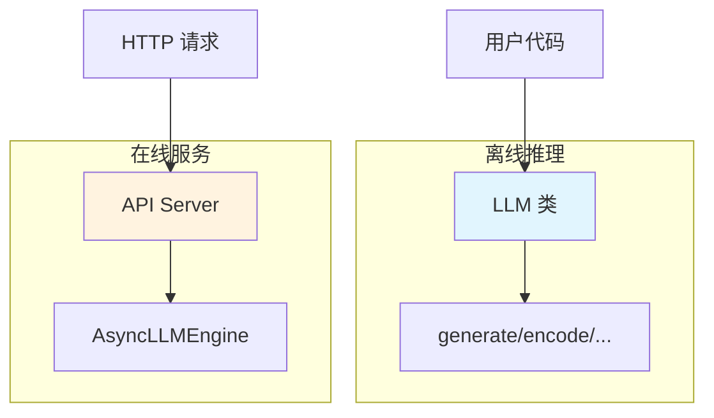
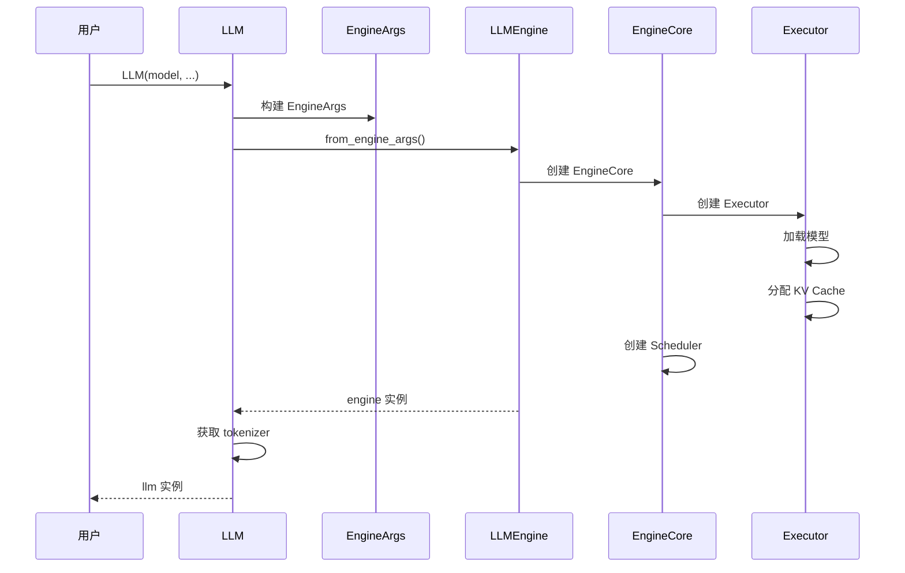
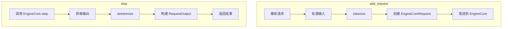
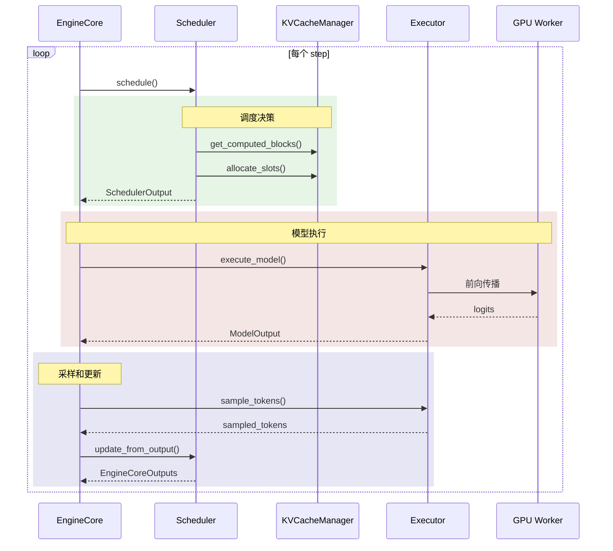
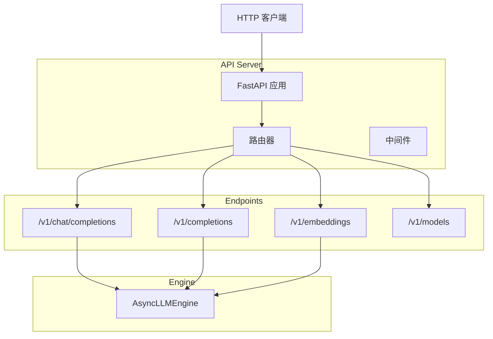
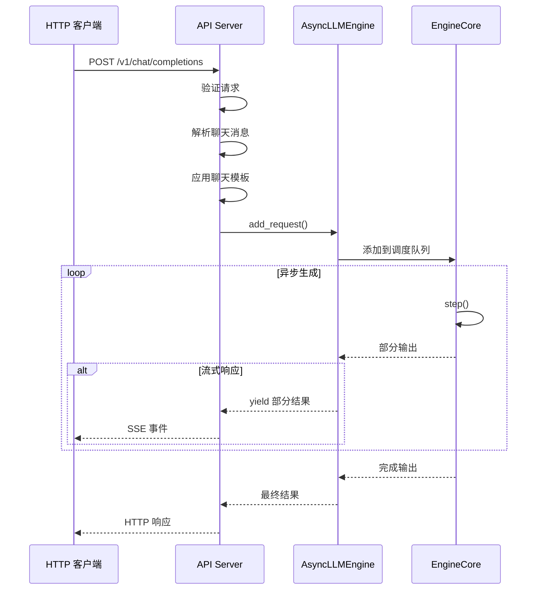
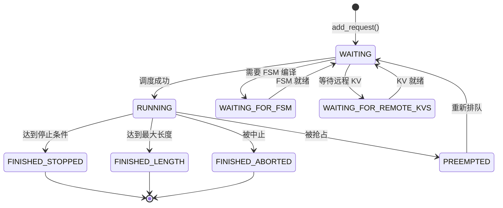

本章开始，我们将从代码层面深入分析 vLLM 的执行流程。首先从入口点开始，了解用户如何与 vLLM 交互，以及请求是如何被处理的。

---

## 1. vLLM 的两种使用方式

vLLM 提供两种主要的使用方式：



| 方式 | 入口类 | 适用场景 |
|-----|-------|---------|
| 离线推理 | `LLM` | 批量处理、脚本调用、研究实验 |
| 在线服务 | `AsyncLLMEngine` | Web 服务、API 接口、实时应用 |

---

## 2. LLM 类 - 离线推理入口

### 2.1 类定义与初始化

```python
# vllm/entrypoints/llm.py

class LLM:
    """用于从给定提示和采样参数生成文本的 LLM。

    这个类包含一个分词器、一个语言模型（可能分布在多个 GPU 上），
    以及为中间状态（即 KV Cache）分配的 GPU 内存空间。
    """

    def __init__(
        self,
        model: str,                         # 模型路径或名称
        *,
        tokenizer: str | None = None,        # 分词器路径
        tokenizer_mode: str = "auto",        # 分词器模式
        trust_remote_code: bool = False,     # 信任远程代码
        tensor_parallel_size: int = 1,       # 张量并行大小
        dtype: str = "auto",                 # 数据类型
        quantization: str | None = None,     # 量化方法
        gpu_memory_utilization: float = 0.9, # GPU 内存利用率
        enable_prefix_caching: bool = False, # 启用前缀缓存
        **kwargs,                            # 更多配置参数
    ):
        # 1. 构建配置
        engine_args = EngineArgs(
            model=model,
            tokenizer=tokenizer,
            tensor_parallel_size=tensor_parallel_size,
            dtype=dtype,
            quantization=quantization,
            gpu_memory_utilization=gpu_memory_utilization,
            enable_prefix_caching=enable_prefix_caching,
            **kwargs,
        )

        # 2. 创建 LLMEngine
        self.llm_engine = LLMEngine.from_engine_args(engine_args)

        # 3. 获取分词器
        self.tokenizer = self.llm_engine.get_tokenizer()

        # 4. 请求计数器
        self.request_counter = Counter()
```

### 2.2 初始化流程



### 2.3 generate() - 文本生成

```python
# vllm/entrypoints/llm.py

def generate(
    self,
    prompts: PromptType | list[PromptType] | None = None,
    sampling_params: SamplingParams | list[SamplingParams] | None = None,
    prompt_token_ids: list[list[int]] | None = None,
    use_tqdm: bool = True,
    lora_request: LoRARequest | list[LoRARequest] | None = None,
) -> list[RequestOutput]:
    """生成文本的主方法。

    Args:
        prompts: 输入提示（字符串或多模态数据）
        sampling_params: 采样参数（温度、top_k、top_p 等）
        prompt_token_ids: 直接提供 token IDs
        use_tqdm: 是否显示进度条
        lora_request: LoRA 适配器请求

    Returns:
        RequestOutput 列表，包含生成的文本
    """
    # 1. 参数验证和标准化
    if prompts is None and prompt_token_ids is None:
        raise ValueError("prompts or prompt_token_ids must be provided")

    # 2. 处理采样参数
    if sampling_params is None:
        sampling_params = SamplingParams()

    # 3. 添加请求到引擎
    for i, (prompt, params) in enumerate(zip(prompts, sampling_params_list)):
        request_id = str(next(self.request_counter))
        self._add_request(
            request_id=request_id,
            prompt=prompt,
            params=params,
            lora_request=lora_request,
        )

    # 4. 运行引擎直到完成
    return self._run_engine(use_tqdm=use_tqdm)
```

### 2.4 _run_engine() - 运行引擎

```python
def _run_engine(self, use_tqdm: bool = True) -> list[RequestOutput]:
    """运行引擎直到所有请求完成"""

    outputs: list[RequestOutput] = []

    # 使用 tqdm 显示进度（可选）
    pbar = tqdm(total=num_requests, disable=not use_tqdm)

    while self.llm_engine.has_unfinished_requests():
        # 执行一步
        step_outputs = self.llm_engine.step()

        for output in step_outputs:
            if output.finished:
                outputs.append(output)
                pbar.update(1)

    pbar.close()

    # 按请求 ID 排序返回
    return sorted(outputs, key=lambda x: int(x.request_id))
```

---

## 3. LLMEngine - 引擎核心

### 3.1 类结构

```python
# vllm/v1/engine/llm_engine.py

class LLMEngine:
    """vLLM 的同步推理引擎"""

    def __init__(self, vllm_config: VllmConfig, ...):
        # 核心组件
        self.engine_core: EngineCore  # 内部循环
        self.tokenizer: TokenizerLike  # 分词器
        self.input_processor  # 输入处理器

    @classmethod
    def from_engine_args(cls, engine_args: EngineArgs) -> "LLMEngine":
        """从引擎参数创建实例（工厂方法）"""
        vllm_config = engine_args.create_engine_config()
        return cls(vllm_config, ...)

    def add_request(
        self,
        request_id: str,
        prompt: PromptType,
        params: SamplingParams,
    ) -> None:
        """添加请求到引擎"""
        ...

    def step(self) -> list[RequestOutput]:
        """执行一步推理"""
        ...
```

### 3.2 关键方法流程



---

## 4. EngineCore - 内部循环

### 4.1 类定义

```python
# vllm/v1/engine/core.py

class EngineCore:
    """vLLM 引擎的内部循环"""

    def __init__(
        self,
        vllm_config: VllmConfig,
        executor_class: type[Executor],
        log_stats: bool,
        ...
    ):
        # 1. 加载插件
        from vllm.plugins import load_general_plugins
        load_general_plugins()

        # 2. 创建模型执行器
        self.model_executor = executor_class(vllm_config)

        # 3. 初始化 KV Cache
        num_gpu_blocks, num_cpu_blocks, kv_cache_config = (
            self._initialize_kv_caches(vllm_config)
        )
        vllm_config.cache_config.num_gpu_blocks = num_gpu_blocks

        # 4. 初始化 Worker 端的 KV Cache
        self.collective_rpc("initialize_cache", args=(num_gpu_blocks, num_cpu_blocks))

        # 5. 创建调度器
        Scheduler = vllm_config.scheduler_config.get_scheduler_cls()
        self.scheduler = Scheduler(
            vllm_config=vllm_config,
            kv_cache_config=kv_cache_config,
            ...
        )
```

### 4.2 step() - 核心执行循环

```python
def step(self) -> EngineCoreOutputs:
    """执行一步推理"""

    # 1. 调度：决定这一步处理哪些请求
    scheduler_output = self.scheduler.schedule()

    if scheduler_output.is_empty():
        return EngineCoreOutputs([])

    # 2. 执行模型
    model_output = self.model_executor.execute_model(scheduler_output)

    # 3. 采样
    if not self.is_pooling_model:
        sampled_tokens = self.model_executor.sample_tokens(model_output)
    else:
        sampled_tokens = None

    # 4. 更新调度器状态
    outputs = self.scheduler.update_from_output(
        model_output,
        sampled_tokens,
        scheduler_output,
    )

    return outputs
```

### 4.3 执行流程图



---

## 5. API Server - 在线服务入口

### 5.1 启动命令

```bash
# 启动 OpenAI 兼容的 API 服务
vllm serve meta-llama/Llama-2-7b --port 8000

python -m vllm.entrypoints.openai.api_server --model meta-llama/Llama-2-7b
```

### 5.2 服务架构



### 5.3 请求处理流程



---

## 6. 请求数据结构

### 6.1 EngineCoreRequest

```python
# vllm/v1/engine/__init__.py

@dataclass
class EngineCoreRequest:
    """从 LLMEngine 发送到 EngineCore 的请求"""

    request_id: str                    # 唯一标识
    prompt_token_ids: list[int]        # prompt 的 token IDs
    mm_inputs: list | None             # 多模态输入
    mm_hashes: list | None             # 多模态内容的 hash
    mm_positions: list | None          # 多模态位置信息
    sampling_params: SamplingParams    # 采样参数
    eos_token_id: int | None           # 结束 token ID
    arrival_time: float                # 到达时间
    lora_request: LoRARequest | None   # LoRA 请求
```

### 6.2 Request（调度器内部）

```python
# vllm/v1/request.py

class Request:
    """调度器内部的请求表示"""

    def __init__(self, ...):
        self.request_id: str
        self.prompt_token_ids: list[int]
        self.sampling_params: SamplingParams

        # 状态跟踪
        self.status: RequestStatus
        self.num_computed_tokens: int
        self._output_token_ids: list[int]

        # 内存管理相关
        self.block_hashes: list[BlockHash]

    @property
    def num_tokens(self) -> int:
        """当前总 token 数"""
        return len(self.prompt_token_ids) + len(self._output_token_ids)

    @property
    def num_output_tokens(self) -> int:
        """输出 token 数"""
        return len(self._output_token_ids)
```

### 6.3 请求状态机



---

## 7. 配置系统

### 7.1 EngineArgs

```python
# vllm/engine/arg_utils.py

@dataclass
class EngineArgs:
    """引擎配置参数"""

    # 模型配置
    model: str
    tokenizer: str | None = None
    revision: str | None = None
    dtype: str = "auto"
    quantization: str | None = None

    # 并行配置
    tensor_parallel_size: int = 1
    pipeline_parallel_size: int = 1

    # 内存配置
    gpu_memory_utilization: float = 0.9
    max_model_len: int | None = None
    block_size: int = 16

    # 调度配置
    max_num_seqs: int = 256
    max_num_batched_tokens: int = 2048

    # 功能开关
    enable_prefix_caching: bool = False
    enable_chunked_prefill: bool = False
```

### 7.2 VllmConfig

```python
# vllm/config.py

@dataclass
class VllmConfig:
    """vLLM 的完整配置"""

    model_config: ModelConfig           # 模型配置
    cache_config: CacheConfig           # 缓存配置
    parallel_config: ParallelConfig     # 并行配置
    scheduler_config: SchedulerConfig   # 调度配置
    device_config: DeviceConfig         # 设备配置
    load_config: LoadConfig             # 加载配置
    lora_config: LoRAConfig | None      # LoRA 配置
    speculative_config: SpeculativeConfig | None  # 投机解码配置
```

---

## 8. 代码位置速查

| 组件 | 文件 | 关键类/函数 |
|-----|------|------------|
| LLM 入口 | `vllm/entrypoints/llm.py` | `LLM` 类 |
| LLMEngine | `vllm/v1/engine/llm_engine.py` | `LLMEngine` 类 |
| EngineCore | `vllm/v1/engine/core.py` | `EngineCore` 类 |
| API Server | `vllm/entrypoints/openai/api_server.py` | `main()` |
| 配置参数 | `vllm/engine/arg_utils.py` | `EngineArgs` |
| 请求类 | `vllm/v1/request.py` | `Request` 类 |
| 请求状态 | `vllm/v1/request.py` | `RequestStatus` 枚举 |

---

## 9. 小结

本章我们了解了 vLLM 的入口点和请求处理流程：

1. **两种使用方式**：
   - `LLM` 类用于离线批量推理
   - API Server 用于在线服务

2. **核心组件层次**：
   - `LLM` → `LLMEngine` → `EngineCore` → `Scheduler` + `Executor`

3. **请求生命周期**：
   - 用户提交 → tokenize → 调度 → 执行 → 采样 → 返回

4. **配置系统**：
   - `EngineArgs` → `VllmConfig` → 各子配置

在下一章中，我们将深入 Executor 和 Worker 的实现，了解模型是如何在 GPU 上执行的。

---

## 导航

- 上一篇：[连续批处理机制](../03-core-modules/05-continuous-batching.md)
- 下一篇：[Executor 与 Worker](02-executor-worker.md)
- [返回目录](../README.md)
