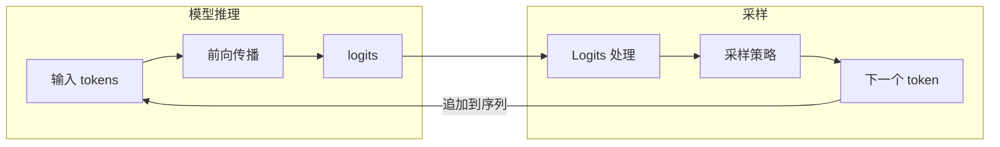
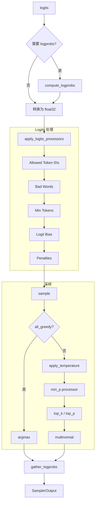
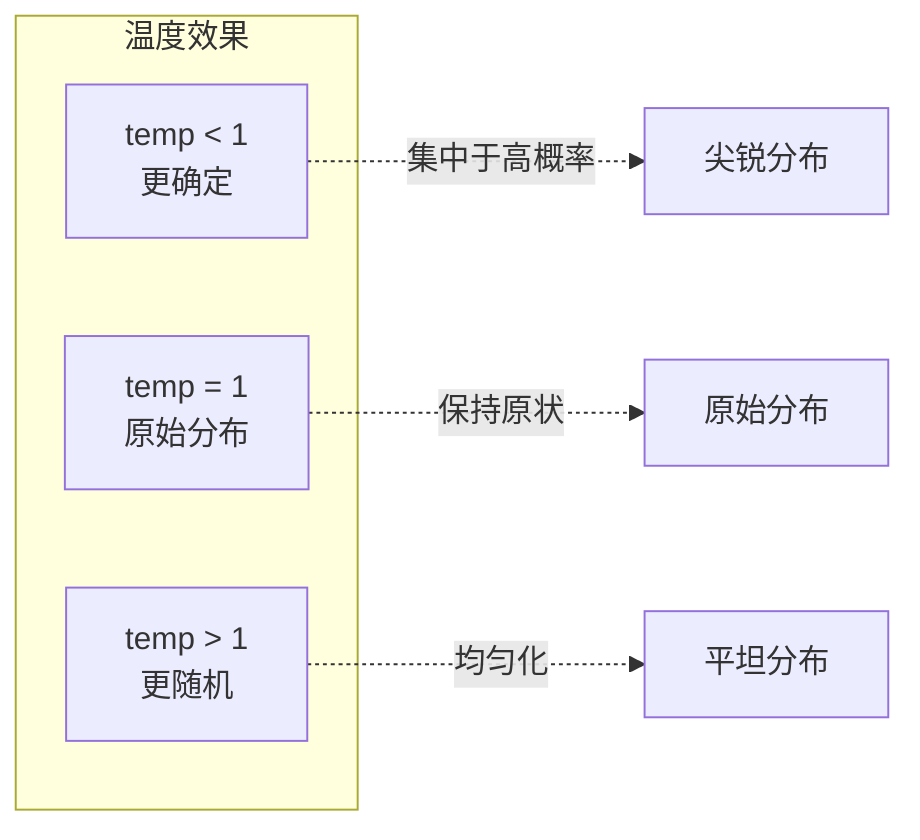
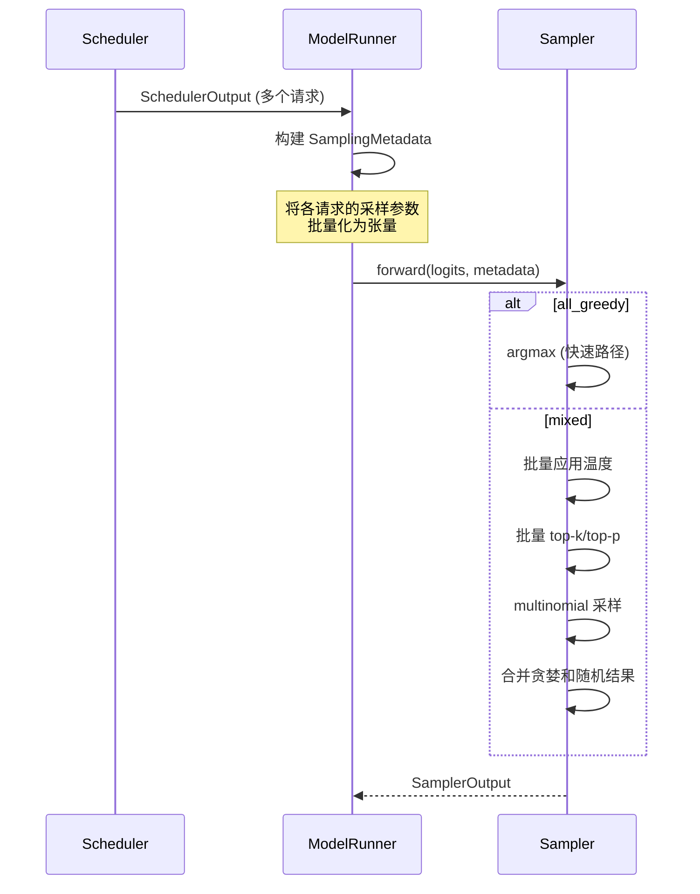

在模型前向传播得到 logits 后，需要通过采样来生成下一个 token。采样过程不仅仅是简单地选择概率最高的 token，还涉及温度调节、top-k/top-p 过滤、惩罚机制等多种策略。本章将深入分析 vLLM 的采样实现。

---

## 1. 采样在推理流程中的位置



**采样的主要步骤：**

1. **Logits 处理**：应用各种处理器修改原始 logits
2. **温度调节**：控制随机性
3. **Top-k/Top-p 过滤**：限制候选 token 范围
4. **实际采样**：从处理后的分布中选择 token

---

## 2. SamplingParams - 采样参数

```python
# vllm/sampling_params.py

class SamplingParams:
    """控制采样行为的参数"""

    def __init__(
        self,
        # 基本参数
        n: int = 1,                        # 每个 prompt 生成的序列数
        best_of: int | None = None,        # 候选序列数

        # 温度
        temperature: float = 1.0,          # 采样温度

        # Top-k/Top-p
        top_k: int = -1,                   # top-k 采样（-1 表示禁用）
        top_p: float = 1.0,                # top-p (nucleus) 采样

        # 惩罚
        repetition_penalty: float = 1.0,   # 重复惩罚
        frequency_penalty: float = 0.0,    # 频率惩罚
        presence_penalty: float = 0.0,     # 存在惩罚

        # 停止条件
        max_tokens: int = 16,              # 最大生成 token 数
        stop: list[str] | None = None,     # 停止字符串
        stop_token_ids: list[int] | None = None,  # 停止 token

        # Logprobs
        logprobs: int | None = None,       # 返回的 logprobs 数量

        # 其他
        seed: int | None = None,           # 随机种子
        min_p: float = 0.0,                # min-p 采样
        ...
    ):
        ...
```

---

## 3. Sampler 类详解

### 3.1 类定义

```python
# vllm/v1/sample/sampler.py

class Sampler(nn.Module):
    """
    从模型输出中采样下一个 token 的层。

    处理步骤：
    1. 计算 logprobs（如果请求）
    2. 转换为 float32
    3. 应用 allowed token ids 白名单
    4. 应用 bad words 排除
    5. 应用非 argmax-invariant 的 logit 处理器
    6. 应用惩罚（重复、频率、存在）
    7. 采样（贪婪或随机）
    8. 收集 top-k logprobs
    9. 返回 SamplerOutput
    """

    def __init__(self, logprobs_mode: LogprobsMode = "raw_logprobs"):
        super().__init__()
        self.topk_topp_sampler = TopKTopPSampler(logprobs_mode)

    def forward(
        self,
        logits: torch.Tensor,              # [num_tokens, vocab_size]
        sampling_metadata: SamplingMetadata,
    ) -> SamplerOutput:
        """主采样方法"""

        # 1. 计算原始 logprobs（用于返回给用户）
        num_logprobs = sampling_metadata.max_num_logprobs
        if num_logprobs is not None:
            raw_logprobs = self.compute_logprobs(logits)

        # 2. 转换为 float32
        logits = logits.to(torch.float32)

        # 3-6. 应用各种 logits 处理器
        logits = self.apply_logits_processors(logits, sampling_metadata)

        # 7. 采样
        sampled, processed_logprobs = self.sample(logits, sampling_metadata)

        # 8. 收集 logprobs
        if num_logprobs is not None:
            logprobs_tensors = self.gather_logprobs(
                raw_logprobs, num_logprobs, token_ids=sampled
            )

        # 9. 返回结果
        return SamplerOutput(
            sampled_token_ids=sampled.unsqueeze(-1),
            logprobs_tensors=logprobs_tensors,
        )
```

### 3.2 采样流程图



---

## 4. 采样策略详解

### 4.1 贪婪采样（Greedy Sampling）

```python
@staticmethod
def greedy_sample(logits: torch.Tensor) -> torch.Tensor:
    """选择概率最高的 token"""
    return logits.argmax(dim=-1).view(-1)
```

**特点：**
- 确定性输出（相同输入总是产生相同输出）
- 适合需要一致性的场景
- 可能导致重复和无聊的输出

### 4.2 温度采样（Temperature Sampling）

```python
@staticmethod
def apply_temperature(
    logits: torch.Tensor,
    temp: torch.Tensor,
    all_random: bool,
) -> torch.Tensor:
    """应用温度缩放"""
    if not all_random:
        # 避免除以零（贪婪请求的 temp 可能为 0）
        temp = torch.where(temp < _SAMPLING_EPS, 1.0, temp)
    return logits.div_(temp.unsqueeze(dim=1))
```

**温度的作用：**

```
logits = [2.0, 1.0, 0.5, 0.1]

temp = 0.5（更确定）:
logits / 0.5 = [4.0, 2.0, 1.0, 0.2]
softmax → [0.84, 0.11, 0.04, 0.01]  # 高概率更集中

temp = 1.0（原始）:
softmax → [0.47, 0.17, 0.10, 0.07]  # 原始分布

temp = 2.0（更随机）:
logits / 2.0 = [1.0, 0.5, 0.25, 0.05]
softmax → [0.36, 0.22, 0.17, 0.14]  # 分布更均匀
```



### 4.3 Top-k 采样

```python
# vllm/v1/sample/ops/topk_topp_sampler.py

def apply_top_k(logits: torch.Tensor, top_k: int) -> torch.Tensor:
    """只保留 top-k 个最高概率的 token"""
    if top_k < 0:
        return logits

    # 找到第 k 大的值
    top_k_values, _ = torch.topk(logits, top_k, dim=-1)
    min_top_k = top_k_values[:, -1].unsqueeze(-1)

    # 将低于阈值的 logits 设为 -inf
    return logits.masked_fill(logits < min_top_k, float('-inf'))
```

**示例：**

```
原始 logits: [3.5, 2.1, 1.8, 0.5, 0.1, -0.2, -1.0]
top_k = 3

处理后: [3.5, 2.1, 1.8, -inf, -inf, -inf, -inf]

softmax 后只有前 3 个有概率
```

### 4.4 Top-p (Nucleus) 采样

```python
def apply_top_p(logits: torch.Tensor, top_p: float) -> torch.Tensor:
    """保留累积概率达到 top_p 的最小 token 集合"""
    if top_p >= 1.0:
        return logits

    # 按概率排序
    probs = torch.softmax(logits, dim=-1)
    sorted_probs, sorted_indices = torch.sort(probs, descending=True)

    # 计算累积概率
    cumsum_probs = torch.cumsum(sorted_probs, dim=-1)

    # 找到累积概率首次超过 top_p 的位置
    mask = cumsum_probs - sorted_probs > top_p

    # 将超出的 logits 设为 -inf
    sorted_logits = logits.gather(-1, sorted_indices)
    sorted_logits = sorted_logits.masked_fill(mask, float('-inf'))

    # 还原顺序
    return sorted_logits.scatter(-1, sorted_indices, sorted_logits)
```

**示例：**

```
原始 probs: [0.40, 0.25, 0.15, 0.10, 0.05, 0.03, 0.02]
top_p = 0.9

累积: [0.40, 0.65, 0.80, 0.90, 0.95, 0.98, 1.00]
                              ↑ 首次 >= 0.9

保留前 4 个 token，其余设为 -inf
```

### 4.5 Min-p 采样

```python
def apply_min_p(logits: torch.Tensor, min_p: float) -> torch.Tensor:
    """过滤掉概率低于 max_prob * min_p 的 token"""
    if min_p <= 0.0:
        return logits

    probs = torch.softmax(logits, dim=-1)
    max_probs = probs.max(dim=-1, keepdim=True).values

    # 概率阈值 = 最大概率 * min_p
    threshold = max_probs * min_p

    # 过滤低概率 token
    return logits.masked_fill(probs < threshold, float('-inf'))
```

---

## 5. 惩罚机制

### 5.1 重复惩罚（Repetition Penalty）

```python
def apply_repetition_penalty(
    logits: torch.Tensor,
    token_ids: torch.Tensor,
    penalty: float,
) -> torch.Tensor:
    """惩罚已出现的 token"""
    if penalty == 1.0:
        return logits

    # 获取已出现 token 的 logits
    score = logits.gather(-1, token_ids)

    # 应用惩罚
    # logits > 0: score = score / penalty
    # logits < 0: score = score * penalty
    score = torch.where(score > 0, score / penalty, score * penalty)

    # 写回
    return logits.scatter(-1, token_ids, score)
```

**效果：**

```
penalty = 1.2, token "the" 已出现

原始 logit: 2.5
惩罚后: 2.5 / 1.2 = 2.08  # 概率降低

原始 logit: -0.5
惩罚后: -0.5 * 1.2 = -0.6  # 概率进一步降低
```

### 5.2 频率惩罚（Frequency Penalty）

```python
def apply_frequency_penalty(
    logits: torch.Tensor,
    token_counts: torch.Tensor,
    penalty: float,
) -> torch.Tensor:
    """基于出现次数的惩罚"""
    if penalty == 0.0:
        return logits

    # logits = logits - penalty * count
    return logits - penalty * token_counts
```

**效果：**

```
penalty = 0.5, token "the" 出现了 3 次

原始 logit: 2.5
惩罚后: 2.5 - 0.5 * 3 = 1.0
```

### 5.3 存在惩罚（Presence Penalty）

```python
def apply_presence_penalty(
    logits: torch.Tensor,
    token_presence: torch.Tensor,  # 0 或 1
    penalty: float,
) -> torch.Tensor:
    """基于是否出现过的惩罚（不考虑次数）"""
    if penalty == 0.0:
        return logits

    # logits = logits - penalty * presence
    return logits - penalty * token_presence
```

---

## 6. Logprobs 计算

### 6.1 计算 Logprobs

```python
@staticmethod
def compute_logprobs(logits: torch.Tensor) -> torch.Tensor:
    """计算 log 概率"""
    return logits.log_softmax(dim=-1, dtype=torch.float32)
```

### 6.2 收集 Top-k Logprobs

```python
@staticmethod
def gather_logprobs(
    logprobs: torch.Tensor,
    num_logprobs: int,
    token_ids: torch.Tensor,
) -> LogprobsTensors:
    """收集 top-k logprobs 和采样 token 的 logprob"""

    # 1. 找 top-k
    topk_logprobs, topk_indices = torch.topk(logprobs, num_logprobs, dim=-1)

    # 2. 获取采样 token 的 logprob
    token_logprobs = logprobs.gather(-1, token_ids.unsqueeze(-1))

    # 3. 计算采样 token 的排名
    token_ranks = batched_count_greater_than(logprobs, token_logprobs)

    # 4. 合并结果
    indices = torch.cat((token_ids.unsqueeze(-1), topk_indices), dim=1)
    logprobs = torch.cat((token_logprobs, topk_logprobs), dim=1)

    return LogprobsTensors(indices, logprobs, token_ranks)
```

---

## 7. 批量采样优化

### 7.1 SamplingMetadata

```python
# vllm/v1/sample/metadata.py

class SamplingMetadata:
    """批量采样的元数据"""

    # 基本信息
    all_greedy: bool          # 所有请求都是贪婪采样
    all_random: bool          # 所有请求都是随机采样

    # 参数（批量张量）
    temperature: torch.Tensor | None   # [batch_size]
    top_k: torch.Tensor | None         # [batch_size]
    top_p: torch.Tensor | None         # [batch_size]

    # Logprobs
    max_num_logprobs: int | None

    # 惩罚相关
    # ...

    # 随机数生成器（每个请求一个）
    generators: list[torch.Generator] | None
```

### 7.2 批量处理流程



---

## 8. 采样参数组合建议

### 8.1 常见场景配置

| 场景 | temperature | top_k | top_p | 说明 |
|-----|------------|-------|-------|------|
| 代码生成 | 0.0 | - | - | 贪婪，确保正确性 |
| 技术写作 | 0.3 | - | 0.9 | 低随机性 |
| 创意写作 | 0.8 | 50 | 0.95 | 高随机性 |
| 对话 | 0.7 | 40 | 0.9 | 平衡 |
| 头脑风暴 | 1.2 | - | 0.95 | 非常随机 |

### 8.2 惩罚参数建议

| 参数 | 推荐范围 | 说明 |
|-----|---------|------|
| repetition_penalty | 1.0-1.2 | 轻微惩罚重复 |
| frequency_penalty | 0.0-0.5 | 减少高频词 |
| presence_penalty | 0.0-0.5 | 鼓励新话题 |

---

## 9. 代码位置速查

| 组件 | 文件 | 关键类/函数 |
|-----|------|------------|
| 采样参数 | `vllm/sampling_params.py` | `SamplingParams` |
| Sampler | `vllm/v1/sample/sampler.py` | `Sampler` |
| 采样元数据 | `vllm/v1/sample/metadata.py` | `SamplingMetadata` |
| Top-k/Top-p | `vllm/v1/sample/ops/topk_topp_sampler.py` | `TopKTopPSampler` |
| 惩罚 | `vllm/v1/sample/ops/penalties.py` | `apply_*_penalty()` |
| Logprobs | `vllm/v1/sample/ops/logprobs.py` | `gather_logprobs()` |

---

## 10. 小结

本章我们深入了解了 vLLM 的采样过程：

1. **采样参数**：temperature、top_k、top_p、min_p 等
2. **采样策略**：
   - 贪婪采样：确定性，选择最高概率
   - 温度采样：控制随机性
   - Top-k：只考虑前 k 个 token
   - Top-p：累积概率阈值过滤
   - Min-p：相对于最高概率的阈值
3. **惩罚机制**：
   - 重复惩罚：惩罚已出现 token
   - 频率惩罚：基于出现次数
   - 存在惩罚：基于是否出现
4. **Logprobs**：返回 token 的对数概率
5. **批量优化**：通过 SamplingMetadata 批量处理

在下一章中，我们将分析输出处理过程，了解采样结果如何转换为用户可见的输出。

---

## 导航

- 上一篇：[模型前向传播](03-model-forward.md)
- 下一篇：[输出处理流程](05-output-processing.md)
- [返回目录](../README.md)
