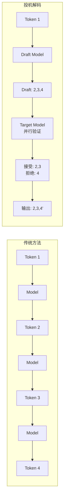
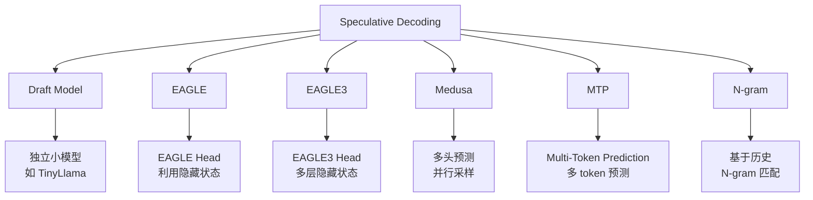
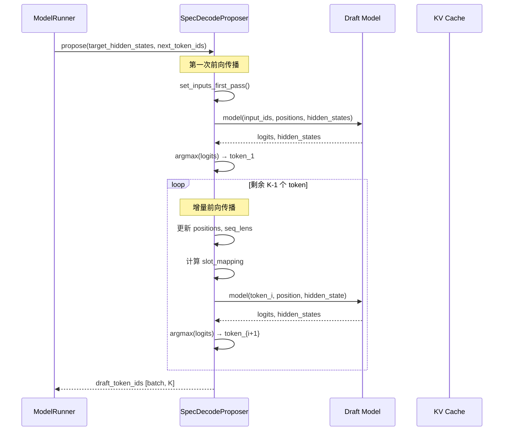
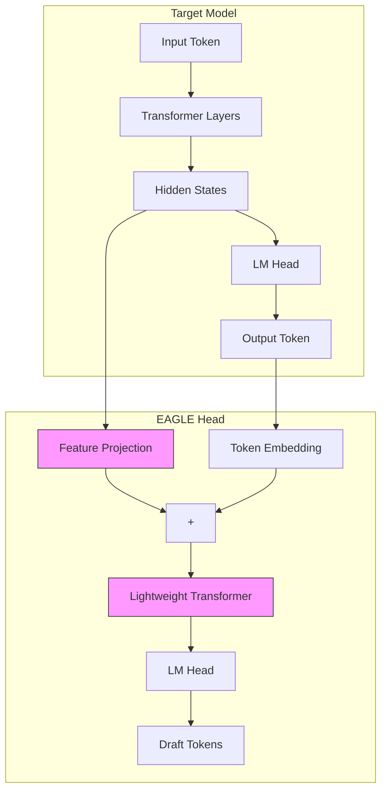
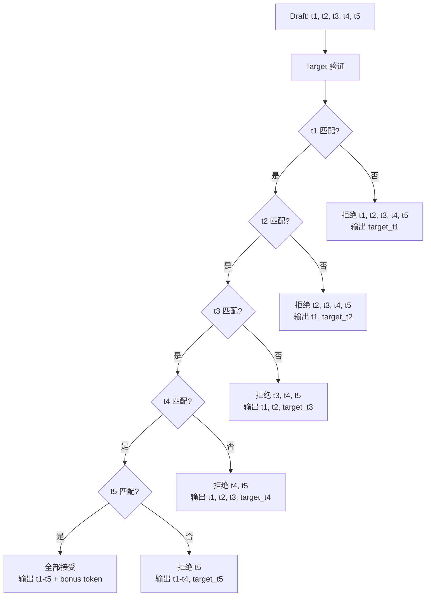
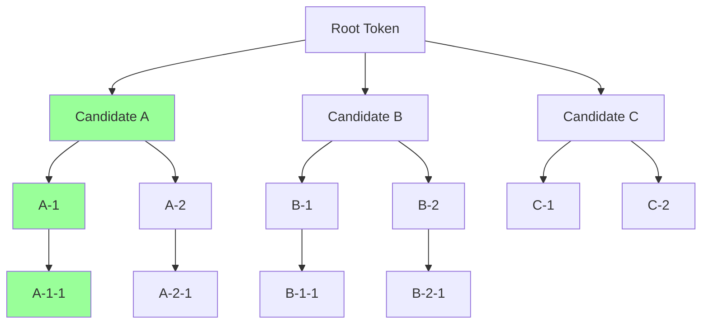
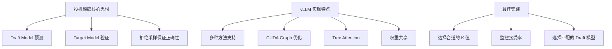

## 概述

投机解码（Speculative Decoding）是一种加速大语言模型推理的技术。其核心思想是：**使用一个小型的 Draft 模型快速生成多个候选 token，然后让大型的 Target 模型并行验证这些候选 token**。由于验证比逐个生成更高效，这种方法可以显著加速推理过程。

本文将深入分析 vLLM 中投机解码的实现原理和代码细节。

---

## 为什么需要投机解码

### Decode 阶段的瓶颈

在[LLM 生成过程](../02-dl-fundamentals/05-llm-generation-process.md)中，我们了解到 Decode 阶段是**内存带宽密集型**的：

```
传统自回归生成：
Token 1 → Model Forward → Token 2 → Model Forward → Token 3 → ...
   |           |            |           |            |
  GPU 利用率低   等待         GPU 利用率低   等待        GPU 利用率低
```

每次 Decode 只处理一个 token，无法充分利用 GPU 的并行计算能力。

### 投机解码的核心思想

投机解码受到 CPU 分支预测的启发：



**关键洞察**：
1. Draft 模型生成 K 个候选 token
2. Target 模型一次性验证所有候选
3. 接受正确的前缀，从第一个错误位置重新生成
4. 验证的计算量 ≈ 生成一个 token，但产出多个 token

---

## 投机解码的数学原理

### 接受率分析

设：
- `p(x)` = Target 模型在位置 i 的概率分布
- `q(x)` = Draft 模型在位置 i 的概率分布
- `x_d` = Draft 模型采样的 token

接受概率计算：
```
接受 x_d 的概率 = min(1, p(x_d) / q(x_d))
```

这种接受准则保证了最终输出的分布与只使用 Target 模型完全一致（无损加速）。

### 加速比估算

假设：
- Draft 模型生成 K 个候选 token
- 每个 token 的平均接受率为 α
- Draft 模型的前向时间为 t_d
- Target 模型的前向时间为 t_t

预期接受的 token 数：
```
E[accepted] = α + α² + α³ + ... + α^K ≈ α/(1-α) （当 α < 1）
```

加速比：
```
Speedup = E[accepted] × t_t / (K × t_d + t_t)
```

例如，当 α = 0.8，K = 5，t_d = t_t/10 时：
```
E[accepted] ≈ 3.2 tokens
Speedup ≈ 3.2 × t_t / (0.5 × t_t + t_t) = 2.1x
```

---

## vLLM 中的投机解码实现

### 支持的投机解码方法

vLLM V1 支持多种投机解码方法：



### 核心代码结构

投机解码的核心代码位于 `vllm/v1/spec_decode/` 目录：

```
vllm/v1/spec_decode/
├── __init__.py
├── eagle.py           # EAGLE 基类和 Proposer
├── draft_model.py     # Draft Model Proposer
├── medusa.py          # Medusa Head
├── metadata.py        # 投机解码元数据
├── metrics.py         # 性能指标
├── ngram_proposer.py  # N-gram 方法
├── suffix_decoding.py # 后缀解码
└── utils.py           # 工具函数

vllm/v1/worker/gpu/spec_decode/
├── eagle.py              # EAGLE CUDA Graph 支持
├── eagle_cudagraph.py    # CUDA Graph 实现
└── rejection_sample.py   # 拒绝采样内核
```

---

## SpecDecodeBaseProposer 基类

### 类定义与初始化

`SpecDecodeBaseProposer` 是所有投机解码方法的基类：

```python
# vllm/v1/spec_decode/eagle.py

class SpecDecodeBaseProposer:
    def __init__(
        self,
        vllm_config: VllmConfig,
        device: torch.device,
        pass_hidden_states_to_model: bool,  # 是否传递隐藏状态
        runner=None,
    ):
        self.vllm_config = vllm_config
        self.speculative_config = vllm_config.speculative_config
        self.draft_model_config = self.speculative_config.draft_model_config
        self.method = self.speculative_config.method

        # 配置参数
        self.num_speculative_tokens = self.speculative_config.num_speculative_tokens
        self.hidden_size = self.draft_model_config.get_hidden_size()

        # 持久化缓冲区（用于 CUDA Graph）
        self.input_ids = torch.zeros(
            self.max_num_tokens, dtype=torch.int32, device=device
        )
        self.positions = torch.zeros(
            self.max_num_tokens, dtype=torch.int64, device=device
        )
        self.hidden_states = torch.zeros(
            (self.max_num_tokens, self.hidden_size),
            dtype=self.dtype, device=device
        )
```

### Proposer 工作流程



### propose() 方法详解

```python
def propose(
    self,
    target_token_ids: torch.Tensor,      # [num_tokens]
    target_positions: torch.Tensor,       # [num_tokens]
    target_hidden_states: torch.Tensor,   # [num_tokens, hidden_size]
    next_token_ids: torch.Tensor,         # [batch_size]
    last_token_indices: torch.Tensor | None,
    common_attn_metadata: CommonAttentionMetadata,
    sampling_metadata: SamplingMetadata,
    ...
) -> torch.Tensor:
    batch_size = common_attn_metadata.batch_size()

    # 1. 设置第一次前向传播的输入
    num_tokens, last_token_indices, common_attn_metadata = (
        self.set_inputs_first_pass(
            target_token_ids=target_token_ids,
            next_token_ids=next_token_ids,
            target_positions=target_positions,
            last_token_indices=last_token_indices,
            cad=common_attn_metadata,
            num_rejected_tokens_gpu=num_rejected_tokens_gpu,
        )
    )

    # 2. 构建 Attention Metadata
    attn_metadata = attn_metadata_builder.build_for_drafting(
        common_attn_metadata=common_attn_metadata, draft_index=0
    )

    # 3. 第一次前向传播
    with set_forward_context(per_layer_attn_metadata, ...):
        ret_hidden_states = self.model(
            input_ids=self.input_ids[:num_input_tokens],
            positions=self._get_positions(num_input_tokens),
            hidden_states=self.hidden_states[:num_input_tokens]
                          if self.pass_hidden_states_to_model else None,
        )

    # 4. 采样第一个 draft token
    logits = self.model.compute_logits(last_hidden_states[last_token_indices])
    draft_token_ids = logits.argmax(dim=-1)
    draft_token_ids_list = [draft_token_ids]

    # 5. 生成剩余的 draft tokens
    for token_index in range(self.num_speculative_tokens - 1):
        # 更新输入
        input_ids = draft_token_ids_list[-1].int()
        positions += 1

        # 处理超出最大长度的情况
        exceeds_max_model_len = positions >= self.max_model_len
        clamped_positions = torch.where(exceeds_max_model_len, 0, positions)

        # 更新序列长度
        common_attn_metadata.seq_lens += 1

        # 计算新的 slot mapping
        block_numbers = clamped_positions // block_size
        block_ids = common_attn_metadata.block_table_tensor.gather(
            dim=1, index=block_numbers.view(-1, 1)
        )
        common_attn_metadata.slot_mapping = (
            block_ids * block_size + clamped_positions % block_size
        )
        # 屏蔽超长位置
        common_attn_metadata.slot_mapping.masked_fill_(
            exceeds_max_model_len, PADDING_SLOT_ID
        )

        # 执行模型
        with set_forward_context(...):
            ret_hidden_states = self.model(
                input_ids=self.input_ids[:input_batch_size],
                positions=self._get_positions(input_batch_size),
                hidden_states=self.hidden_states[:input_batch_size],
            )

        # 采样下一个 token
        logits = self.model.compute_logits(last_hidden_states[:batch_size])
        draft_token_ids = logits.argmax(dim=-1)
        draft_token_ids_list.append(draft_token_ids)

    # 返回所有 draft tokens
    return torch.stack(draft_token_ids_list, dim=1)
```

---

## DraftModelProposer 详解

### 独立 Draft 模型

`DraftModelProposer` 使用独立的小模型（如 TinyLlama）作为 Draft：

```python
# vllm/v1/spec_decode/draft_model.py

class DraftModelProposer(SpecDecodeBaseProposer):
    def __init__(
        self,
        vllm_config: VllmConfig,
        device: torch.device,
        runner=None,
    ):
        super().__init__(
            vllm_config=vllm_config,
            device=device,
            pass_hidden_states_to_model=False,  # 不需要 Target 的隐藏状态
            runner=runner,
        )
        # 验证约束
        self._raise_if_multimodal()     # 暂不支持多模态
        self._raise_if_mrope()          # 暂不支持 M-RoPE
        self._raise_if_vocab_size_mismatch()  # 词表大小必须一致
        self._raise_if_draft_tp_mismatch()    # TP 大小必须一致
```

### 输入处理

Draft Model 的输入处理需要合并 Target 的输出：

```python
def set_inputs_first_pass(
    self,
    target_token_ids: torch.Tensor,
    next_token_ids: torch.Tensor,
    target_positions: torch.Tensor,
    last_token_indices: torch.Tensor | None,
    cad: CommonAttentionMetadata,
    num_rejected_tokens_gpu: torch.Tensor | None,
) -> tuple[int, torch.Tensor, CommonAttentionMetadata]:
    batch_size = cad.batch_size()

    # 使用 Triton kernel 合并 tokens
    # target_toks: [a1, b1, b2, c1, c2, c3]
    # next_toks:   [a2, b3, c4]
    # 结果:        [a1, a2, b1, b2, b3, c1, c2, c3, c4]
    merge_toks_kernel[grid](
        target_toks_ptr=target_token_ids,
        next_toks_ptr=next_token_ids,
        query_start_locs_ptr=start_locs,
        query_end_locs_ptr=end_locs,
        out_ptr_merged_toks=self.input_ids,
        out_ptr_is_rejected_tok=is_rejected_tok,
        ...
    )

    # 重新计算 slot mapping
    new_slot_mapping = compute_new_slot_mapping(
        cad=cad,
        new_positions=self.positions[:num_tokens],
        is_rejected_token_mask=is_rejected_tok,
        block_size=self._block_size(),
        max_model_len=self.max_model_len,
    )

    return num_tokens, new_last_token_indices, new_cad
```

### 加载 Draft 模型

```python
def load_model(self, target_model: Any) -> None:
    # 创建 Draft 模型专用的 VllmConfig
    draft_vllm_config = create_vllm_config_for_draft_model(
        target_model_vllm_config=self.vllm_config
    )

    logger.info(
        "Starting to load draft model %s. TP=%d, rank=%d",
        draft_vllm_config.model_config.model,
        draft_vllm_config.parallel_config.tensor_parallel_size,
        draft_vllm_config.parallel_config.rank,
    )

    # 加载模型并设置编译标签
    with set_model_tag("draft_model"):
        self.model = get_model(vllm_config=draft_vllm_config, prefix="draft_model")
```

---

## EAGLE Proposer 详解

### EAGLE 方法原理

EAGLE (Extrapolation Algorithm for Greater Language-model Efficiency) 利用 Target 模型的隐藏状态来预测 draft tokens：



**EAGLE 的关键创新**：
1. 复用 Target 模型的隐藏状态，避免独立编码
2. 只需要很少的额外参数（通常 < 1% 的 Target 模型）
3. 共享 Token Embedding 和 LM Head 权重

### EagleProposer 实现

```python
# vllm/v1/spec_decode/eagle.py

class EagleProposer(SpecDecodeBaseProposer):
    def __init__(
        self,
        vllm_config: VllmConfig,
        device: torch.device,
        runner=None,
    ):
        super().__init__(
            vllm_config,
            device,
            pass_hidden_states_to_model=True,  # 需要传递隐藏状态
            runner=runner,
        )
```

### 权重共享机制

EAGLE 模型与 Target 模型共享权重：

```python
def load_model(self, target_model: nn.Module) -> None:
    # 加载 EAGLE head
    with set_model_tag("eagle_head"):
        self.model = get_model(
            vllm_config=self.vllm_config,
            model_config=draft_model_config
        )

    # 检查是否需要共享 embedding
    if hasattr(self.model, "has_own_embed_tokens"):
        if not self.model.has_own_embed_tokens:
            share_embeddings = True
            logger.info("Sharing target model embedding weights with draft model")

    if share_embeddings:
        # 共享 embed_tokens
        del self.model.model.embed_tokens
        self.model.model.embed_tokens = target_embed_tokens

    # 共享 lm_head
    if share_lm_head:
        del self.model.lm_head
        self.model.lm_head = target_language_model.lm_head
```

---

## 拒绝采样（Rejection Sampling）

### 核心算法

拒绝采样确保输出分布与 Target 模型一致：

```python
# vllm/v1/worker/gpu/spec_decode/rejection_sample.py

@triton.jit
def _rejection_sample_kernel(
    sampled_ptr,           # [num_reqs, num_speculative_steps + 1]
    sampled_stride,
    num_sampled_ptr,       # [num_reqs]
    target_sampled_ptr,    # [num_draft_tokens + num_reqs]
    input_ids_ptr,         # [num_draft_tokens + num_reqs]（draft tokens）
    cu_num_logits_ptr,     # [num_reqs + 1]
):
    req_idx = tl.program_id(0)
    start_idx = tl.load(cu_num_logits_ptr + req_idx)
    end_idx = tl.load(cu_num_logits_ptr + req_idx + 1)
    num_tokens = end_idx - start_idx

    num_sampled = 0
    rejected = False

    # 逐个比较 draft token 和 target token
    for i in range(num_tokens - 1):
        if not rejected:
            target_sampled = tl.load(target_sampled_ptr + start_idx + i)
            draft_sampled = tl.load(input_ids_ptr + start_idx + i + 1)

            # 存储 target 的采样结果
            tl.store(sampled_ptr + req_idx * sampled_stride + i, target_sampled)
            num_sampled += 1

            # 检查是否匹配
            if target_sampled != draft_sampled:
                rejected = True  # 一旦不匹配，后续全部拒绝

    # 处理最后一个 token（bonus token）
    if not rejected:
        target_sampled = tl.load(target_sampled_ptr + start_idx + num_tokens - 1)
        tl.store(
            sampled_ptr + req_idx * sampled_stride + num_tokens - 1,
            target_sampled
        )
        num_sampled += 1

    tl.store(num_sampled_ptr + req_idx, num_sampled)
```

### 工作流程图解



---

## Tree-based 投机解码

### 树结构 Draft

vLLM 支持树结构的投机解码，可以同时探索多个候选路径：



### Tree Attention

树结构需要特殊的注意力计算：

```python
def propose_tree(
    self,
    batch_size: int,
    logits: torch.Tensor,
    positions: torch.Tensor,
    hidden_states: torch.Tensor,
    common_attn_metadata: CommonAttentionMetadata,
    ...
) -> list[torch.Tensor]:
    # 解析投机 token 树
    tree_depth = len(self.cu_drafts_per_level)

    # 第一层：从 root 采样多个候选
    num_children = self.child_drafts_per_level[0]
    if num_children == 1:
        draft_token_ids = logits.argmax(dim=-1).view(batch_size, -1)
    else:
        # Top-K 采样
        draft_token_ids = torch.topk(
            logits, num_children, dim=-1
        ).indices.view(batch_size, -1)

    draft_token_ids_list = [draft_token_ids]

    # 逐层生成
    for level in range(tree_depth - 1):
        # 构建树注意力元数据
        attn_metadata = tree_attn_metadata_builder.build_for_drafting(
            common_attn_metadata=common_attn_metadata,
            draft_index=level + 1
        )

        # 执行前向传播
        with set_forward_context(...):
            last_hidden_states, hidden_states = self.model(
                input_ids=self.input_ids[:num_input_tokens],
                positions=self.positions[:num_input_tokens],
                hidden_states=self.hidden_states[:num_input_tokens],
            )

        # 为下一层采样
        logits = self.model.compute_logits(draft_last_hidden_states)
        num_children = self.child_drafts_per_level[level + 1]
        if num_children == 1:
            draft_token_ids = logits.argmax(dim=-1).view(batch_size, -1)
        else:
            draft_token_ids = torch.topk(
                logits, num_children, dim=-1
            ).indices.view(batch_size, -1)

        draft_token_ids_list.append(draft_token_ids)

    return draft_token_ids_list
```

---

## 投机解码配置与使用

### 配置参数

```python
from vllm import LLM, SamplingParams

llm = LLM(
    model="meta-llama/Llama-3.1-70B-Instruct",
    speculative_model="meta-llama/Llama-3.2-1B-Instruct",
    num_speculative_tokens=5,  # 每次投机生成的 token 数
)

llm = LLM(
    model="meta-llama/Llama-3.1-70B-Instruct",
    speculative_model="path/to/eagle-head",
    speculative_method="eagle",
    num_speculative_tokens=5,
)
```

### 命令行使用

```bash
# 使用 Draft 模型
vllm serve meta-llama/Llama-3.1-70B-Instruct \
    --speculative-model meta-llama/Llama-3.2-1B-Instruct \
    --num-speculative-tokens 5

vllm serve meta-llama/Llama-3.1-70B-Instruct \
    --speculative-model path/to/eagle-head \
    --speculative-method eagle \
    --num-speculative-tokens 5
```

---

## 性能优化

### CUDA Graph 支持

投机解码支持 CUDA Graph 以减少 kernel launch 开销：

```python
class SpecDecodeBaseProposer:
    def initialize_cudagraph_keys(self, cudagraph_mode: CUDAGraphMode) -> None:
        """初始化 CUDA Graph dispatcher"""
        if (
            not self.speculative_config.enforce_eager
            and cudagraph_mode.mixed_mode() in [CUDAGraphMode.PIECEWISE, CUDAGraphMode.FULL]
        ):
            eagle_cudagraph_mode = CUDAGraphMode.PIECEWISE
        else:
            eagle_cudagraph_mode = CUDAGraphMode.NONE

        self.cudagraph_dispatcher.initialize_cudagraph_keys(eagle_cudagraph_mode)
```

### 批量处理优化

Padded Drafter Batch 避免动态形状：

```python
def prepare_inputs_padded(
    self,
    common_attn_metadata: CommonAttentionMetadata,
    spec_decode_metadata: SpecDecodeMetadata,
    valid_sampled_tokens_count: torch.Tensor,
) -> tuple[CommonAttentionMetadata, torch.Tensor, torch.Tensor]:
    """
    准备投机解码的输入，使用 padding 保持固定形状。
    被拒绝的 token 作为 padding，后续通过 token_indices_to_sample 过滤。
    """
    num_reqs = common_attn_metadata.num_reqs
    device = valid_sampled_tokens_count.device

    token_indices_to_sample = torch.empty(
        (num_reqs,), dtype=torch.int32, device=device
    )
    num_rejected_tokens_gpu = torch.empty(
        (num_reqs,), dtype=torch.int32, device=device
    )

    # 使用 Triton kernel 计算
    eagle_prepare_inputs_padded_kernel[grid](
        spec_decode_metadata.cu_num_draft_tokens,
        valid_sampled_tokens_count,
        common_attn_metadata.query_start_loc,
        token_indices_to_sample,
        num_rejected_tokens_gpu,
        num_reqs,
    )

    return spec_common_attn_metadata, token_indices_to_sample, num_rejected_tokens_gpu
```

---

## 投机解码的限制与注意事项

### 当前限制

1. **多模态不完全支持**：某些投机解码方法不支持多模态模型
2. **M-RoPE 限制**：Draft Model 方法不支持 M-RoPE 位置编码
3. **词表大小**：Draft 和 Target 模型必须有相同的词表
4. **张量并行**：Draft 和 Target 的 TP 大小必须一致

### 最佳实践

1. **选择合适的 K 值**：
   - 较大的 K 增加预测深度，但降低平均接受率
   - 通常 K=3-5 是较好的平衡点

2. **Draft 模型选择**：
   - 选择与 Target 模型同系列的小模型
   - 确保词表完全一致
   - EAGLE 通常比独立 Draft 模型效率更高

3. **监控接受率**：
   ```python
   # 检查投机解码统计
   # vLLM 会在日志中输出平均接受率等指标
   ```

---

## 总结

投机解码是加速 LLM 推理的重要技术：



关键要点：
1. **核心原理**：用小模型快速预测，大模型并行验证
2. **无损加速**：拒绝采样保证输出分布不变
3. **vLLM 优化**：CUDA Graph、权重共享、批量处理
4. **实际效果**：通常可获得 1.5x-3x 的加速

---

## 参考资料

1. [Speculative Decoding 原论文](https://arxiv.org/abs/2211.17192)
2. [EAGLE 论文](https://arxiv.org/abs/2401.15077)
3. [Medusa 论文](https://arxiv.org/abs/2401.10774)
4. [vLLM 投机解码文档](https://docs.vllm.ai/en/latest/features/spec_decode.html)

---

**导航**
- 上一篇：[请求生命周期](../04-code-walkthrough/06-request-lifecycle.md)
- 下一篇：[量化技术](02-quantization.md)
