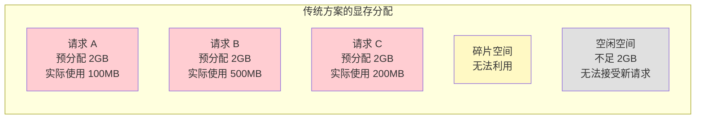
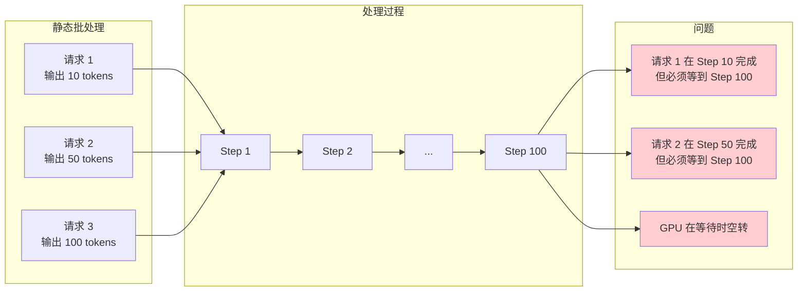
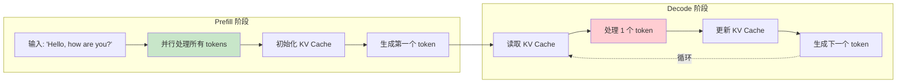
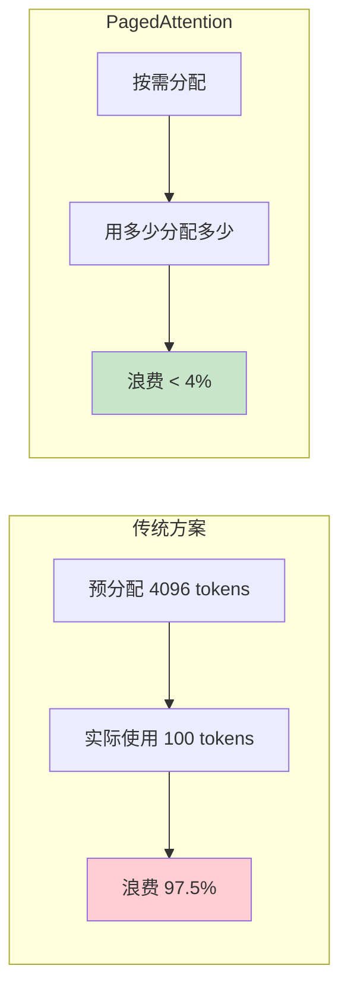
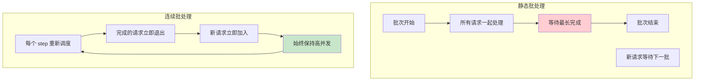

# 为什么需要 vLLM

> 本章将帮助你理解：为什么传统方案无法满足 LLM 推理需求，以及 vLLM 是如何解决这些问题的。

---

## 引言：LLM 时代的推理挑战

2022 年底，ChatGPT 横空出世，大语言模型（Large Language Model，LLM）迅速成为人工智能领域最热门的话题。随后，GPT-4、Claude、LLaMA、Qwen 等一系列强大的语言模型相继发布，LLM 的能力不断突破我们的想象。

然而，当我们尝试将这些强大的模型部署到生产环境中时，一个严峻的问题摆在了面前：

> **如何让 LLM 高效地服务大量用户？**

这个问题看似简单，实则涉及到计算机系统的方方面面——显存管理、并行计算、任务调度、网络通信等。而 vLLM 正是为了解决这个问题而诞生的。

在深入了解 vLLM 之前，让我们先看看传统方案面临的困境。

---

## 1. 传统方案面临的三大困境

### 1.1 困境一：显存被严重浪费

让我们用一个具体的例子来说明这个问题。

假设你有一块 NVIDIA A100 80GB 显卡，想要部署 LLaMA-2-7B 模型来服务用户。首先，模型权重本身就需要约 14GB 显存（FP16 精度）。剩下的 66GB 显存可以用来处理用户请求。

听起来还不错？但问题来了。

在 LLM 推理过程中，有一个叫做 **KV Cache**（键值缓存）的东西，它会随着生成的文本长度不断增长。对于每个用户请求，KV Cache 的大小计算公式是：

```
KV Cache 大小 = 2 × 层数 × 隐藏维度 × 序列长度 × 精度字节数
```

对于 LLaMA-2-7B（32 层，隐藏维度 4096，FP16 精度）：
- 最大序列长度 4096 tokens 时，单个请求的 KV Cache 约需 **2GB** 显存

这意味着理论上你最多只能同时服务 33 个用户（66GB ÷ 2GB）。

**但实际情况更糟糕！**

传统方案采用**预分配策略**：在请求开始时，就为其分配最大可能长度的 KV Cache 空间。即使用户只问了一句"你好"（可能只生成 10 个 token），系统也会预留 4096 个 token 的空间。

这导致了严重的**显存碎片化**问题：



**问题的本质**：
1. **内部碎片**：预分配的空间大部分没有被使用
2. **外部碎片**：剩余的小块空间无法满足新请求的预分配需求
3. **浪费比例**：研究表明，传统方案的显存浪费率高达 **60-80%**！

### 1.2 困境二：静态批处理效率低下

在机器学习中，**批处理（Batching）** 是提高 GPU 利用率的关键技术。简单来说，就是把多个请求打包在一起，让 GPU 同时处理。

然而，传统的静态批处理在 LLM 推理中面临严重问题。

**静态批处理的工作方式**：



**问题分析**：

1. **必须等待最长序列**：一个批次中，所有请求必须等待最长的那个完成才能返回结果
2. **无法动态调整**：批次一旦开始，就不能添加新请求或移除已完成的请求
3. **GPU 利用率波动**：随着请求陆续完成，实际在处理的请求越来越少，GPU 利用率下降

让我们用一个时间线来直观感受这个问题：

```mermaid
gantt
    title 静态批处理时间线
    dateFormat X
    axisFormat %s

    section 请求 1
    实际工作 (10 tokens)     :done, r1, 0, 10
    空等待                   :crit, r1wait, 10, 100

    section 请求 2
    实际工作 (50 tokens)     :done, r2, 0, 50
    空等待                   :crit, r2wait, 50, 100

    section 请求 3
    实际工作 (100 tokens)    :done, r3, 0, 100
```



从图中可以看到：
- 请求 1 完成后白白等待了 90% 的时间
- 请求 2 完成后白白等待了 50% 的时间
- 整个批次的平均响应时间被拉长到最长请求的水平

### 1.3 困境三：GPU 利用率低

LLM 推理分为两个阶段：**Prefill（预填充）** 和 **Decode（解码）**。这两个阶段有着截然不同的计算特性：

| 特性 | Prefill 阶段 | Decode 阶段 |
|------|-------------|-------------|
| 处理内容 | 处理整个输入提示 | 逐个生成新 token |
| 计算密度 | 高（计算密集型） | 低（内存密集型） |
| GPU 利用率 | 高 | 低 |
| 瓶颈 | 计算能力 | 内存带宽 |



**Decode 阶段 GPU 利用率低的原因**：

1. **计算量小**：每次只处理 1 个新 token，计算量很小
2. **内存访问多**：需要读取整个 KV Cache，内存访问量大
3. **计算/访存比低**：GPU 大部分时间在等待数据从显存传输到计算单元

实际测量表明，在 Decode 阶段，GPU 的计算单元利用率可能只有 **10-30%**！这意味着昂贵的 GPU 大部分时间都在"摸鱼"。

---

## 2. vLLM 的解决方案

面对上述三大困境，vLLM 提出了两项核心创新：**PagedAttention** 和 **Continuous Batching**。

### 2.1 PagedAttention：像操作系统一样管理显存

vLLM 的核心创新是 **PagedAttention**（分页注意力），其灵感来自操作系统的虚拟内存管理。

**操作系统的虚拟内存是如何工作的？**

在操作系统中，物理内存被划分为固定大小的"页"（Page），程序使用的是"虚拟地址"，通过"页表"映射到物理内存。这样做的好处是：
- 程序不需要连续的物理内存
- 内存可以按需分配，不用一次性预留
- 多个程序可以共享相同的物理页

**vLLM 将这个思想应用到 KV Cache 管理**：

```mermaid
graph TB
    subgraph 逻辑视图（每个请求看到的）
        L1[请求 A 的 KV Cache]
        L2[请求 B 的 KV Cache]
        L3[请求 C 的 KV Cache]
    end

    subgraph Block Table（页表）
        BT[逻辑块 → 物理块<br/>映射关系]
    end

    subgraph 物理显存（实际存储）
        P1[Block 0]
        P2[Block 1]
        P3[Block 2]
        P4[Block 3]
        P5[Block 4]
        P6[Block 5]
        P7[空闲]
        P8[空闲]
    end

    L1 --> BT
    L2 --> BT
    L3 --> BT
    BT --> P1
    BT --> P2
    BT --> P3
    BT --> P4
    BT --> P5
    BT --> P6

    style P7 fill:#e8f5e9
    style P8 fill:#e8f5e9
```

**PagedAttention 的工作方式**：

1. **块（Block）**：将 KV Cache 划分为固定大小的块，每个块存储固定数量 token 的 KV 数据
2. **按需分配**：请求开始时不预分配空间，生成新 token 时才分配新的块
3. **非连续存储**：一个请求的 KV Cache 可以分散在不连续的物理块中
4. **块表映射**：通过块表（Block Table）记录逻辑块到物理块的映射关系

**好处**：



- **消除内部碎片**：只分配实际需要的块，不预留空间
- **减少外部碎片**：固定大小的块可以灵活复用
- **支持内存共享**：相同前缀的请求可以共享相同的物理块（后续章节详细介绍）

### 2.2 Continuous Batching：连续批处理

vLLM 的第二项创新是 **Continuous Batching**（连续批处理），也叫做 **Iteration-Level Scheduling**（迭代级调度）。

**与静态批处理的对比**：



**连续批处理的工作原理**：

1. **迭代级调度**：每生成一个 token（一个迭代），就重新进行调度决策
2. **动态加入**：新到达的请求可以立即加入当前批次
3. **动态退出**：已完成的请求立即释放资源，不需要等待其他请求
4. **资源复用**：退出请求释放的资源立即分配给新请求

让我们用时间线对比一下：

```mermaid
gantt
    title 连续批处理时间线
    dateFormat X
    axisFormat %s

    section 请求 1
    处理完成 (10 tokens)     :done, r1, 0, 10

    section 请求 2
    处理完成 (50 tokens)     :done, r2, 0, 50

    section 请求 3
    处理完成 (100 tokens)    :done, r3, 0, 100

    section 请求 4（新加入）
    等待                     :r4wait, 0, 10
    处理完成 (40 tokens)     :done, r4, 10, 50

    section 请求 5（新加入）
    等待                     :r5wait, 0, 50
    处理完成 (30 tokens)     :done, r5, 50, 80
```



对比静态批处理，连续批处理的优势：
- 请求 1 在 step 10 完成后**立即返回**，不需要等待
- 请求 4 在 step 10 时**立即加入**，利用请求 1 释放的资源
- 系统始终保持高并发，GPU 利用率更高

---

## 3. vLLM 的性能优势

### 3.1 吞吐量对比

根据 vLLM 官方的 benchmark 测试，在 A100 GPU 上使用 LLaMA-13B 模型：

| 框架 | 吞吐量 (requests/s) | 相对性能 |
|-----|---------------------|---------|
| HuggingFace Transformers | 1.0x（基准） | 基准 |
| Text Generation Inference | 2.2x | +120% |
| vLLM | **14-24x** | +1300-2300% |

这不是印刷错误——vLLM 的吞吐量可以达到 HuggingFace Transformers 的 **14-24 倍**！

### 3.2 显存效率对比

| 指标 | 传统方案 | vLLM |
|------|---------|------|
| 显存浪费率 | 60-80% | < 4% |
| 最大并发请求数 | 低 | 高 2-4 倍 |
| 内存碎片 | 严重 | 几乎没有 |

### 3.3 延迟特性

| 指标 | 含义 | vLLM 表现 |
|------|------|----------|
| TTFT | 首 token 延迟 | 优化（通过 Chunked Prefill） |
| TPS | 每秒生成 token 数 | 高且稳定 |
| P99 延迟 | 99% 请求的最大延迟 | 低且稳定 |

---

## 4. vLLM 与其他框架对比

### 4.1 vs HuggingFace Transformers

| 特性 | HuggingFace | vLLM |
|-----|-------------|------|
| 定位 | 通用深度学习框架 | LLM 推理专用框架 |
| 易用性 | 非常简单 | 简单 |
| 吞吐量 | 低 | 高（14-24x） |
| 显存效率 | 低 | 高 |
| 适用场景 | 开发、实验 | 生产部署 |

**选择建议**：
- 如果你在做模型研究或小规模实验，HuggingFace 更方便
- 如果你需要部署生产服务，vLLM 是更好的选择

### 4.2 vs Text Generation Inference (TGI)

| 特性 | TGI | vLLM |
|-----|-----|------|
| 开发者 | HuggingFace | UC Berkeley |
| 核心优化 | Flash Attention | PagedAttention |
| 连续批处理 | 支持 | 支持 |
| 吞吐量 | 中等 | 高 |
| 生态集成 | HuggingFace 生态 | 独立 |

**选择建议**：
- 如果你深度使用 HuggingFace 生态，TGI 集成更好
- 如果追求极致性能，vLLM 通常更快

### 4.3 vs DeepSpeed-Inference

| 特性 | DeepSpeed | vLLM |
|-----|-----------|------|
| 开发者 | Microsoft | UC Berkeley |
| 主要优化 | 分布式推理 | 单机吞吐量 |
| 显存管理 | 传统方式 | PagedAttention |
| 适用规模 | 超大模型 | 中大模型 |

**选择建议**：
- 如果模型太大，单机放不下，考虑 DeepSpeed
- 如果单机可以放下，vLLM 通常性能更好

---

## 5. vLLM 的典型应用场景

### 5.1 在线 API 服务

```python
# 使用 vLLM 启动 OpenAI 兼容的 API 服务
# vllm serve meta-llama/Llama-2-7b-hf --port 8000
```

适用于：
- ChatGPT 类对话应用
- 代码补全服务
- 文本生成 API

### 5.2 离线批量处理

```python
from vllm import LLM, SamplingParams

# 创建 LLM 实例
llm = LLM(model="meta-llama/Llama-2-7b-hf")

# 批量生成
prompts = ["Hello, my name is", "The capital of France is"]
sampling_params = SamplingParams(temperature=0.8, max_tokens=100)
outputs = llm.generate(prompts, sampling_params)
```

适用于：
- 大规模数据处理
- 模型评测
- 数据生成

### 5.3 多模型服务

vLLM 支持同时加载多个模型，适用于：
- A/B 测试
- 模型对比
- 多任务服务

---

## 6. 本章小结

在本章中，我们了解了：

1. **传统 LLM 推理面临的三大困境**：
   - 显存碎片化导致资源浪费
   - 静态批处理效率低下
   - GPU 利用率低

2. **vLLM 的两大核心创新**：
   - **PagedAttention**：借鉴操作系统虚拟内存，实现高效显存管理
   - **Continuous Batching**：迭代级调度，动态添加/移除请求

3. **vLLM 的性能优势**：
   - 吞吐量提升 14-24 倍
   - 显存浪费率从 60-80% 降至 4% 以下
   - 延迟稳定可预测

4. **框架选择建议**：
   - 研究实验：HuggingFace Transformers
   - 生产部署：vLLM
   - 超大模型：DeepSpeed-Inference

---

## 思考题

1. 为什么 PagedAttention 选择固定大小的块，而不是可变大小？
2. 连续批处理相比静态批处理，有什么潜在的缺点？
3. 如果你有一个 24GB 显存的 GPU，想要部署一个 7B 参数的模型服务 100 个并发用户，你会怎么做？

---

## 下一步

现在你已经了解了为什么需要 vLLM，接下来让我们深入了解 LLM 推理面临的具体挑战：

👉 [下一章：LLM 推理面临的挑战](02-llm-inference-challenges.md)
