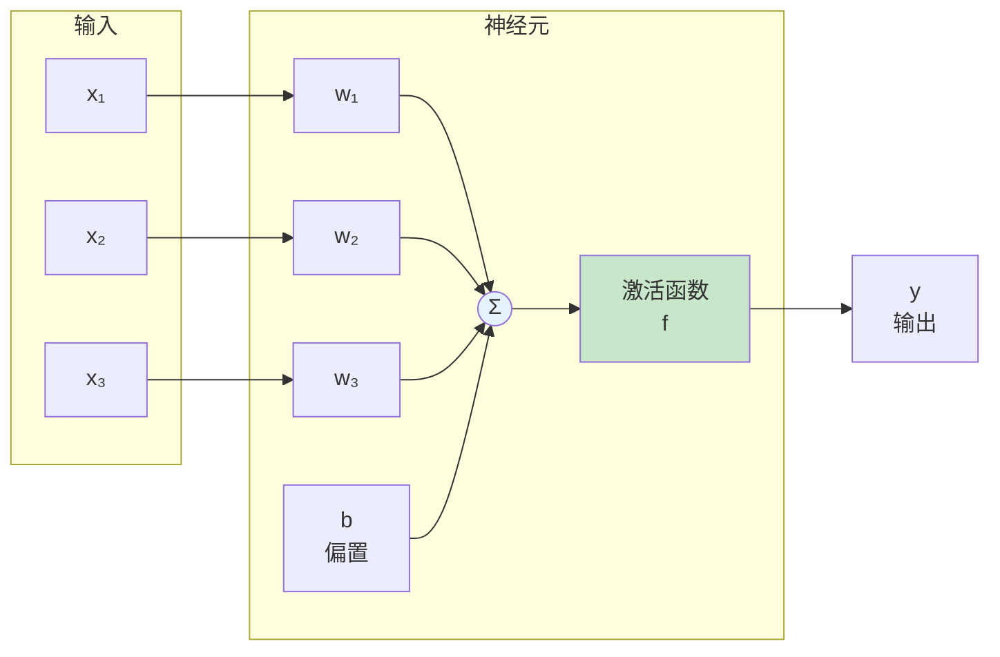
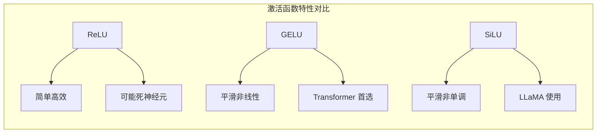
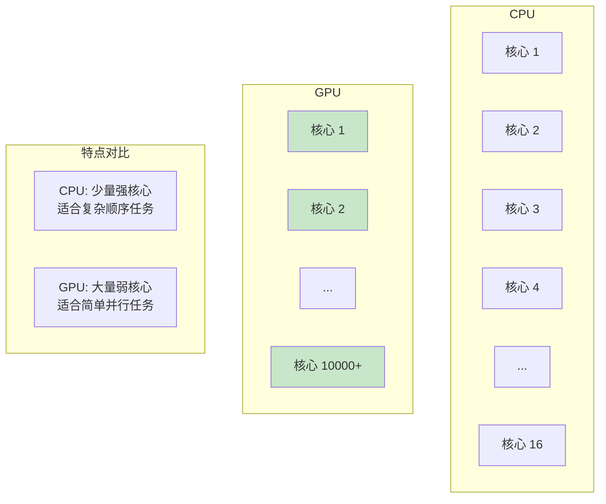
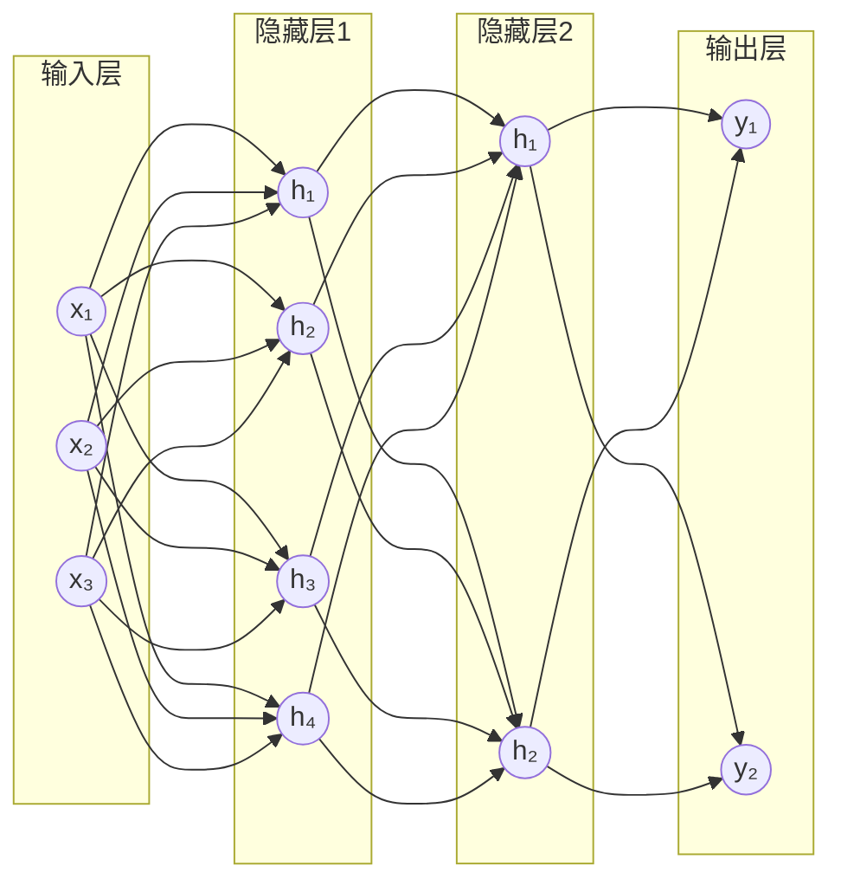
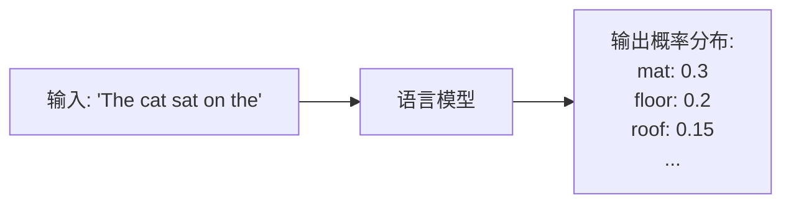
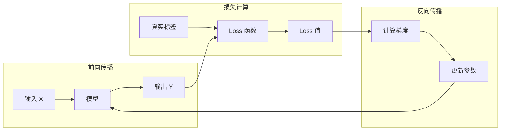

# 神经网络基础

> 本章将介绍神经网络的基本概念，为理解 Transformer 和 LLM 打下基础。

---

## 引言

如果你是深度学习的初学者，本章将帮助你建立必要的基础知识。我们将从最简单的神经元开始，逐步介绍神经网络的核心概念。

如果你已经熟悉这些内容，可以快速浏览或直接跳到下一章。

---

## 1. 从生物神经元到人工神经元

### 1.1 生物神经元

人脑中有约 860 亿个神经元，它们通过突触相互连接。每个神经元：
- 通过**树突**接收来自其他神经元的信号
- 在**细胞体**中处理这些信号
- 通过**轴突**将信号传递给其他神经元

当接收到的信号强度超过某个**阈值**时，神经元就会"激活"并发出信号。

### 1.2 人工神经元

人工神经元是对生物神经元的数学抽象：



**数学表达**：

```
y = f(w₁x₁ + w₂x₂ + w₃x₃ + b)
```

或者用向量形式：

```
y = f(w · x + b)
```

其中：
- **x**：输入向量
- **w**：权重向量（需要学习的参数）
- **b**：偏置（需要学习的参数）
- **f**：激活函数
- **y**：输出

### 1.3 为什么需要激活函数？

如果没有激活函数，神经网络无论多少层，都只能表达**线性函数**：

```
# 两层无激活函数的网络
y = W₂(W₁x + b₁) + b₂
  = W₂W₁x + W₂b₁ + b₂
  = W'x + b'  # 仍然是线性的！
```

激活函数引入**非线性**，使神经网络能够学习复杂的模式。

---

## 2. 激活函数详解

### 2.1 经典激活函数

#### Sigmoid

```
σ(x) = 1 / (1 + e^(-x))
```

**特点**：
- 输出范围 (0, 1)
- 适合二分类的输出层
- **问题**：梯度消失（输入很大或很小时，梯度接近 0）

#### Tanh

```
tanh(x) = (e^x - e^(-x)) / (e^x + e^(-x))
```

**特点**：
- 输出范围 (-1, 1)
- 零中心化
- **问题**：同样有梯度消失问题

#### ReLU（Rectified Linear Unit）

```
ReLU(x) = max(0, x)
```

**特点**：
- 计算简单高效
- 缓解梯度消失
- **问题**：负值区域梯度为 0（"死神经元"）

### 2.2 现代激活函数

#### GELU（Gaussian Error Linear Unit）

```
GELU(x) = x · Φ(x)
```

其中 Φ(x) 是标准正态分布的累积分布函数。

**近似计算**：
```
GELU(x) ≈ 0.5x(1 + tanh(√(2/π)(x + 0.044715x³)))
```

**特点**：
- 平滑的非线性
- 在 Transformer 和 LLM 中广泛使用
- 比 ReLU 表现更好

#### SiLU / Swish

```
SiLU(x) = x · σ(x) = x / (1 + e^(-x))
```

**特点**：
- 平滑、非单调
- 与 GELU 类似的效果

### 2.3 激活函数对比



| 函数 | 公式 | 范围 | 使用场景 |
|------|------|------|---------|
| ReLU | max(0, x) | [0, +∞) | 传统 CNN |
| GELU | x·Φ(x) | (-∞, +∞) | BERT, GPT |
| SiLU | x·σ(x) | (-∞, +∞) | LLaMA, Qwen |

---

## 3. 张量（Tensor）基础

### 3.1 什么是张量

张量是多维数组的通称：

```mermaid
graph TD
    subgraph 张量的维度
        S[标量 Scalar<br/>0维<br/>例: 3.14]
        V[向量 Vector<br/>1维<br/>例: [1, 2, 3]]
        M[矩阵 Matrix<br/>2维<br/>例: [[1,2], [3,4]]]
        T[张量 Tensor<br/>N维<br/>例: 3D, 4D, ...]
    end

    S --> V --> M --> T
```

### 3.2 张量的形状（Shape）

张量的形状描述了每个维度的大小：

```python
import torch

# 标量
scalar = torch.tensor(3.14)
print(scalar.shape)  # torch.Size([])

# 向量
vector = torch.tensor([1, 2, 3])
print(vector.shape)  # torch.Size([3])

# 矩阵
matrix = torch.tensor([[1, 2], [3, 4], [5, 6]])
print(matrix.shape)  # torch.Size([3, 2])  # 3行2列

# 3D 张量
tensor_3d = torch.randn(2, 3, 4)
print(tensor_3d.shape)  # torch.Size([2, 3, 4])
```

### 3.3 LLM 中的常见张量形状

在 LLM 中，我们经常遇到以下形状的张量：

| 张量 | 形状 | 说明 |
|------|------|------|
| 输入 token IDs | `[batch_size, seq_len]` | 批次中的 token 索引 |
| Embedding 输出 | `[batch_size, seq_len, hidden_dim]` | 词向量表示 |
| Attention 权重 | `[batch_size, num_heads, seq_len, seq_len]` | 注意力分数 |
| KV Cache | `[num_layers, 2, batch_size, num_heads, seq_len, head_dim]` | 键值缓存 |
| Logits | `[batch_size, seq_len, vocab_size]` | 输出概率分布 |

**示例**：

```python
# 假设配置
batch_size = 4      # 批次大小
seq_len = 512       # 序列长度
hidden_dim = 4096   # 隐藏维度
num_heads = 32      # 注意力头数
head_dim = 128      # 每个头的维度 (hidden_dim / num_heads)
vocab_size = 32000  # 词表大小

# 输入
input_ids = torch.randint(0, vocab_size, (batch_size, seq_len))
# Shape: [4, 512]

# Embedding 后
embeddings = torch.randn(batch_size, seq_len, hidden_dim)
# Shape: [4, 512, 4096]

# Attention 输出
attention_output = torch.randn(batch_size, seq_len, hidden_dim)
# Shape: [4, 512, 4096]

# 最终 logits
logits = torch.randn(batch_size, seq_len, vocab_size)
# Shape: [4, 512, 32000]
```

### 3.4 常用张量操作

```python
import torch

# 创建张量
x = torch.randn(2, 3, 4)  # 随机正态分布
y = torch.zeros(2, 3, 4)  # 全零
z = torch.ones(2, 3, 4)   # 全一

# 形状操作
x.view(2, 12)      # 重塑形状 [2, 3, 4] → [2, 12]
x.reshape(6, 4)    # 重塑形状 [2, 3, 4] → [6, 4]
x.transpose(1, 2)  # 交换维度 [2, 3, 4] → [2, 4, 3]
x.permute(2, 0, 1) # 重排维度 [2, 3, 4] → [4, 2, 3]

# 数学运算
x + y              # 逐元素加法
x * y              # 逐元素乘法
x @ y.transpose(-1, -2)  # 矩阵乘法
torch.softmax(x, dim=-1) # Softmax

# 索引和切片
x[0]               # 第一个样本
x[:, 0, :]         # 所有样本的第一个位置
x[..., -1]         # 最后一个维度的最后一个元素
```

---

## 4. 矩阵乘法与 GPU 加速

### 4.1 矩阵乘法基础

矩阵乘法是神经网络的核心操作：

```
C = A × B

其中 A: [M, K], B: [K, N], C: [M, N]
```

**计算复杂度**：O(M × K × N)

```python
# PyTorch 矩阵乘法
A = torch.randn(64, 128)   # [M, K]
B = torch.randn(128, 256)  # [K, N]
C = A @ B                   # [M, N] = [64, 256]
# 或者
C = torch.matmul(A, B)
```

### 4.2 批量矩阵乘法（BMM）

在处理批次数据时，我们需要批量矩阵乘法：

```python
# 批量矩阵乘法
batch_A = torch.randn(32, 64, 128)   # [batch, M, K]
batch_B = torch.randn(32, 128, 256)  # [batch, K, N]
batch_C = torch.bmm(batch_A, batch_B) # [batch, M, N] = [32, 64, 256]
```

### 4.3 为什么 GPU 适合矩阵运算



**GPU 优势**：

| 特点 | CPU | GPU |
|------|-----|-----|
| 核心数 | 4-64 | 1000-10000+ |
| 单核性能 | 高 | 低 |
| 并行度 | 低 | 极高 |
| 适合任务 | 复杂逻辑、分支 | 大规模并行计算 |

矩阵乘法的每个输出元素可以独立计算，非常适合 GPU 的大规模并行架构。

### 4.4 实际性能对比

```python
import torch
import time

# 创建大矩阵
A = torch.randn(4096, 4096)
B = torch.randn(4096, 4096)

# CPU 计算
start = time.time()
C_cpu = A @ B
cpu_time = time.time() - start

# GPU 计算
A_gpu = A.cuda()
B_gpu = B.cuda()
torch.cuda.synchronize()
start = time.time()
C_gpu = A_gpu @ B_gpu
torch.cuda.synchronize()
gpu_time = time.time() - start

print(f"CPU: {cpu_time:.3f}s, GPU: {gpu_time:.3f}s")
print(f"加速比: {cpu_time/gpu_time:.1f}x")
# 典型输出: CPU: 2.5s, GPU: 0.01s, 加速比: 250x
```

---

## 5. 多层神经网络

### 5.1 网络结构

多层神经网络（MLP，Multi-Layer Perceptron）由多个层堆叠而成：



### 5.2 前向传播

前向传播计算从输入到输出的过程：

```python
import torch
import torch.nn as nn

class SimpleMLP(nn.Module):
    def __init__(self, input_dim, hidden_dim, output_dim):
        super().__init__()
        self.layer1 = nn.Linear(input_dim, hidden_dim)
        self.activation = nn.GELU()
        self.layer2 = nn.Linear(hidden_dim, output_dim)

    def forward(self, x):
        # x: [batch_size, input_dim]
        x = self.layer1(x)      # [batch_size, hidden_dim]
        x = self.activation(x)   # [batch_size, hidden_dim]
        x = self.layer2(x)       # [batch_size, output_dim]
        return x

# 使用
model = SimpleMLP(768, 3072, 768)
input_data = torch.randn(32, 768)  # batch_size=32
output = model(input_data)  # [32, 768]
```

### 5.3 参数量计算

对于一个全连接层 `nn.Linear(in_features, out_features)`：

```
参数量 = in_features × out_features + out_features(偏置)
```

**示例**：
```python
# 层: Linear(768, 3072)
# 权重参数: 768 × 3072 = 2,359,296
# 偏置参数: 3072
# 总计: 2,362,368 ≈ 2.36M
```

---

## 6. 语言模型基础概念

### 6.1 什么是语言模型

语言模型是一个概率模型，用于预测文本序列的概率：

```
P(w₁, w₂, ..., wₙ) = P(w₁) × P(w₂|w₁) × P(w₃|w₁,w₂) × ... × P(wₙ|w₁,...,wₙ₋₁)
```

**核心任务**：给定前文，预测下一个词的概率分布。



### 6.2 Token 和词表

**Token**：文本的基本单位，可以是：
- 单词："hello"、"world"
- 子词："play" + "ing" = "playing"
- 字符："h"、"e"、"l"、"l"、"o"

**词表（Vocabulary）**：所有可能 token 的集合

```python
# 常见词表大小
# GPT-2: 50257
# LLaMA: 32000
# Qwen: 151936

# Tokenization 示例
text = "Hello, how are you?"
tokens = tokenizer.encode(text)
# tokens = [15496, 11, 703, 527, 499, 30]
```

### 6.3 Embedding

Embedding 将离散的 token ID 转换为连续的向量：

```mermaid
graph LR
    T[Token ID: 15496] --> E[Embedding 层<br/>查表]
    E --> V[向量: [0.1, -0.2, 0.5, ...]]

    subgraph Embedding 矩阵
        EM[矩阵大小: vocab_size × hidden_dim<br/>例: 32000 × 4096]
    end

    style V fill:#c8e6c9
```

```python
import torch.nn as nn

# Embedding 层
vocab_size = 32000
hidden_dim = 4096

embedding = nn.Embedding(vocab_size, hidden_dim)

# 使用
token_ids = torch.tensor([15496, 11, 703])  # 3 个 token
vectors = embedding(token_ids)  # [3, 4096]
```

---

## 7. 推理 vs 训练

### 7.1 训练过程



**训练需要**：
- 前向传播：计算预测值
- 损失计算：比较预测与真实值
- 反向传播：计算梯度
- 参数更新：使用优化器更新权重

### 7.2 推理过程


**推理只需要**：
- 前向传播：计算预测值
- 不需要梯度计算
- 不需要参数更新

### 7.3 推理优化的重要性

| 对比项 | 训练 | 推理 |
|--------|------|------|
| 目标 | 学习参数 | 使用参数 |
| 频率 | 一次（或少数几次） | 大量重复 |
| 延迟要求 | 不敏感 | 敏感（用户等待） |
| 批次大小 | 可以较大 | 通常较小 |
| 内存模式 | 需要存储梯度 | 不需要梯度 |

**推理优化的核心目标**：
- 降低延迟（用户体验）
- 提高吞吐量（服务更多用户）
- 减少显存占用（支持更大模型或更多并发）

这正是 vLLM 要解决的问题！

---

## 8. 本章小结

### 核心概念

1. **神经元**：接收输入、加权求和、应用激活函数、产生输出
2. **激活函数**：引入非线性，GELU 是 LLM 的常用选择
3. **张量**：多维数组，神经网络中数据的载体
4. **矩阵乘法**：神经网络的核心计算，GPU 加速的关键

### 关键公式

```
神经元输出: y = f(w · x + b)
全连接层参数量: in_features × out_features + out_features
```

### LLM 相关

- **Token**：文本的基本单位
- **Embedding**：将 token ID 转换为向量
- **语言模型**：预测下一个 token 的概率分布
- **推理**：使用训练好的模型进行预测

### 与 vLLM 的关联

- 张量形状理解对于理解 vLLM 的内存管理至关重要
- GPU 并行计算是 vLLM 性能优化的基础
- 推理优化是 vLLM 的核心目标

---

## 思考题

1. 为什么现代 LLM 普遍使用 GELU 而不是 ReLU？
2. 如果一个模型有 7B 参数，使用 FP16 精度，需要多少显存存储权重？
3. 批量矩阵乘法如何帮助提高 GPU 利用率？

---

## 下一步

神经网络基础已经介绍完毕，接下来我们将学习 LLM 的核心架构——Transformer：

👉 [下一章：Transformer 架构详解](02-transformer-architecture.md)
