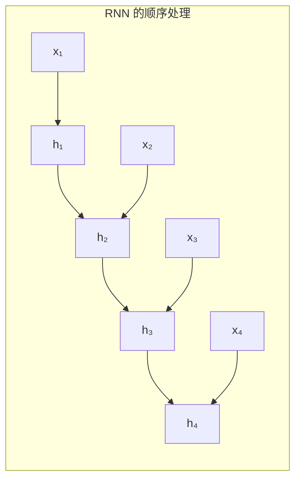
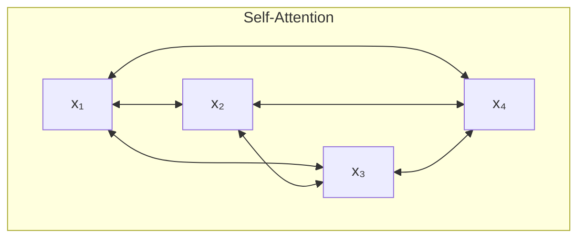
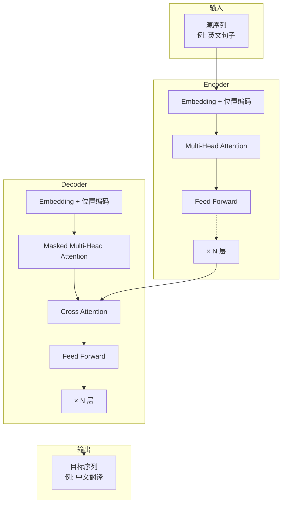
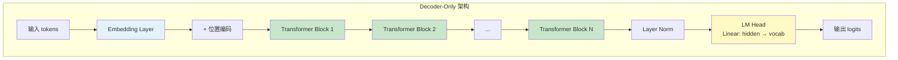
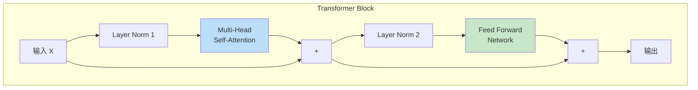
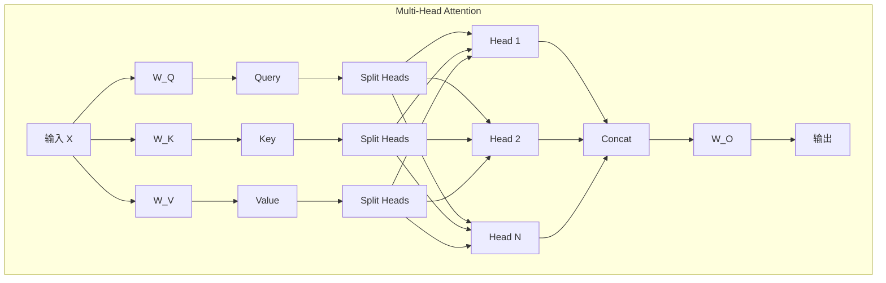
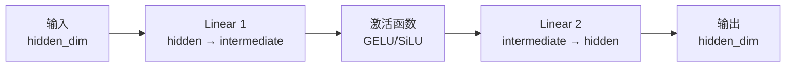
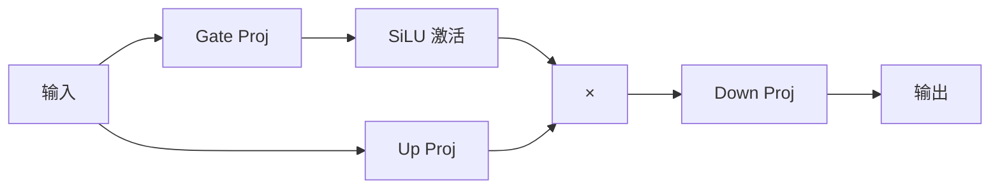
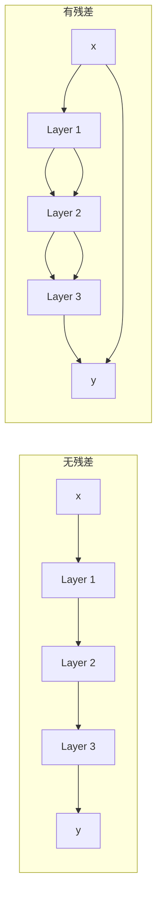
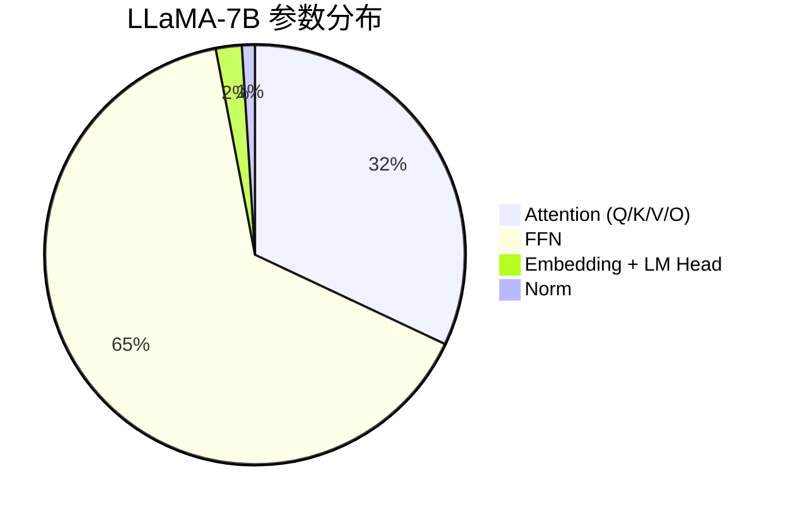

# Transformer 架构详解

> 本章将详细介绍 Transformer 架构，这是现代大语言模型的基础。

---

## 引言

2017 年，Google 发表了划时代的论文《Attention Is All You Need》，提出了 Transformer 架构。这个架构彻底改变了自然语言处理领域，成为了 GPT、BERT、LLaMA 等现代 LLM 的基础。

理解 Transformer 架构是理解 vLLM 优化原理的关键。

---

## 1. Transformer 的诞生背景

### 1.1 RNN/LSTM 的局限

在 Transformer 之前，序列建模主要依赖 RNN（循环神经网络）和 LSTM（长短期记忆网络）：



**RNN 的问题**：

| 问题 | 说明 |
|------|------|
| **顺序依赖** | 必须按顺序处理，无法并行 |
| **长距离依赖** | 难以捕获长序列中的远距离关系 |
| **梯度问题** | 长序列训练时梯度消失或爆炸 |
| **训练慢** | 无法充分利用 GPU 并行能力 |

### 1.2 Attention 的突破

Transformer 的核心创新是**自注意力机制（Self-Attention）**：

- 可以直接建立序列中任意两个位置之间的关系
- 所有位置可以并行计算
- 没有顺序依赖



---

## 2. Transformer 整体架构

### 2.1 原始 Encoder-Decoder 结构

原始 Transformer 包含 Encoder 和 Decoder 两部分：



**应用场景**：
- 机器翻译（英→中）
- 文本摘要
- BERT（仅 Encoder）
- T5（完整 Encoder-Decoder）

### 2.2 Decoder-Only 架构（现代 LLM）

现代大语言模型（GPT 系列、LLaMA、Qwen 等）都采用 **Decoder-Only** 架构：



**为什么 Decoder-Only 成为主流？**

| 优势 | 说明 |
|------|------|
| **统一架构** | 预训练和下游任务使用相同架构 |
| **自回归生成** | 天然适合文本生成任务 |
| **扩展性** | 参数量扩展效果好 |
| **简单高效** | 架构简单，训练推理更高效 |

### 2.3 单层 Transformer Block 结构

每个 Transformer Block 包含以下组件：



**关键组件**：

1. **Layer Normalization**：归一化，稳定训练
2. **Multi-Head Self-Attention**：捕获序列内的关系
3. **Feed Forward Network (FFN)**：非线性变换
4. **残差连接**：缓解梯度消失，帮助信息流动

---

## 3. Embedding 层

### 3.1 Token Embedding

Token Embedding 将离散的 token ID 映射为连续的向量：

```python
import torch.nn as nn

class TokenEmbedding(nn.Module):
    def __init__(self, vocab_size, hidden_dim):
        super().__init__()
        # 创建嵌入矩阵: [vocab_size, hidden_dim]
        self.embedding = nn.Embedding(vocab_size, hidden_dim)

    def forward(self, token_ids):
        # token_ids: [batch_size, seq_len]
        # 返回: [batch_size, seq_len, hidden_dim]
        return self.embedding(token_ids)

# 示例
vocab_size = 32000
hidden_dim = 4096
embedding = TokenEmbedding(vocab_size, hidden_dim)

# 输入 token IDs
token_ids = torch.tensor([[1, 234, 567], [89, 10, 1112]])  # [2, 3]
# 输出嵌入向量
vectors = embedding(token_ids)  # [2, 3, 4096]
```

### 3.2 Embedding 矩阵的参数量

```
参数量 = vocab_size × hidden_dim
```

**示例**（LLaMA-2-7B）：
```
参数量 = 32000 × 4096 = 131,072,000 ≈ 131M
```

占 7B 模型总参数的约 **1.9%**。

---

## 4. 位置编码（Positional Encoding）

### 4.1 为什么需要位置信息

Self-Attention 本身不包含位置信息——它只看 token 之间的关系，不知道它们的顺序。

```
# 这两个序列的 Attention 计算结果相同（如果没有位置编码）
"猫 追 狗"
"狗 追 猫"
```

位置编码为每个位置添加独特的信息，让模型知道 token 的顺序。

### 4.2 正弦位置编码

原始 Transformer 使用正弦/余弦函数：

```
PE(pos, 2i) = sin(pos / 10000^(2i/d))
PE(pos, 2i+1) = cos(pos / 10000^(2i/d))
```

其中：
- `pos`：位置索引
- `i`：维度索引
- `d`：总维度数

```python
import numpy as np

def sinusoidal_position_encoding(max_len, hidden_dim):
    position = np.arange(max_len)[:, np.newaxis]
    div_term = np.exp(np.arange(0, hidden_dim, 2) * -(np.log(10000.0) / hidden_dim))

    pe = np.zeros((max_len, hidden_dim))
    pe[:, 0::2] = np.sin(position * div_term)
    pe[:, 1::2] = np.cos(position * div_term)
    return pe

# 生成位置编码
pe = sinusoidal_position_encoding(512, 4096)
# Shape: [512, 4096]
```

### 4.3 RoPE（旋转位置编码）

现代 LLM（如 LLaMA、Qwen）使用 **RoPE（Rotary Position Embedding）**：

```mermaid
graph LR
    subgraph RoPE 原理
        Q[Query 向量] --> R1[旋转矩阵<br/>R(pos)]
        R1 --> RQ[旋转后的 Query]

        K[Key 向量] --> R2[旋转矩阵<br/>R(pos)]
        R2 --> RK[旋转后的 Key]
    end
```

**RoPE 的优势**：
- 相对位置信息自然编码
- 支持任意长度外推
- 计算高效

```python
# RoPE 的核心思想（简化）
def rotate_half(x):
    x1, x2 = x[..., :x.shape[-1]//2], x[..., x.shape[-1]//2:]
    return torch.cat([-x2, x1], dim=-1)

def apply_rope(q, k, cos, sin):
    q_embed = (q * cos) + (rotate_half(q) * sin)
    k_embed = (k * cos) + (rotate_half(k) * sin)
    return q_embed, k_embed
```

---

## 5. Multi-Head Attention

这是 Transformer 的核心组件，详细原理将在下一章介绍。这里给出结构概览：



**参数量**：

```
Q, K, V 投影: 3 × hidden_dim × hidden_dim
输出投影: hidden_dim × hidden_dim
总计: 4 × hidden_dim²
```

**示例**（hidden_dim = 4096）：
```
参数量 = 4 × 4096² = 67,108,864 ≈ 67M
```

---

## 6. Feed Forward Network (FFN)

### 6.1 基本结构

FFN 是一个简单的两层全连接网络：



```python
class FeedForward(nn.Module):
    def __init__(self, hidden_dim, intermediate_dim):
        super().__init__()
        self.up_proj = nn.Linear(hidden_dim, intermediate_dim)
        self.down_proj = nn.Linear(intermediate_dim, hidden_dim)
        self.activation = nn.GELU()

    def forward(self, x):
        # x: [batch, seq_len, hidden_dim]
        x = self.up_proj(x)       # [batch, seq_len, intermediate_dim]
        x = self.activation(x)     # [batch, seq_len, intermediate_dim]
        x = self.down_proj(x)      # [batch, seq_len, hidden_dim]
        return x
```

### 6.2 SwiGLU 变体

LLaMA 等模型使用 **SwiGLU** 激活函数：



```python
class SwiGLUFeedForward(nn.Module):
    def __init__(self, hidden_dim, intermediate_dim):
        super().__init__()
        self.gate_proj = nn.Linear(hidden_dim, intermediate_dim)
        self.up_proj = nn.Linear(hidden_dim, intermediate_dim)
        self.down_proj = nn.Linear(intermediate_dim, hidden_dim)

    def forward(self, x):
        gate = torch.nn.functional.silu(self.gate_proj(x))
        up = self.up_proj(x)
        return self.down_proj(gate * up)
```

### 6.3 FFN 参数量

**标准 FFN**：
```
参数量 = 2 × hidden_dim × intermediate_dim
```

**SwiGLU FFN**（有三个投影矩阵）：
```
参数量 = 3 × hidden_dim × intermediate_dim
```

**示例**（LLaMA-7B，hidden=4096，intermediate=11008）：
```
参数量 = 3 × 4096 × 11008 = 135,266,304 ≈ 135M
```

---

## 7. Layer Normalization

### 7.1 为什么需要归一化

深层网络中，每层输出的分布会发生变化（Internal Covariate Shift），导致：
- 训练不稳定
- 需要较小的学习率
- 收敛慢

Layer Normalization 将每层输出归一化到均值 0、方差 1 的分布。

### 7.2 计算公式

```
LayerNorm(x) = γ × (x - μ) / √(σ² + ε) + β
```

其中：
- `μ`：均值
- `σ²`：方差
- `ε`：防止除零的小常数
- `γ, β`：可学习的缩放和偏移参数

```python
class LayerNorm(nn.Module):
    def __init__(self, hidden_dim, eps=1e-5):
        super().__init__()
        self.weight = nn.Parameter(torch.ones(hidden_dim))
        self.bias = nn.Parameter(torch.zeros(hidden_dim))
        self.eps = eps

    def forward(self, x):
        mean = x.mean(dim=-1, keepdim=True)
        var = x.var(dim=-1, keepdim=True, unbiased=False)
        return self.weight * (x - mean) / torch.sqrt(var + self.eps) + self.bias
```

### 7.3 RMSNorm

LLaMA 等模型使用 **RMSNorm**，去掉了均值中心化：

```
RMSNorm(x) = γ × x / √(mean(x²) + ε)
```

**优势**：计算更简单，效果相当。

```python
class RMSNorm(nn.Module):
    def __init__(self, hidden_dim, eps=1e-6):
        super().__init__()
        self.weight = nn.Parameter(torch.ones(hidden_dim))
        self.eps = eps

    def forward(self, x):
        rms = torch.sqrt(x.pow(2).mean(dim=-1, keepdim=True) + self.eps)
        return self.weight * x / rms
```

### 7.4 Pre-Norm vs Post-Norm

```mermaid
graph TB
    subgraph Post-Norm
        I1[输入] --> ATT1[Attention]
        ATT1 --> ADD1[+]
        I1 --> ADD1
        ADD1 --> LN1[LayerNorm]
    end

    subgraph Pre-Norm（现代 LLM 常用）
        I2[输入] --> LN2[LayerNorm]
        LN2 --> ATT2[Attention]
        ATT2 --> ADD2[+]
        I2 --> ADD2
    end

    style LN2 fill:#c8e6c9
```

**Pre-Norm 优势**：
- 训练更稳定
- 允许更深的网络
- 更容易收敛

---

## 8. 残差连接

### 8.1 什么是残差连接

残差连接让信息可以"跳过"某些层直接传递：

```
output = x + Layer(x)
```

### 8.2 为什么残差连接重要



**优势**：
- 缓解梯度消失
- 允许训练更深的网络
- 信息直接传递不会丢失

---

## 9. 完整 Transformer Block 代码

```python
import torch
import torch.nn as nn

class TransformerBlock(nn.Module):
    def __init__(self, hidden_dim, num_heads, intermediate_dim):
        super().__init__()
        self.norm1 = RMSNorm(hidden_dim)
        self.attention = MultiHeadAttention(hidden_dim, num_heads)
        self.norm2 = RMSNorm(hidden_dim)
        self.ffn = SwiGLUFeedForward(hidden_dim, intermediate_dim)

    def forward(self, x, attention_mask=None):
        # Pre-Norm + Attention + 残差
        residual = x
        x = self.norm1(x)
        x = self.attention(x, attention_mask)
        x = residual + x

        # Pre-Norm + FFN + 残差
        residual = x
        x = self.norm2(x)
        x = self.ffn(x)
        x = residual + x

        return x
```

---

## 10. 参数量计算实战

### 10.1 LLaMA-2-7B 参数分布

| 组件 | 公式 | 参数量 |
|------|------|--------|
| Embedding | vocab × hidden | 32000 × 4096 = 131M |
| 每层 Attention Q | hidden × hidden | 4096² = 16.8M |
| 每层 Attention K | hidden × (hidden/n_heads × n_kv_heads) | 4096 × 4096 = 16.8M |
| 每层 Attention V | hidden × (hidden/n_heads × n_kv_heads) | 4096 × 4096 = 16.8M |
| 每层 Attention O | hidden × hidden | 4096² = 16.8M |
| 每层 FFN gate | hidden × intermediate | 4096 × 11008 = 45.1M |
| 每层 FFN up | hidden × intermediate | 4096 × 11008 = 45.1M |
| 每层 FFN down | intermediate × hidden | 11008 × 4096 = 45.1M |
| 每层 Norm | 2 × hidden | 2 × 4096 = 8K |
| LM Head | hidden × vocab | 4096 × 32000 = 131M |

**每层总计**：约 202M 参数
**32 层总计**：32 × 202M = 6.46B
**加上 Embedding 和 LM Head**：约 6.7B

### 10.2 参数分布饼图



**关键观察**：
- **FFN 占比最大**（约 65%）
- **Attention 其次**（约 32%）
- **Embedding 占比很小**（约 2%）

这解释了为什么 vLLM 主要优化 Attention 和内存管理，而不是 FFN。

---

## 11. 本章小结

### 架构要点

1. **Decoder-Only 架构**：现代 LLM 的主流选择
2. **Transformer Block**：Attention + FFN + Norm + 残差
3. **位置编码**：RoPE 是现代标准

### 关键组件

| 组件 | 作用 | 现代实现 |
|------|------|---------|
| Embedding | Token → Vector | 直接查表 |
| 位置编码 | 注入位置信息 | RoPE |
| Self-Attention | 捕获序列关系 | Multi-Head |
| FFN | 非线性变换 | SwiGLU |
| Layer Norm | 稳定训练 | RMSNorm |
| 残差连接 | 信息直传 | Pre-Norm |

### 参数分布

- FFN 占主导（约 65%）
- Attention 约 32%
- Embedding 约 2%

### 与 vLLM 的关联

- Attention 计算是 KV Cache 优化的核心
- 参数分布影响显存使用和优化策略
- 位置编码影响序列长度支持

---

## 思考题

1. 为什么 Decoder-Only 架构在 LLM 中比 Encoder-Decoder 更流行？
2. RoPE 相比正弦位置编码有什么优势？
3. 为什么 FFN 的参数量比 Attention 多，但 vLLM 主要优化 Attention？

---

## 下一步

Transformer 架构介绍完毕，接下来我们将深入学习其核心——注意力机制：

👉 [下一章：注意力机制原理](03-attention-mechanism.md)
