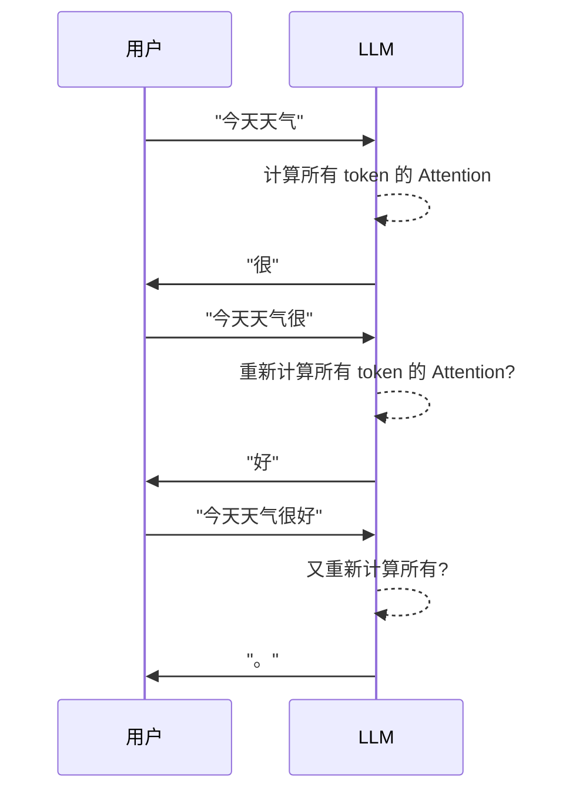
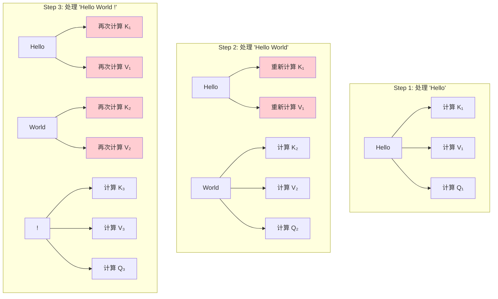
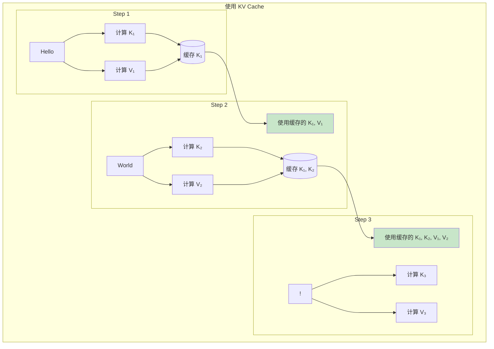
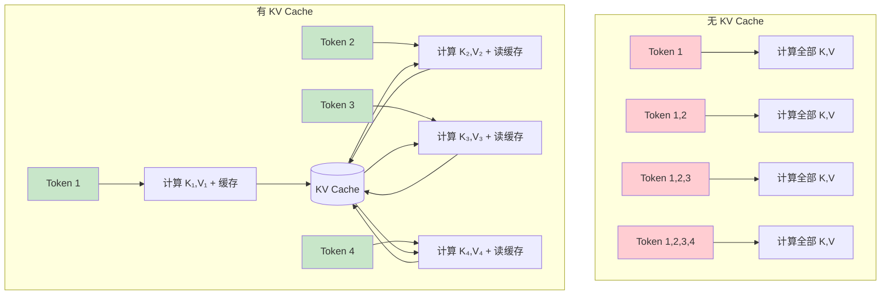
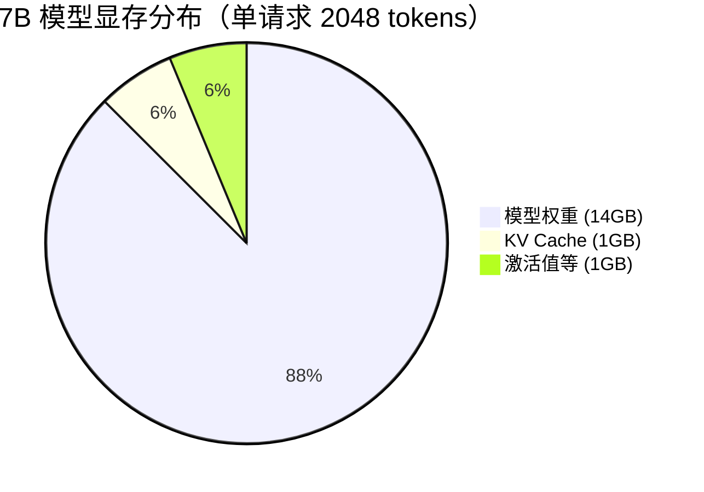
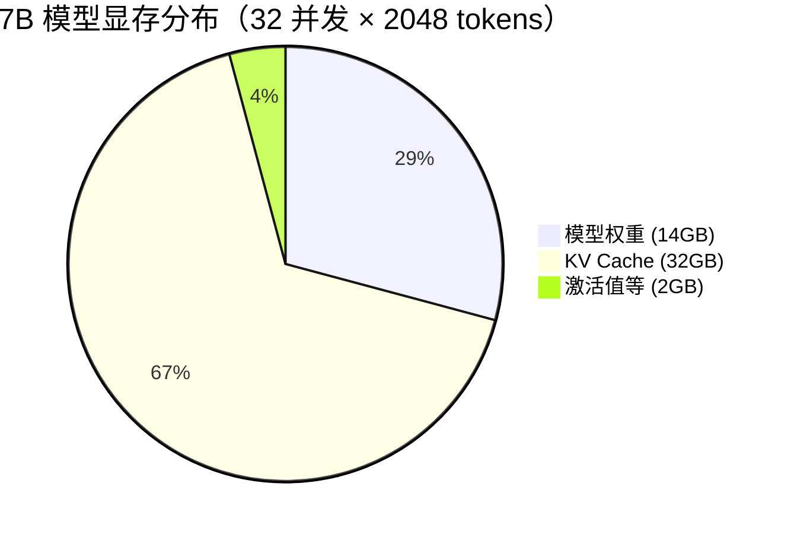
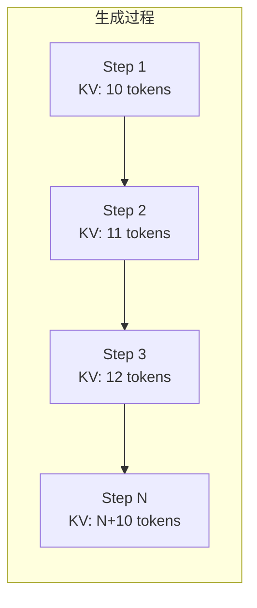
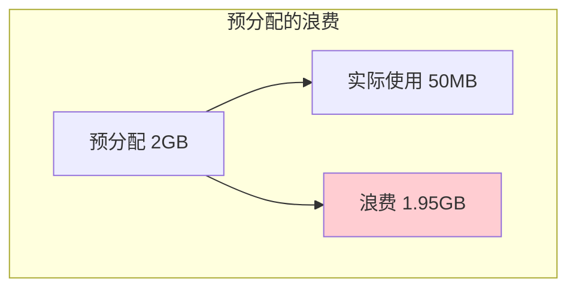
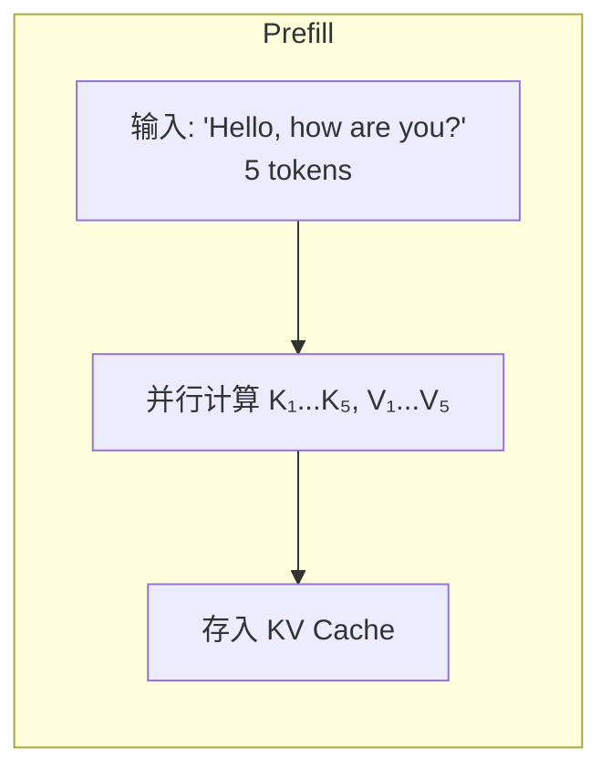

# KV Cache 概念

> 本章将详细介绍 KV Cache 的概念、作用和实现原理，这是理解 vLLM 核心优化的关键。

---

## 引言

KV Cache 是 LLM 推理中最重要的优化技术之一。它通过缓存历史计算结果，避免重复计算，显著提升推理速度。理解 KV Cache 对于理解 vLLM 的 PagedAttention 至关重要。

---

## 1. 为什么需要 KV Cache

### 1.1 自回归生成的特点

LLM 生成文本是**自回归**的：每次只生成一个 token，然后将其加入输入，继续生成下一个。



### 1.2 没有 KV Cache 时的重复计算

在注意力计算中，每个 token 需要：
1. 计算自己的 Q（Query）
2. 计算自己的 K（Key）和 V（Value）
3. 用 Q 与**所有** K 计算注意力
4. 用注意力加权**所有** V

**问题**：历史 token 的 K 和 V 每次都要重新计算！



### 1.3 计算量分析

生成 N 个 token，不使用 KV Cache：

| Step | 需要计算的 K/V | 累计 K/V 计算次数 |
|------|---------------|------------------|
| 1 | 1 | 1 |
| 2 | 2（重新计算 1 + 新的 1） | 1 + 2 = 3 |
| 3 | 3（重新计算 2 + 新的 1） | 3 + 3 = 6 |
| ... | ... | ... |
| N | N | 1 + 2 + ... + N = N(N+1)/2 |

**时间复杂度**：$O(N^2)$

---

## 2. KV Cache 工作原理

### 2.1 核心思想

**观察**：在自回归生成中，历史 token 的 K 和 V 不会改变。

**解决方案**：计算一次后缓存起来，后续直接使用。



### 2.2 计算量对比

使用 KV Cache 后：

| Step | 需要计算的 K/V | 累计 K/V 计算次数 |
|------|---------------|------------------|
| 1 | 1 | 1 |
| 2 | 1（只计算新的） | 1 + 1 = 2 |
| 3 | 1（只计算新的） | 2 + 1 = 3 |
| ... | ... | ... |
| N | 1 | N |

**时间复杂度**：$O(N)$

**加速比**：从 $O(N^2)$ 到 $O(N)$，生成 1000 个 token 时加速约 500 倍！

### 2.3 图解对比



---

## 3. KV Cache 的数据结构

### 3.1 基本形状

KV Cache 需要存储每层的 K 和 V：

```python
# KV Cache 形状
# 方式 1: 分开存储
k_cache = torch.zeros(num_layers, batch_size, num_heads, max_seq_len, head_dim)
v_cache = torch.zeros(num_layers, batch_size, num_heads, max_seq_len, head_dim)

# 方式 2: 合并存储
kv_cache = torch.zeros(num_layers, 2, batch_size, num_heads, max_seq_len, head_dim)
# kv_cache[:, 0, ...] 是 K
# kv_cache[:, 1, ...] 是 V
```

### 3.2 维度解释

| 维度 | 含义 | 示例值 |
|------|------|--------|
| num_layers | Transformer 层数 | 32 |
| 2 | K 和 V | 2 |
| batch_size | 批次大小 | 1-64 |
| num_heads | 注意力头数（或 KV heads） | 32 或 8 |
| max_seq_len | 最大序列长度 | 4096 |
| head_dim | 每个头的维度 | 128 |

### 3.3 代码示例

```python
class KVCache:
    def __init__(self, num_layers, num_heads, head_dim, max_seq_len, dtype=torch.float16):
        self.num_layers = num_layers
        self.max_seq_len = max_seq_len

        # 预分配 K 和 V 缓存
        # 形状: [num_layers, 2, max_batch, num_heads, max_seq_len, head_dim]
        self.cache = None
        self.current_len = 0

    def allocate(self, batch_size):
        self.cache = torch.zeros(
            self.num_layers, 2, batch_size, self.num_heads,
            self.max_seq_len, self.head_dim,
            dtype=self.dtype, device='cuda'
        )
        self.current_len = 0

    def update(self, layer_idx, new_k, new_v):
        """添加新的 K, V 到缓存"""
        # new_k, new_v: [batch, num_heads, new_len, head_dim]
        new_len = new_k.shape[2]
        start_pos = self.current_len
        end_pos = start_pos + new_len

        self.cache[layer_idx, 0, :, :, start_pos:end_pos, :] = new_k
        self.cache[layer_idx, 1, :, :, start_pos:end_pos, :] = new_v

        if layer_idx == self.num_layers - 1:
            self.current_len = end_pos

    def get(self, layer_idx):
        """获取当前层的完整 K, V"""
        k = self.cache[layer_idx, 0, :, :, :self.current_len, :]
        v = self.cache[layer_idx, 1, :, :, :self.current_len, :]
        return k, v
```

---

## 4. 显存占用详细计算

### 4.1 计算公式

```
KV Cache 显存 = 2 × num_layers × num_kv_heads × head_dim × seq_len × batch_size × bytes_per_element
```

简化版（使用 hidden_dim）：

```
KV Cache 显存 = 2 × num_layers × hidden_dim × seq_len × batch_size × bytes_per_element
```

注意：如果使用 GQA，num_kv_heads 可能小于 num_attention_heads。

### 4.2 LLaMA-2-7B 示例

**模型参数**：
- num_layers: 32
- hidden_dim: 4096
- num_kv_heads: 32（MHA）
- head_dim: 128
- 精度: FP16（2 bytes）

**单个请求不同序列长度的 KV Cache**：

| 序列长度 | 计算 | 大小 |
|---------|------|------|
| 512 | 2 × 32 × 4096 × 512 × 2 | 256 MB |
| 1024 | 2 × 32 × 4096 × 1024 × 2 | 512 MB |
| 2048 | 2 × 32 × 4096 × 2048 × 2 | 1 GB |
| 4096 | 2 × 32 × 4096 × 4096 × 2 | 2 GB |
| 8192 | 2 × 32 × 4096 × 8192 × 2 | 4 GB |

### 4.3 LLaMA-2-70B 示例（使用 GQA）

**模型参数**：
- num_layers: 80
- hidden_dim: 8192
- num_kv_heads: 8（GQA，原本是 64 个 attention heads）
- head_dim: 128
- 精度: FP16

**单个请求 4096 序列长度**：

```
KV Cache = 2 × 80 × 8 × 128 × 4096 × 2 = 1.34 GB
```

对比 MHA（如果 kv_heads = 64）：
```
KV Cache = 2 × 80 × 64 × 128 × 4096 × 2 = 10.7 GB
```

**GQA 节省了 8 倍显存！**

### 4.4 显存占用可视化





---

## 5. KV Cache 管理的挑战

### 5.1 动态序列长度

KV Cache 的大小随着生成过程动态增长：



**问题**：在请求开始时，我们不知道最终会生成多少 token！

### 5.2 预分配策略的问题

**传统方案**：预分配最大可能长度（如 4096 tokens）

```
预分配: 4096 tokens × 每token 0.5MB = 2GB
实际使用: 100 tokens × 0.5MB = 50MB
浪费: 1.95GB (97.5%)
```



### 5.3 显存碎片化

当多个请求同时运行时，问题更加严重：

```
显存状态：
+--------+--------+--------+--------+--------+
| Req A  | Req B  | Req C  | Req D  | 空闲   |
| 2GB    | 2GB    | 2GB    | 2GB    | 碎片   |
| 用50MB | 用100MB| 用30MB | 用200MB|        |
+--------+--------+--------+--------+--------+

实际使用: 380MB
预分配: 8GB
浪费: 7.62GB (95%!)
```

### 5.4 这就是 PagedAttention 要解决的问题！

传统方案的问题：
1. **预分配浪费**：每个请求预留最大空间
2. **内部碎片**：实际使用远小于预分配
3. **外部碎片**：释放后的空间不连续

PagedAttention 的解决方案（下一部分详细介绍）：
1. **按需分配**：用多少分配多少
2. **分块管理**：固定大小的块，减少碎片
3. **非连续存储**：块可以不连续

---

## 6. Prefill 和 Decode 中的 KV Cache

### 6.1 Prefill 阶段

处理输入 prompt，一次性计算所有输入 token 的 K、V：



**特点**：
- 批量计算，效率高
- 计算密集型
- KV Cache 从 0 增长到输入长度

### 6.2 Decode 阶段

逐个生成 token，每次只计算新 token 的 K、V：

```mermaid
flowchart TD
    subgraph Decode 循环
        R[读取 KV Cache]
        N[新 token]
        C[计算 K_new, V_new]
        A[Attention: Q_new × [K_cache; K_new]]
        U[更新 KV Cache]
        O[输出 token]

        R --> A
        N --> C --> A
        A --> U --> O
        O -.->|下一轮| N
    end
```

**特点**：
- 增量计算，每次只算 1 个
- 内存密集型（需要读取整个 KV Cache）
- KV Cache 每步增长 1

### 6.3 两阶段的 KV Cache 操作对比

| 操作 | Prefill | Decode |
|------|---------|--------|
| K/V 计算 | 批量（N 个） | 单个（1 个） |
| KV Cache 读取 | 无 | 全部 |
| KV Cache 写入 | N 个 | 1 个 |
| 计算/访存比 | 高 | 低 |

---

## 7. vLLM 中的 KV Cache 相关代码

### 7.1 关键文件位置

| 功能 | 文件 |
|------|------|
| KV Cache 管理 | `vllm/v1/core/kv_cache_manager.py` |
| 块池 | `vllm/v1/core/block_pool.py` |
| 块表 | `vllm/v1/worker/block_table.py` |
| KV Cache 接口 | `vllm/v1/kv_cache_interface.py` |

### 7.2 数据结构预览

```python
# vllm/v1/core/block_pool.py 中的块定义
@dataclass
class KVCacheBlock:
    block_id: int          # 块 ID
    ref_cnt: int           # 引用计数
    block_hash: Optional[BlockHash]  # 用于前缀缓存

# vllm/v1/worker/block_table.py 中的块表
class BlockTable:
    """管理逻辑块到物理块的映射"""
    def __init__(self, ...):
        self.block_table: torch.Tensor  # 形状: [max_blocks]
```

---

## 8. 本章小结

### 核心概念

1. **KV Cache 的作用**：缓存历史 token 的 K、V，避免重复计算
2. **加速效果**：从 $O(N^2)$ 降到 $O(N)$，约 500 倍加速（N=1000）
3. **显存占用**：随序列长度线性增长，可能成为主要显存消耗

### 关键公式

```
KV Cache = 2 × num_layers × num_kv_heads × head_dim × seq_len × bytes
```

### 管理挑战

- **动态增长**：序列长度在生成过程中不断增加
- **预分配浪费**：传统方案浪费 60-80% 显存
- **碎片化**：多请求并发时问题更严重

### 与 vLLM 的关联

- **PagedAttention**：解决 KV Cache 的显存浪费问题
- **分块管理**：将 KV Cache 分成固定大小的块
- **按需分配**：用多少分配多少，不预留

---

## 思考题

1. 如果一个模型使用 GQA，KV heads 是 attention heads 的 1/8，KV Cache 显存会减少多少？
2. 为什么 Decode 阶段是"内存密集型"而不是"计算密集型"？
3. 如果 vLLM 要支持无限长度的上下文，KV Cache 管理会面临什么额外挑战？

---

## 下一步

了解了 KV Cache 后，让我们来看看 LLM 完整的生成过程：

👉 [下一章：LLM 生成过程](05-llm-generation-process.md)
