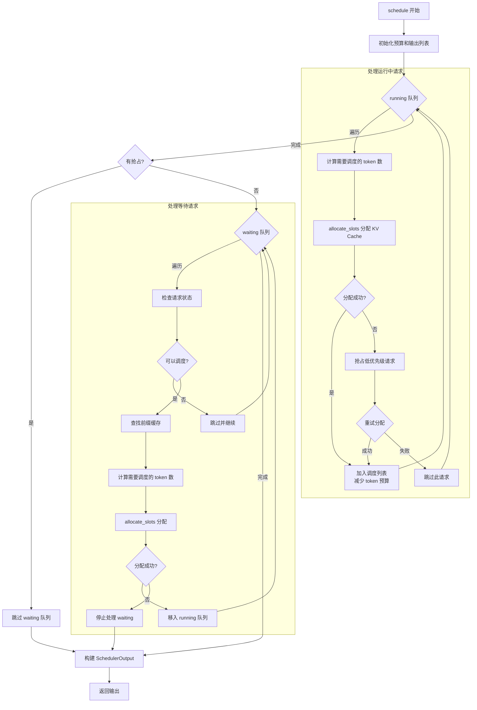

# 调度器原理详解

调度器（Scheduler）是 vLLM 的"大脑"，它决定了**哪些请求可以运行**以及**每个请求能处理多少 token**。一个好的调度策略直接影响系统的吞吐量、延迟和资源利用率。

本章我们将深入了解 vLLM 调度器的工作原理、调度算法和实现细节。

---

## 1. Scheduler 在架构中的位置


**Scheduler 的核心职责：**

1. **请求队列管理**：维护 waiting 和 running 两个队列
2. **资源分配决策**：决定哪些请求可以获得 GPU 资源
3. **内存协调**：与 KVCacheManager 协作管理 KV Cache
4. **抢占处理**：在内存不足时执行抢占策略
5. **输出构建**：为 ModelExecutor 构建 SchedulerOutput

---

## 2. 核心数据结构

### 2.1 请求队列

```python
# vllm/v1/core/sched/scheduler.py

class Scheduler:
    def __init__(self, ...):
        # 等待队列：存放新到达和被抢占的请求
        self.waiting = create_request_queue(self.policy)

        # 运行队列：存放正在处理的请求
        self.running: list[Request] = []

        # 请求字典：通过 request_id 快速查找
        self.requests: dict[str, Request] = {}
```

**两个队列的关系：**


### 2.2 调度约束

```python
class Scheduler:
    def __init__(self, ...):
        # 最大并发请求数
        self.max_num_running_reqs = self.scheduler_config.max_num_seqs

        # 每步最大 token 数
        self.max_num_scheduled_tokens = self.scheduler_config.max_num_batched_tokens

        # 最大序列长度
        self.max_model_len = vllm_config.model_config.max_model_len
```

**约束说明：**

| 约束 | 默认值 | 说明 |
|-----|-------|------|
| `max_num_seqs` | 256 | 最多同时运行的请求数 |
| `max_num_batched_tokens` | 2048 | 每步最多处理的 token 数 |
| `max_model_len` | 模型配置 | 单个序列的最大长度 |

### 2.3 SchedulerOutput - 调度输出

```python
# vllm/v1/core/sched/output.py

@dataclass
class SchedulerOutput:
    """调度器的输出，传递给 ModelExecutor"""

    # 新调度的请求
    scheduled_new_reqs: list[NewRequestData]

    # 继续运行的请求
    scheduled_cached_reqs: CachedRequestData

    # 每个请求调度的 token 数
    num_scheduled_tokens: dict[str, int]

    # 总调度 token 数
    total_num_scheduled_tokens: int

    # 抢占的请求 ID
    preempted_req_ids: set[str]

    # 完成的请求 ID
    finished_req_ids: set[str]
```

---

## 3. schedule() 方法详解

`schedule()` 是调度器的核心方法，每个 step 调用一次。

### 3.1 调度算法概述

```
vLLM 的调度没有明确的 "prefill 阶段" 或 "decode 阶段"。
每个请求只有两个关键状态：
  - num_computed_tokens: 已计算的 token 数
  - num_tokens: 总 token 数（prompt + output）

每一步，调度器尝试分配 token，使 num_computed_tokens 追上 num_tokens。
这种设计足够通用，支持分块预填充、前缀缓存、投机解码等各种优化。
```

### 3.2 完整调度流程



### 3.3 处理 Running 请求

```python
def schedule(self) -> SchedulerOutput:
    # ... 初始化 ...

    # 第一步：处理 RUNNING 请求
    req_index = 0
    while req_index < len(self.running) and token_budget > 0:
        request = self.running[req_index]

        # 计算需要调度的 token 数
        num_new_tokens = (
            request.num_tokens_with_spec      # 总 token 数
            + request.num_output_placeholders  # 输出占位符
            - request.num_computed_tokens      # 已计算的 token 数
        )

        # 应用长 prefill 分块限制
        if 0 < threshold < num_new_tokens:
            num_new_tokens = threshold

        # 不超过 token 预算
        num_new_tokens = min(num_new_tokens, token_budget)

        # 不超过模型最大长度
        num_new_tokens = min(
            num_new_tokens,
            self.max_model_len - 1 - request.num_computed_tokens
        )

        if num_new_tokens == 0:
            req_index += 1
            continue

        # 尝试分配 KV Cache
        while True:
            new_blocks = self.kv_cache_manager.allocate_slots(
                request,
                num_new_tokens,
                num_lookahead_tokens=self.num_lookahead_tokens,
            )

            if new_blocks is not None:
                # 分配成功
                break

            # 分配失败，执行抢占
            preempted_req = self._select_preempt_target()
            self._preempt_request(preempted_req, timestamp)

            if preempted_req == request:
                # 自己被抢占了，无法继续
                break

        if new_blocks is None:
            break

        # 调度成功
        scheduled_running_reqs.append(request)
        token_budget -= num_new_tokens
        req_index += 1
```

### 3.4 处理 Waiting 请求

```python
    # 第二步：处理 WAITING 请求（只有没有抢占时才处理）
    if not preempted_reqs:
        while self.waiting and token_budget > 0:
            # 检查并发限制
            if len(self.running) == self.max_num_running_reqs:
                break

            request = self.waiting.peek_request()

            # 检查各种等待状态
            if request.status == RequestStatus.WAITING_FOR_REMOTE_KVS:
                # 等待远程 KV Cache 加载
                ...

            if request.status == RequestStatus.WAITING_FOR_FSM:
                # 等待语法编译
                ...

            # 查找前缀缓存
            new_computed_blocks, num_cached = (
                self.kv_cache_manager.get_computed_blocks(request)
            )

            # 计算需要调度的 token 数
            num_new_tokens = request.num_tokens - num_cached
            num_new_tokens = min(num_new_tokens, token_budget)

            # 分配 KV Cache
            new_blocks = self.kv_cache_manager.allocate_slots(
                request,
                num_new_tokens,
                num_new_computed_tokens=num_cached,
                new_computed_blocks=new_computed_blocks,
            )

            if new_blocks is None:
                # 无法分配，停止处理 waiting 队列
                break

            # 调度成功，移入 running 队列
            request = self.waiting.pop_request()
            self.running.append(request)
            request.status = RequestStatus.RUNNING
            request.num_computed_tokens = num_cached
            token_budget -= num_new_tokens
```

---

## 4. 抢占机制

当 KV Cache 内存不足时，调度器需要抢占一些请求来释放空间。

### 4.1 抢占策略

```python
def _select_preempt_target(self) -> Request:
    """选择要抢占的请求"""
    if self.policy == SchedulingPolicy.PRIORITY:
        # 优先级调度：抢占优先级最低、到达最晚的请求
        return max(
            self.running,
            key=lambda r: (r.priority, r.arrival_time),
        )
    else:
        # FCFS：抢占最后加入的请求
        return self.running[-1]
```

### 4.2 抢占流程

```python
def _preempt_request(self, request: Request, timestamp: float) -> None:
    """抢占请求并放回 waiting 队列"""
    assert request.status == RequestStatus.RUNNING

    # 释放 KV Cache
    self.kv_cache_manager.free(request)
    self.encoder_cache_manager.free(request)

    # 更新请求状态
    request.status = RequestStatus.PREEMPTED
    request.num_computed_tokens = 0  # 重置计算进度
    request.num_preemptions += 1

    # 放回 waiting 队列头部（优先恢复）
    self.waiting.prepend_request(request)
```

### 4.3 抢占流程图


---

## 5. 调度策略

### 5.1 FCFS（先来先服务）

```python
# 默认策略
class SchedulingPolicy(Enum):
    FCFS = "fcfs"
    PRIORITY = "priority"
```

**FCFS 特点：**
- 按请求到达顺序处理
- 简单公平
- 可能导致"队头阻塞"

### 5.2 Priority（优先级调度）

```python
# 基于优先级的调度
def _select_preempt_target(self):
    if self.policy == SchedulingPolicy.PRIORITY:
        # 选择优先级最低的请求
        return max(
            self.running,
            key=lambda r: (r.priority, r.arrival_time),
        )
```

**Priority 特点：**
- 高优先级请求优先处理
- 支持紧急请求插队
- 可能导致低优先级请求"饥饿"

---

## 6. 分块预填充（Chunked Prefill）

对于长输入，vLLM 支持分块预填充，将 prefill 分成多个 chunk 处理。

### 6.1 工作原理

```
传统 Prefill（一次性处理）:
step 1: [token_1 ... token_1000] → 处理 1000 个 token

分块 Prefill:
step 1: [token_1 ... token_256] → 处理 256 个 token
step 2: [token_257 ... token_512] → 处理 256 个 token
step 3: [token_513 ... token_768] → 处理 256 个 token
step 4: [token_769 ... token_1000] → 处理 232 个 token
```

### 6.2 配置参数

```python
# 长 prefill 分块阈值
threshold = self.scheduler_config.long_prefill_token_threshold

if 0 < threshold < num_new_tokens:
    num_new_tokens = threshold  # 限制每次处理的 token 数
```

### 6.3 好处

1. **降低延迟**：长 prefill 不会阻塞其他请求
2. **更好的资源利用**：允许多个请求交替执行
3. **内存平滑**：避免一次性分配大量 KV Cache


---

## 7. 调度器与其他组件的协作

### 7.1 完整的调度循环


### 7.2 请求状态更新

```python
def update_from_output(
    self,
    model_runner_output: ModelRunnerOutput,
    ...
) -> EngineCoreOutputs:
    """根据模型输出更新请求状态"""

    for req_id, sampler_output in model_output.items():
        request = self.requests[req_id]

        # 追加输出 token
        request.append_output_token_ids(sampler_output.sampled_token_ids)

        # 检查停止条件
        stopped = check_stop(request, self.max_model_len)

        if stopped:
            # 请求完成
            self._free_request(request)
            self.finished_req_ids.add(req_id)
            outputs.append(...)
```

---

## 8. 配置与调优

### 8.1 关键配置参数

| 参数 | 说明 | 建议值 |
|-----|------|-------|
| `max_num_seqs` | 最大并发请求数 | 根据 GPU 内存调整 |
| `max_num_batched_tokens` | 每步最大 token 数 | 2048-8192 |
| `enable_chunked_prefill` | 启用分块预填充 | 建议开启 |
| `long_prefill_token_threshold` | 长 prefill 阈值 | 256-512 |
| `policy` | 调度策略 | fcfs 或 priority |

### 8.2 性能调优建议

**1. 提高吞吐量**

```python
# 增加最大并发数
llm = LLM(model="...", max_num_seqs=512)

# 增加每步 token 数
llm = LLM(model="...", max_num_batched_tokens=4096)
```

**2. 降低延迟**

```python
# 启用分块预填充
llm = LLM(
    model="...",
    enable_chunked_prefill=True,
    long_prefill_token_threshold=256,
)
```

**3. 处理高优先级请求**

```python
# 使用优先级调度
llm = LLM(model="...", policy="priority")

# 发送请求时设置优先级
llm.generate(prompt, priority=0)  # 高优先级
llm.generate(prompt, priority=10)  # 低优先级
```

---

## 9. 代码位置速查

| 功能 | 文件 | 关键类/函数 |
|-----|------|------------|
| Scheduler 主类 | `vllm/v1/core/sched/scheduler.py` | `Scheduler` |
| schedule 方法 | `vllm/v1/core/sched/scheduler.py:313` | `schedule()` |
| 抢占逻辑 | `vllm/v1/core/sched/scheduler.py:892` | `_preempt_request()` |
| 调度输出 | `vllm/v1/core/sched/output.py` | `SchedulerOutput` |
| 请求队列 | `vllm/v1/core/sched/request_queue.py` | `create_request_queue()` |
| 调度策略 | `vllm/v1/core/sched/request_queue.py` | `SchedulingPolicy` |

---

## 10. 小结

本章我们深入了解了 vLLM 调度器的工作原理：

1. **双队列管理**：waiting 和 running 队列
2. **调度算法**：
   - 先处理 running 请求
   - 再处理 waiting 请求
   - 内存不足时执行抢占
3. **抢占机制**：释放低优先级请求的资源
4. **调度策略**：FCFS 和 Priority
5. **分块预填充**：降低长输入的延迟影响
6. **与其他组件协作**：KVCacheManager、ModelExecutor

在下一章中，我们将学习连续批处理（Continuous Batching）机制，了解 vLLM 如何实现高效的动态批处理。

---

## 导航

- 上一篇：[Block Pool 内存块池](03-block-pool.md)
- 下一篇：[连续批处理机制](05-continuous-batching.md)
- [返回目录](../README.md)
