# 分布式推理（Distributed Inference）

## 概述

当模型规模超过单个 GPU 的显存容量时，需要使用分布式推理。vLLM 支持多种并行策略，可以将大模型分布到多个 GPU 上运行。

本文将介绍分布式推理的基本概念、并行策略以及 vLLM 中的实现细节。

---

## 为什么需要分布式推理

### 单卡显存限制

以 LLaMA-70B 为例（FP16 精度）：

| 组件 | 显存占用 |
|------|---------|
| 模型权重 | ~140 GB |
| KV Cache (4K 上下文, batch=32) | ~20 GB |
| 激活值 | ~5 GB |
| **总计** | **~165 GB** |

即使是 H100 80GB，单卡也无法容纳完整模型。

### 分布式推理的目标

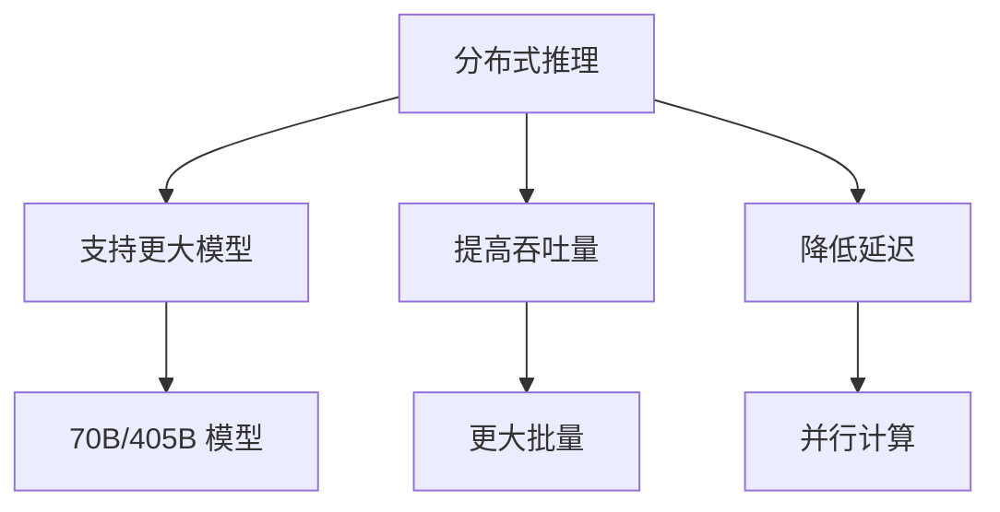

---

## 并行策略概述

### 主要并行方式

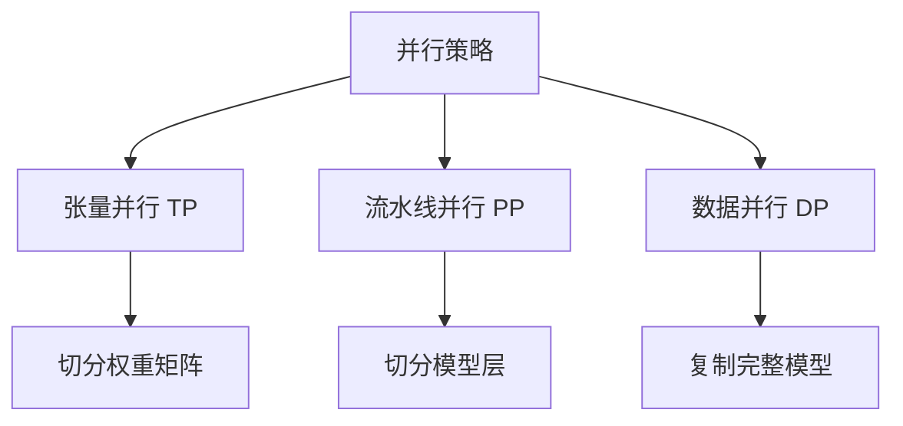

### 各策略对比

| 策略 | 通信模式 | 显存效率 | 计算效率 | 适用场景 |
|------|---------|---------|---------|---------|
| 张量并行 | AllReduce | 高 | 高 | 单节点多卡 |
| 流水线并行 | P2P | 中 | 中 | 多节点 |
| 数据并行 | AllGather | 低 | 最高 | 高吞吐量 |

---

## 张量并行（Tensor Parallelism）

### 基本原理

张量并行将模型的权重矩阵切分到多个 GPU：

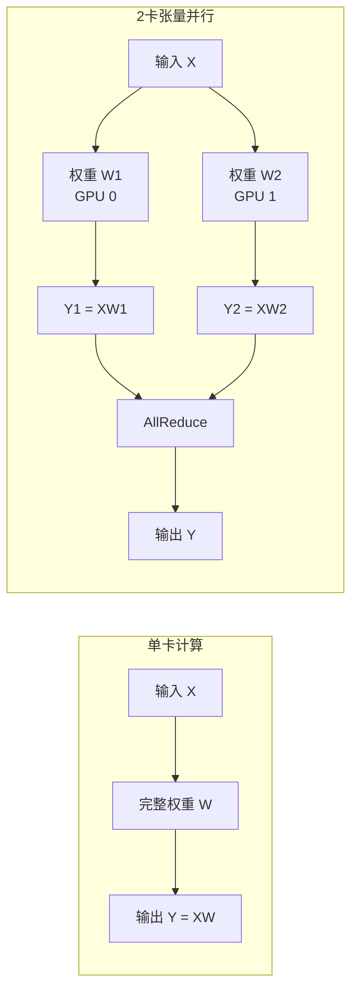

### 列并行与行并行

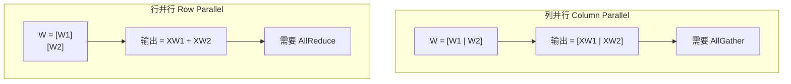

**Linear 层的张量并行**：
- 第一个 Linear：列并行，输出分片
- 第二个 Linear：行并行，输入分片

### vLLM 中的实现

```python
# vllm/distributed/parallel_state.py

class GroupCoordinator:
    """分布式组协调器"""

    def __init__(
        self,
        group_ranks: list[list[int]],
        local_rank: int,
        torch_distributed_backend: str,
        use_pynccl: bool,
        ...
    ):
        self.rank = torch.distributed.get_rank()
        self.ranks = group_ranks[local_rank]
        self.world_size = len(self.ranks)
        self.local_rank = local_rank

        # 创建通信组
        self.device_group = torch.distributed.new_group(
            self.ranks, backend=torch_distributed_backend
        )

    def all_reduce(self, input_: torch.Tensor) -> torch.Tensor:
        """AllReduce 操作"""
        if self.world_size == 1:
            return input_

        if self.use_custom_op_call:
            return torch.ops.vllm.all_reduce(input_, group_name=self.unique_name)
        else:
            return self._all_reduce_out_place(input_)

    def all_gather(self, input_: torch.Tensor, dim: int = -1) -> torch.Tensor:
        """AllGather 操作"""
        if self.world_size == 1:
            return input_

        if self.use_custom_op_call:
            return torch.ops.vllm.all_gather(
                input_, dim, self.world_size, group_name=self.unique_name
            )
        else:
            return self._all_gather_out_place(input_, dim)

    def reduce_scatter(self, input_: torch.Tensor, dim: int = -1) -> torch.Tensor:
        """ReduceScatter 操作"""
        if self.world_size == 1:
            return input_

        return self._reduce_scatter_out_place(input_, dim)
```

### 通信原语

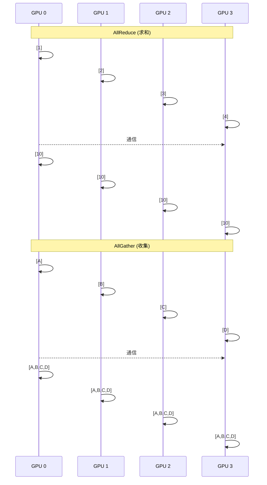

---

## 流水线并行（Pipeline Parallelism）

### 基本原理

流水线并行将模型的层分配到不同 GPU：

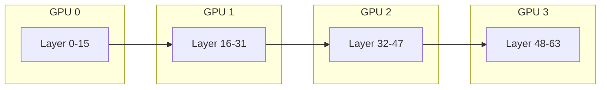

### 流水线调度

为了减少 GPU 空闲时间，使用微批次（micro-batch）流水线：

```mermaid
gantt
    title 流水线并行调度
    dateFormat X
    axisFormat %s

    section GPU 0
    Micro 1 Forward: 0, 1
    Micro 2 Forward: 1, 2
    Micro 3 Forward: 2, 3
    Micro 4 Forward: 3, 4

    section GPU 1
    Idle: 0, 1
    Micro 1 Forward: 1, 2
    Micro 2 Forward: 2, 3
    Micro 3 Forward: 3, 4
    Micro 4 Forward: 4, 5

    section GPU 2
    Idle: 0, 2
    Micro 1 Forward: 2, 3
    Micro 2 Forward: 3, 4
    Micro 3 Forward: 4, 5
    Micro 4 Forward: 5, 6
```

### vLLM 中的配置

```python
from vllm import LLM

# 配置流水线并行
llm = LLM(
    model="meta-llama/Llama-3.1-70B-Instruct",
    tensor_parallel_size=2,   # 每个流水线阶段 2 卡张量并行
    pipeline_parallel_size=2, # 2 个流水线阶段
    # 总共需要 2 × 2 = 4 张 GPU
)
```

---

## 数据并行（Data Parallelism）

### 基本原理

数据并行复制完整模型到每个 GPU，各 GPU 处理不同的请求：

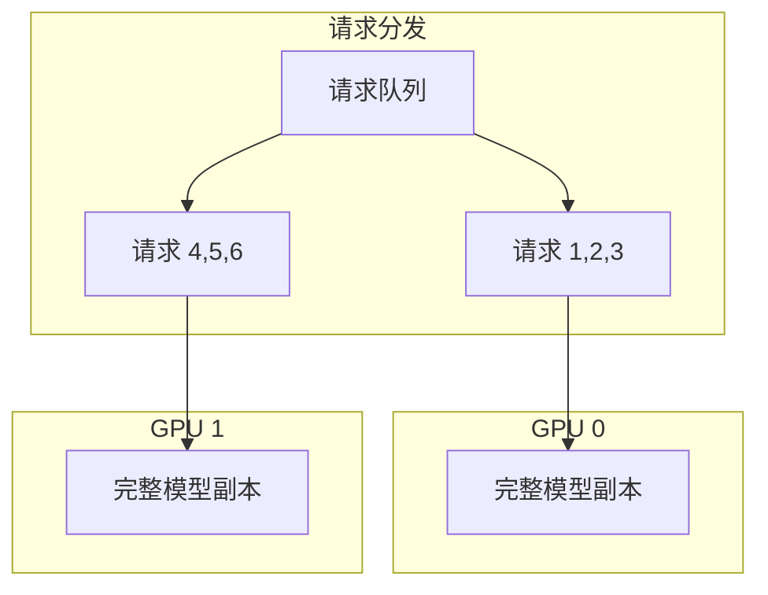

### vLLM 中的数据并行

vLLM 支持通过多实例实现数据并行：

```bash
# 启动多个 vLLM 实例
# 实例 1：使用 GPU 0-1
CUDA_VISIBLE_DEVICES=0,1 vllm serve model --tensor-parallel-size 2 --port 8000

# 实例 2：使用 GPU 2-3
CUDA_VISIBLE_DEVICES=2,3 vllm serve model --tensor-parallel-size 2 --port 8001
```

然后使用负载均衡器分发请求。

---

## 通信后端

### NCCL 通信

vLLM 使用 NCCL (NVIDIA Collective Communications Library) 进行 GPU 间通信：

```python
# vllm/distributed/device_communicators/pynccl.py

class PyNcclCommunicator:
    """PyNccl 通信器"""

    def __init__(self, group: ProcessGroup, device: torch.device):
        self.group = group
        self.device = device

        # 初始化 NCCL 通信
        self.nccl_comm = self._init_nccl()

    def all_reduce(self, tensor: torch.Tensor) -> torch.Tensor:
        """使用 NCCL 执行 AllReduce"""
        # 调用 NCCL AllReduce
        return self._nccl_all_reduce(tensor)
```

### 自定义 AllReduce

vLLM 提供了优化的自定义 AllReduce 实现：

```python
# vllm/distributed/device_communicators/custom_all_reduce.py

class CustomAllReduce:
    """
    自定义 AllReduce，针对小张量优化。
    使用共享内存和 CUDA 内核实现低延迟通信。
    """

    def __init__(self, group: ProcessGroup):
        self.group = group
        # 分配共享内存用于通信
        self._init_shared_memory()

    def all_reduce(self, tensor: torch.Tensor) -> torch.Tensor:
        # 对于小张量，使用自定义内核
        if tensor.numel() < self.threshold:
            return self._custom_all_reduce(tensor)
        # 对于大张量，使用 NCCL
        return self._nccl_all_reduce(tensor)
```

---

## 分布式初始化

### 初始化流程

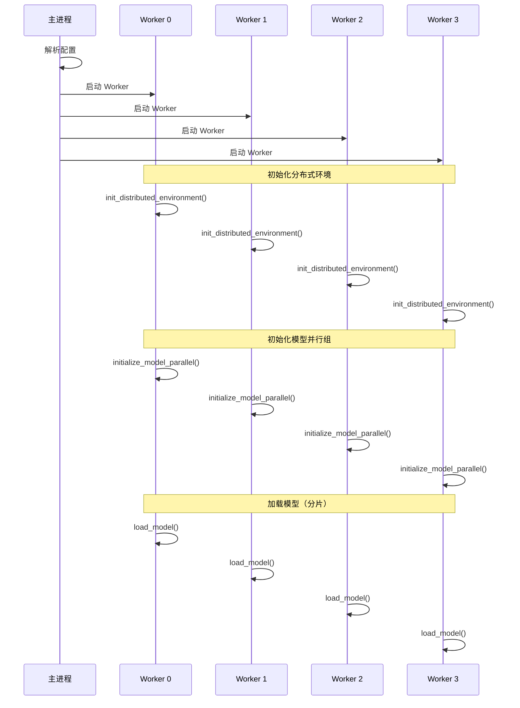

### 并行组配置

```python
# 并行组划分示例
# 假设 4 GPU，TP=2，PP=2

# 张量并行组：
# [GPU 0, GPU 1]  # 第一阶段
# [GPU 2, GPU 3]  # 第二阶段

# 流水线并行组：
# [GPU 0, GPU 2]  # 第一个数据并行副本
# [GPU 1, GPU 3]  # 第二个数据并行副本
```

---

## 分布式执行器

### Executor 类型

vLLM 提供多种分布式执行器：

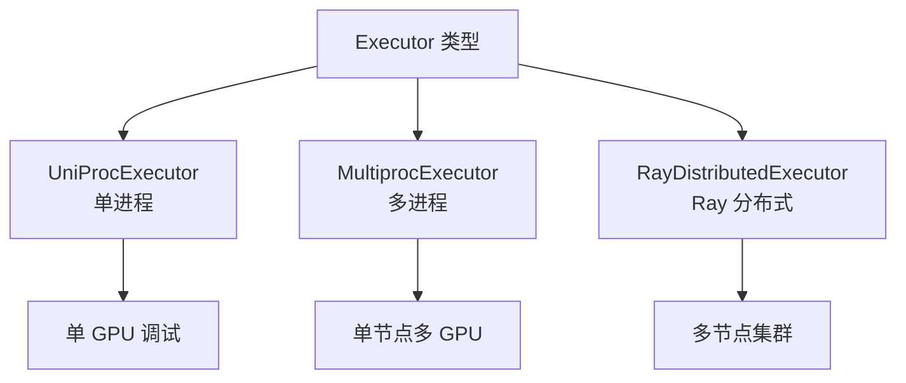

### MultiprocExecutor

```python
# vllm/v1/executor/multiproc_executor.py

class MultiprocExecutor:
    """多进程执行器，用于单节点多 GPU"""

    def __init__(self, vllm_config: VllmConfig):
        self.vllm_config = vllm_config
        parallel_config = vllm_config.parallel_config

        # 计算总 Worker 数
        self.world_size = (
            parallel_config.tensor_parallel_size *
            parallel_config.pipeline_parallel_size
        )

        # 启动 Worker 进程
        self.workers = self._start_workers()

    def _start_workers(self):
        """使用 multiprocessing 启动 Worker"""
        workers = []
        for rank in range(self.world_size):
            worker = multiprocessing.Process(
                target=self._worker_main,
                args=(rank,)
            )
            worker.start()
            workers.append(worker)
        return workers
```

### Ray 分布式执行器

```python
# 使用 Ray 进行多节点分布式推理
from vllm import LLM

# Ray 会自动检测集群中的 GPU
llm = LLM(
    model="meta-llama/Llama-3.1-70B-Instruct",
    tensor_parallel_size=4,  # 使用 4 张 GPU
    distributed_executor_backend="ray",
)
```

---

## KV Cache 分布式传输

### Prefill-Decode 分离架构

vLLM 支持将 Prefill 和 Decode 阶段分离到不同节点：

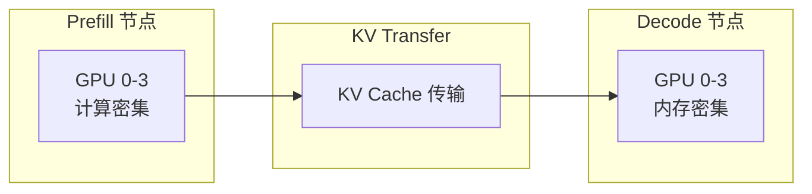

### KV Connector 实现

```python
# vllm/distributed/kv_transfer/kv_connector/v1/base.py

class KVConnectorBase:
    """KV Cache 传输连接器基类"""

    def send_kv_cache(
        self,
        request_id: str,
        kv_cache: torch.Tensor,
    ) -> None:
        """发送 KV Cache 到远程节点"""
        raise NotImplementedError

    def recv_kv_cache(
        self,
        request_id: str,
    ) -> torch.Tensor:
        """从远程节点接收 KV Cache"""
        raise NotImplementedError
```

---

## 配置示例

### 单节点 4 GPU

```python
# 单节点 4 GPU 张量并行
llm = LLM(
    model="meta-llama/Llama-3.1-70B-Instruct",
    tensor_parallel_size=4,
)
```

```bash
# 命令行方式
vllm serve meta-llama/Llama-3.1-70B-Instruct --tensor-parallel-size 4
```

### 单节点 8 GPU

```python
# 4 路张量并行 + 2 路流水线并行
llm = LLM(
    model="meta-llama/Llama-3.1-405B-Instruct",
    tensor_parallel_size=4,
    pipeline_parallel_size=2,
)
```

### 多节点集群

```bash
# 节点 1（主节点）
vllm serve meta-llama/Llama-3.1-405B-Instruct \
    --tensor-parallel-size 8 \
    --pipeline-parallel-size 2 \
    --distributed-executor-backend ray

# 确保 Ray 集群已启动并包含所有节点
```

---

## 性能优化

### 通信优化

1. **重叠计算与通信**：
```python
# 使用异步通信
with torch.cuda.stream(comm_stream):
    all_reduce(tensor)

# 同时在计算流上进行其他操作
with torch.cuda.stream(compute_stream):
    other_computation()
```

2. **使用 Custom AllReduce**：
```python
# 对于小张量，使用自定义 AllReduce
# vLLM 会自动选择最优策略
```

### 负载均衡

对于流水线并行，确保每个阶段的层数均衡：

```python
# 手动指定层分配（如果需要）
# 默认情况下 vLLM 会均匀分配
```

---

## 调试技巧

### 检查分布式状态

```python
from vllm.distributed import (
    get_tensor_model_parallel_rank,
    get_tensor_model_parallel_world_size,
    get_pipeline_model_parallel_rank,
    get_pipeline_model_parallel_world_size,
)

# 打印当前进程的并行信息
print(f"TP Rank: {get_tensor_model_parallel_rank()}")
print(f"TP World Size: {get_tensor_model_parallel_world_size()}")
print(f"PP Rank: {get_pipeline_model_parallel_rank()}")
print(f"PP World Size: {get_pipeline_model_parallel_world_size()}")
```

### 环境变量

```bash
# 设置 NCCL 调试级别
export NCCL_DEBUG=INFO

# 设置 NCCL 超时
export NCCL_TIMEOUT=1800

# 禁用 P2P 通信（调试用）
export NCCL_P2P_DISABLE=1
```

---

## 总结

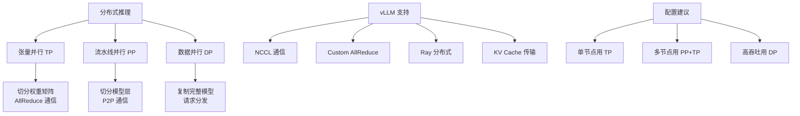

关键要点：
1. **张量并行**：单节点多 GPU 首选，低延迟
2. **流水线并行**：跨节点扩展，需要权衡
3. **数据并行**：吞吐量最高，但显存效率低
4. **组合使用**：大模型通常需要 TP+PP 组合

---

## 参考资料

1. [Megatron-LM 论文](https://arxiv.org/abs/1909.08053)
2. [GPipe 论文](https://arxiv.org/abs/1811.06965)
3. [NCCL 官方文档](https://docs.nvidia.com/deeplearning/nccl/user-guide/docs/)
4. [vLLM 分布式推理文档](https://docs.vllm.ai/en/latest/serving/distributed_serving.html)
5. [Ray 官方文档](https://docs.ray.io/)

---

**导航**
- 上一篇：[量化技术](02-quantization.md)
- 下一篇：[术语表](../appendix/glossary.md)
