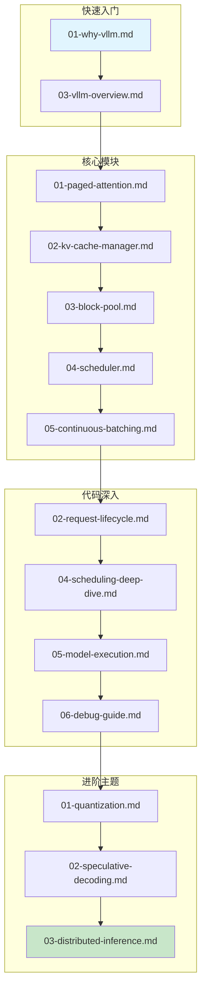
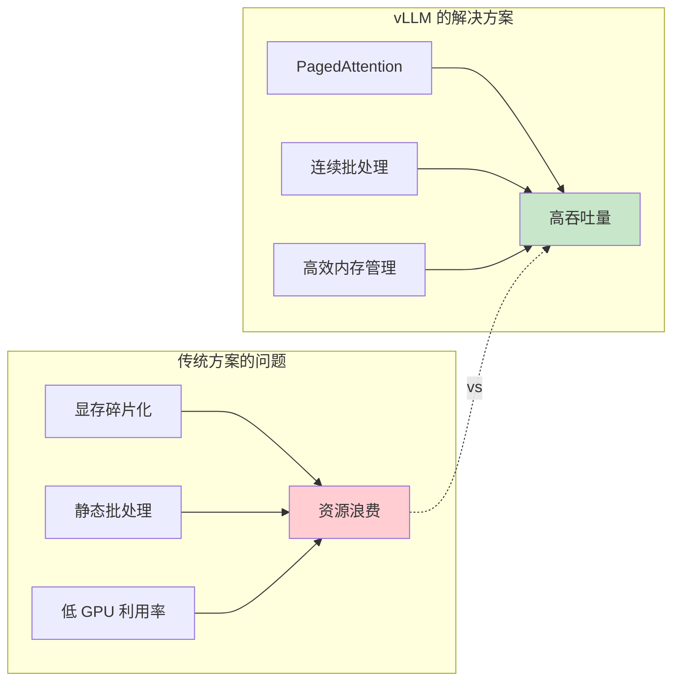
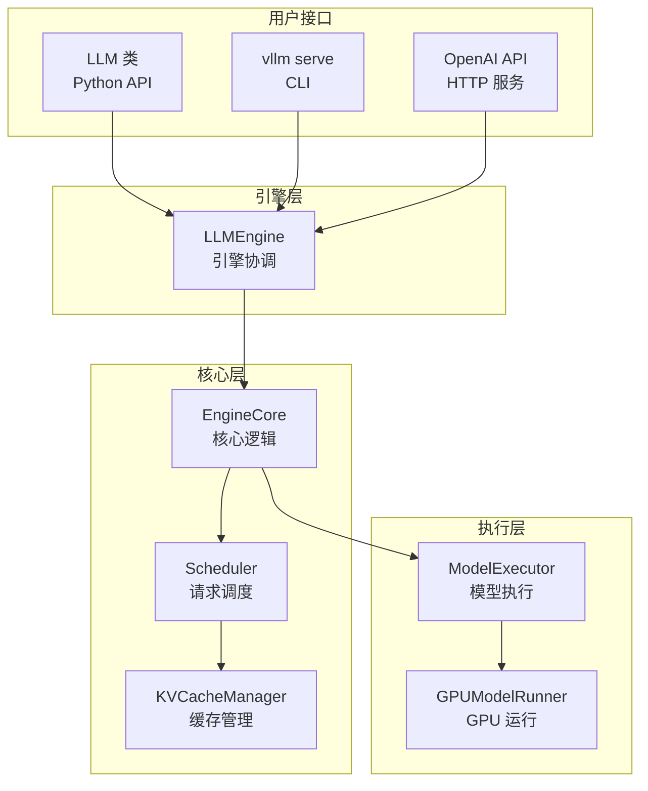

# vLLM 原理深度解析

> 面向深度学习初学者的 vLLM 技术文档

---

## 文档简介

本文档系列旨在帮助深度学习初学者深入理解 vLLM —— 一个高性能的大语言模型（LLM）推理和服务框架。我们将从最基础的概念出发，逐步深入到核心算法和代码实现，让你不仅知其然，更知其所以然。

### 适用读者

- **深度学习初学者**：了解基本的 Python 编程，对机器学习有初步认识
- **LLM 应用开发者**：希望了解推理框架底层原理
- **系统工程师**：负责部署和优化 LLM 服务
- **研究人员**：研究 LLM 推理优化技术

### 你将学到

- 大语言模型推理面临的核心挑战
- Transformer 架构和注意力机制的工作原理
- vLLM 的核心创新：PagedAttention 和连续批处理
- 从入口到输出的完整代码执行链路
- 如何调试和分析 vLLM 代码

---

## 文档结构总览

```
docs/deep-dive/
├── README.md                              # 本文件 - 导航与学习指南
│
├── 01-introduction/                       # 第一部分：入门篇
│   ├── 01-why-vllm.md                     # 为什么需要 vLLM
│   ├── 02-llm-inference-challenges.md     # LLM 推理面临的挑战
│   └── 03-vllm-overview.md                # vLLM 整体架构概览
│
├── 02-dl-fundamentals/                    # 第二部分：深度学习基础
│   ├── 01-neural-network-basics.md        # 神经网络基础
│   ├── 02-transformer-architecture.md     # Transformer 架构详解
│   ├── 03-attention-mechanism.md          # 注意力机制原理
│   ├── 04-kv-cache-concept.md             # KV Cache 概念
│   └── 05-llm-generation-process.md       # LLM 生成过程
│
├── 03-core-modules/                       # 第三部分：核心模块详解
│   ├── 01-paged-attention.md              # PagedAttention 分页注意力
│   ├── 02-kv-cache-manager.md             # KV Cache 管理器
│   ├── 03-block-pool.md                   # Block Pool 内存块池
│   ├── 04-scheduler.md                    # 调度器原理
│   └── 05-continuous-batching.md          # 连续批处理机制
│
├── 04-code-walkthrough/                   # 第四部分：代码链路分析
│   ├── 01-entry-points.md                 # 入口点分析
│   ├── 02-request-lifecycle.md            # 请求生命周期
│   ├── 03-engine-core-flow.md             # 引擎核心流程
│   ├── 04-scheduling-deep-dive.md         # 调度流程深入
│   ├── 05-model-execution.md              # 模型执行流程
│   └── 06-debug-guide.md                  # 代码调试指南
│
├── 05-advanced-topics/                    # 第五部分：进阶主题
│   ├── 01-quantization.md                 # 量化技术
│   ├── 02-speculative-decoding.md         # 投机解码
│   └── 03-distributed-inference.md        # 分布式推理
│
└── appendix/                              # 附录
    ├── glossary.md                        # 术语表
    ├── code-map.md                        # 代码文件索引
    └── references.md                      # 参考资料
```

---

## 学习路线图

我们提供两条学习路径，你可以根据自己的背景和目标选择合适的路线。

### 路径一：基础路径（推荐新手）

适合深度学习基础较薄弱的读者，从基础概念学起。

```mermaid
flowchart TD
    subgraph 第一阶段：理解问题
        A[README.md<br/>了解文档结构] --> B[01-why-vllm.md<br/>理解问题背景]
        B --> C[02-llm-inference-challenges.md<br/>深入理解挑战]
    end

    subgraph 第二阶段：学习基础
        C --> D[01-neural-network-basics.md<br/>神经网络基础]
        D --> E[02-transformer-architecture.md<br/>Transformer 架构]
        E --> F[03-attention-mechanism.md<br/>注意力机制]
        F --> G[04-kv-cache-concept.md<br/>KV Cache 概念]
        G --> H[05-llm-generation-process.md<br/>生成过程]
    end

    subgraph 第三阶段：掌握核心
        H --> I[03-vllm-overview.md<br/>vLLM 架构全貌]
        I --> J[01-paged-attention.md<br/>PagedAttention]
        J --> K[05-continuous-batching.md<br/>连续批处理]
    end

    subgraph 第四阶段：代码实践
        K --> L[01-entry-points.md<br/>代码入口]
        L --> M[03-engine-core-flow.md<br/>引擎流程]
        M --> N[glossary.md<br/>术语参考]
    end

    style A fill:#e1f5fe
    style N fill:#c8e6c9
```

**预计阅读量**：约 70,000 字，建议分 5-7 天完成

### 路径二：进阶路径（适合有基础的读者）

如果你已经了解 Transformer 和 KV Cache 的基本概念，可以直接进入核心内容。



**预计阅读量**：约 50,000 字，建议分 3-5 天完成

---

## 各部分内容概要

### 第一部分：入门篇

> **目标**：理解为什么需要 vLLM，它解决了什么问题

| 文档 | 内容简介 | 关键概念 |
|------|---------|---------|
| [01-why-vllm.md](01-introduction/01-why-vllm.md) | 介绍 LLM 推理部署的痛点，以及 vLLM 的解决方案 | 静态批处理、显存碎片化、吞吐量 |
| [02-llm-inference-challenges.md](01-introduction/02-llm-inference-challenges.md) | 深入分析显存、计算、批处理三大挑战 | Prefill、Decode、TTFT、TPS |
| [03-vllm-overview.md](01-introduction/03-vllm-overview.md) | vLLM 整体架构和核心组件介绍 | LLMEngine、Scheduler、ModelRunner |

### 第二部分：深度学习基础

> **目标**：为理解 vLLM 原理打下必要的基础知识

| 文档 | 内容简介 | 关键概念 |
|------|---------|---------|
| [01-neural-network-basics.md](02-dl-fundamentals/01-neural-network-basics.md) | 神经网络的基本概念和组成 | 神经元、激活函数、张量 |
| [02-transformer-architecture.md](02-dl-fundamentals/02-transformer-architecture.md) | Transformer 架构详细剖析 | Embedding、位置编码、FFN |
| [03-attention-mechanism.md](02-dl-fundamentals/03-attention-mechanism.md) | 注意力机制的原理和计算过程 | Q/K/V、多头注意力、因果掩码 |
| [04-kv-cache-concept.md](02-dl-fundamentals/04-kv-cache-concept.md) | KV Cache 的作用和实现原理 | 增量计算、缓存复用 |
| [05-llm-generation-process.md](02-dl-fundamentals/05-llm-generation-process.md) | LLM 文本生成的完整流程 | Prefill、Decode、采样策略 |

### 第三部分：核心模块详解

> **目标**：深入理解 vLLM 的核心创新和实现

| 文档 | 内容简介 | 关键概念 |
|------|---------|---------|
| [01-paged-attention.md](03-core-modules/01-paged-attention.md) | PagedAttention 的设计思想和实现 | Block、Block Table、Slot Mapping |
| [02-kv-cache-manager.md](03-core-modules/02-kv-cache-manager.md) | KV Cache 管理器的工作原理 | 分配、释放、前缀缓存 |
| [03-block-pool.md](03-core-modules/03-block-pool.md) | 内存块池的数据结构和算法 | LRU 驱逐、引用计数 |
| [04-scheduler.md](03-core-modules/04-scheduler.md) | 调度器的设计和调度算法 | 优先级、抢占、资源管理 |
| [05-continuous-batching.md](03-core-modules/05-continuous-batching.md) | 连续批处理的原理和优势 | 迭代级调度、动态批处理 |

### 第四部分：代码链路分析

> **目标**：跟踪代码执行路径，理解实现细节

| 文档 | 内容简介 | 关键代码文件 |
|------|---------|-------------|
| [01-entry-points.md](04-code-walkthrough/01-entry-points.md) | CLI 和 Python API 入口分析 | `llm.py`, `main.py` |
| [02-request-lifecycle.md](04-code-walkthrough/02-request-lifecycle.md) | 请求从创建到完成的完整生命周期 | `request.py` |
| [03-engine-core-flow.md](04-code-walkthrough/03-engine-core-flow.md) | 引擎核心的 step() 循环分析 | `core.py`, `llm_engine.py` |
| [04-scheduling-deep-dive.md](04-code-walkthrough/04-scheduling-deep-dive.md) | schedule() 方法的详细流程 | `scheduler.py` |
| [05-model-execution.md](04-code-walkthrough/05-model-execution.md) | 模型执行和采样过程 | `gpu_model_runner.py` |
| [06-debug-guide.md](04-code-walkthrough/06-debug-guide.md) | 调试技巧和常见问题排查 | - |

### 第五部分：进阶主题

> **目标**：了解 vLLM 的高级功能和优化技术

| 文档 | 内容简介 |
|------|---------|
| [01-quantization.md](05-advanced-topics/01-quantization.md) | 模型量化技术：INT8、INT4、AWQ、GPTQ |
| [02-speculative-decoding.md](05-advanced-topics/02-speculative-decoding.md) | 投机解码加速技术 |
| [03-distributed-inference.md](05-advanced-topics/03-distributed-inference.md) | 张量并行和流水线并行 |

### 附录

| 文档 | 内容简介 |
|------|---------|
| [glossary.md](appendix/glossary.md) | 术语表：所有专业术语的解释 |
| [code-map.md](appendix/code-map.md) | 代码文件索引：按功能分类的文件列表 |
| [references.md](appendix/references.md) | 参考资料：论文、文档、博客链接 |

---

## 核心概念速览

在深入学习之前，先快速了解几个核心概念：

### 什么是 vLLM？

vLLM 是一个快速且易用的大语言模型推理和服务库，由加州大学伯克利分校开发。它的核心创新是 **PagedAttention** 算法，通过类似操作系统虚拟内存的方式管理 KV Cache，显著提高了推理吞吐量。

### 为什么需要 vLLM？



### vLLM 的核心组件



---

## 如何使用本文档

### 阅读建议

1. **循序渐进**：按照推荐的学习路径阅读，不要跳过基础部分
2. **动手实践**：遇到代码示例时，尝试在本地运行和修改
3. **结合源码**：阅读文档时，同时打开对应的源代码文件
4. **做好笔记**：记录不理解的概念，反复阅读相关章节

### 代码阅读技巧

本文档中的代码引用格式为 `文件路径:行号`，例如：

- `vllm/entrypoints/llm.py:42` 表示 `llm.py` 文件的第 42 行
- `vllm/v1/core/sched/scheduler.py:313` 表示 `scheduler.py` 文件的第 313 行

建议使用 IDE（如 VSCode 或 PyCharm）打开 vLLM 源码，配合文档一起阅读。

### 图表说明

本文档使用 Mermaid 绘制各类图表：

- **流程图（flowchart）**：展示代码执行流程
- **时序图（sequenceDiagram）**：展示组件之间的交互
- **类图（classDiagram）**：展示数据结构
- **状态图（stateDiagram）**：展示状态转换
- **饼图（pie）**：展示占比分布

如果你的 Markdown 阅读器不支持 Mermaid，可以使用 [Mermaid Live Editor](https://mermaid.live/) 在线查看。

---

## 快速开始

如果你迫不及待想要开始学习，这里是第一步：

**对于深度学习新手**：
```
开始阅读 → 01-introduction/01-why-vllm.md
```

**对于有经验的开发者**：
```
开始阅读 → 01-introduction/03-vllm-overview.md
```

---

## 文档版本

- **vLLM 版本**：基于 vLLM v1 架构
- **文档版本**：1.0
- **最后更新**：2025 年 1 月

---

## 反馈与贡献

如果你在阅读过程中发现任何问题或有改进建议，欢迎：

1. 在 vLLM GitHub 仓库提交 Issue
2. 直接提交 Pull Request 改进文档

---

> **提示**：准备好了吗？让我们开始 vLLM 的深度学习之旅！
>
> 👉 [开始阅读：为什么需要 vLLM](01-introduction/01-why-vllm.md)
